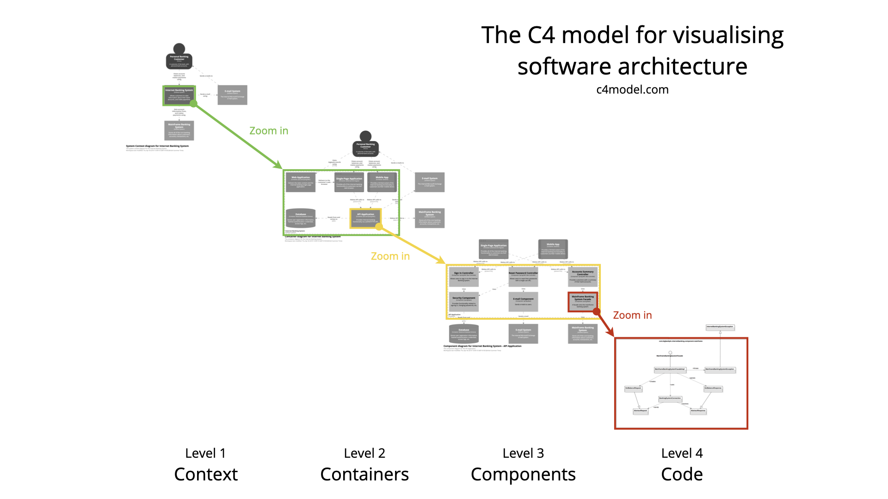
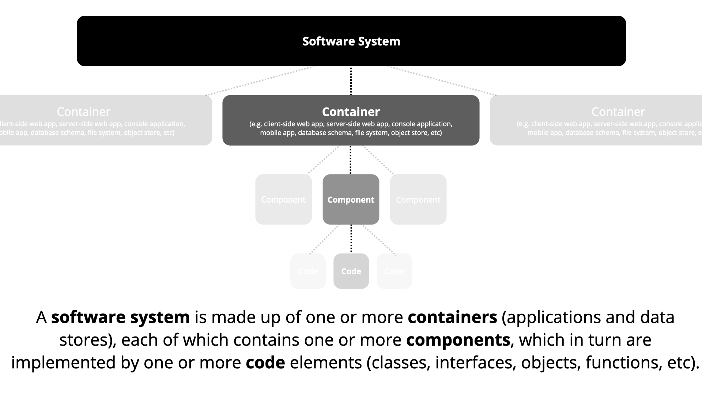
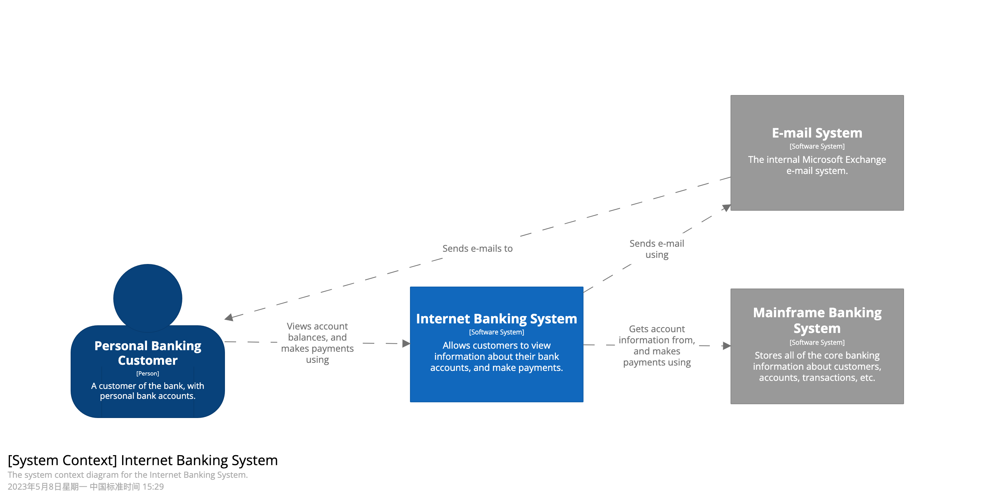
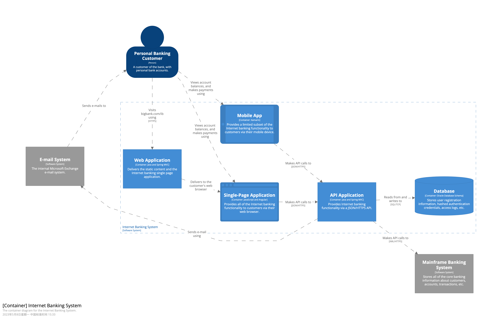
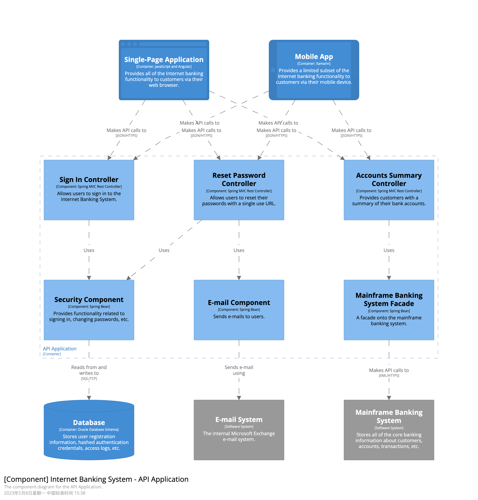
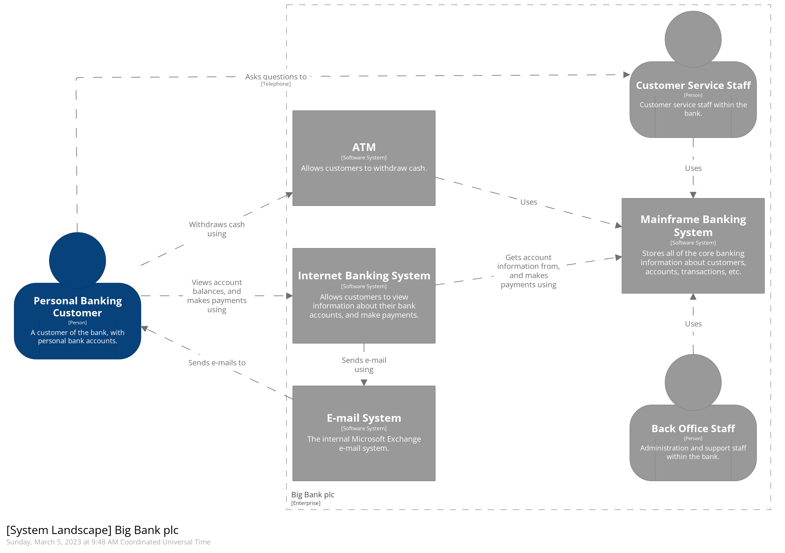
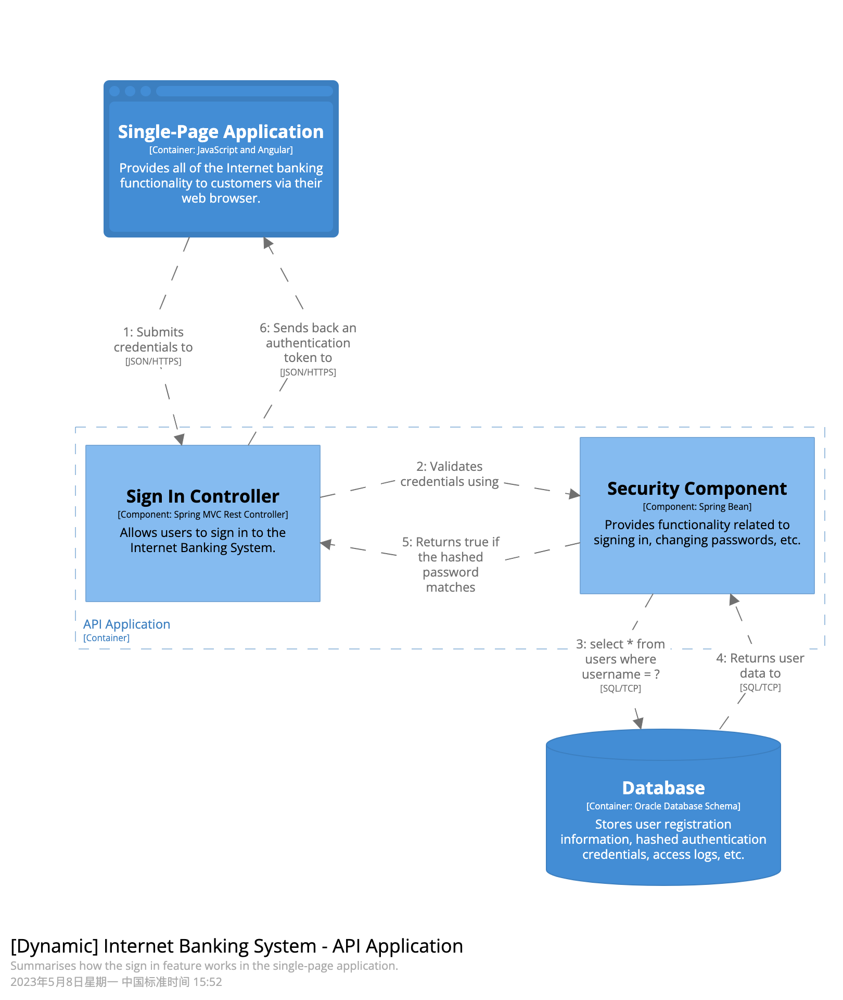
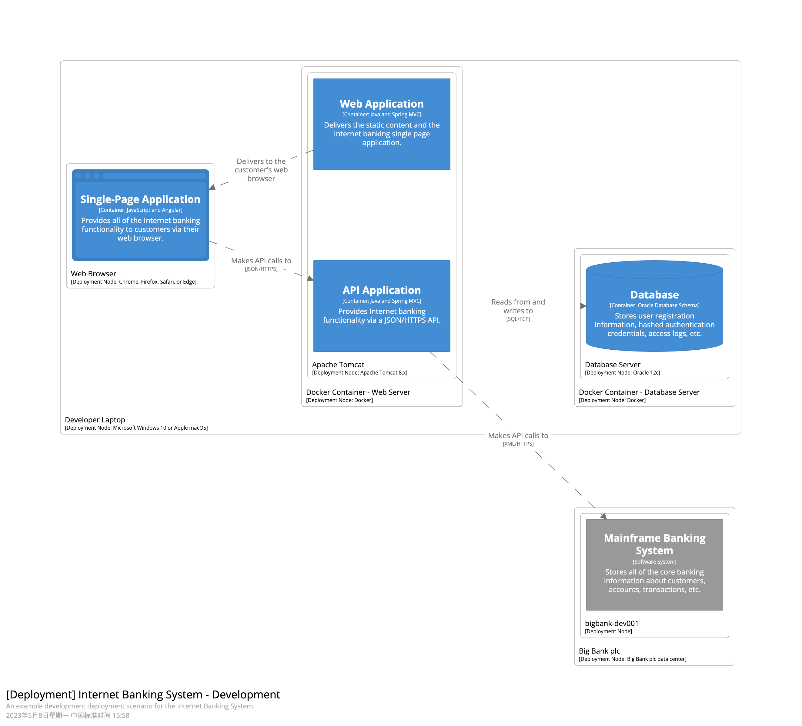
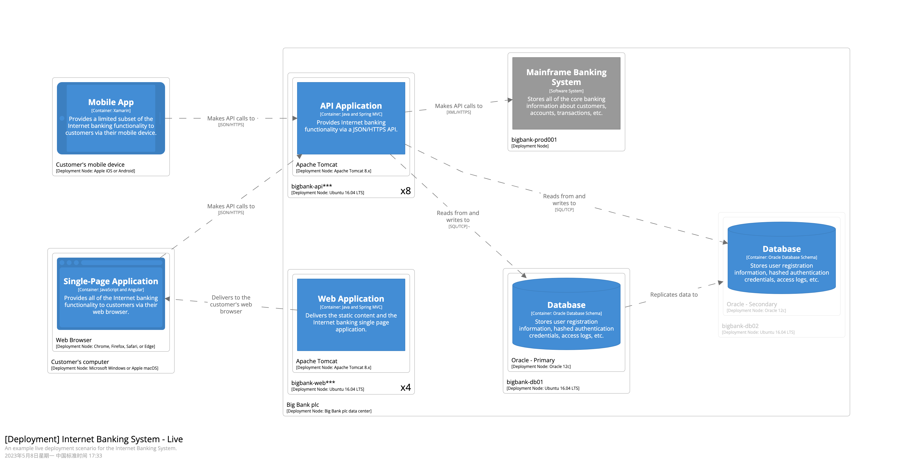

# C4 模型
> C4是软件架构可视化的一种方案。架构可视化，指的是用图例的方式，把软件架构设计准确、清晰、美观地表示出来。架构可视化不是指导开发者如何进行架构设计，而是指导开发者将架构设计表达出来，产出简洁直观的架构图。  
> C4模型将系统从上往下分为System Context, Containers, Components, Code四层视图，每一层都是对上一层的完善和展开，层层递进地对系统进行描述。  
>   
> 

## System Context diagram
> System Context（系统上下文）视图位于顶层，是软件系统架构图的起点，表达的是系统的全貌。System Context视图重点展示的是系统边界、系统相关的用户、其他支撑系统以及与本系统的交互。本层不涉及到具体细节（例如技术选型、协议、部署方案和其他低级细节），因此System Context可以很好地向非技术人员介绍系统。
>  - **作用**：清晰地展示待构建的系统、用户以及现有的IT基础设施。
>  - **范围**：待描述的核心系统以及其相关用户、支撑系统，不应该出现与核心系统无关的其他系统。例如我们要描述一个打车系统，不应该把无关联的药店系统绘制进去，并且要确保一个System Context只有一个待描述的软件系统。
>  - **主要元素**：Context内待描述的软件系统。
>  - **支持元素**：在范围内直接与主要元素中的软件系统有关联的人员（例如用户、参与者、角色或角色）和外部依赖系统。通常，这些外部依赖系统位于我们自己的软件系统边界之外。
>  - **目标受众**：软件开发团队内外的所有人，包括技术人员和非技术人员。
>  - **推荐给大多数团队**：是的
### 示例

## Container diagram
> Container（容器）视图是对System Context的放大，是对System Context细节的补充。  
> 注意这里的容器，指的不是Docker等容器中间件。Container的描述范围是一个可单独运行/可部署的单元。Container一般指的是应用以及依赖的中间件，例如服务器端 Web 应用程序、单页应用程序、桌面应用程序、移动应用程序、数据库架构、文件系统、Redis、ElasticSeach、MQ等。  
> Container显示了软件架构的高级形状以及系统内各容器之间的职责分工。  
> 在Container这一层，还显示了系统的主要的技术选型以及容器间的通信和交互。
>  - **作用**：展示系统整体的开发边界，体现高层次的技术选型，暴露系统内容器之间的分工交互。
>  - **范围**：单个软件系统，关注的系统内部的应用构成。
>  - **主要元素**：软件系统范围内的容器，例如Spring Boot打包后的应用，MySQL数据库、Redis、MQ等。
>  - **支持元素**：直接使用容器的人员和外部依赖系统。
>  - **目标受众**：软件开发团队内外的技术人员，包括软件架构师、开发人员和运营/支持人员。
>  - **推荐给大多数团队**：是的。
>  - **注意**：Container视图没有说明部署方案、集群、复制、故障转移等。部署相关的视图，会通过Deployment视图进行展示。
### 示例

## Component diagram
> 将单个容器放大，则显示了该容器内部的组件。Component（组件）视图显示了一个容器是如何由许多“组件”组成的，每个组件是什么，它们的职责以及技术实现细节。
>  - **作用**：展示了可执行的容器内部构成与分工，可直接指导开发。
>  - **范围**：单个容器。
>  - **主要元素**：范围内容器内的组件，通常可以是Dubbo接口、REST接口、Service、Dao等。
>  - **支持元素**：直接连接到容器的人员和外部依赖系统。
>  - **目标受众**：软件架构师和开发人员。
>  - **推荐给大多数团队**：Component用于指导开发，当有需要时创建。
### 示例

## Code diagram
> 放大组件视图，则得到出组件的Code视图（代码视图）。  
> Code视图一般采用 UML 类图、ER图等。Code视图是一个可选的详细级别，通常可以通过 IDE 等工具按需生成。除了最重要或最复杂的组件外，不建议将这种详细程度用于其他任何内容。  
> 在注重敏捷开发的今天，一般不建议产出Code视图。
>  - **范围**：单个组件。
>  - **主要元素**：范围内组件内的代码元素（例如类、接口、对象、函数、数据库表等）。
>  - **目标受众**：软件架构师和开发人员。
>  - **推荐给大多数团队**：不，大多数 IDE 可以按需生成这种级别的详细信息。

## System Landscape diagram
> C4 模型提供了单个软件系统的静态视图，不管是 System Context、Container、Component都是针对单个软件系统的进行描述的，但在实际中软件系统不会孤立存在。为描述所有这些软件系统如何在给定的企业、组织、部门等中与其他系统组合在一起，C4采用扩展视图System Landscape （系统景观图）。  
> 系统景观图实际上只是一个没有特定关注的软件系统的系统上下文图（System Context diagram），系统景观图内的软件系统都可以采用C4进行深入分析。
>  - **适用范围**：企业/组织/部门/等。
>  - **主要元素**：与所选范围相关的人员和软件系统。
>  - **目标受众**：软件开发团队内外的技术人员和非技术人员。
### 示例

## Dynamic diagram
> Dynamic diagram（动态图）用于展示静态模型中的元素如何在运行时协作。动态图允许图表元素自由排列，并通过带有编号的箭头以指示执行顺序。
>  - **范围**：特定功能、故事、用例等。
>  - **主要元素和支持元素**：按照实际需要，可以是软件系统、容器或组件。
>  - **目标受众**：软件开发团队内外的技术人员和非技术人员。
### 示例

## Deployment diagram
> Deployment diagram（部署图）用于说明静态模型中的软件系统（或容器）的实例在给定环境（例如生产、测试、预发、开发等）中的部署方案。
> C4的部署图基于UML 部署图，但为了突出显示容器和部署节点之间的映射会做略微的简化。  
> 部署节点表示表示软件系统/容器实例运行的位置，类似于物理基础架构（例如物理服务器或设备）、虚拟化基础架构（例如 IaaS、PaaS、虚拟机）、容器化基础架构（例如 Docker 容器）、执行环境（例如数据库服务器、Java EE web/应用服务器、Microsoft IIS）等。部署节点可以嵌套，也可以将基础设施节点包括进去，例如 DNS 服务、负载平衡器、防火墙等。
> 可以在部署图中随意使用 Amazon Web Services、Azure 等提供的图标，只需确保被使用的任何图标都包含在图例中，不产生歧义。
>  - **范围**：单个部署环境中的一个或多个软件系统（例如生产、暂存、开发等）。
>  - **主要元素**：部署节点、软件系统实例和容器实例。
>  - **支持元素**：用于部署软件系统的基础设施节点。
>  - **目标受众**：软件开发团队内外的技术人员；包括软件架构师、开发人员、基础架构架构师和运营/支持人员。
### 示例
> - 网上银行系统的开发环境部署图
> 
> - 网上银行的生产环境部署图
> 