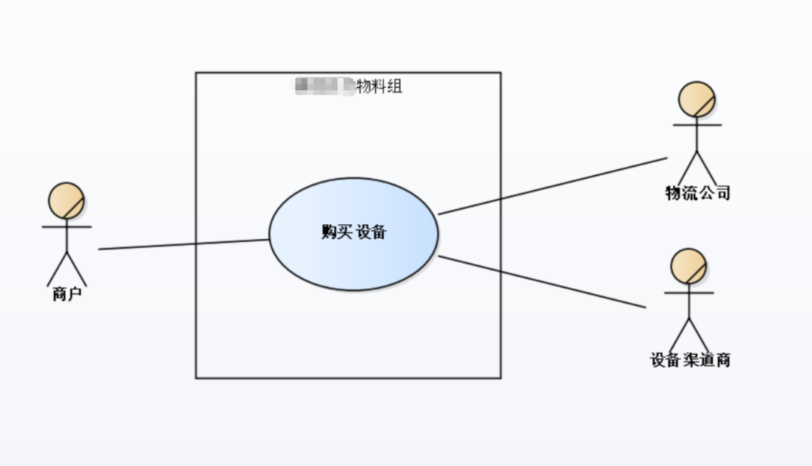
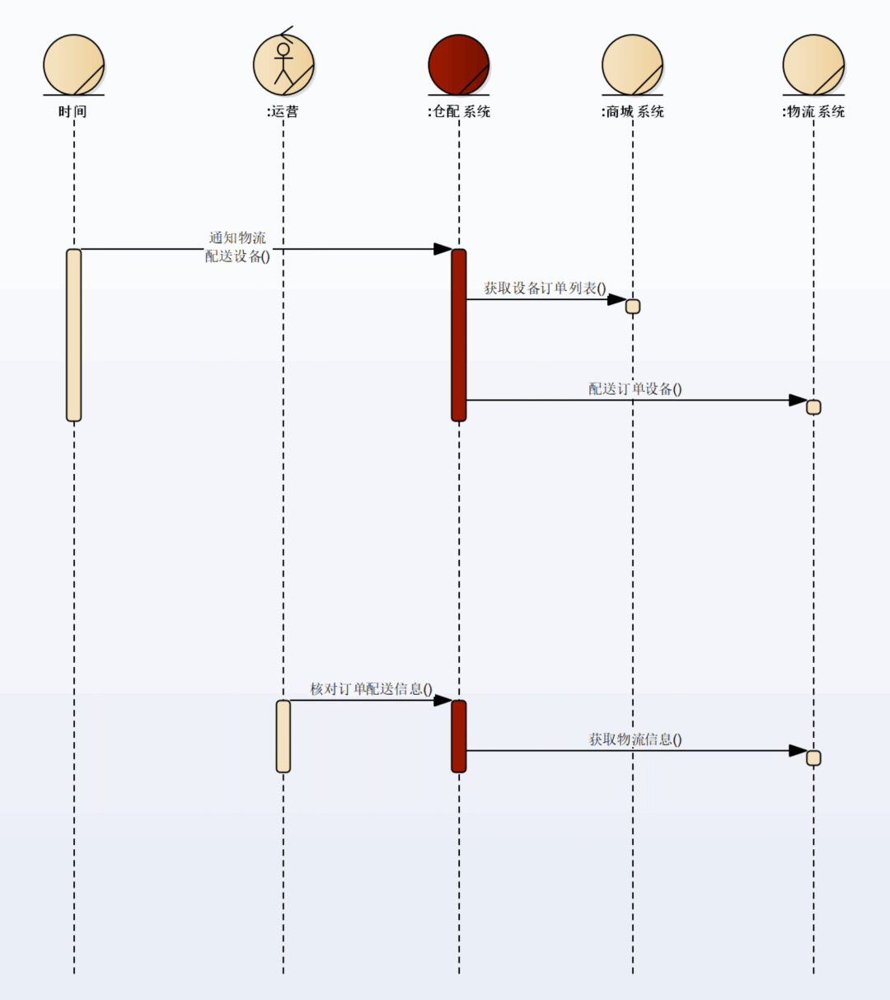
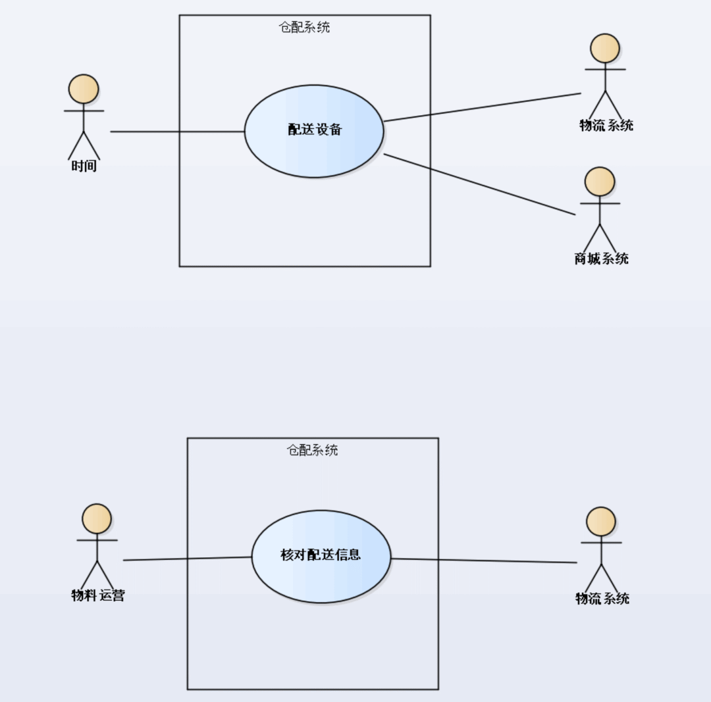
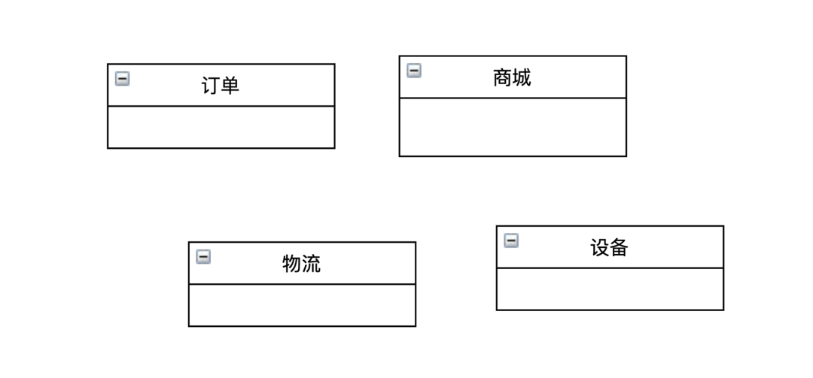
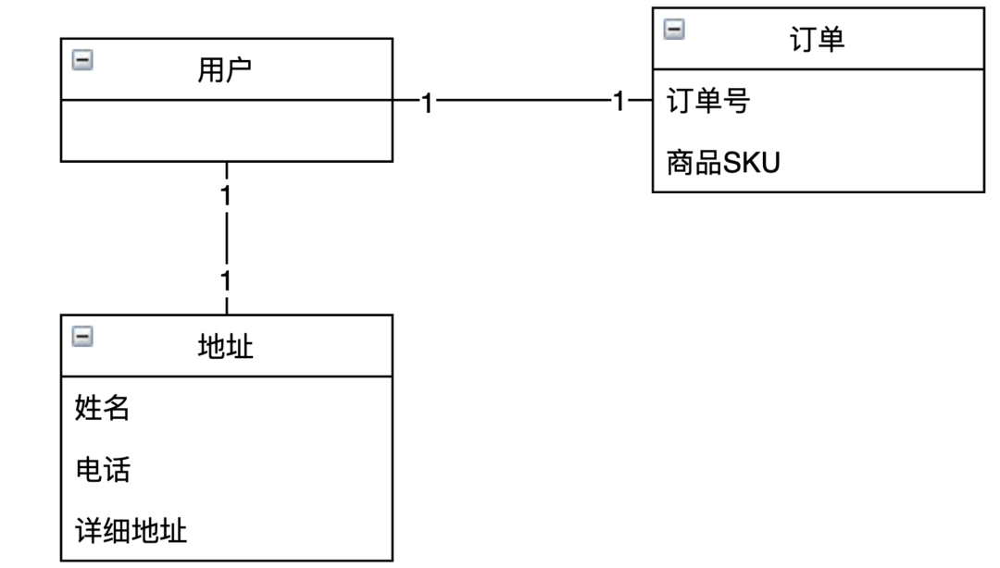
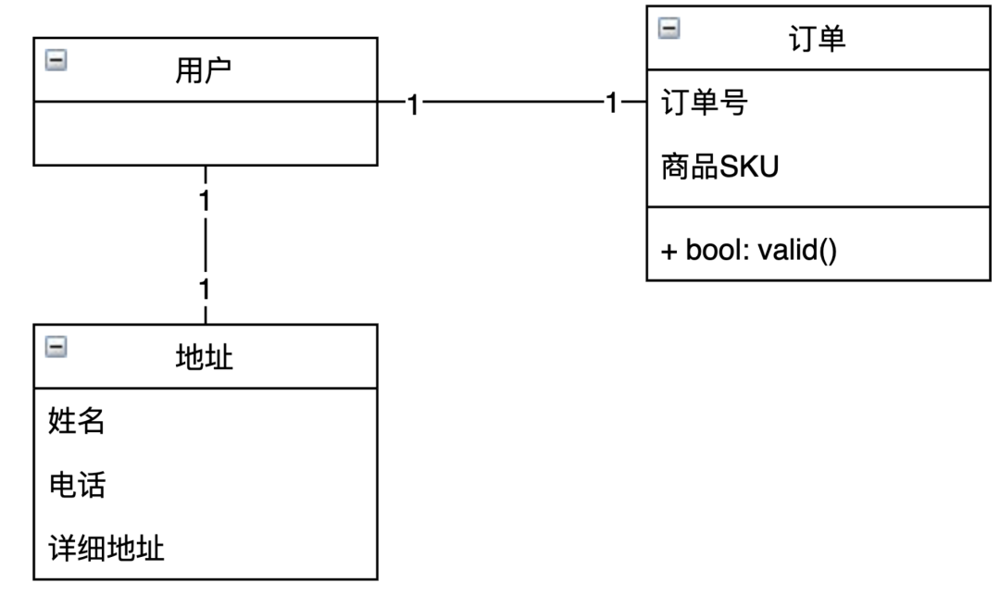
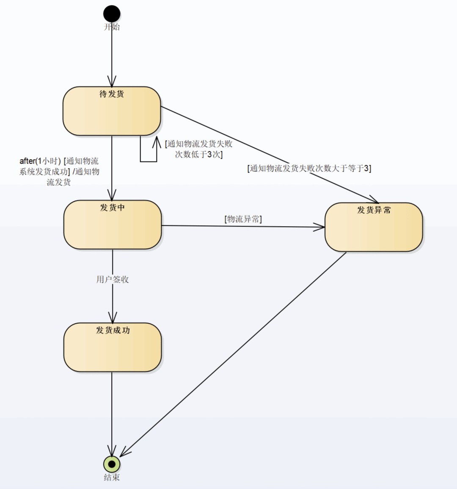

# 设计与建模

## 架构师
> 所谓架构师，是软件开发中那些对业务抽象做得最好的人，随着级别的提升，工程师所面对的需求会越来越抽象。  
> 承接抽象需求，提供抽象架构是架构师走向卓越的必经之途。

## 设计与建模的作用
> 进行设计建模能够让协作变得有效
> - 一方面，设计建模前期是沟通和信息对齐，将协作的内容提前；
> - 一方面，采用合适的图形化工具，review 的成本是相对较低的。

## 设计和建模的三个关键点
### 业务建模
> 业务建模主要聚焦于分析涉众利益，厘清业务流程。  
> **分析涉众利益**：
>   - 找到软件产品的愿景，愿景表达了软件产品带来的核心意义。
>   - 找到利益相关的的涉众和其利益诉求。
>
> 从工具上来说，主要是用例图，流程图；  
> 从内容上来说，主要是找人（利益涉众，系统执行者），找业务实体（其余系统，相关的重要对象）。

> 商城购买配送系统业务用例图  
> 

### 业务流程分析
> 完整的业务流程图可能很庞大，需要关注的是其中最有可能影响涉众利益的流程片段

> 购买设备业务流程中配送设备的流程片段  
> 

> 这里的业务流程问题体现在，配送设备的流程是在全部业务流程中较为繁重，人肉工作量大的流程片段，不符合涉众利益。  
> 所以系统需要改进流程，替代人的部分工作
> 

### 系统建模
> 系统建模关注的是系统与外部的边界和系统自身的职责，主要聚焦两件事：
> - 画出系统用例；
> - 写出用例规约。

#### 系统用例图
> 仓配系统的系统用例图  
> 

#### 系统用例规约  
> 有了业务流程图和系统用例图，需要根据进一步细化系统边界上的约束，保证系统的稳定性。系统执行者与系统的交互细化了详细的约束，系统的稳定性才能提高，如果没有仔细列出约束，有可能会忽略一些边界条件，导致系统的故障；如：仓配系统不考虑来自第三方商城订单要配送的设备数量限制，则会因为第三方商城出现的错误，导致资产损失。

### 类的分析与设计
#### 识别类
> 常见的类一般有三种——边界类、控制类和实体类。边界类是外部系统在系统内部的映射，借由边界类，系统和外部系统交互。一些接口请求、输入输出都属于边界类的职责。控制类往往体现用例流程，一般情况下，一个用例就是一个控制类。实体类是系统的核心，良好的实体类设计能够提高系统的复用程度，减低系统的复杂性。
#### 找实体名词
> 识别具体的类需要去找业务流程、系统流程、系统规约中经常出现的名词。在前文的流程图中，订单、商城、设备、物流、用户是反复出现的名称，说明这就是类的业务实体体现。  
> 
#### 找属性
> 类的属性不是凭空产生，需要对业务实现有价值。找到那些对于系统实现必不可少的属性，放到正确的类中。如仓配系统中的订单，包含订单号，商品，用户。用户则有收件地址。  
> 
#### 找职责
> 业务规则和约束中，可以找到一些实体应当有的职责。以订单为例，其就具备验证合法性的职责。  
> 
#### 状态机
> 对于一些主要的实体类，还需要设计出他的状态机，清晰的状态机能有效地厘清系统内的一些事件和状态，增强系统整体的健壮性。  
>   
> 以仓配系统中的订单为例，从用户购买的待发货状态，到通知物流发货，再到实际发货，物流签收有一系列状态的演变，这都要体现在状态机上。