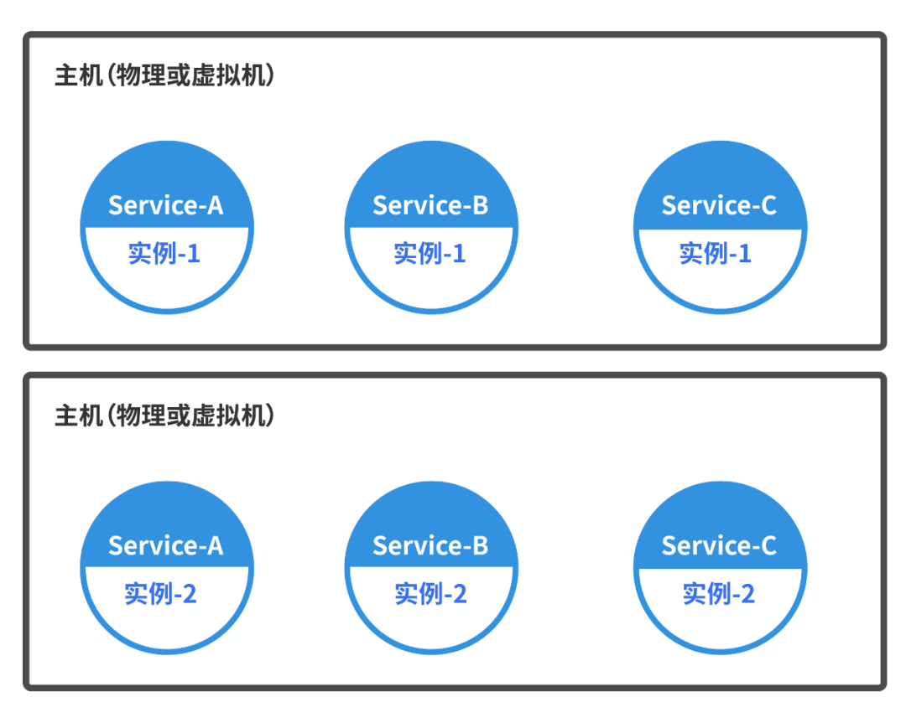
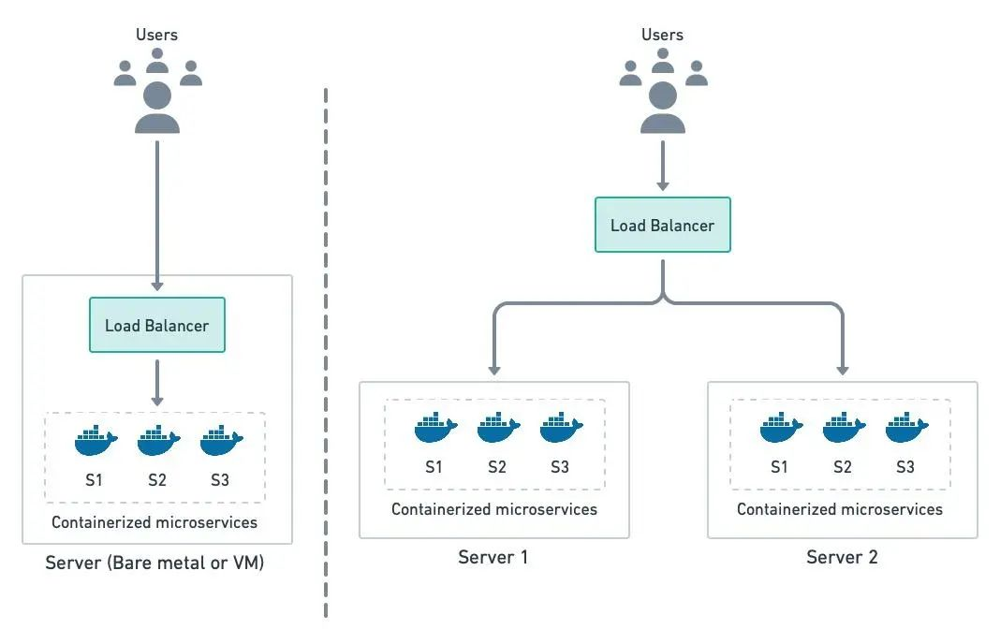
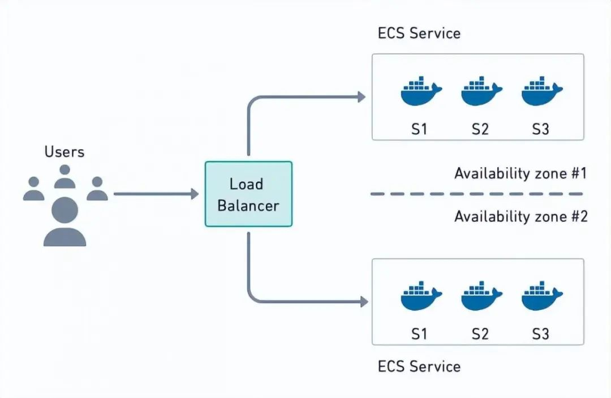

# 微服务部署架构

## 微服务多实例架构部署

### 优点
资源利用最大化
### 缺点
在同一主机上运行多个实例可能会导致资源争夺。  
尤其是在资源紧张的情况下，可能会影响各实例的性能、和稳定性。
### 场景
采用这种方式，可以在在不同的虚拟机上运行多个微服务实例，也可以在物理服务器上直接运行多个实例，适用于需要高性能、和资源隔离的场景。

## 微服务容器化架构部署

### 特点
#### 一致性
容器，可以确保应用在开发、测试、和生产环境中的行为一致，消除了环境差异引发的问题。
#### 隔离性
每个容器，独立运行，避免了不同应用程序之间的冲突。  
并且，提高资源利用率，提供进程级隔离，这也是容器化的最大特点，可以很轻量级。
#### 高效资源利用
容器轻量级、启动快、资源开销低，原因很简单：进程级的方式。
#### 便捷的扩展和管理
通过容器编排工具可以方便地扩展、更新、和管理应用。

## 微服务Serverless架构部署

Serverless架构，提供了一种高效的微服务部署方式，允许开发者专注于业务逻辑，而无需管理底层.....等基础设施。

## 微服务容器编排架构部署
  
Kubernetes是Google开发的容器编排平台，用于自动化部署、扩展、和管理容器化应用。  
### 特点
主要是通过：Master节点、和Node节点，来实现容器编排。  
Master节点，管理、和控制Kubernetes集群的控制平面，包含如下组件：
> - **`API Server`**：处理RESTful API请求，是集群的入口；
> - **`etcd`**：分布式键值存储，用于保存集群状态......等数据；
> - **`Controller Manager`**：管理控制器，确保集群状态、与期望状态一致；
> - **`Scheduler`**：负责将Pod，调度到合适的工作节点上。
### 其他：
Pod是，Kubernetes中的最小部署单元，一个Pod可以包含：一个、或多个容器，共享网络、和存储。
Node节点，运行容器化应用的工作节点，包含如下组件：
> - **`Kubelet`**：在每个节点上运行，负责与Master通信，执行Pod和容器的管理任务；
> - **`Kube-proxy`**：实现Kubernetes服务的网络代理、和负载均衡；
> - **`Container Runtime`**：运行容器的底层引擎，如：Docker........等。
### 场景
采用这种方式，适用于拥有大量微服务的系统，通过Kubernetes自动管理、和扩展的场景。

