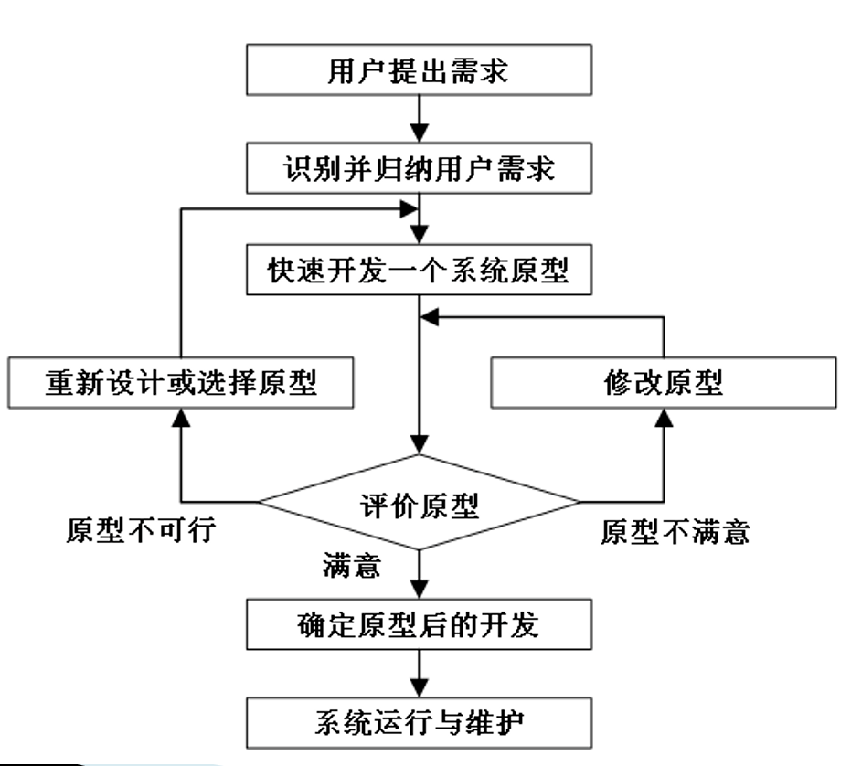

# 软件工程

## 背景
> 1968 年 NATO（北大西洋公约组织）提出了软件危机（Software crisis）一词。同年，为了解决软件危机问题，“软件工程”的概念诞生了。一门叫做软件工程的学科也就应运而生。
### 软件危机
> 描述软件开发的一个痛点：很难高效地开发出质量高的软件。
### 定义
> 信息系统项目管理师：  
> 软件工程是指应用计算机科学、数学及管理科学等原理，以工程化的原则和方法来解决软件问题的工程，其目的是提高软件生产率、提高软件质量、降低软件成本。

> 电气与电子工程师协会(Institute of Electrical and Electronics Engineers, IEEE)：  
> 将系统的、规范的、可度量的工程化方法应用于软件开发、运行和维护的全过程及上述方法的研究。
> 软件工程由方法、工具和过程三个部分组成：  
> 1. 软件工程方法是完成软件工程项目的技术手段，它支待整个软件生命周期；  
> 2. 软件工程使用的工具是人们在开发软件的活动中智力和体力的扩展与延伸，它自动或半自动地支待软件的开发和管理，支待各种软件文档的生成；  
> 3. 软件工程中的过程贯穿于软件开发的各个环节，管理人员在软件工程过程中，要对软件开发的质量、进度和成本进行评估、管理和控制，包括人员组织、计划跟踪与控制、成本估算、质量保证和配置管理等。
### 目标
> 在更少资源消耗的情况下，创造出更好、更容易维护的软件。

## 软件开发过程

### 需求分析
> 分析用户的需求，建立逻辑模型。
#### 需求分析的过程顺序
##### 需求获取
> 需求获取是一个确定和理解不同的项目干系人的需求和约束的过程。
##### 需求分析
> 需求分析对已经获取到的需求进行提炼、分析和审查，以确保所有的项目干系人都明白其含义并找出其中的错误、遗漏或其他不足的地方。
###### 需求分析方法
> - 结构化分析(Structured Analysis, SA)：其建立的模型的核心是数据字典。
>   - 围绕这个核心，有三个层次的模型，分别是数据模型、功能模型和行为模型(也称为状态模型)：
>     1. 实体关系图(E-R图)表示数据模型：描述实体、属性，以及实体之间的关系
>     2. 数据流图(Data Flow Diagram, DFD)表示功能模型：从数据传递和加工的角度，利用图形符号通过逐层细分描述系统内各个部件的功能和数据在它们之间传递的情况，来说明系统所完成的功能
>     3. 状态转换图(State Transfonn Diagram, STD)表示行为模型：描述系统的状态和引起系统状态转换的事件，来表示系统的行为，指出作为特定事件的结果将执行哪些动作(例如，处理数据等)
> - 面向对象的分析(Object-Oriented Analysis, OOA)：基本任务是运用面向对象的(Object-Oriented,OO)方法，对问题域进行分析和理解，正确认识其中的事物及它们之间的关系，找出描述问题域和系统功能所需的类和对象，定义它们的属性和职责，以及它们之间所形成的各种联系。最终产生一个符合用户需求，并能直接反映问题域和系统功能的OOA模型及其详细说明。
>   - OOA模型包括用例模型和分析模型：
>     1. 用例是一种描述系统需求的方法，使用用例的方法来描述系统需求的过程就是用例建模；
>     2. 分析模型描述系统的基本逻辑结构，展示对象和类如何组成系统(静态模型)，以及它们如何保持通信，实现系统行为(动态模型)。
##### 需求定义（编写需求规格说明书）
> 软件需求规格说明书(Software Requirement Specification, SRS)是需求开发活动的产物，编制该文档的目的是使项目干系人与开发团队对系统的初始规定有一个共同的理解，使之成为整个开发工作的基础。  
> 在国家标准GB/T 8567《计算机软件文档编制规范》中，规定SRS应该包括范围、引用文件、需求、合格性规定、需求可追踪性、尚未解决的问题、注解和附录。国家标准GB/T 9385《计算机软件需求说明编制指南》也给出了一个详细的SRS写作大纲。
##### 需求验证
> 在系统分析阶段，检测SRS中的错误所采取的任何措施都将节省相当多的时间和资金。需求验证与确认活动内容包括：
> - SRS正确地描述了预期的、满足项目干系人需求的系统行为和特征；
> - SRS中的软件需求是从系统需求、业务规格和其他来源中正确推导而来的；
> - 需求是完整的和高质量的；
> - 需求的表示在所有地方都是一致的；
> - 需求为继续进行系统设计、实现和测试提供了足够的基础。
#### 需求的层次
> 这三个不同层次从目标到具体，从整体到局部，从概念到细节。 
> - 业务需求：反映企业或客户对系统高层次的目标要求，通常来自项目投资人、购买产品的客户、客户单位的管理人员、市场营销部门或产品策划部门等
> - 用户需求：用户的具体目标，或用户要求系统必须能完成的任务
> - 系统需求：从系统的角度来说明软件的需求，包括功能需求、非功能需求和设计约束等
### 软件设计
> 根据需求分析的结果对软件架构进行设计。  
#### 设计方法
> 结构化设计(数据流图为依据)、面向对象设计(面向对象概念为依据)  
> 
##### 结构化设计(Structure Design)
> 一种面向数据流的方法，是一个自顶向下、逐步求精和模块化的过程。其基本思想是将软件设计成由相对独立且具有单一功能的模块组成的结构，  
> 主要分为概要设计和详细设计两个阶段：  
> 1. 概要设计：又叫做总体结构设计，主要任务是将系统的功能需求分配给软件模块，确定每个模块的功能和调用关系，形成软件的模块结构图、即系统结构图
> 2. 详细设计：为每个具体任务选择适当的技术手段和处理方法
> - 遵循原则：高内聚，低耦合
##### 面向对象设计(Object-Oriented Design)
> 面向对象设计(OOD)是OOA方法的延续，其基本思想包括抽象、封装和可扩展性，其中可扩展性主要通过继承和多态来实现。在OOD中，数据结构和在数据结构上定义的操作算法封装在一个对象之中。
> OOD的主要任务是对类和对象进行设计，包括类的属性、方法以及类与类之间的关系。OOD的结果就是设计模型。对于OOD而言，在支待可维护性的同时，提高软件的可复用性是一个至关重要的问题，如何同时提高软件的可维护性和可复用性，是OOD需要解决的核心问题之一。  
> - 遵循6原则：
> 1. **单一职责（Simple responsibility principle, SRP）**：又叫做单一功能原则，每个类只负责一项职责。是面向对象五个基本原则之一。
> 2. **开闭原则（Open Closed Principle，OCP）**：规定“软件中的对象（类、模块、函数等）应该对于扩展是开放的，但是对于修订是封闭的”
> 3. **里氏替换原则（Liskov Substitution Principle, LSP）**：子类可以扩展父类的功能，但不能改变父类原有的功能，和Java 中的继承类似。
> 4. **迪米特法则（Principle of Least Knowledge, PLK）**：也叫做最小知识原则，意义在于降低类之间的耦合。由于每个对象尽量减少对其他对象的了解，因此，很容易使得系统的功能模块功能独立，相互之间不存在（或很少有）依赖关系
> 5. **依赖倒转原则（Dependence Inversion Principle, DIP）**：是实现开闭原则的重要途径，在软件设计中，具体的实现变化很多，但是抽象层相对比较稳定，因此以抽象为基础搭建起来的架构要比具体实现的要稳定的多。因此程序要依赖于抽象接口，尽量避免依赖于具体实现。
> 6. **接口隔离原则（Interface Segregation Principle, ISP）**：要求程序员尽量将臃肿庞大的接口拆分成更小和更具体的接口。
##### 其他
> 1. **结构化方法(SASD)**：功能、流程确定，系统规模不太大也不太复杂，需求变化也不大。
> 2. **面向对象方法(OMT)**：自顶向下分析、自底向上归纳，采用建模方式与实际活动贴近。
> 3. **面向数据结构方法(Jackson)**：得到完整的程序结构图，充分利用顺序、条件、循环结构。
> 4. **原型化方法**：需求不确定一直在变，采用原型工具进行更改。
> 5. **问题分析方法(PAM)**：从输入、输出开始去分析中间的功能。
> 6. **可视化方法**：例如拖控件、搭接面就是可视化，一边做一遍能看到效果。

#### 设计模式
##### 根据范围不同，设计模式可分为两类
> - 类模式处理类和子类之间的关系，这些关系通过继承建立，在编译时刻就被确定下来，属于静态关系；
> - 对象模式处理对象之间的关系，这些关系在运行时刻变化，更具动态性。

##### GoF设计模式/23种设计模式：根据目的和用途不同，设计模式可分为三类
> - 创建型模式 (Creational Pattern)主要用于创建对象。包括5种模式；
>   1. 抽象工厂模式(Abstract Factory)
>   2. 建造者模式(Builder)
>   3. 工厂方法模式(Factory Method)
>   4. 原型模式(Prototype)
>   5. 单例模式(Singleton)
> - 结构型模式 (Structural Pattern) 模式主要用于处理类或对象的组合。包括7种模式；
>   6. 适配器模式(Adapter)
>   7. 桥接模式(Bridge)
>   8. 组合模式(Composite)
>   9. 装饰模式(Decorator)
>   10. 外观模式(Facade)
>   11. 享元模式(Flyweight)
>   12. 代理模式(Proxy)
> - 行为型模式 (Behavioral Pattern)模式主要用于描述类或对象的交互以及职责的分配。包括11种模式；
>   13. 职责链模式(Chain of Responsibility)
>   14. 命令模式(Command)
>   15. 解释器模式(Interpreter)
>   16. 迭代器模式(Iterator)
>   17. 中介者模式(Mediator)
>   18. 备忘录模式(Memento)
>   19. 观察者模式(Observer)
>   20. 状态模式(State)
>   21. 策略模式(Strategy)
>   22. 模板方法模式(Template Method)
>   23. 访问者模式(Visitor)

### 编码
> 编写程序运行的源代码。
### 测试
> 确定测试用例，编写测试报告。  
> 根据国家标准GB/T 15532《计算机软件测试规范》，软件测试的目的是验证软件是否满足软件开发合同或项目开发计划、系统/子系统设计文档、SRS、软件设计说明和软件产品说明等规定的软件质量要求。通过测试发现软件缺陷，为软件产品的质量测量和评价提供依据。  
#### 软件测试方法可分为静态测试和动态测试
> 1. 静态测试是指被测试程序不在机器上运行，而采用人工检测和计算机辅助静态分析的手段对程序进行检测。
>   - 静态测试包括对文档的静态测试和对代码的静态测试：
>     1. 对文档的静态测试主要以检查单的形式进行
>     2. 对代码的静态测试一般采用桌前检查(Desk Checking)、代码走查和代码审查
> 2. 动态测试是指在计算机上实际运行程序进行软件测试。
>   - 一般采用白盒测试和黑盒测试方法：
>     1. 白盒测试也称为结构测试，主要用于软件单元测试中。
>     2. 黑盒测试也称为功能测试，主要用于集成测试、确认测试和系统测试中。
### 交付
> 将做好的软件交付给客户。
### 维护
> 对软件进行维护比如解决bug，完善功能。

## 软件开发模型
> 软件开发模型有很多种，比如瀑布模型（Waterfall Model）、快速原型模型（Rapid Prototype Model）、V 模型（V-model）、W 模型（W-model）、敏捷开发模型。  
> 其中最具有代表性的还是 瀑布模型 和 敏捷开发 。

### 瀑布模型
> 由于这种方法是从一个阶段成瀑布流入下一个阶段，所以称为“瀑布模型”  
>   
> 应坚持做到以下两点：
> - 每个阶段都完成规定的文档，没有交出合格的文档就没有完成阶段性工作。
> - 每个阶段结束前都要对提交的文档进行评审，以便尽早发现问题，改正错误。
#### 优缺点及适用情况
##### 优点
> - 定义清楚，应用广泛
> - 强迫开发人员采用规范化的方法(如：结构化方法)
> - 严格规定每个阶段提交的文档
> - 易于建模和理解
> - 便于计划和管理;有支持生命周期模型的多种工具
##### 缺点
> - 必须在开始时就知道大多数需求
> - 不便于适应需求的变化
> - 在项目接近完成之前，产品不能投入使用
> - 可运行的软件交付给用户之前，用户只能通过文档来了解产品
##### 适用情况
> - 待开发项目与以前的成功项目类似
> - 待开发项目的需求稳定且很好理解
> - 使用的技术经过验证并且成熟
> - 整个项目的开发周期较长(至少一年)
> - 用户不需要任何阶段性产品
#### V模型
> V模型是瀑布模型的一种变体  
> 由于整个开发过程构造成一个V字形而得名

### 敏捷开发
> 敏捷开发模型是目前使用的最多的一种软件开发模型。  
> 敏捷开发是一种以人为核心、迭代、循序渐进的开发方法。在敏捷开发中，软件项目的构建被切分成多个子项目，各个子项目的成果都经过测试，具备集成和可运行的特征。换言之，就是把一个大项目分为多个相互联系，但也可独立运行的小项目，并分别完成，在此过程中软件一直处于可使用状态。  
> 像现在比较常见的一些概念比如持续集成、重构、小版本发布、低文档、站会、结对编程、测试驱动开发都是敏捷开发的核心。
> 
> 
> 敏捷开发的实现主要包括SCRUM、XP（极限编程）、Crystal Methods、FDD（特性驱动开发）等等。
#### SCRUM

> - **Sprint**：冲刺周期，通俗的讲就是实现一个“小目标”的周期。一般需要 2-6 周时间。
> - **User Story**：用户的外在业务需求。拿银行系统来举例的话，一个 Story 可以是用户的存款行为，或者是查询余额等等。也就是所谓的小目标本身。
> - **Task**：由 User Story 拆分成的具体开发任务。
> - **Backlog**：需求列表，可以看成是小目标的清单。分为 Sprint Backlog 和 Product Backlog。
> - **Daily meeting**：每天的站会，用于监控项目进度。有些公司直接称其为 Scrum。
> - **Sprint Review meeting**：冲刺评审会议，让团队成员们演示成果。
> - **Sprint burn down**：冲刺燃尽图，说白了就是记录当前周期的需求完成情况。
> - **Release**：开发周期完成，项目发布新的可用版本。
#### XP（极限编程）
> XP的核心原则围绕着五个基本价值观：沟通、简单、反馈、勇气和尊重。这些价值观相互交织，形成了XP的坚实基础。
> 1. **沟通**：良好的沟通是XP成功的关键。团队成员之间、开发人员与客户之间的频繁交流可以确保每个人都了解项目的进展和需求的变化。通过持续的沟通，团队能够迅速解决问题，避免误解和潜在的风险。
> 2. **简单**：XP提倡尽可能保持设计和代码的简单。这不仅减少了开发的复杂性，也降低了维护的难度。简单的设计和代码易于理解和修改，从而提高了开发效率和代码质量。
> 3. **反馈**：及时的反馈是XP的另一个重要原则。通过频繁的小版本发布，开发团队可以迅速获得用户和客户的反馈，进而及时调整方向。这种反馈机制确保了产品能够不断满足客户的需求。
> 4. **勇气**：XP鼓励开发者勇于面对和解决问题。无论是重构代码、修改需求，还是处理技术债务，都需要开发者具备足够的勇气。勇气使团队能够持续改进，追求卓越。
> 5. **尊重**：尊重每个团队成员的贡献和意见，是XP价值观的核心之一。尊重建立了团队内部的信任和合作，促进了团队的和谐与高效运作。
#### RAID
> RAID（风险、假设、问题和依赖项）是敏捷项目管理中一个关键的工具，用于识别和管理项目可能遇到的挑战。
##### 风险（RISK）
> 1. **风险的识别**：风险识别是风险管理的第一步。团队需要通过头脑风暴、专家访谈、历史数据分析等方法，识别出可能影响项目进度、质量和成本的风险因素。常见的风险包括技术风险、市场风险、法律风险和财务风险等。
> 2. **风险的评估**：评估风险的主要目的是确定其对项目的潜在影响和发生的可能性。评估方法包括定性评估和定量评估。定性评估通过专家评审来判断风险的严重性和可能性，而定量评估则通过数据分析、模拟等方法进行更精确的评估。
> 3. **风险的应对策略**：应对策略包括规避、减轻、转移和接受等。规避风险是通过改变项目计划来消除风险；减轻风险是通过采取措施降低风险的影响；转移风险是将风险转移给第三方，如购买保险；接受风险则是当风险无法避免且影响较小时，团队决定接受风险并准备应急计划。
> 4. **风险的监控与控制**：风险管理是一个持续的过程，需要在项目生命周期内不断监控和控制。团队应定期评审风险清单，更新风险状态，并根据实际情况调整应对策略。使用风险登记表和风险矩阵图等工具，可以帮助团队更有效地进行风险管理。
##### 假设（ASSUMPTIONS）
> 1. **假设的识别**：在项目规划阶段，团队通常会做出一些假设，以便进行更有效的计划和资源配置。这些假设可能包括市场需求、技术可行性、资源可用性等。识别这些假设是管理它们的第一步。
> 2. **假设的验证**：假设验证是确保项目计划建立在可靠基础上的关键步骤。验证方法包括市场调研、技术测试、专家评审等。通过验证，团队可以确认哪些假设是合理的，哪些需要调整或重新考虑。
> 3. **假设的管理**：假设管理包括记录、跟踪和更新假设。团队应建立假设登记表，定期评审和更新假设状态。如果发现某个假设不再成立，应及时调整项目计划，以避免对项目产生负面影响。
> 4. **假设的沟通**：有效的沟通是管理假设的重要环节。团队应确保所有成员了解和认同项目中的关键假设，并定期进行沟通，确保假设状态和相关信息得到及时更新和共享。
##### 问题（ISSUES）
> 1. **问题的识别**：问题通常是在项目执行过程中实际发生的事件，与风险不同，它们已经对项目产生了影响。识别问题的途径包括团队反馈、项目审查、质量检查等。
> 2. **问题的记录**：记录问题的主要目的是确保所有问题都得到及时的关注和处理。问题登记表是常用的记录工具，包含问题描述、责任人、优先级、解决措施等信息。通过详细记录，团队可以更有效地管理和解决问题。
> 3. **问题的优先级排序**：根据问题的严重性和紧急程度，对问题进行优先级排序，以便团队集中资源优先解决高优先级问题。常见的方法包括PARETO分析、影响/紧急矩阵等。
> 4. **问题的解决**：解决问题需要团队协作，通过制定和实施详细的解决方案来消除或减轻问题的影响。解决方案应包括责任分配、时间表和资源需求等。定期评审和更新问题状态，确保问题得到有效解决。
##### 依赖项（DEPENDENCIES）
> 1. **依赖项的识别**：依赖项是指项目中某些任务或交付物需要依赖其他任务或外部因素完成。识别依赖项有助于团队了解项目的关键路径和潜在瓶颈，从而更有效地进行资源配置和时间管理。
> 2. **依赖项的记录**：记录依赖项有助于团队跟踪和管理这些关键因素。依赖项登记表是常用的工具，包含依赖项描述、责任人、预期完成时间等信息。通过详细记录，团队可以更清晰地了解项目进展情况。
> 3. **依赖项的管理**：管理依赖项包括监控、协调和解决依赖关系。团队应定期评审依赖项状态，确保所有依赖项按计划完成。如果发现某个依赖项存在延迟或其他问题，应及时采取措施进行调整。
> 4. **依赖项的沟通**：有效的沟通是管理依赖项的重要环节。团队应确保所有成员了解项目中的关键依赖项，并定期进行沟通，确保依赖项状态和相关信息得到及时更新和共享。

### 其他
#### （快速）原型模型
> 软件工程的原型模型的基本思想是从用户处收集到的需求出发，初步定义软件的总体目标，然后根据总体目标进行快速设计，建造一个能够反映用户主要需求并且能够运行的软件系统原型  
>   
##### 优缺点及适用情况
###### 优点
> - 直观形象，符合人们认识事务循序渐进的规律，容易被接受
> - 有效地避免开发人员和用户对需求理解的不一致性
> - 及时暴露问题、及时反馈，确保系统的正确性
> - 开发周期短、成本低，软件尽早投入使用
###### 缺点
> - 为了加快开发速度，常常导致软件质量的降低
> - 没有严格的开发文档，维护困难
> - 缺乏统一的规划和开发标准
> - 难以对系统的开发过程进行控制
###### 适用情况
> - 用户需求不确定或经常发生变化
> - 开发人员的经验不丰富
> - 开发规模不大、不太复杂的系统。因为大型系统不经过整体的分析和设计是不行的

#### 螺旋模型
> 瀑布模型 + 快速原型模型  

##### 优缺点及适用情况
###### 优点
> - 设计上的灵活性，可以在项目的各个阶段进行变更
> - 以小的分段来构建大型系统，使成本计算变得简单容易
> - 用户始终参与每个阶段的开发，保证了项目的方向与可控性:具有瀑布模型和原型模型两者的优点。
###### 缺点
> - 采用螺旋模型需要丰富的风险评估经验和专门知识，在风险较大的项目开发中，如果未能够及时标识风险，势必造成重大损失
> - 过多的迭代次数会增加开发成本，延迟提交时间
###### 适用情况
> - 对于高风险、需求不确定的大型软件项目，螺旋模型是一个理想的开发过程模型

#### 增量/迭代模型
> 增量模型首先创建一组核心功能，或者是项目至关重要的最高优先级的系统，或者是能够降低风险的系统。随后基于核心功能反复扩展，逐步增加功能以提高性能。  
>   
> 注意点：  
> - 良好的可扩展性架构设计，是增量开发成功的基础
> - 由于一些模块必须在另一个模块之前完成，所以必须定义良好的接口
> - 与完整系统相比，增量方式正式评审更难于实现，所以必须定义可行的过程
> - 要避免把难题往后推，首先完成的应该是高风险和重要的部分
> - 客户必须认识到总体成本不会更低
> - 分析阶段采用总体目标而不是完整的需求定义，可能不适应管理
> - 需要良好的计划和设计，管理必须注意动态分配工作，技术人员必须注意相关因素的变化
##### 优缺点及适用情况
###### 优点
> - 降低进度拖延、需求变更及验收问题的风险;提高项目开发的可管理性
> - 连续增量的方式，把用户反馈融入到细化的产品中
> - 中间构件可以在最终板本完成之前交付，用户可以标识需求的变更，“分而治之”的策略，将一个时间周期较长的项目分解开发
> - 在产品开发时，允许用户确认产品，用户能够从早期的增量中了解系统，可以更改后面增量中的需求，对尚不清楚的需求，可将实现推迟到弄清需求后的发行中
###### 缺点
> - 同瀑布模型一样，必须在早期就了解大部分需求
> - 对选择具体构件的开发方法敏感
> - 需要对每次发行进行回归测试，增加软件测试工作量
> - 生命周期的早期就将产品置于配置控制之下，因而需要正式的更改控制过程，将增加系统开销
###### 适用情况
> - 待开发项目类似于以前的成功项目
> - 大多数需求是稳定的和易于理解的
> - 整个项目开发时间大于一年，或者软件需要中期发行
##### RAD模型
> RAD模型是增量型的软件开发过程模型，强调极短的开发周期，是瀑布模型的一个“高速”变种，通过大量使用可复用构件，采用基于构件的建造方法进行快速开发。  
> 使用情况：  
> 如果一个业务能够被模块化使得其中每一个主要功能均可以在不到3个月的时间内完成，则是RAD的一个候选。

#### 软件包模型
> 主要用于开发依赖于外购（协）软件产品和可重用软件包的系统  
> 
##### 优缺点及适用情况
###### 优点
> - 与从头开发等价的功能相比，开发费用低
> - 与从头开发等价的功能相比，开发周期短
> - 可以提高最终产品的质量
###### 缺点
> - 可能会产生期望功能和外购软件提供功能之间的折衷
> - 可维护性面临更大的挑战，因为外购软件的来源可能并不是同一开发机构(例如，外购(协)软件制造商发布更新版本时，需要第三方更改，并造成软件配置管理问题)
###### 适用情况
> - 外购软件可以提供待开发软件项目的大部分系统功能。

#### 遗留系统维护模型
> 主要用于纠错性维护或者稍加改进一个运行系统  
> 
##### 优缺点及适用情况
###### 优点
> - 定义清楚，易于建模和理解，便于计划和管理
> - 有支持该模型的多种工具
> - 适用于一个运行系统的纠错性维护或局部改进
###### 缺点
> - 不适用于需要改变软件结构的适应性维护
> - 不适用于需要改变软件结构的完善性维护
> - 不适用于新软件的开发
###### 适用情况
> - 只包含纠错及少量改进的维护发行

## 软件开发的基本策略
### 软件复用
> 在构建一个新的软件的时候，不需要从零开始，通过复用已有的一些轮子（框架、第三方库等）、设计模式、设计原则等等现成的物料，可以更快地构建出一个满足要求的软件。
### 分而治之
> 将一些比较复杂的问题拆解为一些小问题，然后，一一攻克。  
> 在领域驱动设计中，很重要的一个概念就是领域（Domain），它就是解决的问题。在领域驱动设计中，要做的就是把比较大的领域（问题）拆解为若干的小领域（子域）。
### 逐步演进
> 软件开发是一个逐步演进的过程，需要不断进行迭代式增量开发，最终交付符合客户价值的产品。
> 
> MVP（Minimum Viable Product，最小可行产品）。
### 优化折中
> 软件开发是一个不断优化改进的过程。任何软件都有很多可以优化的点，不可能完美，需要不断改进和提升软件的质量。  
> 但是不要陷入追求完美的怪圈，要学会平衡，在有限的投入内以最有效的方式提高现有软件的质量。

