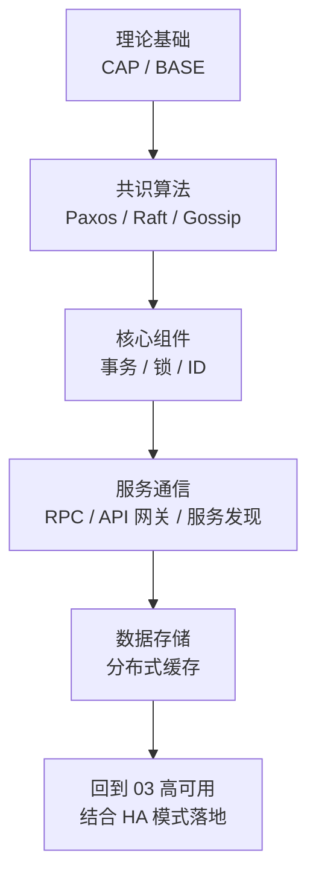

<!--
module:
  parent: system-design
  slug: system-design/02-distributed
  type: article
  category: 主模块子文章
  summary: **一句话定义**：分布式系统是**多台独立计算机通过网络协作**，对外表现得像一台单一计算机的系统——但单机理论（如 ACID）在这里都要被重新审视。
-->

# 分布式系统

> **一句话定义**：分布式系统是**多台独立计算机通过网络协作**，对外表现得像一台单一计算机的系统——但单机理论（如 ACID）在这里都要被重新审视。
> 适用读者：后端工程师 / 架构师 / SRE，建议具备 [01-foundation](../01-foundation/README.md) 基础。
> 最后更新: 2026-06-09

## 目录

- [一、为什么需要分布式](#一为什么需要分布式)
- [二、本章学习路径](#二本章学习路径)
- [三、模块导航](#三模块导航)
- [四、关键概念速查](#四关键概念速查)
- [五、选型指南](#五选型指南)
- [六、延伸阅读](#六延伸阅读)
- [七、参考资料](#七参考资料)

---
## 引言：反直觉代码
分布式系统 的关键不是语法——是**看起来对**的代码背后那些'踩坑点'。

本篇用 3 个反直觉片段切入，把面试/生产中常被问起、但一深入就漏馅的点摆出来。

---

## 一、为什么需要分布式

单机系统终将撞上三堵墙：

| 瓶颈 | 单机上限（参考量级） | 解决思路 |
| --- | --- | --- |
| **计算** | 单机 CPU 核数 / 主频 | 垂直扩展（升级硬件）→ 水平扩展（加机器） |
| **存储** | 单盘容量 / 单机内存 | 分库分表 / 分布式文件系统 |
| **可用性** | 单点故障 = 整体不可用 | 多副本 / 多机房 / 异地容灾 |

垂直扩展有天花板（摩尔定律放缓 + 硬件成本非线性增长），所以**水平扩展 + 分布式协作**是唯一可持续路径。但分布式不是免费的——它引入了**网络不可靠、时钟不同步、部分失败**三个新问题：

- **网络不可靠**：消息丢失、延迟、乱序、重复。
- **时钟不同步**：NTP 同步误差毫秒级，无法做"全局时间戳排序"。
- **部分失败**：节点 A 成功调用 B，但 A 给客户端的响应丢失——客户端重试，B 又执行一次。

> 这三个问题贯穿整个分布式理论：CAP、BASE、共识算法、幂等设计、分布式事务、分布式锁……都是为了**在不可靠之上构建可靠**。

---

## 二、本章学习路径

建议按以下顺序阅读（**理论基础 → 共识 → 组件 → 通信 → 存储**），不要跳读：



**前导知识**：
- 计算机网络（TCP / HTTP / DNS）
- 操作系统（进程 / 线程 / 内存模型）
- 数据库（事务、索引、锁）

**横向依赖**：
- [01-foundation](../01-foundation/README.md) 提供架构基础
- [03-high-availability](../03-high-availability/README.md) 是分布式的"工程化落地"
- [04-high-performance](../04-high-performance/README.md) 是分布式的"性能优化面"

---

## 三、模块导航

### 3.1 理论基础

- [CAP 定理](cap-and-base/cap/README.md) — 一致性 / 可用性 / 分区容错性的三选二
- [BASE 模型](cap-and-base/base/README.md) — 基本可用 / 软状态 / 最终一致性

### 3.2 共识算法

- [共识算法综述](consensus-algorithms/README.md) — 从 Paxos 到 Raft 的演进
- [Paxos](consensus-algorithms/paxos/README.md) — 最基础的分布式共识算法（难懂但经典）
- [Raft](consensus-algorithms/raft/README.md) — 易于理解的共识算法（工程首选）
- [Gossip](consensus-algorithms/gossip/README.md) — 病毒式传播协议（最终一致性场景）

### 3.3 核心组件

- [分布式事务](distributed-transaction/README.md) — 2PC / 3PC / TCC / SAGA / 本地消息表
- [分布式锁](distributed-lock/README.md) — Redis / ZooKeeper / Etcd 实现方案
- [分布式 ID](distributed-id/README.md) — [UUID](distributed-id/uuid/README.md) / [ULID](distributed-id/ulid/README.md) / [UUID-v7](distributed-id/uuid-v7/README.md) / Snowflake / Leaf

### 3.4 服务通信

- [RPC](rpc/README.md) — [RPC vs REST](rpc/rpc-and-rest/README.md) / [Apache Dubbo](rpc/apache-dubbo/README.md)
- [API 网关](api-gateway/README.md) — 网关的核心功能与选型
- [服务注册与发现](service-discovery/README.md) — Eureka / Nacos / Consul

### 3.5 数据存储

- [分布式缓存](distributed-cache/README.md) — Redis Cluster / 缓存击穿·穿透·雪崩

---

## 四、关键概念速查

### 4.1 CAP / BASE / ACID 对比

| 维度 | CAP（理论） | BASE（实践） | ACID（传统） |
| --- | --- | --- | --- |
| **提出者 / 年份** | Eric Brewer, 2000 | Dan Pritchett, 2008 | Jim Gray, 1981 |
| **适用场景** | 分布式系统理论边界 | 分布式系统实践哲学 | 单机关系型数据库 |
| **一致性** | C：强一致（CP 选 C、AP 放弃 C） | 软状态 → 最终一致 | 强一致（事务结束即一致） |
| **可用性** | A：可用（AP 选 A、CP 放弃 A） | 基本可用 | 受事务约束 |
| **分区容错** | P：必须（不可放弃） | 默认接受 | 不涉及 |
| **事务模型** | 无具体协议 | 多种实现（消息表、Saga 等） | 2PC |
| **典型系统** | ZooKeeper (CP) / Eureka (AP) | 大部分 NoSQL、电商 | MySQL InnoDB / Oracle |
| **代价** | 必须放弃 C 或 A | 实现复杂、需补偿 | 性能低、扩展难 |
| **推荐场景** | 理解上限 | 互联网分布式首选 | 强一致金融 |

> **实战心法**：分布式里**没有真正的强一致**（CAP 的 P 不可避免），只有"延迟可接受的一致"。

### 4.2 一致性级别速查

| 级别 | 描述 | 实现代价 | 典型协议 |
| --- | --- | --- | --- |
| **强一致** | 写后读一定读到最新 | 高 | Paxos / Raft / 2PC |
| **顺序一致** | 所有节点看到相同操作顺序 | 中 | Raft Log |
| **因果一致** | 有因果关系的操作必顺序 | 中 | Vector Clock |
| **读己之写** | 自己写的自己立即能读到 | 低 | Session + 版本号 |
| **单调读** | 不会读到旧值覆盖新值 | 低 | Session + 版本号 |
| **最终一致** | 足够时间后所有节点一致 | 极低 | Gossip / 异步复制 |

---

## 五、选型指南

### 5.1 共识算法怎么选？

```
是否强需求：多个节点必须就"一个值"达成一致？
├── 是 → 一致性要求？
│   ├── 极强（金融、配置）→ Raft（etcd / Consul）
│   ├── 强但允许部分失败 → Paxos（Chubby / Megastore）
│   └── 弱（最终一致即可）→ Gossip / Cassandra
└── 否 → 是否需要"全网广播一个事件"？
    ├── 是 → Gossip（Redis Cluster / Consul membership）
    └── 否 → 单机即可
```

### 5.2 分布式 ID 怎么选？

```
场景
├── 数据库主键 + 趋势递增 + 可排序 → Snowflake / Leaf（雪花算法）
├── 全局唯一即可（不在乎顺序）→ UUID v4
├── 全局唯一 + 可排序 + 分布式友好 → UUID v7 / ULID
├── 业务前缀可读 → 业务前缀 + Snowflake
└── 单库自增足够 → AUTO_INCREMENT（不要过度设计）
```

### 5.3 分布式事务怎么选？

```
一致性要求
├── 强一致（钱必须不能错）→ 2PC（Seata AT 模式）/ TCC
├── 最终一致（可接受秒级不一致）→ Saga / 本地消息表
├── 不要求强一致（仅去重）→ 幂等键 + 状态机
└── 完全无事务要求 → 异步消息 + 补偿
```

### 5.4 分布式锁怎么选？

```
场景
├── 性能敏感 + 可容忍偶尔失效 → Redis（Redlock）
├── 强一致 + 不在意性能 → ZooKeeper / etcd
├── 单数据中心 → 任选
└── 多数据中心 → etcd（基于 Raft 跨数据中心较成熟）
```

### 5.5 决策树：什么时候上分布式？

> **KISS 原则：能不上就不上，能用单机用单机。**

```
Q1: 单机能扛住吗？
├── 是 → 不上
└── 否 → Q2: 上分布式还是垂直扩展？
    ├── 业务简单 + 数据量 < 1TB → 垂直扩展（升级硬件）
    └── 业务复杂 / 流量大 / 全球化 → Q3
        Q3: 强一致需求？
        ├── 是 → CP 系统（ZooKeeper / etcd 协调 + 分库分表）
        └── 否 → AP 系统（最终一致 / Saga / 异步消息）
```

---

## 六、延伸阅读

### 6.1 跨章

- [01-foundation](../01-foundation/README.md) — 架构基础、微服务拆分
- [03-high-availability](../03-high-availability/README.md) — 熔断、限流、降级（分布式落地的工程化补充）
- [04-high-performance](../04-high-performance/README.md) — 缓存、消息队列、分库分表（性能优化面）
- [05-security](../05-security/README.md) — 分布式安全（TLS、密钥管理、认证授权）
- [06-idempotency](../06-idempotency/README.md) — 分布式幂等（重试、补偿、防重）
- [07-deployment](../07-deployment/deploy/README.md) — 分布式部署（CI/CD、蓝绿、灰度）

### 6.2 同章

- [cap-and-base/cap](cap-and-base/cap/README.md) — CAP 详细推导
- [cap-and-base/base](cap-and-base/base/README.md) — BASE 工程实践
- [consensus-algorithms/README.md](consensus-algorithms/README.md) — 共识算法综述
- [distributed-transaction/README.md](distributed-transaction/README.md) — 事务方案对比
- [distributed-lock/README.md](distributed-lock/README.md) — 锁方案对比

---

## 七、参考资料

### 7.1 必读经典

- **《Designing Data-Intensive Applications》(DDIA)** — Martin Kleppmann，"分布式 + 数据库 + 大数据"三合一圣经，强烈推荐。
- **《Distributed Systems》** — Maarten van Steen & Andrew Tanenbaum，分布式系统导论。
- **《Data and Reality】** — William Kent，领域建模基础。

### 7.2 论文

- **Eric Brewer, "CAP Twelve Years Later"** (2012) — CAP 原文 + 12 年反思。
- **Leslie Lamport, "Paxos Made Simple"** (2001) — Paxos 简化版。
- **Diego Ongaro & John Ousterhout, "In Search of an Understandable Consensus Algorithm" (Raft)** (2014) — Raft 原文。
- **Dan Pritchett, "BASE: An Acid Alternative"** (2008) — BASE 原文。
- **Jeff Dean, "Designs, Lessons and Advice from Building Large Distributed Systems"** (LADIS 2009) — Google 经验。

### 7.3 在线课程

- **MIT 6.824 Distributed Systems** — 课程 + Paper Reading + Lab，是分布式最好的入门课之一。
- **CMU 15-440 Distributed Systems** — 偏系统视角。
- **Stanford CS244b Distributed Systems** — 偏工程。

### 7.4 工业实践

- **Google Cloud Architecture Framework** — 谷歌分布式架构指南。
- **AWS Well-Architected Framework** — AWS 架构五支柱。
- **Microsoft Azure Architecture Center** — 微软分布式参考架构。
- **Alibaba PouchContainer / Nacos / Seata / Sentinel / RocketMQ 文档** — 阿里开源分布式组件全家桶。

### 7.5 推荐博客 / 网站

- **The Morning Paper** — 分布式论文精读。
- **Martin Kleppmann's Blog** — DDIA 作者博客。
- ** highscalability.com** — 真实系统架构案例。

---

## 八、章节元信息

- **章节定位**：系统设计的"理论 + 组件"层
- **难度**：★★★★☆（需要工程经验才能体会）
- **学习时长**：建议 4-6 周（每周末 1-2 篇）
- **配套练习**：建议用 `mit-6.824` 的 lab（实现 Raft）巩固
- **前置章节**：[01-foundation](../01-foundation/README.md)
- **后续章节**：[03-high-availability](../03-high-availability/README.md)

> 分布式不是银弹——**它把单机的简单问题变成了网络问题，把一致性问题变成了共识问题，把可用性问题变成了副本问题**。读完后请记住：**当你需要分布式时，先问自己三次"我真的需要吗？"**。

---

## 📊 本节统计

| 子目录 | leaf 主题数 | 备注 |
|:-------|:-----------:|:-----|
| `02-distributed/`（本文） | 13 | CAP/BASE · 共识 · 事务 · 锁 · RPC · 网关 |
| ├─ `cap-and-base/` | 2 | CAP 定理 · BASE 模型 |
| ├─ `consensus-algorithms/` | 4 | 共识综述 · Paxos · Raft · Gossip |
| ├─ `distributed-transaction/` | 1 | 2PC/3PC/TCC/Saga/本地消息表 |
| ├─ `distributed-lock/` | 1 | Redis/ZooKeeper/Etcd 实现 |
| ├─ `distributed-id/` | 4 | UUID · ULID · UUID-v7 · Snowflake |
| ├─ `rpc/` | 3 | RPC 总览 · vs REST · Apache Dubbo |
| ├─ `api-gateway/` | 1 | 网关功能与选型 |
| ├─ `service-discovery/` | 1 | Eureka/Nacos/Consul |
| └─ `distributed-cache/` | 1 | Redis Cluster · 三大经典问题 |
| **README 覆盖** | 19 depth-2 leaf + 1 顶层 = **20** | 100% frontmatter |
| **聚合主题数** | 13（见上方学习路径） | 含分布式 ID 等 4 个子专题 |

> 数字基线：以子目录 leaf README 数 + 顶层章节主题数统计；最后更新 2026-07-02。

---

← [返回 04.system-design 主模块](../README.md)
