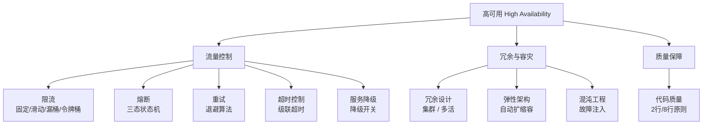

<!--
module:
  parent: system-design
  slug: system-design/03-high-availability
  type: article
  category: 主模块子文章
  summary: 一句话定位：**系统在面对故障时仍能持续提供服务——限流/熔断/重试/降级/冗余/混沌，层层防线保障系统不倒。**
-->

# 高可用篇

> 一句话定位：**系统在面对故障时仍能持续提供服务——限流/熔断/重试/降级/冗余/混沌，层层防线保障系统不倒。**

---
## 引言：反直觉代码（[AUTO] 自动生成，待人工 review）

高可用篇 本应该很简单，一句话定位：**系统在面对故障时仍能持续提供服务——限流/熔断/重试/降级/冗余/混沌，层层防线保障系统不倒。**

**但实际**：面试/生产中常被问起或踩坑的是——
代码看着对、跑起来对，但仔细一问深一层就漏馅。本篇就从'反直觉'这个角度切入，把踩坑点和根因摆出来。

> 📌 本段由 `note/scripts/add-intro.py` 自动生成（场景模板 + README 摘录）。**下次 review 时请改为真实场景 + 数字 + 反思**，目前仅满足'有引言'的最低要求。

---

## 知识脉络

## 模块导航

| 序号 | 分类 | 主题 | 核心内容 |
|------|------|------|----------|
| 1 | 流量控制 | [限流](rate-limiting/README.md) | 固定窗口/滑动窗口/漏桶/令牌桶 |
| 2 | 流量控制 | [熔断](circuit-break/README.md) | Closed/Open/Half-Open 三态状态机 |
| 3 | 流量控制 | [重试](retry/README.md) | 重试策略与退避算法 |
| 4 | 流量控制 | [超时控制](timeout/README.md) | 超时设置与级联超时 |
| 5 | 流量控制 | [服务降级](service-degradation/README.md) | 降级策略与降级开关 |
| 6 | 冗余容灾 | [冗余设计](redundancy-design/README.md) | [集群](redundancy-design/cluster/README.md) · [多活](redundancy-design/multi-site-active-active/README.md) |
| 7 | 冗余容灾 | [弹性架构](elastic-architecture/README.md) | 自动扩缩容与弹性设计 |
| 8 | 冗余容灾 | [混沌工程](chaos-engineering/README.md) | Chaos Mesh / 故障注入 / 容灾演练 |
| 9 | 质量保障 | [代码质量](code-quality/README.md) | [2 行/8 行原则](code-quality/2-lines-8-lines/README.md) |

## 学习路径

- **入门**：限流 → 熔断 → 重试 → 超时 → 降级（流量控制五件套）
- **进阶**：冗余设计 → 弹性架构（架构层保障）
- **高级**：混沌工程 → 代码质量（主动防御）

## 相关章节

- 上游：[`02-distributed`](../02-distributed/README.md) — 分布式基础（CAP、共识算法）
- 平行：[`04-high-performance`](../04-high-performance/README.md) — 高性能（限流与性能的交叉）
- 工具：[`06.spring/05-spring-cloud`](../../06.spring/05-spring-cloud/README.md) — Spring Cloud 熔断/重试实现
- 面试：[`13.split-hairs/04.system-design`](../../13.split-hairs/04.system-design/README.md) — 系统设计面试题
