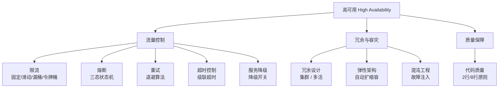

<!--
module:
  parent: system-design
  slug: system-design/03-high-availability
  type: article
  category: 主模块子文章
  summary: 一句话定位：**系统在面对故障时仍能持续提供服务——限流/熔断/重试/降级/冗余/混沌，层层防线保障系统不倒。**
-->

# 高可用篇

> 一句话定位：**系统在面对故障时仍能持续提供服务——限流/熔断/重试/降级/冗余/混沌，层层防线保障系统不倒。**

---
---

## 知识脉络

## 业务层风控

高可用 8 件套是**技术层**防御，业务层还需要风控引擎：

- 🆕 [risk-control-engine](risk-control-engine/README.md) — 5 层架构 + 砍一刀病毒 K-Factor + 黑产 7 类对抗 + 评分卡实战

## 模块导航

| 序号 | 分类 | 主题 | 核心内容 |
|------|------|------|----------|
| 1 | 流量控制 | [限流](rate-limiting/README.md) | 固定窗口/滑动窗口/漏桶/令牌桶 |
| 2 | 流量控制 | [熔断](circuit-break/README.md) | Closed/Open/Half-Open 三态状态机 |
| 3 | 流量控制 | [重试](retry/README.md) | 重试策略与退避算法 |
| 4 | 流量控制 | [超时控制](timeout/README.md) | 超时设置与级联超时 |
| 5 | 流量控制 | [服务降级](service-degradation/README.md) | 降级策略与降级开关 |
| 5b | 流量控制 | [秒杀无 Redis 实战](rate-limiting/seckill-without-redis.md) | 500 人 / 2 台服务器 / 库存=1 单机方案 + 5 大方案对比 |
| 6 | 冗余容灾 | [冗余设计](redundancy-design/README.md) | [集群](redundancy-design/cluster/README.md) · [多活](redundancy-design/multi-site-active-active/README.md) |
| 7 | 冗余容灾 | [弹性架构](elastic-architecture/README.md) | 自动扩缩容与弹性设计 |
| 8 | 冗余容灾 | [混沌工程](chaos-engineering/README.md) | Chaos Mesh / 故障注入 / 容灾演练 |
| 9 | 质量保障 | [代码质量](code-quality/README.md) | [2 行/8 行原则](code-quality/2-lines-8-lines/README.md) |
| 10 | 业务防御 | [风控引擎](risk-control-engine/README.md) | 5 层架构（数据/特征/规则/模型/处置）+ 砍一刀 K-Factor + 7 类黑产对抗 |

## 学习路径

- **入门**：限流 → 熔断 → 重试 → 超时 → 降级（流量控制五件套）
- **进阶**：冗余设计 → 弹性架构（架构层保障）
- **高级**：混沌工程 → 代码质量（主动防御）

## 相关章节

- 上游：[`02-distributed`](../02-distributed/README.md) — 分布式基础（CAP、共识算法）
- 平行：[`04-high-performance`](../04-high-performance/README.md) — 高性能（限流与性能的交叉）
- 工具：[`06.spring/05-spring-cloud`](../../06.spring/05-spring-cloud/README.md) — Spring Cloud 熔断/重试实现
- 面试：[`13.split-hairs/04.system-design`](../../13.split-hairs/04.system-design/README.md) — 系统设计面试题

---

## 📊 本节统计

| 子目录 | leaf 主题数 | 备注 |
|:-------|:-----------:|:-----|
| `03-high-availability/`（本文） | 10 | 限流 · 熔断 · 重试 · 超时 · 降级 · 冗余 · 弹性 · 混沌 · 代码质量 · 秒杀实战 |
| ├─ `rate-limiting/` | 1 | 固定窗口/滑动窗口/漏桶/令牌桶 |
| ├─ `circuit-break/` | 1 | 三态状态机 |
| ├─ `retry/` | 1 | 重试策略与退避 |
| ├─ `timeout/` | 1 | 超时与级联超时 |
| ├─ `service-degradation/` | 1 | 降级策略与降级开关 |
| ├─ `redundancy-design/` | 3 | 冗余 · 集群 · 多活 |
| ├─ `elastic-architecture/` | 1 | 自动扩缩容 |
| ├─ `chaos-engineering/` | 1 | Chaos Mesh / 故障注入 |
| └─ `code-quality/` | 2 | 2 行/8 行原则 |
| **README 覆盖** | 12 depth-2 leaf + 1 顶层 = **13** | 100% frontmatter |
| **聚合主题数** | 9（见上方模块导航） | 全部聚合在本章及子 README |

> 数字基线：以子目录 leaf README 数 + 顶层章节主题数统计

---

← [返回 04.system-design 主模块](../README.md)
