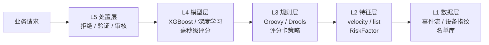
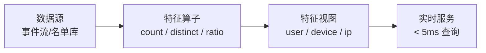
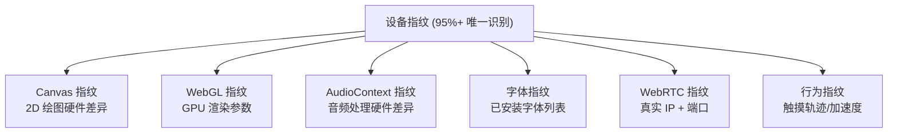
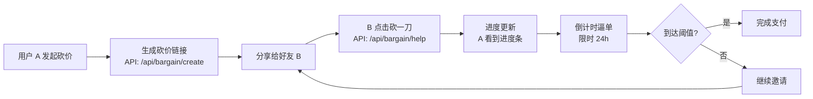
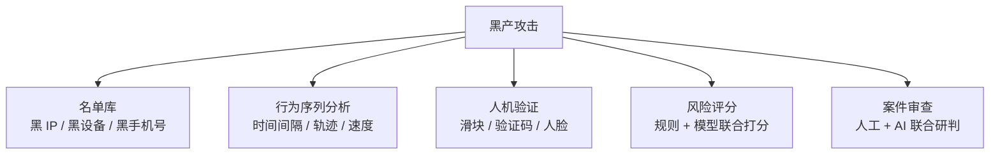

<!--
module:
  parent: system-design
  slug: system-design/risk-control-engine
  type: article
  category: 主模块子文章
  summary: 风控引擎 = 业务风险决策大脑 —— 5 层架构（数据/特征/规则/模型/处置）+ 砍一刀 K-Factor 病毒系数公式 + 黑产 7 类对抗手段
-->

# 风控引擎（Risk Control Engine）

> **风控引擎 = 业务风险决策大脑** —— 5 层架构（数据/特征/规则/模型/处置）+ 砍一刀 K-Factor 病毒系数公式 + 黑产 7 类对抗手段

---

## 目录

- [一、风控的本质：业务风险决策大脑](#一风控的本质业务风险决策大脑)
- [二、风控引擎 5 层架构](#二风控引擎-5-层架构)
- [三、设备指纹：从标识性到行为序列的演进](#三设备指纹从标识性到行为序列的演进)
- [四、砍一刀 K-Factor 病毒系数：营销风控建模](#四砍一刀-k-factor-病毒系数营销风控建模)
- [五、黑产 7 类对抗手段](#五黑产-7-类对抗手段)
- [六、实战规则示例 + 限流集成](#六实战规则示例--限流集成)
- [七、风险评估 + 7 大反直觉](#七风险评估--7-大反直觉)
- [📚 参考来源](#参考来源)
- [🔗 相关章节](#相关章节)

---

## 一、风控的本质：业务风险决策大脑

风控系统（RCS, Risk Control System）不是简单的"黑名单 + 拦截"，而是一套**实时风险决策大脑**：
- **输入**：用户行为流（注册、登录、交易、营销互动等）
- **输出**：实时风险评分 + 处置动作（拒绝 / 二次验证 / 人工审核 / 通过）

风控与限流、熔断同属高可用防线，但定位不同：

| 维度 | 限流 | 熔断 | 风控 |
|------|------|------|------|
| 防御对象 | 流量洪峰 | 服务故障 | 恶意用户 / 黑产 |
| 决策依据 | QPS / TPS | 错误率 / RT | 行为模式 / 风险评分 |
| 处置粒度 | 请求级 | 服务调用级 | 用户 / 设备 / 行为级 |
| 典型场景 | 秒杀、爬虫 | 级联故障 | 薅羊毛、欺诈、刷量 |

> 一句话：**限流防"洪水"，熔断防"雪崩"，风控防"敌人"。**

---

## 二、风控引擎 5 层架构

风控引擎通常采用分层架构，自下而上分为 5 层，每层职责单一、可独立演进：



### 2.1 数据层（L1）—— 风控的"原料仓库"

数据层提供风控决策所需的全部原始信号：

| 数据类别 | 典型内容 | 采集方式 |
|----------|----------|----------|
| **事件流** | 注册、登录、下单、支付、分享、砍价等行为日志 | Kafka / Flink 实时流 |
| **设备指纹** | Android ID / IMEI / OAID / IP / MAC / 浏览器指纹 | SDK 采集 + 服务端补齐 |
| **名单库** | 黑名单（手机号、IP、身份证、银行卡）/ 白名单 / 灰名单 | 离线挖掘 + 人工审核 |
| **外部数据** | 征信、运营商、地理位置、IP 风险标签 | 三方 API（如数美、顶象） |
| **关联数据** | 设备-账号-手机号-收货地址四元关系图 | 图数据库（Neo4j / JanusGraph） |

**关键设计**：
- **实时 + 离线双链路**：实时数据（事件流）走 Kafka → Flink，离线数据（名单、画像）走 T+1 同步到 Redis
- **冷热分层**：热数据（最近 24h 行为）放 Redis，冷数据（历史画像）放 HBase / OSS
- **数据血缘**：每个特征必须能追溯到原始事件，便于排查误判

### 2.2 特征层（L2）—— 风控的"加工厂"

特征层把原始数据加工成风控模型可直接消费的"特征向量"。两大类特征：

**velocity 速度特征**（行为频率）：
- `register_count_24h`：同一设备 24h 内注册次数
- `login_fail_count_1h`：同一账号 1h 内登录失败次数
- `order_count_10min`：同一 IP 10min 内下单次数
- `share_click_count_1h`：砍价场景下 1h 内点击次数

**list 名单特征**（黑/白/灰名单命中）：
- `is_in_blacklist_phone`：手机号是否在黑名单
- `is_proxy_ip`：IP 是否代理池
- `is_recycled_device`：设备是否被回收过（IMEI 复用）

**RiskFactor 模式（新一代特征平台）**：

传统特征开发是"一个特征一套代码"，效率低下。**RiskFactor** 把特征抽象为「算子 + 数据源」的 DAG：



优势：
- **算子复用**：同一个 `count` 算子可作用于任意事件
- **在线一致**：离线 T+1 计算的特征，与线上实时特征使用同一套 DSL
- **样本回溯**：一键回放历史事件，重算特征用于模型训练

> 详见 CSDN 2024《新一代风控特征平台 RiskFactor》。

### 2.3 规则层（L3）—— 风控的"老中医"

规则层基于业务专家经验，用 DSL 表达"什么情况下拒绝"。**两大经典策略**：

**① 评分卡策略**（加法评分）：
```
规则 1：同一设备 24h 注册 ≥ 3 次         → +60 分
规则 2：IP 属于代理池                   → +40 分
规则 3：手机号在黑名单                  → +80 分
规则 4：行为序列异常（无浏览直接下单）   → +30 分
─────────────────────────────────────────────
总分 ≥ 80 → 拒绝；60 ≤ 总分 < 80 → 二次验证；总分 < 60 → 通过
```

**② 最坏匹配策略**（短路逻辑）：
```
如果 命中"手机号黑名单"         → 直接拒绝（不进入下一条）
否则如果 命中"IP 高危代理池"     → 直接拒绝
否则如果 总分 ≥ 80              → 拒绝
否则                          → 通过
```

**规则引擎选型**：
- **Groovy**：动态脚本，轻量，适合中等规模（推荐）
- **Drools**：RETE 算法，复杂规则网络，性能更佳
- **Aviator / MVEL**：表达式求值，极致性能

详见 CSDN 2021《搭建一套基于 Groovy 规则引擎的业务风控平台》。

### 2.4 模型层（L4）—— 风控的"AI 大脑"

模型层用机器学习做"规则难以表达"的高维模式识别：

| 模型类型 | 适用场景 | 延迟要求 |
|----------|----------|----------|
| **XGBoost / LightGBM** | 结构化特征（设备、行为、IP） | < 10ms |
| **深度学习（DNN / Transformer）** | 行为序列、文本、图特征 | 10~50ms |
| **图神经网络（GNN）** | 团伙欺诈识别 | 50~200ms |
| **大模型 LLM** | 案件分析、规则生成 | 异步 |

**关键约束**：
- **毫秒级响应**：风控是同步链路，模型推理必须 < 50ms，否则用户体验崩溃
- **特征一致性**：离线训练用 100 个特征，线上推理必须能实时拿到同样的 100 个特征（否则模型效果打折）
- **可解释性**：金融风控必须给出"为什么拒绝"，不能是黑盒（监管要求）

### 2.5 处置层（L5）—— 风控的"执行者"

处置层根据规则层 + 模型层的输出，执行最终动作：

| 处置动作 | 含义 | 典型场景 |
|----------|------|----------|
| **通过** | 风险低，正常放行 | 正常用户首次下单 |
| **拒绝** | 风险高，立即拦截 | 黑名单手机号注册 |
| **二次验证** | 滑块 / 短信码 / 人脸 | 异地登录、大额支付 |
| **人工审核** | 案件团队介入 | 大额信贷、可疑交易 |
| **延迟处置** | 放行但异步回查 | 灰色行为，需 T+1 复审 |

**异步回流**：处置结果通过 Kafka 回流到数据层，形成闭环——"处置 → 反馈 → 优化规则/模型"。

---

## 三、设备指纹：从标识性到行为序列的演进

设备指纹是风控识别"是不是同一台设备"的核心技术。

### 3.1 两类参数

| 类别 | 典型字段 | 稳定性 | 黑产可改 |
|------|----------|--------|----------|
| **标识性参数** | Android ID / IMEI / OAID / MAC / IDFA | 高 | 易（root + 改码工具） |
| **非标识性参数** | 运营商 / 网络类型 / 屏幕分辨率 / 时区 / 语言 / 电池电量 | 中 | 中（需 hook） |
| **行为参数** | 触摸轨迹 / 加速度传感器 / 陀螺仪 | 低 | 难 |

### 3.2 2026 AI 风控时代：95%+ 唯一识别

单纯依靠标识性参数，黑产可通过"改机工具 + 一键新机"轻松伪造。**新一代 AI 风控**采用浏览器/客户端多维特征交叉：



组合后唯一识别率从单一维度的 30~40% 提升到 **95%+**。

### 3.3 黑产对抗思路：必须配合行为序列

> **反直觉**：单纯设备指纹在高强度对抗下意义有限。

原因：
- 设备农场（1000 台真机）每台都是真实设备，指纹"看起来都正常"
- 改机工具可模拟出"看似合理"的 Canvas / WebGL 参数

**正确做法**：设备指纹 + **行为序列分析** 联合判定
- 真用户：点击有"思考停顿"，滑动有惯性曲线
- 脚本：点击坐标完美均匀，滑动无惯性，时间戳精准等差

---

## 四、砍一刀 K-Factor 病毒系数：营销风控建模

"砍一刀"是拼多多标志性营销玩法，背后是**病毒系数（K-Factor）** 数学模型。风控在其中的角色是**反作弊 + 动态调控**。

### 4.1 K-Factor 公式

$$K = I \times Conv$$

| 变量 | 含义 | 砍一刀场景 |
|------|------|------------|
| **I**（Invitations） | 每用户平均发出邀请数 | 1 个用户分享给 N 个好友 |
| **Conv**（Conversion） | 受邀转化率 | 受邀好友完成"砍价"动作的比例 |

**三种状态**：
- **K > 1**：病毒传播，新用户呈指数增长（理想状态）
- **K = 1**：自维持，新用户线性增长（临界状态）
- **K < 1**：衰减，新用户越来越少（需要补贴）

### 4.2 砍一刀 API 驱动的社交裂变链路



### 4.3 5 大设计原则

| 原则 | 作用 | 砍一刀实现 |
|------|------|------------|
| **胜负欲** | 利用"差一点就成功"心理 | 进度条永远显示 99.9% |
| **进度可视** | 明确预期 | 进度条 + 数字双重展示 |
| **限时** | 制造紧迫感 | 24h 倒计时 |
| **福利激励** | 拉新动力 | 砍多少得多少 |
| **信任展现** | 真实砍价记录 | "X 朋友砍掉 0.01 元" |

### 4.4 数据逻辑：动态调整砍价力度

拼多多"砍一刀"的核心争议是"看似逼近完成，实则永不到 0"：

- **前期大刀**：第一次砍掉 50%，后续 30%、10%
- **后期零头**：越接近阈值，每次砍得越少（0.01 元、0.001 元）
- **永不到 0**：需要邀请的人数动态调整，确保不会轻易达成

> **风控角色**：识别"虚假砍价"（机器助力、群控助力），保护真实用户利益，避免羊毛党把福利薅光。

详见 CSDN 2026-07《拼多多"砍一刀"背后的数据逻辑：API 如何驱动社交裂变》。

---

## 五、黑产 7 类对抗手段

黑产（Black Industry）是风控的核心对手。按攻击维度分为 7 类：

### 5.1 7 类黑产手段

| # | 黑产手段 | 攻击目标 | 典型工具 |
|---|----------|----------|----------|
| ① | **猫池** | 短信验证码 | 多 SIM 卡设备，批量接收验证码 |
| ② | **虚拟手机号** | 注册环节 | 一号通、阿里小号、网络电话 |
| ③ | **代理 IP 池** | IP 风控 | 千万级 IP 池，分钟级切换 |
| ④ | **设备伪造工具** | 设备指纹 | 改机工具、一键新机、多开 |
| ⑤ | **打码平台** | 图形验证码 | OCR 识别 + AI 解码 + 人工众包 |
| ⑥ | **群控** | 批量操作 | 100+ 台手机统一控制 + 脚本 |
| ⑦ | **AI 自动化脚本** | 行为模拟 | RPA + LLM 模拟真人行为 |

### 5.2 综合应对策略



**核心原则**：
- **没有银弹**：单一手段都会被绕过，必须多层防御
- **攻防不平衡**：防御必须 100 分，攻击只需 1 分——所以持续运营比初始设计更重要
- **数据驱动**：每类黑产都需要打标 → 训练专项模型 → 持续迭代

---

## 六、实战规则示例 + 限流集成

### 6.1 Groovy 规则示例

```groovy
// 规则：同一设备 24h 内注册 ≥ 3 次 → 拒绝
rule "device_register_count_24h"
    when
        $device : Device(deviceRegisterCount24h >= 3)
    then
        $device.setRiskAction("REJECT");
        $device.setRiskScore(95);
        $device.setRiskReason("同一设备 24h 内注册次数过多");
end
```

### 6.2 风控评分卡示例

```
特征                              权重    阈值
─────────────────────────────────────────────
设备 24h 注册次数 ≥ 3             30 分   ≥ 3
IP 命中代理池                     25 分   命中
手机号命中黑名单                  40 分   命中
行为序列异常（无浏览直接下单）     20 分   命中
─────────────────────────────────────────────
总分 ≥ 80 → 拒绝
60 ≤ 总分 < 80 → 二次验证
总分 < 60 → 通过
```

### 6.3 限流集成（rate-limiting 配合风控）

风控与限流同属高可用防线，但分工不同。**正确链路**：

```
请求 → 风控规则/模型 → 通过 → 入限流器（令牌桶） → 业务处理
                  ↘ 拒绝 → 直接拦截（不进限流器）
                  ↘ 验证 → 二次验证 → 通过 → 入限流器
```

**为什么要先风控后限流**：
- 限流器是"无差别拦流"，不知道流是好是坏
- 风控是"智能识别好坏流"，先过滤恶意流量后，限流阈值可以更精准
- 攻击者 IP 可能被风控直接拒绝，不会消耗限流配额

---

## 七、风险评估 + 7 大反直觉

| # | 反直觉点 | 错误认知 | 正确做法 |
|---|----------|----------|----------|
| 1 | 设备指纹够用 | 单一设备指纹可识别 100% 黑产 | 必须 + 行为序列、< 5% 黑产可单靠指纹拦截 |
| 2 | 规则越多越好 | 堆 1000 条规则更安全 | 规则之间会冲突，必须有优先级 + 短路逻辑 |
| 3 | 模型是银弹 | 用 AI 模型就不需要规则 | 模型无法解释，监管场景必须有规则兜底 |
| 4 | 越严越好 | 拒绝率越高越安全 | 误杀率 > 5% 会严重影响业务，必须权衡 |
| 5 | 黑名单够用 | 维护一份黑名单就够 | 黑名单滞后，必须有实时风险评分 |
| 6 | 异步分析够用 | 离线 T+1 分析足够 | 薅羊毛是秒级，必须实时风控 |
| 7 | 风控可一劳永逸 | 上线后就完事 | 攻防持续对抗，风控必须持续运营（周级迭代） |

---

## 📚 参考来源

- CSDN 2026 — 风控系统架构设计(2)—策略引擎：决策大脑的工程实现 — https://blog.csdn.net/XMEHB
- 博客园 2025-12 — 病毒系数(K-Factor)：衡量裂变增长的"传播引擎" — https://www.cnblogs.com/BlogNetSpace/p/19330732
- CSDN 2026-07 — 拼多多"砍一刀"背后的数据逻辑：API 如何驱动社交裂变 — https://blog.csdn.net/lovelin_5566/article/details/146158181
- CSDN 2024 — 新一代风控特征平台 RiskFactor：让黑产对抗进入复兴号时代 — https://blog.csdn.net/weixin_38753262/article/details/140223067
- CSDN 2021 — 搭建一套基于 Groovy 规则引擎的业务风控平台 — https://blog.csdn.net/thlzjfefe/article/details/116913325

---

## 🔗 相关章节

- 高可用 8 件套：[限流](../rate-limiting/README.md) · [熔断](../circuit-break/README.md) · [服务降级](../service-degradation/README.md) · [弹性架构](../elastic-architecture/README.md) · [混沌工程](../chaos-engineering/README.md)
- API 安全：[05-security/api-security](../../05-security/api-security/README.md) — 接口层风控
- 餐厅叙事：[12.story/04-peak-traffic-defense](../../../12.story/04-peak-traffic-defense.md) — 大促流量防线
- 咬文嚼字：[13.split-hairs/04.system-design/砍一刀算法](../../../13.split-hairs/04.system-design/砍一刀算法/README.md)

---

← [返回 高可用](../README.md)