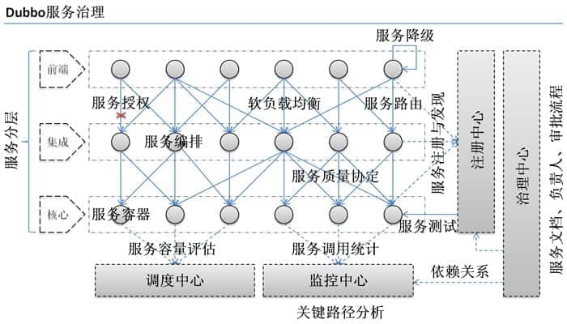
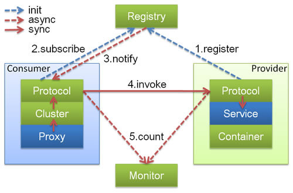
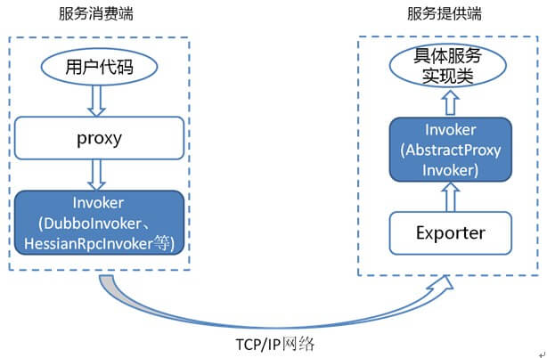
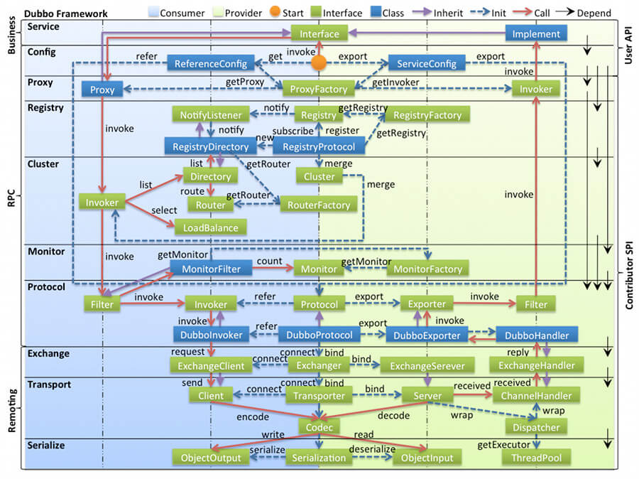
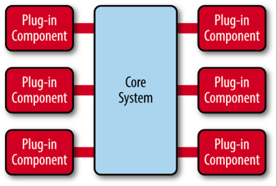
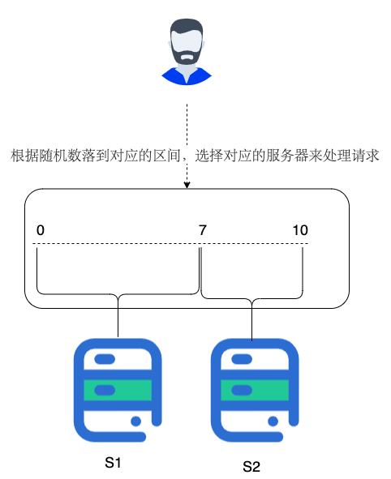
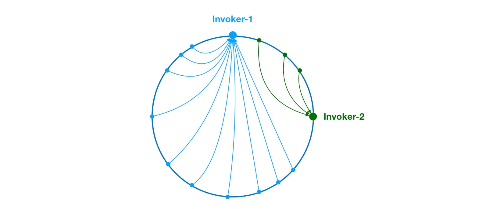
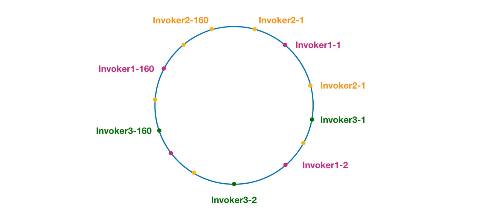

# Apache Dubbo

> Apache Dubbo 是一款易用、高性能的 WEB 和 RPC 框架，同时为构建企业级微服务提供服务发现、流量治理、可观测、认证鉴权等能力、工具与最佳实践。
## 六大核心能力
> - 面向接口代理的高性能 RPC 调用
> - 智能容错和负载均衡
> - 服务自动注册和发现
> - 高度可扩展能力
> - 运行期流量调度
> - 可视化的服务治理与运维
## Dubbo 的作用

> - **负载均衡**：同一个服务部署在不同的机器时该调用哪一台机器上的服务。
> - **服务调用链路生成**： 随着系统的发展，服务越来越多，服务间依赖关系变得错踪复杂，甚至分不清哪个应用要在哪个应用之前启动，架构师都不能完整的描述应用的架构关系。Dubbo 可以为我们解决服务之间互相是如何调用的。
> - 服务访问压力以及时长统计、资源调度和治理。
> - 基于访问压力实时管理集群容量，提高集群利用率。
> - ……
## Dubbo 架构
### Dubbo 架构中的核心角色

> - **Container**：服务运行容器，负责加载、运行服务提供者。必须。
> - **Provider**：暴露服务的服务提供方，会向注册中心注册自己提供的服务。必须。
> - **Consumer**：调用远程服务的服务消费方，会向注册中心订阅自己所需的服务。必须。
> - **Registry**：服务注册与发现的注册中心。注册中心会返回服务提供者地址列表给消费者。非必须。
> - **Monitor**：统计服务的调用次数和调用时间的监控中心。服务消费者和提供者会定时发送统计数据到监控中心。 非必须。
### Dubbo 中的 Invoker 概念

> - 服务提供 Invoker
> - 服务消费 Invoker
### Dubbo 的工作原理

> - **config 配置层**：Dubbo 相关的配置。支持代码配置，同时也支持基于 Spring 来做配置，以 ServiceConfig, ReferenceConfig 为中心proxy
> - **服务代理层**：调用远程方法像调用本地的方法一样简单的一个关键，真实调用过程依赖代理类，以 ServiceProxy 为中心。
> - **registry 注册中心层**：封装服务地址的注册与发现。cluster 路由层：封装多个提供者的路由及负载均衡，并桥接注册中心，以 Invoker 为中心。
> - **monitor 监控层**：RPC 调用次数和调用时间监控，以 Statistics 为中心。
> - **protocol 远程调用层**：封装 RPC 调用，以 Invocation, Result 为中心。
> - **exchange 信息交换层**：封装请求响应模式，同步转异步，以 Request, Response 为中心。
> - **transport 网络传输层**：抽象 mina 和 netty 为统一接口，以 Message 为中心。
> - **serialize 数据序列化层**：对需要在网络传输的数据进行序列化。
### Dubbo 的 SPI 机制
> 扩展 Dubbo 中的默认实现  
> SPI（Service Provider Interface） 机制被大量用在开源项目中，它可以帮助动态寻找服务/功能（比如负载均衡策略）的实现。  
> SPI 的具体原理是这样的：将接口的实现类放在配置文件中，在程序运行过程中读取配置文件，通过反射加载实现类。这样可以在运行的时候，动态替换接口的实现类。和 IoC 的解耦思想是类似的。  
> Java 本身就提供了 SPI 机制的实现。不过，Dubbo 没有直接用，而是对 Java 原生的 SPI 机制进行了增强，以便更好满足自己的需求。
#### 负载均衡策略
> 1. 创建对应的实现类 XxxLoadBalance 实现 LoadBalance 接口或者 AbstractLoadBalance 类
```java
package com.xxx;

import org.apache.dubbo.rpc.cluster.LoadBalance;
import org.apache.dubbo.rpc.Invoker;
import org.apache.dubbo.rpc.Invocation;
import org.apache.dubbo.rpc.RpcException;

public class XxxLoadBalance implements LoadBalance {
    public <T> Invoker<T> select(List<Invoker<T>> invokers, Invocation invocation) throws RpcException {
        // ...
    }
}
```
> 2. 将这个实现类的路径写入到resources 目录下的 META-INF/dubbo/org.apache.dubbo.rpc.cluster.LoadBalance文件中
```text
src
 |-main
    |-java
        |-com
            |-xxx
                |-XxxLoadBalance.java (实现LoadBalance接口)
    |-resources
        |-META-INF
            |-dubbo
                |-org.apache.dubbo.rpc.cluster.LoadBalance (纯文本文件，内容为：xxx=com.xxx.XxxLoadBalance)
```
### Dubbo 的微内核架构
> 微内核架构模式（有时被称为插件架构模式）是实现基于产品应用程序的一种自然模式。基于产品的应用程序是已经打包好并且拥有不同版本，可作为第三方插件下载的。然后，很多公司也在开发、发布自己内部商业应用像有版本号、说明及可加载插件式的应用软件（这也是这种模式的特征）。微内核系统可让用户添加额外的应用如插件，到核心应用，继而提供了可扩展性和功能分离的用法。  
>   
> 微内核架构包含两类组件：核心系统（core system） 和 插件模块（plug-in modules）
### 注册中心和监控中心
> 注册中心负责服务地址的注册与查找，相当于目录服务，服务提供者和消费者只在启动时与注册中心交互。  
> - 服务提供者宕机后，注册中心会立即推送事件通知消费者。
> 监控中心负责统计各服务调用次数，调用时间等。
> 
> -注册中心和监控中心都宕机不影响已运行的提供者和消费者，消费者在本地缓存了提供者列表。注册中心和监控中心都是可选的，服务消费者可以直连服务提供者。Dubbo 的负载均衡策略
## Dubbo 的负载均衡
### 负载均衡
> 负载均衡改善了跨多个计算资源（例如计算机，计算机集群，网络链接，中央处理单元或磁盘驱动）的工作负载分布。负载平衡旨在优化资源使用，最大化吞吐量，最小化响应时间，并避免任何单个资源的过载。使用具有负载平衡而不是单个组件的多个组件可以通过冗余提高可靠性和可用性。负载平衡通常涉及专用软件或硬件。
### 负载均衡策略
#### RandomLoadBalance
> 根据权重随机选择（对加权随机算法的实现）。这是 Dubbo 默认采用的一种负载均衡策略。  
> 
#### LeastActiveLoadBalance
> 最小活跃数负载均衡。  
> `Dubbo`就认为谁的活跃数越少，谁的处理速度就越快，性能也越好，这样的话，就优先把请求给活跃数少的服务提供者处理  
> 如果有多个服务提供者的活跃数相等，就再走一遍`RandomLoadBalance`。
#### ConsistentHashLoadBalance
> 一致性`Hash`负载均衡策略，在分库分表、各种集群中就经常使用这个负载均衡策略。  
>   
> `Dubbo`为了避免数据倾斜问题（节点不够分散，大量请求落到同一节点）引入了虚拟节点的概念。通过虚拟节点可以让节点更加分散，有效均衡各个节点的请求量。  
> 
#### RoundRobinLoadBalance
> 加权轮询负载均衡。  
> 轮询就是把请求依次分配给每个服务提供者。加权轮询就是在轮询的基础上，让更多的请求落到权重更大的服务提供者上。  
> `Dubbo-2.6.5`版本的`RoundRobinLoadBalance`为平滑加权轮询算法
## Dubbo 序列化协议
> JDK 自带的序列化、hessian2、JSON、Kryo、FST、Protostuff，ProtoBuf 等等。  
> Dubbo 默认使用的序列化方式是 hessian2。
> [查看](..%2F..%2F..%2F01.java%2F01.base%2FREADME.md#序列化和反序列化)


