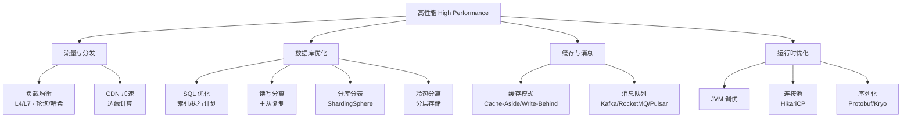

# 高性能篇

> 一句话定位：**在有限资源下最大化吞吐——从负载均衡到数据库优化，从缓存模式到序列化，全链路性能调优。**

---

## 知识脉络

## 模块导航

| 序号 | 分类 | 主题 | 核心内容 |
|------|------|------|----------|
| 1 | 流量分发 | [负载均衡](load-balance/README.md) | L4/L7 · 轮询/哈希/最少连接 |
| 2 | 流量分发 | [CDN 加速](cdn/README.md) | 静态资源分发 · 边缘计算 |
| 3 | 数据库 | [SQL 优化](database-optimization/sql/README.md) | 索引优化 · 执行计划 · 慢查询 |
| 4 | 数据库 | [读写分离](database-optimization/read-write-splitting/README.md) | 主从复制 · 代理模式 |
| 5 | 数据库 | [分库分表](database-optimization/db-sharding/README.md) | [ShardingSphere](database-optimization/db-sharding/sharding-sphere/README.md) |
| 6 | 数据库 | [冷热分离](database-optimization/cold-hot-data-separation/README.md) | 数据分层存储 |
| 7 | 缓存消息 | [缓存设计模式](cache-patterns/README.md) | Cache-Aside / Read-Through / Write-Behind |
| 8 | 缓存消息 | [消息队列](mq/README.md) | Kafka / RocketMQ / Pulsar 对比 |
| 9 | 运行时 | [Java 性能优化](java/README.md) | JVM 调优 · 代码级优化 |
| 10 | 运行时 | [连接池优化](connection-pool/README.md) | HikariCP 参数调优 |
| 11 | 运行时 | [序列化优化](serialization/README.md) | Protobuf / Kryo / Hessian |

## 学习路径

- **入门**：缓存模式 → 连接池 → SQL 优化（最直接的收益）
- **进阶**：读写分离 → 分库分表 → 消息队列（架构层优化）
- **高级**：JVM 调优 → 序列化 → 负载均衡 → CDN（极致性能）

## 相关章节

- 上游：[`03-database`](../../03.database/README.md) — 数据库基础（MySQL/Redis 底层原理）
- 平行：[`03-high-availability`](../03-high-availability/README.md) — 高可用（性能与可用性的权衡）
- 工具：[`05.tools`](../../05.tools/README.md) — Nginx 负载均衡配置
- 面试：[`13.split-hairs/04.system-design`](../../13.split-hairs/04.system-design/README.md) — 系统设计面试题
