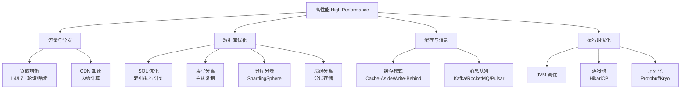

<!--
module:
  parent: system-design
  slug: system-design/04-high-performance
  type: article
  category: 主模块子文章
  summary: 一句话定位：**在有限资源下最大化吞吐——从负载均衡到数据库优化，从缓存模式到序列化，全链路性能调优。**
-->

# 高性能篇

> 一句话定位：**在有限资源下最大化吞吐——从负载均衡到数据库优化，从缓存模式到序列化，全链路性能调优。**

---
## 引言：性能对比
高性能篇 的关键不是'快'——是**什么时候慢、慢多少、为什么**。

本篇用'常见 vs 极端'两组数字切入，把排查思路和优化边界讲清。

---

## 知识脉络

## 模块导航

| 序号 | 分类 | 主题 | 核心内容 |
|------|------|------|----------|
| 1 | 流量分发 | [负载均衡](load-balance/README.md) | L4/L7 · 轮询/哈希/最少连接 |
| 2 | 流量分发 | [CDN 加速](cdn/README.md) | 静态资源分发 · 边缘计算 |
| 3 | 数据库 | [SQL 优化](database-optimization/sql/README.md) | 索引优化 · 执行计划 · 慢查询 |
| 4 | 数据库 | [读写分离](database-optimization/read-write-splitting/README.md) | 主从复制 · 代理模式 |
| 5 | 数据库 | [分库分表](database-optimization/db-sharding/README.md) | [ShardingSphere](database-optimization/db-sharding/sharding-sphere/README.md) |
| 6 | 数据库 | [冷热分离](database-optimization/cold-hot-data-separation/README.md) | 数据分层存储 |
| 7 | 缓存消息 | [缓存设计模式](cache-patterns/README.md) | Cache-Aside / Read-Through / Write-Behind |
| 8 | 缓存消息 | [消息队列](mq/README.md) | Kafka / RocketMQ / Pulsar 对比 |
| 9 | 运行时 | [Java 性能优化](java/README.md) | JVM 调优 · 代码级优化 |
| 10 | 运行时 | [连接池优化](connection-pool/README.md) | HikariCP 参数调优 |
| 11 | 运行时 | [序列化优化](serialization/README.md) | Protobuf / Kryo / Hessian |
| 12 | 🆕 业务安全 | [敏感词过滤](sensitive-word-filter/README.md) | AC 自动机 + Bloom + 100w QPS 高并发完整方案 |
| 13 | 🆕 搜索系统 | [商品搜索](product-search/README.md) | 倒排索引 + BM25 + 多阶段排序 + 数据同步 |
| 14 | 🆕 文件上传 | [大文件上传](file-upload/README.md) | 分片 + 断点续传 + 秒传 + 对象存储 |
| 14b | 🆕 媒体上传 | [media-upload-storage](media-upload-storage/README.md) | 图片 WebP/AVIF + 视频 HLS/DASH + 冷热分层 + 高可用 4 层防线 + 防盗链 DRM | 媒体上传存储系统 |

## 学习路径

- **入门**：缓存模式 → 连接池 → SQL 优化（最直接的收益）
- **进阶**：读写分离 → 分库分表 → 消息队列（架构层优化）
- **高级**：JVM 调优 → 序列化 → 负载均衡 → CDN（极致性能）

## 相关章节

- 上游：[`03-database`](../../03.database/README.md) — 数据库基础（MySQL/Redis 底层原理）
- 平行：[`03-high-availability`](../03-high-availability/README.md) — 高可用（性能与可用性的权衡）
- 工具：[`05.tools`](../../05.tools/README.md) — Nginx 负载均衡配置
- 面试：[`13.split-hairs/04.system-design`](../../13.split-hairs/04.system-design/README.md) — 系统设计面试题

---

## 📊 本节统计

| 子目录 | leaf 主题数 | 备注 |
|:-------|:-----------:|:-----|
| `04-high-performance/`（本文） | 11 | 负载均衡 · CDN · SQL · 读写分离 · 分库分表 · 冷热 · 缓存 · MQ · JVM · 连接池 · 序列化 |
| ├─ `load-balance/` | 1 | L4/L7 · 轮询/哈希/最少连接 |
| ├─ `cdn/` | 1 | 静态资源分发 · 边缘计算 |
| ├─ `database-optimization/` | 6 | 顶层 + SQL · 读写分离 · 分库分表 · 冷热分离 |
| ├─ `cache-patterns/` | 1 | Cache-Aside / Read-Through / Write-Behind |
| ├─ `mq/` | 1 | Kafka / RocketMQ / Pulsar |
| ├─ `java/` | 1 | JVM 调优 · 代码级优化 |
| ├─ `connection-pool/` | 1 | HikariCP 参数调优 |
| ├─ 🆕 `sensitive-word-filter/` | 6 | AC 自动机 + Bloom + Caffeine + 分布式 100w QPS + 变体绕过对抗 |
| ├─ 🆕 `product-search/` | 4 | 倒排索引 + IK 分词 + BM25 + 多阶段排序 + 数据同步 |
| ├─ 🆕 `file-upload/` | 4 | 分片上传 + 断点续传 + 秒传 + 对象存储 + 引用计数 |
| └─ `serialization/` | 1 | Protobuf / Kryo / Hessian |
| **leaf README 合计** | 16 depth-2 leaf + 1 顶层 = **17** | 100% frontmatter |
| **模块导航行数** | 14（见上方模块导航） | 全部聚合在本章及子 README |

> 数字基线：以 leaf README 数 + 模块导航行数双口径统计

---

← [返回 04.system-design 主模块](../README.md)
