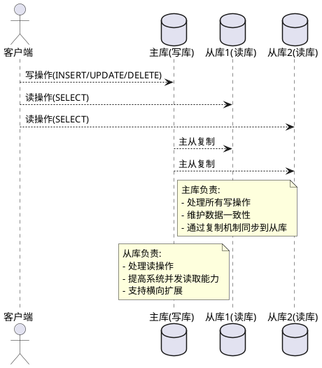
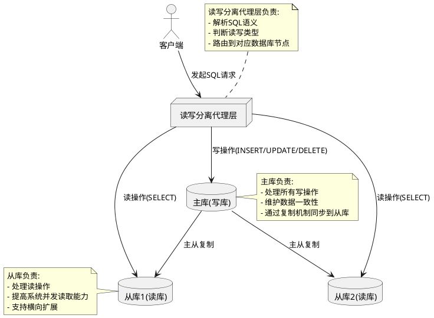

<!--
module:
  parent: system-design
  slug: system-design/read-write-splitting
  type: article
  category: 主模块子文章
  summary: 读写分离通过将读请求分流到从库、写请求集中在主库，提升系统整体吞吐量与可用性，是数据库性能优化的常见方案
-->

# 数据库读写分离

---

> 读写分离通过将读请求分流到从库、写请求集中在主库，提升系统整体吞吐量与可用性，是数据库性能优化的常见方案。

## 什么是读写分离


读写分离主要是为了将对数据库的读写操作分散到不同的数据库节点上。
- 小幅提升写性能，大幅提升读性能。 
- 一般情况下会选择一主多从，也就是一台主数据库负责写，其他的从数据库负责读。主库和从库之间会进行数据同步，以保证从库中数据的准确性。这样的架构实现起来比较简单，并且也符合系统的写少读多的特点。

## 实现读写分离

### 读写分离步骤
1. 部署多台数据库，选择其中的一台作为主数据库，其他的一台或者多台作为从数据库。 
2. 保证主数据库和从数据库之间的数据是实时同步的，这个过程也就是我们常说的主从复制。 
3. 系统将写请求交给主数据库处理，读请求交给从数据库处理。

### 读写分离方式
#### 代理方式

在应用和数据中间加了一个代理层。应用程序所有的数据请求都交给代理层处理，代理层负责分离读写请求，将它们路由到对应的数据库中。
提供类似功能的中间件有 MySQL Router（官方， MySQL Proxy 的替代方案）、Atlas（基于 MySQL Proxy）、MaxScale、MyCat。
#### 组件方式
通过引入第三方组件来帮助进行读写请求。 例如使用 sharding-jdbc 进行读写分离的操作

---

## 主从延迟与一致性处理

主从复制通常是**异步**的，从库会有毫秒到秒级的延迟（极端情况下如大事务/网络抖动可达数秒）。读写分离的**头号风险**就是"读不到刚写入的数据"。

### 反例 ❌ / 正例 ✅

- ❌ 写后立即从从库读：用户改完昵称刷新页面看不到自己改的名字。
- ✅ **强制读主库**（Hint / 路由）：同一个会话内紧跟写操作的读请求走主库，ShardingSphere 提供 `HintManager.setWriteRouteOnly()`。
- ✅ **延迟等待**：写入主库后异步轮询 `SHOW SLAVE STATUS` 的 `Seconds_Behind_Master`，归零后再返回；或借助 **GTID**（MySQL 5.6+）的 `WAIT_FOR_EXECUTED_GTID_SET()` 阻塞读线程直到事务在所有从库应用完毕。
- ✅ **读己之写（Read Your Writes）**：业务上把"刚写完的用户"识别出来，强制走主库；老用户继续走从库。

```sql
-- 等待 GTID 在从库执行完成（MySQL 5.7+）
SELECT WAIT_FOR_EXECUTED_GTID_SET('uuid:gtid_no', 5);  -- 超时 5 秒
```

---

## 最小配置示例（ShardingSphere-JDBC 5.x）

```yaml
# application.yml
spring:
  shardingsphere:
    datasource:
      names: master, slave0, slave1
      master:
        type: com.zaxxer.hikari.HikariDataSource
        driver-class-name: com.mysql.cj.jdbc.Driver
        jdbc-url: jdbc:mysql://master:3306/order?useSSL=false
        username: root
        password: root
      slave0:
        type: com.zaxxer.hikari.HikariDataSource
        jdbc-url: jdbc:mysql://slave0:3306/order?useSSL=false
        username: read
        password: read
      slave1:
        type: com.zaxxer.hikari.HikariDataSource
        jdbc-url: jdbc:mysql://slave1:3306/order?useSSL=false
        username: read
        password: read
    rules:
      readwrite-splitting:           # 读写分离规则
        load-balancers:             # 从库负载均衡
          round-robin:
            type: ROUND_ROBIN
        data-sources:
          order_ds:                 # 数据源别名，应用使用此名
            primary-data-source-name: master
            replica-data-source-names: slave0, slave1
            load-balancer-name: round-robin
    props:
      sql-show: true                # 调试期打印真实路由的 SQL
```

```text
# 强制某次请求走主库（Java 代码示例）
try (HintManager hint = HintManager.getInstance()) {
    hint.setWriteRouteOnly();       // 后续读 SQL 全部走 master
    Order o = orderMapper.findById(id);
}
```

---

## MyCat 配置最小示例

```xml
<!-- server.xml：用户权限 -->
<user name="app">
    <property name="schemas">ORDERDB</property>
    <property name="readOnly">false</property>
</user>

<!-- schema.xml：逻辑库 + 读写节点 -->
<schema name="ORDERDB" checkSQLschema="true" sqlMaxLimit="100">
    <table name="t_order" dataNode="dn_order" rule="mod-long"/>
</schema>

<dataNode name="dn_order" dataHost="orderHost" database="order"/>

<dataHost name="orderHost" maxCon="1000" minCon="10" balance="1"
          writeType="0" dbType="mysql" dbDriver="native" switchType="1">
    <heartbeat>select user()</heartbeat>
    <writeHost host="M1" url="master:3306" user="root" password="root">
        <readHost host="S1" url="slave0:3306" user="read" password="read"/>
        <readHost host="S2" url="slave1:3306" user="read" password="read"/>
    </writeHost>
</dataHost>
```

> `balance="1"` 表示读请求在 `writeHost` + 所有 `readHost` 间轮询；写只走 `writeHost`。

---

## 关键参数与配置速查

| 参数 / 选项 | 推荐值 | 说明 |
|------|--------|------|
| 复制模式 | 半同步 / MGR | 牺牲少量写延迟换取一致性，避免极端丢数 |
| `Seconds_Behind_Master` 阈值 | 1~3s | 超过即触发告警 |
| 从库负载均衡 | `WEIGHT` / `ROUND_ROBIN` | 机器配置差异大时按权重 |
| 从库读策略 | `prefer-slave` / `load-balance-1` | 故障时自动降级到主库 |
| 连接池隔离 | 主/从各自 HikariCP | 避免读慢连接占满主连接 |
| 强制读主 | HintManager / ThreadLocal | 写后立即读等场景 |
| 读超时 | 1~3s | 避免慢从库拖死前端 |
| 监控指标 | `lag_seconds`, `replica_io_running` | Prometheus exporter 抓取 |

---

## 常见误区

- ❌ "读写分离一定能提升性能"——若写远大于读或主库已是瓶颈，反而引入复制延迟与运维成本。
- ❌ "从库越多越好"——每个从库都是主库 binlog 的消费者，过多会拖慢主库 IO。
- ✅ 先做缓存（Redis）+ 慢 SQL 优化，再考虑读写分离；分库分表是读写分离也撑不住时的下策。

---

## 相关章节

- [数据库优化总览](../README.md) — 缓存 / 分库分表 / 索引等其它手段
- [数据库分库分表](../db-sharding/README.md) — 当读写分离仍不够时，按业务键水平拆分
- [缓存模式](../../cache-patterns/README.md) — 读写分离上游常叠加 Redis 做读穿透

---

← [返回 数据库优化](../README.md)