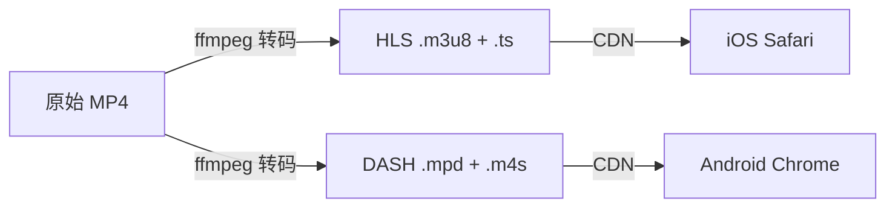
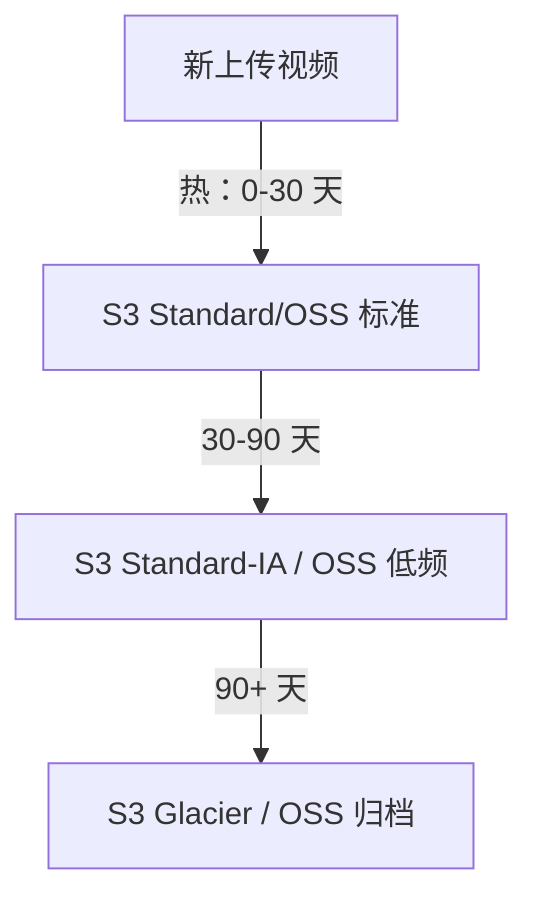
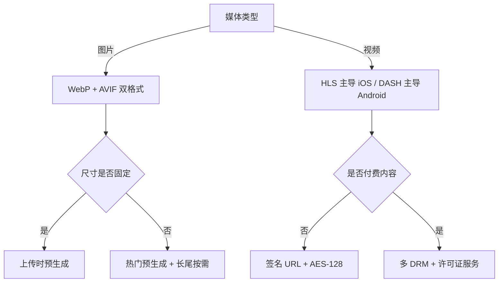

<!--
module:
  parent: high-performance
  slug: system-design/media-upload-storage
  type: article
  category: 主模块子文章
  summary: 图片视频上传存储系统专题：WebP/AVIF 转码 + HLS/DASH 流媒体 + 冷热分层存储 + 高可用 4 层防线 + 防盗链 DRM
-->

# 图片视频上传存储系统（媒体专题）

> 一句话定位：图片视频 = **4 大子模块** —— 图片转码（WebP/AVIF）+ 视频流（HLS/DASH）+ 冷热分层（S3 Standard-IA-Archive）+ 高可用 4 层防线（客户端→服务端→CDN→跨区域）。

媒体系统不是“把文件传到对象存储”这么简单。上传只是入口，真正决定体验和成本的是转码、分发、存储生命周期与版权保护。

---

## 一、为什么需要单独的“媒体”专题？

通用文件上传重点解决分片、断点续传、秒传与完整性校验；媒体上传在此基础上多出一条计算密集型处理链。

### 1.1 与通用文件上传的四个差异

1. **多媒体转码**：图片需要格式和尺寸转换，视频需要编码、封装和码率梯度。
2. **流式播放协议**：大视频不能等待完整下载，需要 HLS/DASH 分片和自适应码率。
3. **隐私与版权**：图片 EXIF 可能暴露 GPS，付费视频需要防盗链、加密乃至 DRM。
4. **冷热分层**：媒体体积大、访问热度衰减明显，必须通过生命周期策略控制成本。

### 1.2 典型用户场景

| 场景 | 核心诉求 | 主要技术 |
|------|----------|----------|
| 电商商品图 | 首屏快、细节清晰、多终端适配 | WebP/AVIF、多尺寸、CDN |
| 短视频点播 | 秒开、弱网不卡顿 | HLS/DASH、ABR、预热 |
| 直播流 | 低延迟、抗抖动 | LL-HLS、切片、边缘分发 |
| 长视频归档 | 低成本、可恢复 | IA/Archive、生命周期策略 |

设计边界要先明确：上传成功不等于媒体可用。只有元数据落库、病毒扫描、转码、审核、分发全部完成，资源才能进入“可发布”状态。

---

## 二、图片子系统：WebP vs AVIF 转码 + 多尺寸

### 2.1 格式选型

| 维度 | JPEG/PNG 传统 | WebP（Google 2010） | AVIF（Netflix/AOMedia 2019） |
|------|---------------|---------------------|------------------------------|
| 压缩率 | 1x | 同画质约减少 25%～35% | 同画质约减少 50% |
| 浏览器覆盖 | 全 | 95%+ | 90%+，旧终端需降级 |
| 透明通道 | PNG 支持 | 支持 | 支持 |
| 动图 | GIF 支持 | 支持 | 支持但生态较弱 |
| HDR/广色域 | 能力有限 | 有限 | 支持更好 |
| 编码速度 | 快 | 中等 | 较慢、CPU 开销高 |
| 编码工具 | 系统库/ImageMagick | `cwebp` | `cavif`/libavif |

推荐采用“原图保底 + WebP 主力 + AVIF 增强”的组合，而不是只存一种派生格式。服务端依据请求头 `Accept` 选择：

```text
Accept: image/avif,image/webp,image/*
        │
        ├─ 支持 AVIF → 返回 .avif
        ├─ 支持 WebP → 返回 .webp
        └─ 其他终端  → 返回 .jpg/.png
```

CDN 缓存键必须包含格式维度，通常通过 `Vary: Accept` 或 URL 后缀区分，避免把 AVIF 错发给不支持的浏览器。

### 2.2 多尺寸缩略图

一张原图通常生成 5 个尺寸，尺寸应由业务组件而不是设备型号驱动：

| 变体 | 建议宽度 | 用途 |
|------|----------|------|
| small | 160px | 列表头像、搜索结果 |
| medium | 480px | 移动端卡片 |
| large | 960px | 桌面端详情 |
| xl | 1920px | 大图预览 |
| web | 按请求裁剪 | 响应式页面兜底 |

对象键建议包含内容哈希和转换参数：

```text
/media/image/{sha256}/original.jpg
/media/image/{sha256}/w480-q80.webp
/media/image/{sha256}/w960-q75.avif
```

哈希路径天然支持不可变缓存；新图片产生新 URL，可安全配置 `Cache-Control: public, max-age=31536000, immutable`。

生成缩略图时还要处理旋转方向、色彩空间、超大像素炸弹和透明背景。解码前限制像素总量，例如宽×高不得超过 100MP，避免恶意图片耗尽内存。

### 2.3 EXIF 隐私三件套

发布前默认去除：

- **GPS 经纬度**：可能暴露家庭、学校或办公地点；
- **设备信息**：相机型号、序列号、软件版本可用于指纹识别；
- **拍摄时间**：可能泄露用户行程与活动规律。

仅保留渲染必需的方向和色彩信息，并在像素旋转完成后删除 Orientation。原始素材若因合规或创作需要保留，应放在私有桶，通过严格权限访问。

### 2.4 实时转码还是上传时预生成

| 方案 | 优点 | 缺点 | 适用场景 |
|------|------|------|----------|
| 上传时预生成 | 首次访问快、延迟稳定 | 生成无用尺寸、占存储 | 尺寸固定、访问量大 |
| On-the-fly | 按需生成、规格灵活 | 首次慢、易被参数攻击 | 长尾尺寸、内部系统 |
| 混合方案 | 热门规格预生成、长尾按需 | 架构稍复杂 | 大多数互联网业务 |

实时转码必须限制宽高、质量、格式参数集合，并对相同参数做请求合并。否则攻击者可构造无限尺寸，制造计算和存储账单攻击。

---

## 三、视频子系统：HLS / DASH 流媒体协议



### 3.1 HLS 与 DASH

| 维度 | HLS | MPEG-DASH |
|------|-----|-----------|
| 发起方 | Apple，规范见 RFC 8216 | MPEG 标准 |
| 清单 | `.m3u8` | `.mpd` |
| 典型分片 | `.ts` 或 fMP4 | `.m4s` |
| 原生生态 | iOS/Safari 最佳 | Android/Chrome 与播放器生态广 |
| 加密 | AES-128、SAMPLE-AES | CENC、Widevine/PlayReady |
| 灵活性 | 兼容性优先 | 编解码与描述能力更灵活 |

HLS 的 Master Playlist 描述多码率流，Media Playlist 列出具体片段。点播常以 4～6 秒为一个片段；片段越短，首开和切换越快，但请求数、清单体积和 CDN 开销越高。

DASH 使用 MPD 描述 Period、AdaptationSet 与 Representation，音视频可以独立选择。使用 CMAF/fMP4 可让 HLS 与 DASH 共享媒体分片，仅保留不同清单，减少重复存储。

### 3.2 多分辨率转码阶梯

| 档位 | 分辨率 | 示例视频码率 | 典型网络 |
|------|--------|--------------|----------|
| 360p | 640×360 | 0.6～1 Mbps | 弱网/省流 |
| 720p | 1280×720 | 2～3 Mbps | 移动网络 |
| 1080p | 1920×1080 | 4～6 Mbps | Wi-Fi/桌面 |
| 4K | 3840×2160 | 12～25 Mbps | 大屏高速网络 |

码率阶梯不是固定模板：动画、体育、访谈的运动复杂度不同，应结合 VMAF/SSIM 做按标题编码（per-title encoding），在目标画质下寻找最低码率。

所有档位需要对齐关键帧与切片边界，否则播放器切换码率时会黑屏、回退或出现音画不同步。音频通常独立编码为 AAC，多语言轨道和字幕分别挂入清单。

### 3.3 自适应码率 ABR

播放器持续观察吞吐、缓冲区、丢包与设备能力，在片段边界切换 Representation：

```text
网络变好：缓冲充足 → 360p → 720p → 1080p
网络变差：下载耗时逼近片长 → 1080p → 720p → 360p
```

首个片段宜选择保守档位保证秒开，积累带宽样本后再升档。切换策略既不能频繁震荡，也不能只追求清晰度而导致卡顿。

### 3.4 转码与封面

转码任务由队列驱动，状态机可设为 `UPLOADED → SCANNING → TRANSCODING → REVIEWING → READY/FAILED`。任务需幂等，输出写临时前缀，全部成功后原子更新发布状态。

封面可用 FFmpeg seek 自动截取：

```bash
ffmpeg -ss 00:00:05 -i input.mp4 -frames:v 1 -vf "scale=1280:-2" cover.webp
```

固定第 5 秒可能截到黑帧，应结合场景变化、亮度和人脸评分挑选候选帧。失败任务进入死信队列，并保存命令、输入探测信息与错误日志用于重放。

---

## 四、冷热分层存储 + 防盗链



### 4.1 三层生命周期

| 层级 | 时间示例 | 存储类型 | 特点 |
|------|----------|----------|------|
| 热 | 0～30 天 | S3 Standard/OSS 标准 | 高频访问、低延迟 |
| 温 | 30～90 天 | Standard-IA/OSS 低频 | 存储便宜，有取回费用 |
| 冷 | 90 天以上 | Glacier/OSS 归档 | 成本最低，恢复需等待 |

合理分层常可降低约 80% 的长期存储成本，但数字取决于访问分布、最短存储周期、取回费与请求费。不要只比较每 GB 单价。

生命周期规则应同时考虑最后访问时间、业务状态和合规保留期。已删除资源先进入软删除期，再清理原图、转码产物、字幕、封面和 CDN 缓存。

冷归档前保留元数据和低清预览。用户请求归档视频时，API 返回“恢复中”，后台发起 restore；恢复完成后提供限时 URL，避免同步接口长时间阻塞。

### 4.2 防盗链五招

1. **Referer 白名单**：低成本挡住普通站外引用，但 Referer 可缺失或伪造。
2. **签名 URL**：把路径、过期时间、随机数纳入 HMAC，短期有效。
3. **Token 鉴权**：将用户、资源、权限和播放会话绑定，支持主动撤销。
4. **IP 限速**：限制单 IP 并发与带宽，注意 NAT 用户和代理误伤。
5. **DRM**：对高价值内容使用 FairPlay、Widevine 或 PlayReady 管理密钥和许可证。

典型签名输入为 `path + expires + clientId + nonce`，服务端验证签名、时钟窗口与权限。不要在 URL 中放长期密钥，也不要仅依赖可伪造的 Referer。

### 4.3 HLS AES-128 加密

HLS 可通过 key 与 keyinfo 为片段加密：清单只暴露密钥 URI，播放器鉴权后获取密钥。密钥服务应独立授权、短期缓存并记录审计日志。

AES-128 能阻止直接下载裸片段，但密钥交付后仍可能被录制；它不是完整 DRM。付费影视需要设备级许可证、输出保护和密钥轮换，必要时采用 SAMPLE-AES/CENC。

---

## 4.5 HLS AES-128 加密实战（key + keyinfo + ffmpeg）

**3 步链路**：

```bash
# Step 1: 生成 16 字节密钥（rand 生成随机字节）
openssl rand 16 > /keys/enc.key

# Step 2: 创建 keyinfo 文件（3 行固定格式）
cat > /keys/enc.keyinfo <<EOF
http://cdn.example.com/hls/enc.key          # 公网可访问的密钥 URL
/keys/enc.key                               # ffmpeg 读取的本地路径
$(openssl rand -hex 16)                    # 16 字节 IV（可选但推荐）
EOF

# Step 3: ffmpeg 转码 + AES-128 加密 + HLS 切片
ffmpeg -i source.mp4 \
  -c:v libx264 -crf 22 -preset medium \
  -hls_time 6 -hls_playlist_type vod \
  -hls_key_info_file /keys/enc.keyinfo \
  -hls_enc true \
  -hls_segment_filename "seg_%03d.ts" \
  stream.m3u8
```

**关键约束**：
- **密钥 URL 必须 HTTPS + 独立鉴权服务**（API 网关防爬虫爆破）
- **每视频独立密钥**（共用密钥被拖库即全平台失守）
- **IV 16 字节随机**（ECB 模式下相同明文密文一致，反推风险）
- **密钥 90 天轮换**（长期密钥泄露风险累积）

**反模式**：
- ❌ 密钥 URL 公开 + 无鉴权 → 攻击者直接拉密钥
- ❌ 多视频共用密钥 → 一泄露失守全平台
- ❌ 静态 IV → 密码学反推攻击风险

---

## 五、高可用 4 层防线

| 层 | 故障域 | 防御手段 |
|----|--------|----------|
| L1 客户端 | 网络抖动 | 重试 3 次 + 指数退避 + 断点续传 |
| L2 服务端 | 服务宕机 | LB + 多机房 + 限流熔断 |
| L3 CDN 边缘 | 边缘节点宕机 | 多 CDN 厂商 + 智能选路 + HTTP/3 |
| L4 跨区域复制 | 机房断电 | 异地多活 + OSS 双写 + 异步复制 |

### 5.0 4 层防线详细表（实战对照）

| 层 | 故障域 | 实测概率 | 防御手段 + 实操工具 | 验证方式 |
|----|--------|---------|-------------------|---------|
| **L1 客户端** | 网络抖动 / 断网 | 用户场景 ~5% | 3 次重试 + 指数退避（1s/3s/9s + random jitter） + 断点续传（uploadId + chunk index + ETag） + 客户端本地缓存已上传 chunks | 弱网模拟（Charles / Network Link Conditioner） |
| **L2 服务端** | 服务宕机 / 限流 | 服务可用性 99.9%~99.99% | Nginx SLB / ALB + K8s 多 Pod + Sentinel/Resilience4j 限流熔断 + HPA 弹性扩容 + 健康检查 | chaos engineering（ChaosBlade / Chaos Monkey） |
| **L3 CDN 边缘** | 边缘节点宕机 / 回源过慢 | CDN 厂商 SLA 99.95% | 多 CDN 厂商（阿里云 + 腾讯云）+ GSLB 智能 DNS + HTTP/3 + QUIC + Origin Shield 回源配额 + 客户端备用域名 | 主动探测（合成监控） + 厂商故障演练 |
| **L4 跨区域复制** | 机房断电 / 自然灾害 | 同城 RPO=0 / 跨区域 RPO 几秒-RPO 分钟 | 异地多活 + OSS 双写同 region + S3 Cross-Region Replication 异步 + 冷备份定期 + DNS 切换流量 | 跨区域 failover 演练（季度） |

### 5.1 L1：客户端韧性

每个分片独立校验和重试，建议指数退避加随机抖动，例如 1s、2s、4s，最多 3 次。客户端持久化 `uploadId`、分片 ETag 和过期时间，刷新页面后可查询服务端已完成分片。

不要无脑重试 4xx；仅对超时、连接中断和可恢复的 5xx 重试。弱网下动态降低并发，避免多个分片争抢带宽导致全部超时。

### 5.2 L2：服务端可用性

上传协调服务保持无状态，经负载均衡部署到多个可用区；会话、分片状态放 Redis/数据库，对象数据直接进入存储。限流保护 STS、初始化和合并接口，熔断外部审核、转码等依赖。

元数据写入与消息投递使用 Outbox 或事务消息，避免“文件已上传但转码任务丢失”。消费者以媒体 ID 和处理版本做幂等键。

### 5.3 L3：CDN 边缘容灾

多 CDN 可按地域、运营商、实时质量和成本选路。DNS 切换恢复较慢，可配合客户端备用域名或调度层。HTTP/3 基于 QUIC，在移动网络切换与丢包场景下更稳，但仍需保留 HTTP/2 回退。

源站要防回源风暴：热门资源预热、请求合并、分层缓存和回源限速缺一不可。清单缓存时间应短于媒体分片；点播不可变分片可长期缓存。

### 5.4 L4：跨区域复制

原始素材和关键元数据跨区域异步复制，明确 RPO/RTO。双写并不天然一致：需处理一边成功一边失败、重试乱序、删除标记同步和对象版本冲突。

灾备演练必须覆盖 DNS/CDN 切换、密钥服务、数据库、消息积压和存储权限。只有定期恢复验证过的副本才算备份。

---

## 六、高并发上传架构实战

### 6.1 总体链路

```text
客户端 → 上传初始化/鉴权 → STS 预签名 → 对象存储
                                      │
                                      └→ 上传完成事件 → MQ
                                                        ├→ 病毒扫描
                                                        ├→ 图片转码
                                                        ├→ 视频转码
                                                        └→ 审核与发布
```

控制面负责身份、配额、状态；数据面让客户端直传对象存储，避免媒体字节穿过业务服务器。上传完成不能只信客户端回调，服务端还需 HEAD 对象核验大小、校验和与对象键。

### 6.2 上传通道限流

采用 **IP + UID 双维度令牌桶**：IP 防止匿名洪泛，UID 保证账户配额。Redis Lua 将补充令牌、判断和扣减放在一次原子操作中。

限流指标不只是 QPS，还包括并发上传数、每分钟字节数、单文件大小和每日总量。超限返回明确的 `Retry-After`，避免客户端立即重试放大流量。

### 6.3 STS 预签名直传

STS 临时凭证应满足最小权限：只允许指定桶、指定用户前缀、指定 Content-Type 和有限大小，过期时间通常为分钟级。服务端生成不可预测的对象键，禁止客户端覆盖任意路径。

分片上传结束后显式 Complete；超时未完成的 multipart upload 通过生命周期规则清理，否则残留分片持续计费。

### 6.4 批处理异步化

对象存储事件进入消息队列，图片转码可使用 Serverless 函数，长视频则使用容器/GPU 转码集群。任务按分辨率拆分并行处理，汇总任务等待必要档位成功再发布。

队列积压时按业务优先级降级：先保证封面和 360p/720p，再补齐 1080p/4K。通过幂等输出、可见性超时和死信队列确保可重试。

### 6.5 双 11 / 618 弹性扩容

活动前预估上传带宽、转码 CPU/GPU、队列峰值和 CDN 回源。提前扩容并预热镜像、连接池、热门内容和转码模板；活动中依据队列等待时间而非仅 CPU 自动扩容。

活动结束后逐步缩容，避免中断仍在处理的长任务。容量演练要包含对象存储限额、STS 接口配额和第三方审核吞吐这些隐形瓶颈。

---

## 七、实战选型决策树



决策顺序建议如下：

1. 先确认媒体类型、终端覆盖与首开目标；
2. 再确定格式、编码、分辨率和兼容性降级；
3. 根据访问热度选择预生成或按需转换；
4. 根据内容价值选择防盗链、加密或 DRM；
5. 最后以真实访问曲线设计缓存和冷热生命周期。

小规模业务可优先采用云厂商媒体处理服务，减少转码与 DRM 运维；规模增大后再评估自建以优化单位成本。不要在没有质量指标和成本模型时盲目自建。

---

## 八、5 大反直觉 + 实战陷阱

| 误区 | 正解 | 原因 |
|------|------|------|
| ❌ 视频上传即播 | ✅ 必须先转码 + 分片 | 原编码未必兼容，整文件无法稳定 ABR |
| ❌ WebP 全局替换 | ✅ WebP/AVIF 渐进增强并保留降级 | Safari 16+ 才完整支持 AVIF，旧终端仍存在 |
| ❌ 对象存储一个类型即可 | ✅ 冷数据归档到 Glacier/OSS 归档 | 媒体访问热度衰减，长期标准存储成本高 |
| ❌ CDN 一次预热就够 | ✅ LCP 优化依赖长期缓存策略 | 新 URL、长尾与清单持续产生回源 |
| ❌ 防盗链加签名即可 | ✅ Referer + Token + 限速 + DRM 多层组合 | URL 可能被分享，签名无法阻止授权端录制 |

### 8.1 额外工程陷阱

- **忽略内容嗅探**：只信扩展名会上传伪装文件，应校验 Magic Number 并沙箱解码。
- **转码覆盖原文件**：处理失败时无法重试，应保持原始素材不可变。
- **缓存键遗漏参数**：格式、宽度、质量未入缓存键会返回错误变体。
- **切片边界不对齐**：ABR 切换出现花屏或音画不同步。
- **删除只删数据库**：对象、派生文件、分片和 CDN 缓存继续泄露或计费。
- **只监控成功率**：还应监控首帧时间、卡顿率、转码排队、失败档位和单分钟成本。

上线前至少压测上传初始化、STS 签发、直传带宽、消息堆积、转码吞吐与热点回源，并为每一层准备限流和降级开关。

---

## 九、📚 参考来源

1. [RFC 8216 — HTTP Live Streaming](https://datatracker.ietf.org/doc/html/rfc8216)
2. [AWS S3 Storage Classes](https://aws.amazon.com/s3/storage-classes/)
3. [阿里云 OSS 存储类型](https://help.aliyun.com/zh/oss/user-guide/storage-classes)
4. [FFmpeg 官方文档](https://ffmpeg.org/documentation.html)
5. [WebP 官方文档](https://developers.google.com/speed/webp) 与 [AOMedia AV1](https://aomedia.org/av1-features/)

- **DRM 协议**：
  - [Apple FairPlay Streaming](https://developer.apple.com/streaming/fps/) — iOS 端 DRM 加密（HSM 密钥托管）
  - [Google Widevine](https://www.widevine.com/) — Chrome / Android DRM（3 级安全级别）
  - [Microsoft PlayReady](https://learn.microsoft.com/en-us/playready/) — Edge / 部分智能电视

版本、浏览器覆盖率和云服务价格会持续变化，落地时应以目标用户数据和厂商最新文档为准。

---

## 十、🔗 相关章节

### 现有专题互补

- [file-upload](../file-upload/README.md) — 通用大文件分片、断点续传与秒传
- [CDN 内容分发](../cdn/README.md) — 静态/动态加速、边缘缓存与智能选路
- [缓存模式](../cache-patterns/README.md) — Cache-Aside 与缓存一致性

### 跨主题

- [限流](../../03-high-availability/rate-limiting/README.md) — 令牌桶、漏桶与分布式限流
- [高可用](../../03-high-availability/README.md) — 容灾、降级与故障演练
- 容量规划：[07-deployment/capacity-planning](../../07-deployment/capacity-planning/README.md) — 媒体存储容量预测（热 SSD / 温 Standard-IA / 冷 Glacier 3 层迁移策略 + 媒体增长曲线）
- [冷热数据分离](../database-optimization/cold-hot-data-separation/README.md) — 分层思想与迁移策略
- [消息队列](../mq/README.md) — 异步转码、重试与削峰
- [负载均衡](../load-balance/README.md) — 多实例与流量调度
- **咬文嚼字**：[media-upload 面试](../../../13.split-hairs/04.system-design/media-upload/README.md)

---

← [返回 高性能](../README.md)
