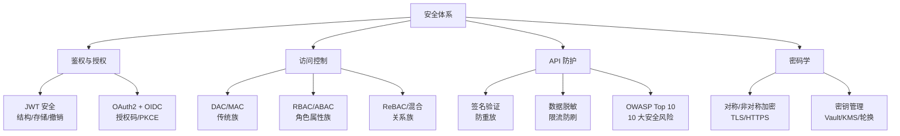

<!--
module:
  parent: system-design
  slug: system-design/05-security
  type: article
  category: 主模块子文章
  summary: 一句话定位：**系统安全是软件的生命线——从鉴权到加密，从访问控制到 OWASP 防御，构建纵深安全体系。**
-->

# 安全篇

> 一句话定位：**系统安全是软件的生命线——从鉴权到加密，从访问控制到 OWASP 防御，构建纵深安全体系。**

---
## 引言：生产 Bug

安全篇 的关键不是'防住'——是**出事后 5 分钟内能定位**。

本篇用真实生产场景切入：线上怎么炸、按官方文档写为什么也会错、怎么止血。

---

## 知识脉络

## 模块导航

| 序号 | 分类 | 主题 | 核心内容 |
|------|------|------|----------|
| 1 | 鉴权 | [JWT 安全](jwt-security/README.md) | JWT 结构 / 攻击防御 / 安全存储 / Token 撤销 |
| 2 | 鉴权 | [OAuth2.0 与 OIDC](oauth2-oidc/README.md) | 授权码 / PKCE / 客户端凭证 |
| 3 | 访问控制 | [访问控制模型](access-control/README.md) | 6 大权限模型与选型决策 |
| 4 | ↳ | [传统族](access-control/01-traditional/README.md) | DAC / MAC |
| 5 | ↳ | [角色属性族](access-control/02-role-and-attribute/README.md) | RBAC / ABAC |
| 6 | ↳ | [关系混合族](access-control/03-relationship-and-hybrid/README.md) | ReBAC / RBAC+ABAC |
| 7 | 防护 | [API 安全](api-security/README.md) | 签名验证 / 防重放 / 数据脱敏 / 限流 |
| 8 | 安全标准 | [OWASP Top 10](owasp-top10/README.md) | 2021 版 10 大 Web 安全风险 |
| 9 | 密码学 | [加密与密钥管理](encryption/README.md) | 对称/非对称/哈希/TLS/KMS |
| 10 | 密码学 | [密钥凭据管理](secrets-management/README.md) | Vault / KMS / 轮换 / 12-Factor |

## 学习路径

- **入门**：JWT → OAuth2 → 访问控制（鉴权三件套）
- **进阶**：API 安全 → OWASP Top 10（防护实战）
- **高级**：加密 → 密钥管理（底层原理）

## 相关章节

- 上游：[`02-distributed`](../02-distributed/README.md) — 分布式基础（安全通信的前提）
- 平行：[`03-high-availability`](../03-high-availability/README.md) — 高可用（安全与可用的平衡）
- 前端安全：[`09.front-end/07-security`](../../09.front-end/07-security/README.md) — XSS/CSRF/CSP 前端安全
- 面试：[`13.split-hairs/04.system-design`](../../13.split-hairs/04.system-design/README.md) — 系统设计面试题
