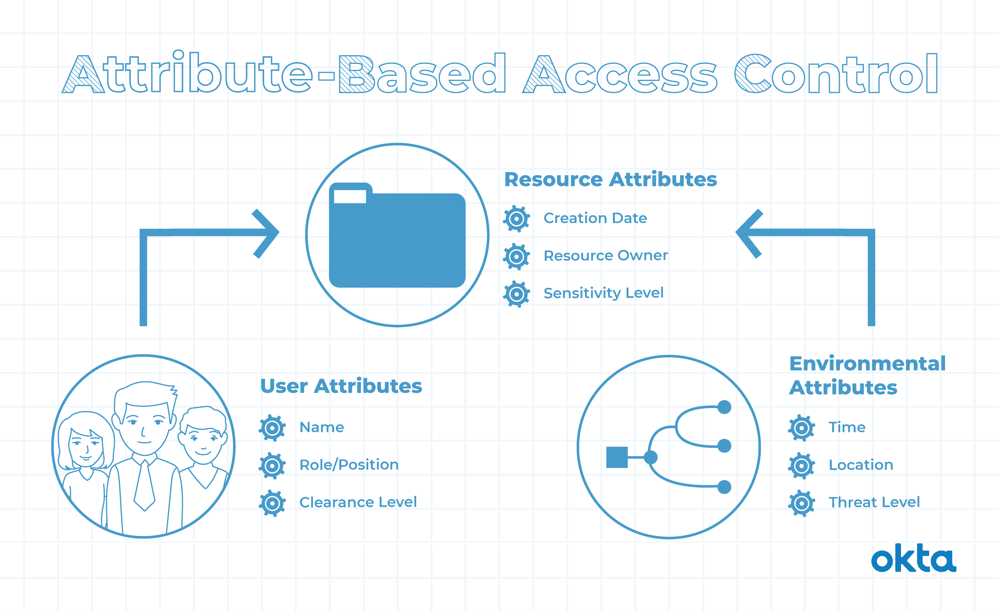

# ABAC（Attribute-Based Access Control，基于属性的访问控制）

> 一句话定位：ABAC 基于主体/客体/环境/动作四类属性，由策略引擎动态评估，灵活度最高。

## 1. 概念与起源

**ABAC** 又称 **PBAC（Policy-Based Access Control）** 或 **CBAC（Claims-Based Access Control）**。它的核心思想是：**不再把权限绑死到"角色"，而是基于"属性 + 策略表达式"在每次访问时动态评估**。

- **历史背景**：2000 年代由 OASIS 的 XACML（eXtensible Access Control Markup Language）标准化；2014 年 NIST 发布 SP 800-162 指南
- **核心思想**：策略即代码，决策 = `eval(策略表达式, 主体属性 ∪ 客体属性 ∪ 环境属性 ∪ 动作属性)`

**与 RBAC 的关键区别**：RBAC 用"角色"这一个间接层；ABAC 用"任意属性"作为决策依据，理论上可表达任意复杂规则。

## 2. 核心模型图



### 四要素

- **对象（Subject）**：当前请求访问资源的用户。属性包括 ID、个人资源、角色、部门、组织成员身份
- **资源（Object/Resource）**：当前用户要访问的资产或对象。属性包括类型、所有者、标签、数据分类、密级
- **操作（Action）**：用户试图对资源进行的操作（读取、写入、编辑、复制、删除）
- **环境（Environment）**：访问请求的上下文（时间、位置、设备、通信协议、加密强度）

## 3. 表/数据结构

```sql
-- 用户属性
CREATE TABLE user_attribute (
    id        BIGINT PRIMARY KEY AUTO_INCREMENT,
    user_id   BIGINT NOT NULL,
    attr_key  VARCHAR(64) NOT NULL,   -- 如 'department' / 'level' / 'clearance'
    attr_val  VARCHAR(255) NOT NULL,
    UNIQUE KEY uk_user_attr (user_id, attr_key)
);

-- 资源属性
CREATE TABLE resource_attribute (
    id           BIGINT PRIMARY KEY AUTO_INCREMENT,
    resource_id  BIGINT NOT NULL,
    attr_key     VARCHAR(64) NOT NULL,
    attr_val     VARCHAR(255) NOT NULL,
    UNIQUE KEY uk_res_attr (resource_id, attr_key)
);

-- 策略
CREATE TABLE abac_policy (
    id        BIGINT PRIMARY KEY AUTO_INCREMENT,
    name      VARCHAR(128) NOT NULL,
    effect    VARCHAR(8) NOT NULL,    -- 'PERMIT' / 'DENY'
    priority  INT DEFAULT 0,
    condition TEXT NOT NULL,          -- 策略表达式（SpEL / Rego / JSON Logic）
    enabled   TINYINT DEFAULT 1
);
```

## 4. 代码/伪代码示例

```java
// ABAC 策略引擎
public class AbacEngine {

    /**
     * 评估访问请求
     */
    public boolean evaluate(AbacRequest request) {
        // 1. 加载匹配的策略
        List<Policy> policies = policyRepository
            .findByResourceType(request.getResource().getType());

        // 2. 按优先级排序
        policies.sort(Comparator.comparingInt(Policy::getPriority));

        // 3. 逐条评估（deny-override 模式）
        for (Policy policy : policies) {
            AccessDecision decision = policy.evaluate(request);
            if (decision == AccessDecision.DENY) {
                return false;
            }
            if (decision == AccessDecision.PERMIT) {
                return true;
            }
        }
        return false; // 默认拒绝
    }
}

// 策略评估
public class Policy {
    private String name;
    private int priority;
    private Expression condition; // SpEL / MVEL / OPA Rego
    private AccessDecision effect;

    public AccessDecision evaluate(AbacRequest request) {
        EvaluationContext ctx = new EvaluationContext();
        ctx.setVariable("subject", request.getSubject());
        ctx.setVariable("resource", request.getResource());
        ctx.setVariable("action", request.getAction());
        ctx.setVariable("environment", request.getEnvironment());

        boolean matches = expressionEvaluator.evaluate(condition, ctx);
        return matches ? effect : AccessDecision.NOT_APPLICABLE;
    }
}
```

### 策略表达式示例（XACML / Rego 风格）

```
策略 1: 工作时间限制
─────────────────────────
PERMIT IF
  subject.role == "employee"
  AND action == "access"
  AND environment.time BETWEEN "09:00" AND "18:00"
  AND environment.day IN ["Monday", ..., "Friday"]

策略 2: 数据访问限制（"销售只能看自己部门客户"）
─────────────────────────
PERMIT IF
  subject.department == resource.owner_department
  AND subject.security_clearance >= resource.classification_level

策略 3: 敏感操作（删除）
─────────────────────────
PERMIT IF
  action == "delete"
  AND subject.role IN ["admin", "owner"]
  AND environment.mfa_verified == true
  AND environment.ip NOT IN blacklist
```

## 5. 优缺点

**优点**:
- 极高的灵活性，可表达任意复杂规则
- 上下文感知（时间、地点、设备、网络）
- 减少"角色爆炸"问题，策略即代码
- 天然支持细粒度（数据级、字段级）权限

**缺点**:
- 实现复杂度高，需要策略引擎和表达式引擎
- 性能开销（每次访问都评估策略）
- 策略难以直观理解（vs 角色-权限映射）
- 策略冲突排查困难（多条策略可能同时匹配）
- 对开发/运维要求高

## 6. 适用与不适用场景

**适用**:
- 金融行业（基于客户资产等级、风险等级的差异化数据访问）
- 医疗行业（HIPAA 合规，基于患者同意状态的数据共享）
- 多租户 SaaS（租户隔离 + 组织内角色 + 资源归属的复合规则）
- 文档协作（只能编辑/删除自己创建的文档）
- 地理围栏（特定 IP 范围或地理位置才能访问敏感资源）
- 时间敏感操作（仅工作时间可执行管理操作）

**不适用**:
- 简单 CRUD 的内部系统（RBAC 足矣）
- 性能极敏感的热路径（每次策略评估都是开销）
- 团队不具备表达式/策略调试能力

## 主流实现

- **Open Policy Agent (OPA)**：CNCF 毕业项目，Rego 语言，云原生事实标准
- **AWS IAM**：策略文档即 ABAC
- **Cerbos**：开源 ABAC 服务
- **Spring Security 表达式**：项目内轻量 ABAC

## 相关章节

- 族内：[RBAC](rbac.md) — ABAC 是 RBAC 的"细粒度 + 上下文"升级
- 跨族：[混合模型](../03-relationship-and-hybrid/hybrid.md) — 实战黄金组合：RBAC + ABAC
- 05-security 主题：[OAuth2.0 与 OIDC](../../oauth2-oidc/README.md) — OAuth2 的 claim 即 ABAC 的"主体属性"
- 05-security 主题：[API 安全](../../api-security/README.md)
