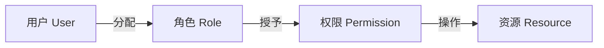
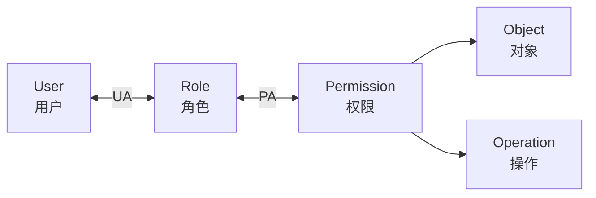
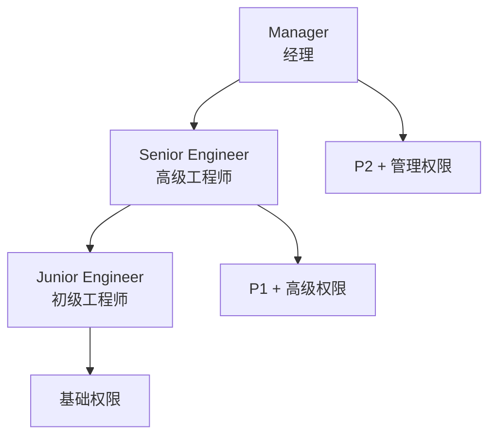
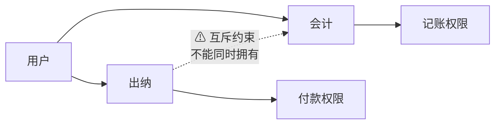
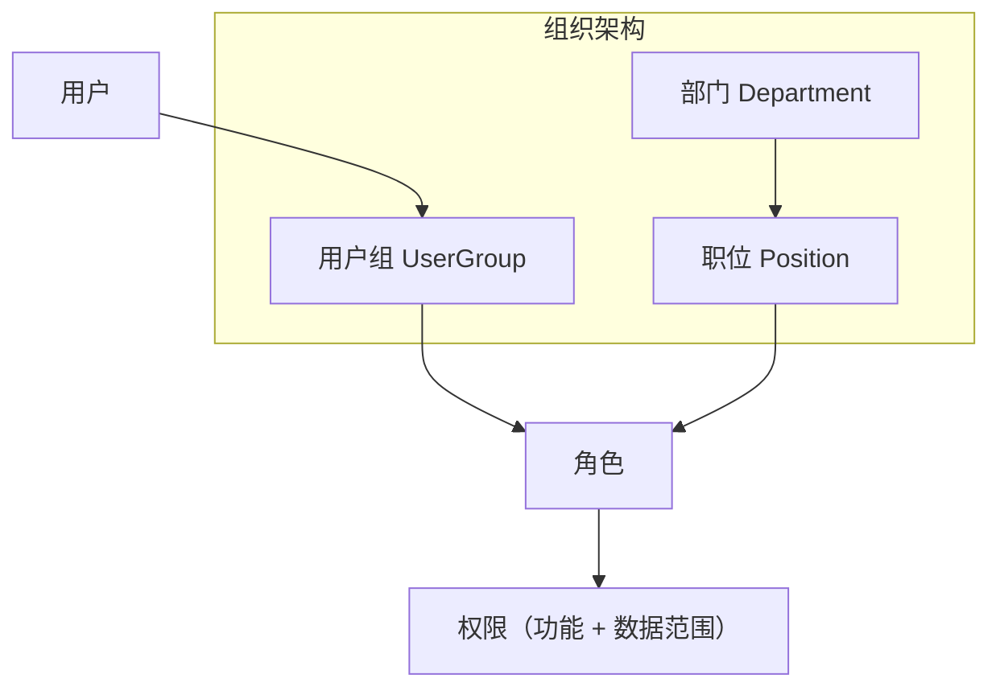

# RBAC（Role-Based Access Control，基于角色的访问控制）

> 一句话定位：RBAC 把权限从用户身上抽到"角色"中介，权限不直接分配给用户，而是分配给角色再分配给用户。

## 1. 概念与起源

**RBAC** 是 1990 年代由美国 NIST（David Ferraiolo 与 Rick Kuhn）系统化的访问控制模型，2004 年成为 ANSI INCITS 359 标准。它的核心洞察是：**权限数量远远小于"用户 × 资源"笛卡尔积，把权限先绑定到"角色"再把角色分配给用户，可以指数级降低管理成本**。

- **历史背景**：1992 年 Ferraiolo & Kuhn 论文；2004 年 ANSI RBAC 标准；2007 年 NIST 给出 RBAC 参考模型
- **核心思想**：用户（User）→ 角色（Role）→ 权限（Permission）三层间接，权限不直接落到用户



## 2. 核心模型图

### RBAC0（基线模型）



### RBAC1（角色继承）



### RBAC2（角色约束）



### RBAC3（用户组 + 组织 + 职位）



## 3. 表/数据结构

### 最小版（RBAC0）

```mermaid
erDiagram
    sys_user ||--o{ sys_user_role : "has"
    sys_role ||--o{ sys_user_role : "assigned"
    sys_role ||--o{ sys_role_permission : "has"
    sys_permission ||--o{ sys_role_permission : "granted"
    sys_user { bigint id, string username, string password, tinyint status }
    sys_role { bigint id, string role_code, string role_name }
    sys_permission { bigint id, string perm_code, string perm_name, string resource, string action }
    sys_user_role { bigint user_id, bigint role_id }
    sys_role_permission { bigint role_id, bigint permission_id }
```

### 完整版（含组织/职位/用户组）

```mermaid
erDiagram
    sys_user ||--o{ sys_user_role : "has"
    sys_role ||--o{ sys_user_role : "assigned"
    sys_role ||--o{ sys_role_permission : "has"
    sys_permission ||--o{ sys_role_permission : "granted"
    sys_dept ||--o{ sys_position : "contains"
    sys_position ||--o{ sys_user : "employs"
    sys_user_group ||--o{ sys_user : "members"
    sys_user_group ||--o{ sys_role : "granted"
    sys_dept { bigint id, string dept_name, bigint parent_id }
    sys_position { bigint id, string position_name, bigint dept_id }
    sys_user_group { bigint id, string group_name, string description }
```

### SQL 落地（核心 5 张表）

```sql
CREATE TABLE sys_user (
    id          BIGINT PRIMARY KEY AUTO_INCREMENT,
    username    VARCHAR(64) NOT NULL UNIQUE,
    password    VARCHAR(255) NOT NULL,
    status      TINYINT DEFAULT 1
);

CREATE TABLE sys_role (
    id          BIGINT PRIMARY KEY AUTO_INCREMENT,
    role_code   VARCHAR(64) NOT NULL UNIQUE,
    role_name   VARCHAR(128) NOT NULL,
    description VARCHAR(255)
);

CREATE TABLE sys_permission (
    id          BIGINT PRIMARY KEY AUTO_INCREMENT,
    perm_code   VARCHAR(128) NOT NULL UNIQUE, -- 如 user:read, user:write
    perm_name   VARCHAR(128) NOT NULL,
    resource    VARCHAR(128),
    action      VARCHAR(32),
    description VARCHAR(255)
);

CREATE TABLE sys_user_role (
    id      BIGINT PRIMARY KEY AUTO_INCREMENT,
    user_id BIGINT NOT NULL,
    role_id BIGINT NOT NULL,
    UNIQUE KEY uk_user_role (user_id, role_id),
    FOREIGN KEY (user_id) REFERENCES sys_user(id),
    FOREIGN KEY (role_id) REFERENCES sys_role(id)
);

CREATE TABLE sys_role_permission (
    id            BIGINT PRIMARY KEY AUTO_INCREMENT,
    role_id       BIGINT NOT NULL,
    permission_id BIGINT NOT NULL,
    UNIQUE KEY uk_role_perm (role_id, permission_id),
    FOREIGN KEY (role_id) REFERENCES sys_role(id),
    FOREIGN KEY (permission_id) REFERENCES sys_permission(id)
);
```

## 4. 代码/伪代码示例

```java
// 权限检查注解
@Retention(RetentionPolicy.RUNTIME)
@Target(ElementType.METHOD)
public @interface RequirePermission {
    String value(); // 如 "user:delete"
}

// AOP 权限拦截器
@Aspect
@Component
public class PermissionInterceptor {

    @Autowired
    private PermissionService permissionService;

    @Around("@annotation(requirePermission)")
    public Object checkPermission(ProceedingJoinPoint pjp,
                                   RequirePermission requirePermission) throws Throwable {
        String requiredPerm = requirePermission.value();
        Long userId = SecurityContext.getCurrentUserId();

        if (!permissionService.hasPermission(userId, requiredPerm)) {
            throw new AccessDeniedException("无权执行操作: " + requiredPerm);
        }

        return pjp.proceed();
    }
}

// 权限检查服务
@Service
public class PermissionService {

    /**
     * 优化: 使用单次 SQL 查询
     * SELECT DISTINCT p.perm_code
     * FROM sys_user_role ur
     * JOIN sys_role_permission rp ON ur.role_id = rp.role_id
     * JOIN sys_permission p ON rp.permission_id = p.id
     * WHERE ur.user_id = ?
     */
    public boolean hasPermission(Long userId, String permCode) {
        return permissionMapper.countUserPermissions(userId, permCode) > 0;
    }
}
```

### 使用示例

```java
@RestController
@RequestMapping("/api/users")
public class UserController {

    @GetMapping("/{id}")
    @RequirePermission("user:read")
    public User getUser(@PathVariable Long id) {
        return userService.findById(id);
    }

    @DeleteMapping("/{id}")
    @RequirePermission("user:delete")
    public void deleteUser(@PathVariable Long id) {
        userService.deleteById(id);
    }
}
```

## 5. 优缺点

**优点**:
- 模型简单直观，5 张表即可落地
- 大幅降低管理复杂度（N 个用户 × M 个权限 → N + M）
- 适合组织架构明确的内部系统
- 审计清晰（角色-权限映射一目了然）

**缺点**:
- **角色爆炸**：复杂场景下角色数量急剧膨胀（销售一部经理、销售二部经理、销售三部经理...）
- **难以表达细粒度规则**："只能编辑自己创建的文档"无法用纯角色表达
- **上下文不敏感**：不考虑时间、地点、设备
- **数据权限弱**：纯 RBAC 不解决"销售 A 只能看自己的客户"问题（需配合 ABAC）

## 6. 适用与不适用场景

**适用**:
- 企业内部管理系统（OA、ERP、CRM）
- 权限规则主要基于功能菜单和操作
- 团队规模较小，没有专门的权限管理团队
- 追求快速上线和易维护性

**不适用**:
- 权限依赖"只能看自己创建的"等数据归属（用 ABAC）
- 权限依赖时间/IP 等环境因素（用 ABAC）
- 多租户 SaaS，租户之间有复杂隔离（用 RBAC+ABAC）
- 角色数量爆炸的复杂场景（用 ABAC）

## RBAC 的 4 个变体

| 模型 | 关键扩展 | 典型场景 |
|------|----------|----------|
| RBAC0 | 用户-角色-权限基础模型 | 80% 内部系统 |
| RBAC1 | 增加角色继承（Senior ⊃ Junior） | 经理 / 主管 / 员工分层 |
| RBAC2 | 增加角色约束（互斥、基数、先决条件） | "出纳"与"会计"互斥 |
| RBAC3 | RBAC1 + RBAC2 综合 | 复杂组织 |

### 三要素（核心概念）

- **用户（User）**：系统中的所有账户
- **角色（Role）**：一系列权限的集合
- **权限（Permission）**：菜单、按钮、数据的增删改查

## 相关章节

- 族内：[ABAC](abac.md) — RBAC 的"细粒度 + 上下文感知"升级版
- 05-security 主题：[OAuth2.0 与 OIDC](../../oauth2-oidc/README.md) — OAuth2 的 scope 是"角色化权限"的一种
- 05-security 主题：[API 安全](../../api-security/README.md) — 接口层 RBAC 拦截
- 05-security 主题：[OWASP Top 10](../../owasp-top10/README.md) — A01 失效的访问控制
