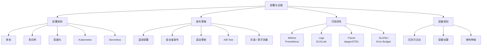

<!--
module:
  parent: system-design
  slug: system-design/07-deployment
  type: article
  category: 主模块子文章
  summary: 一句话定位：**从单机到 K8s，从蓝绿发布到可观测性——部署架构决定物理形态，发布策略决定变更可控。**
-->

# 部署与运维篇

> 一句话定位：**从单机到 K8s，从蓝绿发布到可观测性——部署架构决定物理形态，发布策略决定变更可控。**

---
## 引言：反直觉代码

部署与运维篇 的关键不是语法——是**看起来对**的代码背后那些'踩坑点'。

本篇用 3 个反直觉片段切入，把面试/生产中常被问起、但一深入就漏馅的点摆出来。

---

## 知识脉络

## 模块导航

| 序号 | 主题 | 核心内容 |
|------|------|----------|
| 1 | [部署架构与发布策略](deploy/README.md) | 单机 → K8s → Serverless；蓝绿 / 金丝雀 / 滚动 / A-B Test / 灰度 / 影子流量 / Feature Flag |
| 2 | [可观测性](observability/README.md) | Metrics + Logs + Traces 三大支柱 + SLO/SLI/Error Budget |
| 3 | [容量规划与压测](capacity-planning/README.md) | 压测方法论 · 容量估算模型 · 状态服务容量规划 |

## 学习路径

- **第 1 步**：部署架构 — 理解从单机到 K8s/Serverless 的演进
- **第 2 步**：发布策略 — 蓝绿、金丝雀、滚动等发布模式
- **第 3 步**：可观测性 — 建立 Metrics + Logs + Traces + SLO 体系
- **第 4 步**：容量规划 — 压测 → 估算 → 弹性伸缩

## 相关章节

- 上游：[`03-high-availability`](../03-high-availability/README.md) — 高可用（部署架构是高可用的物理保障）
- 平行：[`04-high-performance`](../04-high-performance/README.md) — 高性能（容量规划与性能的交叉）
- 工具：[`06.spring/07-observability`](../../06.spring/07-observability/README.md) — Spring Boot 可观测性实现
- 工具：[`05.tools`](../../05.tools/README.md) — Docker / Nginx 部署工具
