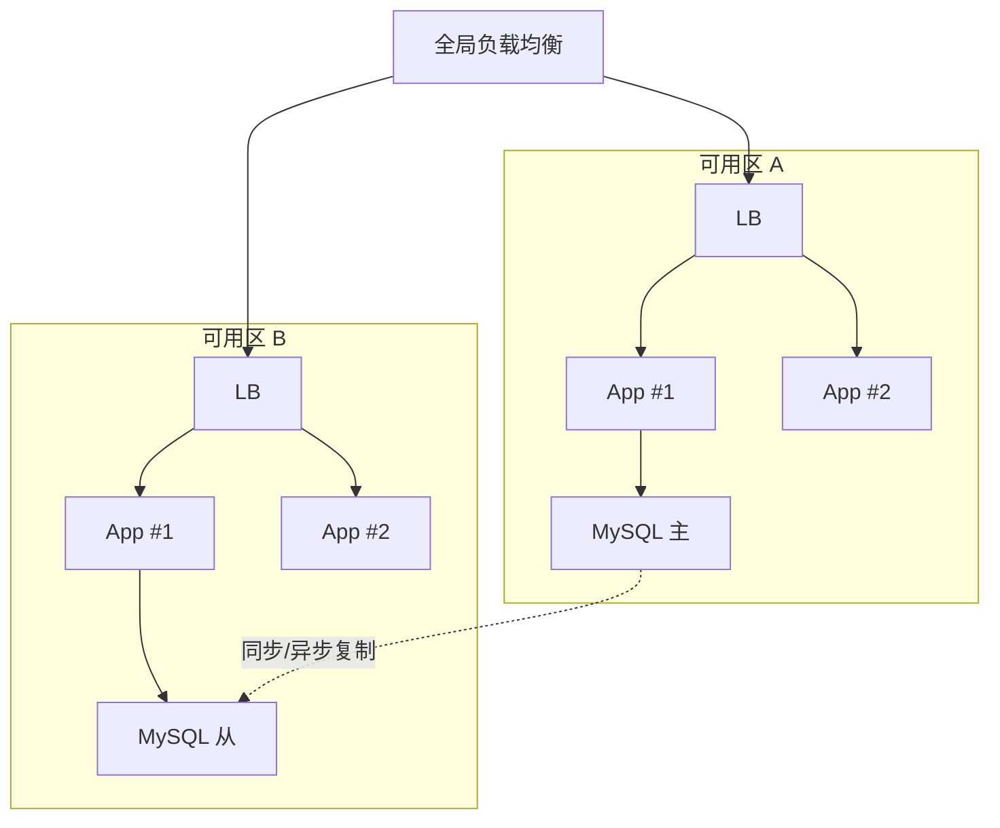

<!--
module:
  parent: system-design
  slug: system-design/deploy
  type: article
  category: 主模块子文章
  summary: 部署架构决定系统的物理形态，发布策略决定变更的可控性。本文系统讲解部署架构（单机/多实例/容器化/K8s/Serverless）和发布策略（蓝绿/金丝雀/滚动/...
-->

# 部署架构与发布策略

> 部署架构决定系统的物理形态，发布策略决定变更的可控性。本文系统讲解部署架构（单机/多实例/容器化/K8s/Serverless）和发布策略（蓝绿/金丝雀/滚动/A-B Test/灰度）的设计、适用场景与权衡。

## 目录

- [一、部署架构](#一部署架构)
  - [单机部署](#单机部署)
  - [多实例部署](#多实例部署)
  - [容器化部署](#容器化部署)
  - [Kubernetes 编排](#kubernetes-编排)
  - [Serverless 部署](#serverless-部署)
  - [部署架构对比](#部署架构对比)
- [二、发布策略](#二发布策略)
  - [蓝绿部署](#蓝绿部署-blue-green-deployment)
  - [金丝雀发布](#金丝雀发布-canary-release)
  - [滚动更新](#滚动更新-rolling-update)
  - [A/B Test](#ab-test)
  - [灰度发布](#灰度发布)
  - [影子流量](#影子流量-shadow-traffic)
  - [Feature Flag](#feature-flag)
- [三、对比与选型](#三对比与选型)
- [四、发布流程规范](#四发布流程规范)
- [五、参考链接](#五参考链接)
- [相关章节](#相关章节)

---
## 引言：架构困境

部署架构与发布策略 的关键不是'选型'——是**选完之后怎么在 5 个 trade-off 里活下来**。

本篇用'决策困境'切入，比较几种主流路径并讲清取舍。

---

## 一、部署架构

部署架构定义了系统运行在何种物理或虚拟资源上，是发布策略的载体。不同的部署架构在可用性、扩展性、运维成本上差异巨大。

### 单机部署

**特点**：所有服务部署在一台物理机或虚拟机上，进程间通过本地调用通信。

```
┌────────────────────────────────────┐
│           单机                      │
│  ┌──────┐ ┌──────┐ ┌──────┐        │
│  │ App1 │ │ App2 │ │ App3 │        │
│  └──────┘ └──────┘ └──────┘        │
│  ┌──────────────┐ ┌──────────┐     │
│  │   MySQL      │ │  Redis   │     │
│  └──────────────┘ └──────────┘     │
└────────────────────────────────────┘
```

- **优点**：部署简单、调试方便、无网络开销
- **缺点**：单点故障、扩展性差、资源争抢
- **适用场景**：开发环境、内部工具、流量极小的工具类应用

### 多实例部署

为了突破单机资源限制，将同一个服务部署多个实例，通过负载均衡对外提供服务。早期微服务架构的典型形态。

```
            ┌─────────────────┐
            │  Load Balancer  │
            └────────┬────────┘
                     │
        ┌────────────┼────────────┐
        ▼            ▼            ▼
   ┌────────┐  ┌────────┐  ┌────────┐
   │App #1  │  │App #2  │  │App #3  │
   │VM/Host │  │VM/Host │  │VM/Host │
   └────────┘  └────────┘  └────────┘
```

**优点**
- 资源利用最大化，多个服务可共享主机资源
- 简单的水平扩展：加机器即可

**缺点**
- 同一主机上多个实例会争夺 CPU、内存、I/O
- 资源紧张时可能影响各实例的稳定性和性能
- 缺乏进程级隔离，单个实例崩溃可能影响整个宿主

**场景**
- 在不同虚拟机/物理机上运行多个微服务实例
- 需要较高性能与一定资源隔离的场景
- 中小型系统，过渡到容器化之前的形态

### 容器化部署

容器化以进程级隔离的方式解决多实例部署中资源争抢和一致性问题，是当前事实标准。

**核心特点**

- **一致性**：容器确保应用在开发、测试、生产环境中的行为一致，消除环境差异
- **隔离性**：每个容器独立运行，进程级隔离，资源边界清晰
- **高效资源利用**：容器轻量、启动快（秒级）、开销低（共享内核）
- **便捷管理**：通过镜像版本化、仓库分发，扩展与回滚都很方便

```
┌────────────────────────────────────┐
│           Host OS                  │
│  ┌──────────┐  ┌──────────┐        │
│  │Container1│  │Container2│        │
│  │ App A    │  │ App B    │        │
│  └──────────┘  └──────────┘        │
│  ┌──────────────────────────┐      │
│  │     Container Runtime    │      │
│  │   (Docker / containerd)  │      │
│  └──────────────────────────┘      │
└────────────────────────────────────┘
```

### Kubernetes 编排

Kubernetes 是 Google 开源的容器编排平台，是云原生时代的事实标准。

**架构组成**

```
                    ┌──────────────────┐
                    │   Master Node    │
                    │  ┌────────────┐  │
                    │  │ API Server │  │
                    │  └─────┬──────┘  │
                    │  ┌─────┴──────┐  │
                    │  │ Scheduler  │  │
                    │  │ Controller │  │
                    │  │ Manager    │  │
                    │  │ etcd       │  │
                    │  └────────────┘  │
                    └─────────┬────────┘
                              │
            ┌─────────────────┼─────────────────┐
            ▼                 ▼                 ▼
       ┌─────────┐       ┌─────────┐       ┌─────────┐
       │Node #1  │       │Node #2  │       │Node #3  │
       │┌──────┐ │       │┌──────┐ │       │┌──────┐ │
       ││ Pod  │ │       ││ Pod  │ │       ││ Pod  │ │
       │└──────┘ │       │└──────┘ │       │└──────┘ │
       │Kubelet  │       │Kubelet  │       │Kubelet  │
       │Kube-    │       │Kube-    │       │Kube-    │
       │proxy    │       │proxy    │       │proxy    │
       └─────────┘       └─────────┘       └─────────┘
```

**Master 节点组件**

- **API Server**：处理 RESTful API 请求，是集群的统一入口
- **etcd**：分布式键值存储，保存集群状态等元数据
- **Controller Manager**：管理控制器，确保集群实际状态与期望状态一致
- **Scheduler**：负责将 Pod 调度到合适的工作节点上

**Node 节点组件**

- **Kubelet**：在每个节点上运行，与 Master 通信，执行 Pod/容器管理任务
- **Kube-proxy**：实现 Kubernetes 服务的网络代理与负载均衡
- **Container Runtime**：运行容器的底层引擎（Docker、containerd 等）

**核心概念**

- **Pod**：Kubernetes 中最小的部署单元，一个 Pod 可包含一个或多个容器，共享网络与存储
- **Deployment**：管理 Pod 副本与滚动更新策略
- **Service**：为 Pod 集合提供稳定的访问入口与负载均衡
- **Ingress**：管理外部到集群内部的 HTTP/HTTPS 路由

**适用场景**：拥有大量微服务的系统，需要自动扩缩容、自愈、滚动发布的场景

### Serverless 部署

Serverless 架构让开发者专注于业务逻辑，无需管理底层基础设施。云厂商按请求量与运行时长计费。

```
┌────────────────────┐
│   Event Source     │
│  (API/HTTP/Cron)   │
└─────────┬──────────┘
          ▼
┌────────────────────┐
│  Function Platform │
│  (Lambda/Func)     │
│  ┌──────┐ ┌──────┐ │
│  │Func A│ │Func B│ │
│  └──────┘ └──────┘ │
│  Auto-scaling      │
│  Pay-per-use       │
└────────────────────┘
```

**优点**：免运维、自动弹性、按需付费
**缺点**：冷启动延迟、运行时长限制、调试复杂、厂商绑定
**适用场景**：流量波动大、事件驱动型业务（图片处理、定时任务、Webhook、ChatOps）

### 多可用区部署（高可用增强）

在多实例/容器化基础上，将服务部署在多个可用区（Availability Zone），由负载均衡器跨可用区分发流量，单可用区故障不影响整体可用性。



**核心要点**
- **跨可用区容灾**：任意一个可用区整体故障时，其他可用区仍能正常服务
- **同步/异步复制**：数据层需配合跨 AZ 的数据复制（RDS 多 AZ、Redis 集群跨槽）
- **延迟权衡**：跨 AZ 调用会有 1~3ms 的额外延迟，需要在可用性与延迟间权衡

**适用场景**：金融、电商、SaaS 等对可用性要求 99.99% 以上的核心系统

### 部署架构对比

| 架构 | 复杂度 | 扩展性 | 可用性 | 资源效率 | 适用场景 |
|------|--------|--------|--------|----------|----------|
| 单机 | 极低 | 极差 | 极低 | 低 | 开发测试、工具类应用 |
| 多实例 | 中 | 中 | 中 | 中 | 中小型系统、过渡形态 |
| 容器化 | 中 | 高 | 中 | 高 | 微服务、CI/CD |
| Kubernetes | 高 | 极高 | 高 | 高 | 中大型系统、云原生 |
| Serverless | 低（运维） | 极高 | 高 | 极高 | 事件驱动、流量波动 |

---

## 二、发布策略

发布策略解决的是"如何将变更安全、可控地推送到生产环境"的问题。不同的发布策略在风险、回滚速度、资源消耗上差异显著。

### 蓝绿部署（Blue-Green Deployment）

**原理**：维护两套完全相同的环境（蓝/绿），同时只有一套环境对外提供服务。发布时将新版本部署到闲置环境，验证通过后切换路由器（Load Balancer / Service / Ingress）将流量一次性切到新版本。旧版本保留为热备份，便于秒级回滚。

```
                ┌─────────────┐
                │   Router    │
                │  (LB/SVC)   │
                └──────┬──────┘
                       │
            ┌──────────┴──────────┐
            ▼                     ▼
    ┌──────────────┐      ┌──────────────┐
    │  Blue (v1)   │      │  Green (v2)  │
    │  当前生产     │      │  新版本待切   │
    │  100% 流量    │      │  0% 流量      │
    └──────────────┘      └──────────────┘
```

**切换时序**：

```
阶段1: Blue=100% Green=0%   ← 稳态运行
阶段2: 部署 Green 版本，等待就绪检查通过
阶段3: 路由器切换：Blue=0% Green=100%   ← 原子切换
阶段4: Blue 保留为热备份
阶段5: 验证通过后，Blue 销毁（或保留为下一次发布的"蓝"）
```

**K8s Service Selector 切换示例**

```yaml
# 阶段1: Service 指向 v1
apiVersion: v1
kind: Service
metadata:
  name: order-service
spec:
  selector:
    app: order
    version: v1   # 指向蓝环境
  ports:
    - port: 80
      targetPort: 8080
---
# 阶段3: 切换 selector 到 v2
apiVersion: v1
kind: Service
metadata:
  name: order-service
spec:
  selector:
    app: order
    version: v2   # 一行切换完成蓝绿发布
  ports:
    - port: 80
      targetPort: 8080
```

**优点**
- 切换是原子的，回滚只需再切一次路由器，秒级回滚
- 新旧版本完全隔离，验证不污染生产
- 适合数据库 schema 兼容的场景（Schema 先迁移，新版本读新字段）

**缺点**
- 资源消耗翻倍（同时维护两套环境）
- 数据库 schema 变更需要前后兼容，否则切换即故障
- 一次性全量切换，发布风险集中

**适用场景**：金融、电信等对可用性要求极高的核心系统；数据库 schema 兼容的版本升级

### 金丝雀发布（Canary Release）

**原理**：将少量流量（如 1%）导入新版本，观察错误率、延迟等关键指标；指标正常后逐步扩大比例（5% → 25% → 50% → 100%），最终全量。任何阶段异常，立刻回滚到旧版本。

```
阶段1:                    阶段2:                  阶段3:
   v1: 100% 流量             v1: 95% 流量            v1: 50% 流量
   v2:   0% 流量             v2:  5% 流量            v2: 50% 流量

阶段4:                    阶段5:
   v1:  25% 流量             v1:   0% 流量
   v2:  75% 流量             v2: 100% 流量
```

```
                ┌─────────────┐
                │   Router    │
                │ (权重路由)   │
                └──────┬──────┘
                       │
            ┌──────────┴──────────┐
            ▼                     ▼
    ┌──────────────┐      ┌──────────────┐
    │  v1 (稳定)    │      │  v2 (金丝雀)  │
    │  99% 流量     │      │  1% 流量      │
    │  100 实例     │      │  1~2 实例     │
    └──────────────┘      └──────────────┘
       监控: 错误率 0.05%     监控: 错误率 0.8%  ← 立即回滚
```

**Istio VirtualService 权重路由示例**

```yaml
apiVersion: networking.istio.io/v1beta1
kind: VirtualService
metadata:
  name: order-service
spec:
  hosts:
    - order-service
  http:
    - route:
        - destination:
            host: order-service
            subset: v1
          weight: 95             # 95% 流量到 v1
        - destination:
            host: order-service
            subset: v2
          weight: 5              # 5% 流量到 v2（金丝雀）
---
apiVersion: networking.istio.io/v1beta1
kind: DestinationRule
metadata:
  name: order-service
spec:
  host: order-service
  subsets:
    - name: v1
      labels:
        version: v1
    - name: v2
      labels:
        version: v2
```

**渐进式比例参考**

| 阶段 | v1 比例 | v2 比例 | 观察时长 | 通过条件 |
|------|---------|---------|----------|----------|
| 初始 | 99% | 1% | 10~30 分钟 | 错误率无明显上升 |
| 第二 | 95% | 5% | 30 分钟 | P99 延迟无明显恶化 |
| 第三 | 75% | 25% | 1 小时 | 业务核心指标正常 |
| 第四 | 50% | 50% | 2 小时 | 容量、稳定性 OK |
| 终态 | 0% | 100% | - | 全量发布完成 |

**优点**
- 风险渐进式暴露，影响范围可控
- 真实流量验证，统计意义强
- 出问题只影响小部分用户

**缺点**
- 发布周期长（数小时到数天）
- 需要精细的流量切分基础设施（Service Mesh / LB）
- 新旧版本共存期间，需要保证数据/接口兼容性

**适用场景**：通用 Web 服务、面向 C 端的微服务；任何对变更敏感、希望逐步验证的发布

### 滚动更新（Rolling Update）

**原理**：以批次方式逐批替换旧版本实例。每一批次先创建少量新版本 Pod，待就绪后下线等量旧版本 Pod，循环往复直至全部替换。Kubernetes Deployment 默认的发布策略。

```
阶段1: [v1][v1][v1][v1][v1][v1]   ← 初始
阶段2: [v1][v1][v1][v1][v1][v2]   ← 新增 1 个 v2
阶段3: [v1][v1][v1][v1][v2][v2]   ← 旧版本下线 1 个
阶段4: [v1][v1][v1][v2][v2][v2]
...
阶段N: [v2][v2][v2][v2][v2][v2]   ← 全部替换
```

**K8s Deployment Strategy 示例**

```yaml
apiVersion: apps/v1
kind: Deployment
metadata:
  name: order-service
spec:
  replicas: 10
  strategy:
    type: RollingUpdate
    rollingUpdate:
      maxSurge: 2          # 最多允许超出 replicas 数量 2 个 Pod
      maxUnavailable: 1    # 最多允许不可用 Pod 数为 1
  selector:
    matchLabels:
      app: order
  template:
    metadata:
      labels:
        app: order
        version: v2
    spec:
      containers:
        - name: order
          image: order-service:v2
          readinessProbe:    # 关键：就绪检查通过才接流量
            httpGet:
              path: /actuator/health/readiness
              port: 8080
            initialDelaySeconds: 30
            periodSeconds: 5
```

**优点**
- 资源消耗与稳态相同，无需双倍资源
- 发布过程平滑，对用户无感知
- K8s 原生支持，无需额外基础设施

**缺点**
- 回滚速度比蓝绿慢（需反向滚动）
- 新旧版本短时共存，需要兼容
- 发布异常时影响范围取决于 maxSurge/maxUnavailable 配置

**适用场景**：无状态服务的常规发布、K8s 默认场景、内部系统

### A/B Test

**原理**：基于用户特征（用户 ID 哈希、Cookie、Header 等）将用户划分为不同分组，分别路由到不同版本，目的不是平稳发布，而是对比不同版本在产品/业务指标上的差异。

```
用户请求: HTTP Header / Cookie / UserID
              │
              ▼
        ┌─────────────┐
        │  路由决策    │
        │  hash(uid)  │
        │   % 100     │
        └──────┬──────┘
               │
      ┌────────┴────────┐
      ▼                 ▼
 hash%100 < 50     hash%100 >= 50
      │                 │
      ▼                 ▼
  v1 (对照组)       v2 (实验组)
  旧版本 UI        新版本 UI
```

**与金丝雀的区别**

| 维度 | 金丝雀 | A/B Test |
|------|--------|----------|
| 目的 | 验证新版本稳定性 | 验证产品/业务假设 |
| 路由依据 | 流量比例 | 用户特征 |
| 决策依据 | 技术指标（错误率/延迟） | 业务指标（转化率/留存） |
| 持续时间 | 小时~天 | 周~月 |

**适用场景**：UI 改版、新算法验证、推荐策略对比、商业化产品试验

### 灰度发布

**原理**：基于用户属性（地域、设备、会员等级、渠道等）将发布范围限定在特定用户群，逐步扩大白名单范围。介于金丝雀和 A/B Test 之间，更偏向生产环境的可控放量。

**典型灰度维度**

- **地域灰度**：先发布到某个机房或地域（如华东 → 华南 → 华北）
- **用户分群灰度**：先开放给内部员工 → 灰度用户 → VIP 用户 → 全量
- **设备灰度**：特定机型 / iOS 版本
- **渠道灰度**：某个 App 渠道

**适用场景**：对稳定性要求极高的产品、需要按白名单逐步放大范围的发布

### 影子流量（Shadow Traffic）

**原理**：将生产流量的副本（"影子"）异步复制到新版本，新版本的处理结果不返回给用户、不影响生产数据，仅用于验证新版本在真实流量下的行为。

```
用户 ──▶ v1（返回结果给用户）──┐
                              │ 复制
                              ▼
                           v2（影子，不返回结果）
                              │
                              ▼
                         比对 v1/v2 响应
```

**优点**
- 真实流量压测，但完全不影响用户
- 适合数据迁移、架构重构等高风险变更

**缺点**
- 需要流量复制基础设施
- 写操作需要特殊处理（影子写入或屏蔽）
- 不能解决数据相关的真实问题

**适用场景**：核心链路重构、数据库迁移、搜索/推荐引擎升级

### Feature Flag

**原理**：将新功能封装在代码中的开关后面，通过配置中心动态控制开关的开关状态与覆盖范围。可以做到"代码已发布、功能未启用"。

```java
// LaunchDarkly / Unleash / 自研 FeatureFlag
if (featureFlag.isEnabled("new-checkout", user)) {
    return newCheckoutService.checkout(user);
} else {
    return legacyCheckoutService.checkout(user);
}
```

**典型发布节奏**

1. 代码合并到主干，开关关闭，发布到生产
2. 内部用户开启开关，验证
3. 灰度用户开启，监控指标
4. 全量开启
5. 后续版本中清理开关与旧代码

**适用场景**：跨多个服务的特性发布、高风险功能、需要快速关闭的能力

---

## 三、对比与选型

### 策略对比

| 策略 | 风险 | 资源消耗 | 回滚速度 | 数据库兼容性 | 适用场景 |
|------|------|----------|----------|--------------|----------|
| 蓝绿部署 | 中（切换瞬间） | 2x | 秒级 | 需兼容 | 核心系统、Schema 变更 |
| 金丝雀 | 低 | 1.1~1.5x | 分钟级 | 需兼容 | 通用 Web 服务 |
| 滚动更新 | 中 | 1x | 分钟级 | 需兼容 | 无状态服务默认 |
| A/B Test | 低 | 1.5~2x | 即时（路由切换） | 需兼容 | 产品验证 |
| 灰度发布 | 低 | 1.1~1.5x | 即时（白名单） | 需兼容 | 严格白名单场景 |
| 影子流量 | 极低 | 2x | 不需要 | 写需特殊处理 | 架构重构 |
| Feature Flag | 低 | 1x | 即时（关开关） | 需兼容 | 跨服务特性 |

### 选型决策树

```
需要做产品/业务验证？
  ├── 是 ──> A/B Test
  └── 否
        │
        风险高、要求秒级回滚？
          ├── 是 ──> 蓝绿部署
          └── 否
                │
                数据库 schema 不兼容？
                  ├── 是 ──> 蓝绿 + 分阶段迁移
                  └── 否
                        │
                        流量规模大、需要渐进放量？
                          ├── 是 ──> 金丝雀发布
                          └── 否
                                │
                                服务无状态 + 追求资源效率？
                                  ├── 是 ──> 滚动更新
                                  └── 否 ──> 金丝雀 / 灰度
```

---

## 四、发布流程规范

### 发布前检查清单

- [ ] 代码已通过 CI（编译、单元测试、代码扫描）
- [ ] 集成测试 / 端到端测试通过
- [ ] 依赖服务已就绪（数据库、缓存、MQ、第三方 API）
- [ ] 配置变更已申请 / 已就位
- [ ] 监控告警已配置（关键指标：QPS、错误率、延迟）
- [ ] 健康检查（liveness/readiness）已配置
- [ ] 回滚预案已就绪
- [ ] 变更公告已发布

### 发布中观察指标

| 指标 | 关注点 | 异常处理 |
|------|--------|----------|
| 错误率 | 较发布前是否有显著上升 | 立即暂停或回滚 |
| P99 延迟 | 较发布前是否有明显恶化 | 观察或回滚 |
| QPS / TPS | 是否达到预期 | 排查容量 |
| CPU / 内存 | 新版本是否资源泄漏 | 立即回滚 |
| 业务核心指标 | 订单、支付等是否正常 | 立即回滚 |

### 发布后验证

1. **冒烟测试**：核心链路手工或自动化验证
2. **监控巡检**：观察 30 分钟 ~ 2 小时的关键指标
3. **用户反馈**：关注客服、用户群、错误日志中的问题
4. **业务指标**：核心业务转化率、留存等无明显异常

### 回滚预案

- 触发条件：明确写明何种指标达到何种阈值即触发回滚
- 回滚步骤：命令清单、负责人、预计时长
- 通信机制：回滚过程中的对内对外通报
- 验证步骤：回滚后需要验证哪些指标确认恢复

---

## 五、参考链接

- [Kubernetes Deployment Strategies](https://kubernetes.io/docs/concepts/workloads/controllers/deployment/#strategy)
- [Istio Traffic Management](https://istio.io/latest/docs/concepts/traffic-management/)
- [Argo Rollouts](https://argoproj.github.io/argo-rollouts/)
- [Spinnaker](https://spinnaker.io/)
- [Flagger](https://flagger.app/)
- [Martin Fowler - BlueGreenDeployment](https://martinfowler.com/bliki/BlueGreenDeployment.html)

---

## 相关章节

- [容量规划与压测](../capacity-planning/README.md) — 发布前需要确认容量基线
- [可观测性](../observability/README.md) — 发布过程中的监控、告警、链路追踪
- [限流](../../03-high-availability/rate-limiting/README.md) — 发布过程中的限流保护
- [熔断](../../03-high-availability/circuit-break/README.md) — 异常时的熔断降级
- [负载均衡](../../04-high-performance/load-balance/README.md) — 流量切分的基础设施
