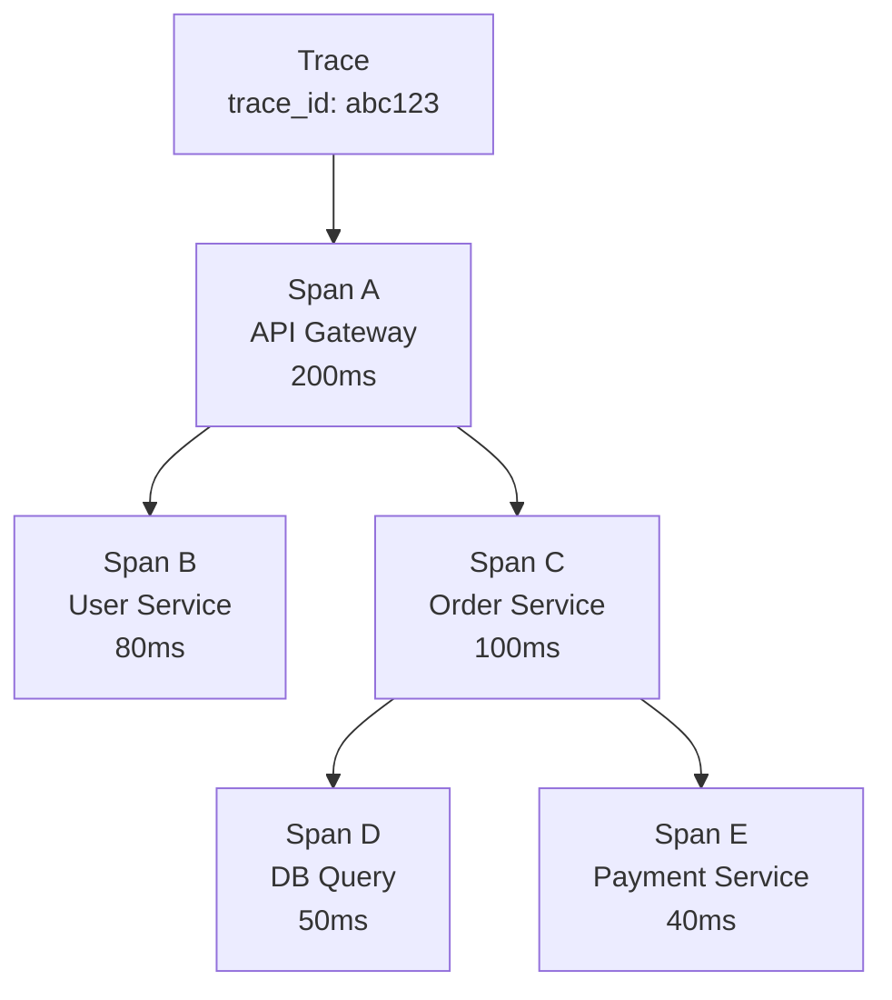
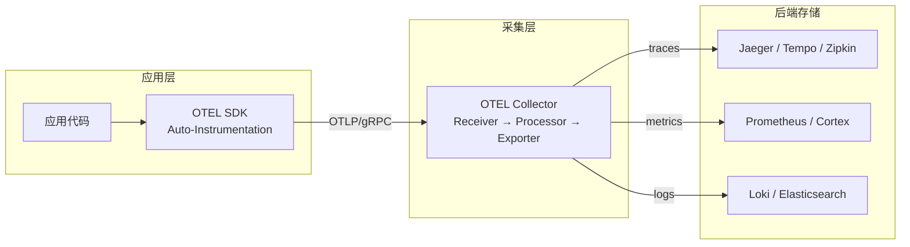
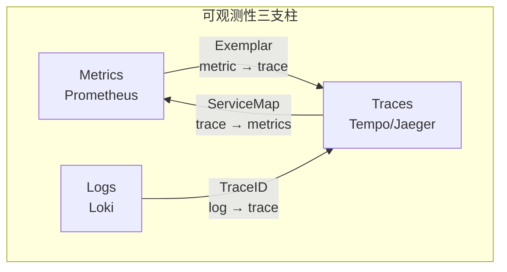

<!--
module:
  parent: system-design
  slug: system-design/08-observability/04-tracing
  type: article
  category: 主模块子文章
  summary: 分布式追踪实战手册：从 Trace/Span 核心概念到 OpenTelemetry 架构，再到 Jaeger/Zipkin/Tempo 选型与采样策略。
-->

# 分布式追踪 · Distributed Tracing 实战

> 分布式追踪实战手册：从 Trace/Span 核心概念到 OpenTelemetry 架构，再到 Jaeger/Zipkin/Tempo 选型与采样策略。

---

## 一、一句话定位

**分布式追踪（Distributed Tracing）**：在微服务架构下，通过为每个请求分配唯一 TraceID，串联跨服务调用链，实现"一次请求，全链可观测"——是可观测性三支柱（Metrics / Logs / Traces）中定位"哪里慢、哪里错"的核心手段。

---

## 二、核心概念

### 2.1 Trace / Span / SpanContext



| 概念 | 定义 | 类比 |
|------|------|------|
| **Trace** | 一次完整请求的调用链（由多个 Span 组成）| 一条快递物流记录 |
| **Span** | 调用链中的一个工作单元（有开始/结束时间、标签、事件）| 物流中的一个节点（揽件/中转/派送）|
| **SpanContext** | 跨进程传播的上下文（trace_id + span_id + baggage）| 快递单号（跟着包裹走）|

### 2.2 Span 的关键属性

| 属性 | 说明 | 示例 |
|------|------|------|
| `trace_id` | 全局唯一追踪 ID（128-bit） | `4bf92f3577b34da6a3ce929d0e0e4736` |
| `span_id` | 当前 Span 的唯一 ID（64-bit） | `00f067aa0ba902b7` |
| `parent_span_id` | 父 Span ID（构成树形结构） | `a3ce929d0e0e4736` |
| `operation_name` | 操作名称 | `HTTP GET /api/orders` |
| `start_time` / `duration` | 起止时间 | `2026-07-16T10:00:00Z / 150ms` |
| `attributes` | 键值对标签 | `http.status_code=200` |
| `events` | 时间戳事件（日志） | `exception: NullPointerException` |
| `status` | 状态码 | `OK / ERROR` |

---

## 三、传播机制（Context Propagation）

跨服务调用时，SpanContext 需要从上游传递到下游。主流传播协议：

| 协议 | 提出者 | Header 格式 | 特点 |
|------|--------|------------|------|
| **W3C Trace Context** | W3C 标准 | `traceparent: 00-{trace_id}-{parent_span_id}-{flags}` | 开放标准，OTEL 默认 |
| **B3** | Zipkin | `X-B3-TraceId` / `X-B3-SpanId` / `X-B3-Sampled` | Zipkin 生态，多 Header |
| **B3 Single** | Zipkin | `b3: {trace_id}-{span_id}-{sampling}-{parent_span_id}` | 单 Header 精简版 |
| **Jaeger** | Jaeger | `uber-trace-id: {trace_id}:{span_id}:{parent_span_id}:{flags}` | Jaeger 原生 |

### W3C Trace Context 示例

```text
# 上游服务发出请求时注入 Header
GET /api/orders HTTP/1.1
traceparent: 00-4bf92f3577b34da6a3ce929d0e0e4736-00f067aa0ba902b7-01
tracestate: congo=t61rcWbgMz

# 下游服务收到后提取并继续传播
GET /api/payments HTTP/1.1
traceparent: 00-4bf92f3577b34da6a3ce929d0e0e4736-b7ad6b71632031f4-01
```

> **最佳实践**：统一使用 W3C Trace Context，兼容所有 OTEL SDK。旧系统迁移时可同时支持 B3 + W3C。

---

## 四、OpenTelemetry 架构

### 4.1 整体架构



### 4.2 核心组件

| 组件 | 角色 | 说明 |
|------|------|------|
| **API** | 接口定义 | 稳定、不含实现，嵌入到 SDK 中 |
| **SDK** | 数据采集 + 处理 | SpanProcessor / SpanExporter / Sampler |
| **Instrumentation** | 自动/手动埋点 | 库级别自动注入（Spring、gRPC、HTTP Client）|
| **Collector** | 中转站 | 接收 → 处理（过滤/采样/脱敏）→ 导出 |
| **OTLP** | 传输协议 | gRPC / HTTP，统一 traces/metrics/logs 格式 |

### 4.3 Collector Pipeline

```text
Receiver (OTLP/Jaeger/Zipkin)
    ↓
Processor (batch / memory_limiter / filter / tail_sampling)
    ↓
Exporter (OTLP / Jaeger / Prometheus / Loki)
```

---

## 五、后端选型：Jaeger vs Zipkin vs Tempo

| 维度 | **Jaeger** | **Zipkin** | **Grafana Tempo** |
|------|-----------|-----------|-------------------|
| **开发方** | Uber（CNCF 毕业） | Twitter（开源） | Grafana Labs |
| **存储** | Cassandra / Elasticsearch / Kafka + Flink | Elasticsearch / MySQL / Cassandra | 对象存储（S3 / GCS / MinIO） |
| **查询语言** | Jaeger UI / TraceQL（Tempo 也支持） | Zipkin UI / JSON API | TraceQL / Grafana 集成 |
| **协议支持** | OTLP / Jaeger / Zipkin | Zipkin / OTLP | OTLP / Jaeger / Zipkin |
| **索引策略** | 全量索引（tag + duration） | 全量索引 | **仅 TraceID 索引**（成本低）|
| **存储成本** | 高（全量索引） | 高 | **低**（对象存储 + 最小索引）|
| **Grafana 集成** | 需配置数据源 | 需配置数据源 | **原生集成**（Exemplar / TraceID 跳转）|
| **大规模适用** | 需 Kafka + Flink | 不推荐 | ✅ 专为大规模设计 |
| **适用场景** | 通用、功能最完善 | 轻量、快速上手 | Grafana 全家桶用户 |

> **选型建议**：
> - 已用 Grafana + Loki + Prometheus → **Tempo**（三支柱统一体验）
> - 独立部署、功能最全 → **Jaeger**
> - 轻量级快速验证 → **Zipkin**

---

## 六、采样策略

全量采集 Trace 数据成本极高（1 万 QPS × 每 trace 10KB ≈ 100MB/s），必须采样。

### 6.1 三种采样策略

| 策略 | 时机 | 原理 | 优点 | 缺点 |
|------|------|------|------|------|
| **Head-based** | 请求入口 | 在 Trace 开始时按概率决定是否采集 | 简单、开销低 | 可能丢失错误 Trace |
| **Tail-based** | 请求结束 | 在 Collector 中根据完整 Trace 决策 | 保留所有错误/慢请求 | 需要内存缓冲、延迟高 |
| **Adaptive** | 动态调整 | 根据服务负载/错误率动态调整采样率 | 平衡成本与信息量 | 实现复杂 |

### 6.2 采样率配置示例

```yaml
# OTEL Collector - tail_sampling processor
processors:
  tail_sampling:
    policies:
      # 所有错误请求都保留
      - name: errors-policy
        type: status_code
        status_code: {status_codes: [ERROR]}
      # 延迟 > 1s 的请求都保留
      - name: latency-policy
        type: latency
        latency: {threshold_ms: 1000}
      # 其余请求只保留 10%
      - name: default-rate
        type: probabilistic
        probabilistic: {sampling_percentage: 10}
```

> **生产建议**：Head-based 1-10%（常规流量） + Tail-based 保留 100% 错误 + 100% 慢请求（P99 以上）。

---

## 七、三支柱关联：TraceID 贯穿 Metrics / Logs / Traces



### 7.1 关联方式

| 方向 | 机制 | 说明 |
|------|------|------|
| **Metrics → Traces** | Exemplar | Prometheus 指标中嵌入 TraceID，点击异常指标直接跳转 Trace |
| **Logs → Traces** | TraceID 注入 | 日志中自动注入 `trace_id`，Loki 中点击 TraceID 查看调用链 |
| **Traces → Metrics** | SpanMetrics | 从 Span 数据自动生成 RED 指标（Rate / Error / Duration）|
| **Traces → Logs** | Span Events | Span 中的 Events 本质是结构化日志 |

### 7.2 Grafana 三支柱联动体验

```text
1. Grafana Dashboard 看到 HTTP 5xx 指标飙升（Metrics）
   ↓ 点击 Exemplar
2. 跳转到具体 Trace（Traces）→ 发现 OrderService → PaymentService 超时
   ↓ 点击 Service
3. 查看该时间段 OrderService 的日志（Logs）→ 发现连接池耗尽
```

---

## 八、Spring Boot + OpenTelemetry 实战

### 8.1 自动埋点（Zero-Code）

```bash
# 下载 OTEL Java Agent
wget https://github.com/open-telemetry/opentelemetry-java-instrumentation/releases/latest/download/opentelemetry-javaagent.jar

# 启动应用（自动埋点 Spring MVC / WebFlux / gRPC / JDBC / Redis）
java -javaagent:opentelemetry-javaagent.jar \
  -Dotel.service.name=order-service \
  -Dotel.exporter.otlp.endpoint=http://otel-collector:4317 \
  -Dotel.traces.exporter=otlp \
  -Dotel.metrics.exporter=otlp \
  -Dotel.logs.exporter=otlp \
  -jar order-service.jar
```

### 8.2 手动埋点（自定义 Span）

```java
import io.opentelemetry.api.trace.Span;
import io.opentelemetry.api.trace.Tracer;
import io.opentelemetry.context.Scope;

@Service
public class OrderService {

    private final Tracer tracer;

    public OrderService(Tracer tracer) {
        this.tracer = tracer;
    }

    public Order createOrder(OrderRequest request) {
        Span span = tracer.spanBuilder("createOrder")
            .setAttribute("order.type", request.getType())
            .setAttribute("order.amount", request.getAmount())
            .startSpan();

        try (Scope scope = span.makeCurrent()) {
            // 业务逻辑会自动被子 Span 追踪
            Order order = orderRepository.save(request.toEntity());
            paymentService.charge(order);

            span.setAttribute("order.id", order.getId());
            span.setStatus(StatusCode.OK);
            return order;
        } catch (Exception e) {
            span.setStatus(StatusCode.ERROR, e.getMessage());
            span.recordException(e);
            throw e;
        } finally {
            span.end();
        }
    }
}
```

### 8.3 Spring Boot 配置（application.yml）

```yaml
# Spring Boot 3.x + Micrometer Tracing（内置 OTEL 支持）
management:
  tracing:
    sampling:
      probability: 0.1          # Head-based 10% 采样
    propagation:
      type: w3c                 # W3C Trace Context 传播
  otlp:
    tracing:
      endpoint: http://otel-collector:4317/v1/traces
    metrics:
      endpoint: http://otel-collector:4317/v1/metrics

# 日志中自动注入 TraceID
logging:
  pattern:
    level: "%5p [${spring.application.name},%X{traceId},%X{spanId}]"
```

---

## 九、性能影响与最佳实践

### 9.1 性能开销

| 组件 | CPU 开销 | 内存开销 | 网络开销 |
|------|---------|---------|---------|
| OTEL Agent（自动埋点）| 1-3% | 50-150MB | 取决于采样率 |
| 1% 采样率 | 可忽略 | 可忽略 | ~1MB/s @10K QPS |
| 100% 采样率 | 5-10% | 200-500MB | ~100MB/s @10K QPS |
| Collector（per instance）| 2-4 核 | 2-8GB | 中转流量 ×2 |

### 9.2 最佳实践清单

| 编号 | 实践 | 说明 |
|------|------|------|
| 1 | **统一使用 W3C Trace Context** | 避免多协议混用导致 SpanContext 丢失 |
| 2 | **生产环境 Head-based 1-10%** | 平衡信息量与成本 |
| 3 | **Tail-based 保留所有错误** | 错误请求 100% 采集，不丢关键信息 |
| 4 | **Collector 部署为 DaemonSet + Gateway** | 本地 DaemonSet 收集 → 中心 Gateway 处理导出 |
| 5 | **日志注入 TraceID** | 让 Logs 和 Traces 可通过 TraceID 互跳 |
| 6 | **Exemplar 启用** | Metrics 中嵌入 TraceID，从指标跳转调用链 |
| 7 | **Span 属性控制** | 避免在 Span 属性中存大文本（PII / 大 JSON）|
| 8 | **定期审计 Span 数量** | 防止"Span 爆炸"（如循环调用产生海量 Span）|

---

## 十、常见问题

| 问题 | 原因 | 解决方案 |
|------|------|---------|
| Trace 断裂（Span 丢失）| 传播 Header 未注入 / 异步线程未传递上下文 | 使用 OTEL Agent 自动传播 + `Context.current()` |
| 采样后看不到关键请求 | Head-based 随机丢 | Tail-based 采样保留错误 + 慢请求 |
| Collector OOM | 未配置 batch processor / memory_limiter | 启用 `memory_limiter` + `batch` processor |
| Span 数量爆炸 | 循环调用 / 大量子 Span | 限制 Span 属性大小 + 合理拆分服务 |

---

← [返回: 可观测性](../README.md)

## 📊 本节统计

- **核心概念**：3 个（Trace / Span / SpanContext）
- **传播协议**：4 种（W3C / B3 / B3 Single / Jaeger）
- **采样策略**：3 种（Head-based / Tail-based / Adaptive）
- **后端对比**：3 个（Jaeger / Zipkin / Tempo）
- **三支柱关联**：4 个方向（M→T / L→T / T→M / T→L）
- **最佳实践**：8 条
