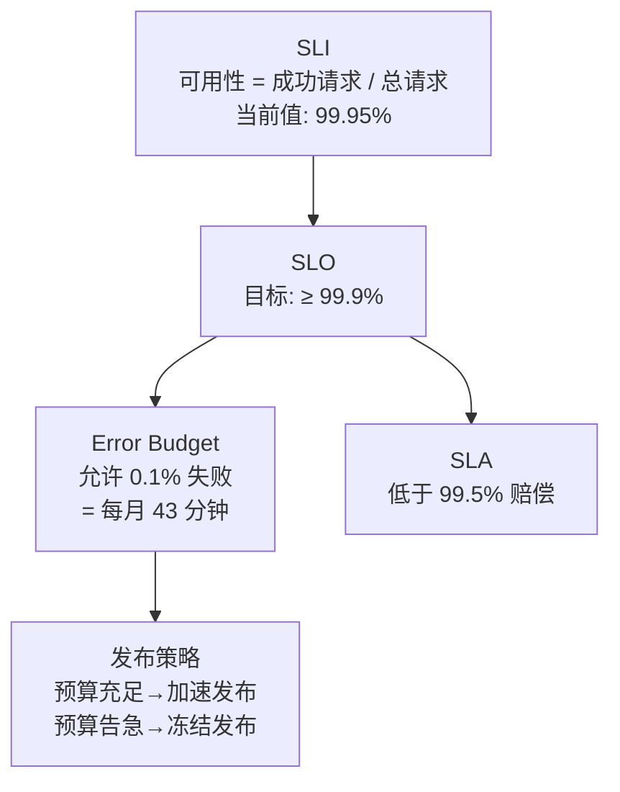
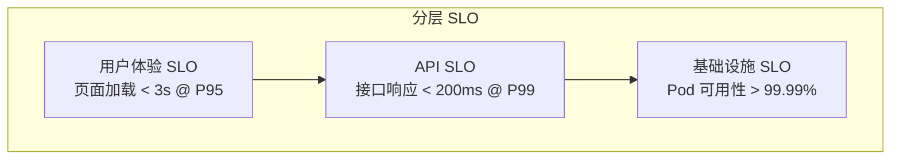
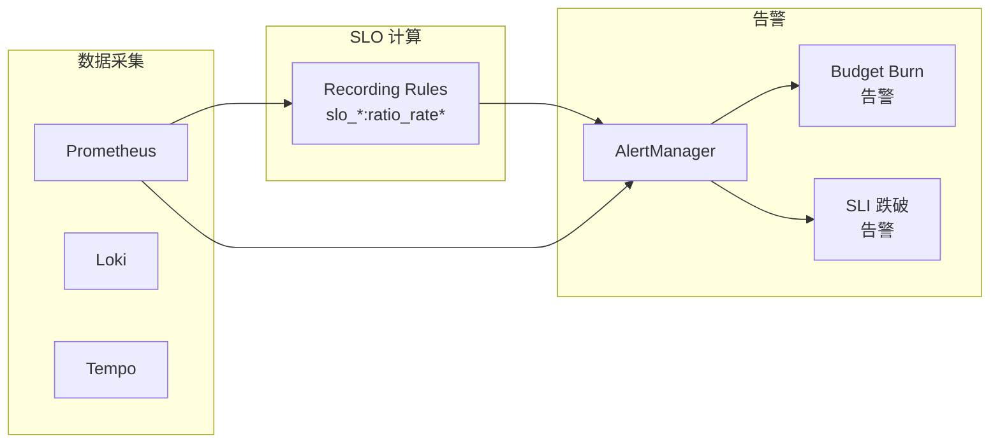

<!--
module:
  parent: system-design
  slug: system-design/08-observability/05-slo-sli
  type: article
  category: 主模块子文章
  summary: SLO/SLI 实战手册：从服务等级指标定义到错误预算策略，Google SRE 方法论的工程落地指南。
-->

# SLO/SLI · 服务等级目标与指标实战

> SLO/SLI 实战手册：从服务等级指标定义到错误预算策略，Google SRE 方法论的工程落地指南。

---

## 一、一句话定位

**SLO/SLI**：用量化指标定义"系统多可靠才算可靠"——SLI 是"度量尺"（实际表现），SLO 是"及格线"（目标值），Error Budget 是"允许的犯错空间"。三者构成了 Google SRE 可靠性工程的核心框架。

---

## 二、核心概念

### 2.1 SLI / SLO / SLA 的区别

| 概念 | 全称 | 定义 | 类比 |
|------|------|------|------|
| **SLI** | Service Level Indicator | 服务行为的**定量度量** | 温度计（实际温度） |
| **SLO** | Service Level Objective | 基于 SLI 的**目标区间** | 空调设定温度（26°C ± 1°C）|
| **SLA** | Service Level Agreement | 违反 SLO 时的**商务赔偿条款** | 物业合同（不达标退费） |

### 2.2 关系图



---

## 三、SLI 定义与度量

### 3.1 SLI 的分类

| SLI 类型 | 定义 | 适用场景 | 计算公式 |
|---------|------|---------|---------|
| **可用性** | 成功请求占比 | HTTP API / Web | `成功请求数 / 总请求数 × 100%` |
| **延迟** | 请求处理时间分布 | 用户敏感型服务 | `P50 / P95 / P99 延迟` |
| **吞吐量** | 单位时间处理量 | 批处理 / 消息队列 | `消息处理数 / 秒` |
| **新鲜度** | 数据更新延迟 | 数据管道 / ETL | `当前时间 - 数据最后更新时间` |
| **覆盖率** | 处理完成比例 | 批处理 / 爬虫 | `成功处理数 / 应处理总数` |
| **正确性** | 结果正确比例 | ML 模型 / 搜索 | `正确结果数 / 总结果数` |

### 3.2 SLI 定义规范

一个好的 SLI 需要满足：

| 要素 | 说明 | 示例 |
|------|------|------|
| **度量对象** | 度量什么行为 | "用户登录 API 的可用性" |
| **度量方式** | 怎么度量 | "成功 HTTP 响应（2xx/3xx）占总响应比例" |
| **数据来源** | 从哪里采集 | "Prometheus 的 http_requests_total 指标" |
| **聚合窗口** | 时间粒度 | "5 分钟滑动窗口" |
| **排除条件** | 什么不算 | "排除计划维护时段 / 客户端超时" |

### 3.3 常见 SLI 定义示例

```yaml
# 示例：订单服务的可用性 SLI
sli:
  name: order-service-availability
  description: "订单创建 API 的可用性"
  type: availability
  good_events: "http_requests_total{service='order', status=~'2..|3..'}"
  total_events: "http_requests_total{service='order'}"
  window: 5m
  exclusion:
    - "维护窗口（每月第一个周二 02:00-04:00）"
    - "客户端主动取消的请求"
```

---

## 四、SLO 设定方法

### 4.1 SLO 设定的 4 种方法

| 方法 | 原理 | 适用 | 示例 |
|------|------|------|------|
| **基于用户体验** | 从用户可接受的体验倒推 | 面向用户的服务 | "99.9% 的请求在 300ms 内完成" |
| **基于历史数据** | 分析过去 N 天的实际表现 | 已有系统 | "取过去 30 天 P50 表现作为 SLO" |
| **基于业务目标** | 从业务损失倒推 | 交易系统 | "每月宕机不超过 43 分钟（99.9%）" |
| **基于行业基准** | 参考行业标准 | 新系统 | "云服务通常承诺 99.95% 可用性" |

### 4.2 常见 SLO 目标参考

| SLO | 每月允许宕机 | 每季度允许宕机 | 典型场景 |
|-----|------------|--------------|---------|
| 99% | 7.3 小时 | 21.9 小时 | 内部工具 |
| 99.9% | 43 分钟 | 2.16 小时 | 一般业务 API |
| 99.95% | 21.6 分钟 | 1.08 小时 | 核心交易链路 |
| 99.99% | 4.3 分钟 | 12.96 分钟 | 支付/金融核心 |
| 99.999% | 26 秒 | 1.3 分钟 | 电信级 / 航空 |

> **陷阱**：不要把 SLO 定得比需要的高。99.999% 意味着全年只能宕机 5.26 分钟——代价极高，多数业务不需要。

### 4.3 SLO 层级设计



> **原则**：每一层的 SLO 要比上层更严格——底层可靠性是上层可靠性的前提。

---

## 五、Error Budget 概念与策略

### 5.1 什么是 Error Budget

```text
Error Budget = 1 - SLO

示例：SLO = 99.9%
→ Error Budget = 0.1%
→ 每月允许失败请求 = 总请求 × 0.1%
→ 如果月请求量 1000 万 → 允许 1 万次失败
→ 换算时间 ≈ 43 分钟
```

### 5.2 Error Budget 消耗模型

| 阶段 | 预算消耗 | 策略 |
|------|---------|------|
| **预算充足**（> 50%）| 正常消耗 | 加速发布、尝试高风险变更、混沌工程 |
| **预算告警**（< 20%）| 消耗过快 | 减缓发布频率、增加 Code Review、加强测试 |
| **预算耗尽**（< 0%）| 超支 | 冻结非紧急发布、投入稳定性改进、事后复盘 |
| **预算恢复** | 回到正常 | 恢复发布节奏 |

### 5.3 Error Budget 告警

```yaml
# 基于消耗速率的告警（优于固定阈值告警）
alerts:
  - name: ErrorBudgetBurn
    expr: |
      # 14 天窗口消耗速率 > 14.4× → 1 小时告警
      (1 - slo_request_success:ratio_rate14d) > (14.4 * (1 - 0.999))
    severity: critical
    description: "错误预算消耗过快，预计 1 小时内耗尽"

  - name: ErrorBudgetBurnSlow
    expr: |
      # 3 天窗口消耗速率 > 6× → 6 小时告警
      (1 - slo_request_success:ratio_rate3d) > (6 * (1 - 0.999))
    severity: warning
    description: "错误预算消耗偏快，建议减缓发布"
```

> **核心思想**：不按固定阈值告警（如"可用性 < 99.8%"），而按**预算消耗速率**告警——能更早发现问题，减少误报。

---

## 六、与监控告警的关系

### 6.1 SLO 驱动的告警体系



### 6.2 SLO 与告警的映射

| 告警类型 | 触发条件 | 响应动作 |
|---------|---------|---------|
| **Budget Burn（快）** | 1h 内消耗 14.4× 预算 | 立即排查、考虑回滚 |
| **Budget Burn（慢）** | 3d 内消耗 6× 预算 | 检查近期变更、加强监控 |
| **SLI 跌破阈值** | 可用性 < SLO - 0.05% | 启动应急响应 |
| **预算耗尽** | 剩余预算 < 0 | 冻结发布、稳定性改进 |

---

## 七、Google SRE 实践

### 7.1 Google 的 SLO 文化

| 实践 | 说明 |
|------|------|
| **SLO 是团队共同责任** | 不是 SRE 独自负责，Dev + SRE 共同制定和维护 |
| **Error Budget 驱动决策** | 预算充足时大胆发布，预算告急时冻结发布 |
| **事后复盘（Postmortem）** | 每次 SLO 违反后必须写 Postmortem，不追责重改进 |
| **SLO Review 会议** | 每月/每季度回顾 SLO 达成情况，调整目标 |
| **可靠性优先级** | 如果系统"太好"（远超 SLO），投入新功能而不是进一步优化 |

### 7.2 SLO 落地步骤

| 步骤 | 行动 | 周期 |
|------|------|------|
| 1. 识别核心服务 | 梳理用户关键路径（登录 / 下单 / 支付） | 1 周 |
| 2. 定义 SLI | 为每个核心服务定义 1-3 个 SLI | 1 周 |
| 3. 分析历史数据 | 回顾过去 30 天的 SLI 表现 | 1 周 |
| 4. 设定 SLO | 基于用户体验 + 历史数据设定目标 | 1 周 |
| 5. 搭建看板 | Grafana SLO Dashboard + 告警 | 2 周 |
| 6. 试运行 | 只观察不告警，验证准确性 | 2 周 |
| 7. 正式上线 | 启用告警 + Error Budget 策略 | 持续 |

---

## 八、常见问题

| 问题 | 原因 | 解决方案 |
|------|------|---------|
| SLO 总是达成但用户投诉 | SLO 未覆盖用户体验（如前端延迟）| 增加前端 SLI / 端到端 SLO |
| 告警太多、疲于应对 | 用固定阈值而非 Budget Burn | 改用 Error Budget 消耗速率告警 |
| SLO 定太高、永远达不到 | 拍脑袋定 99.999% | 从历史数据出发，逐步提高 |
| 团队不关注 SLO | 没有与发布流程联动 | Error Budget 驱动发布决策 |

---

← [返回: 可观测性](../README.md)

## 📊 本节统计

- **核心概念**：3 个（SLI / SLO / SLA）
- **SLI 类型**：6 种（可用性 / 延迟 / 吞吐量 / 新鲜度 / 覆盖率 / 正确性）
- **SLO 设定方法**：4 种（用户体验 / 历史数据 / 业务目标 / 行业基准）
- **Error Budget 策略**：4 阶段（充足 / 告警 / 耗尽 / 恢复）
- **落地步骤**：7 步（从识别服务到正式上线）
- **参考标准**：Google SRE Book + Workbook
