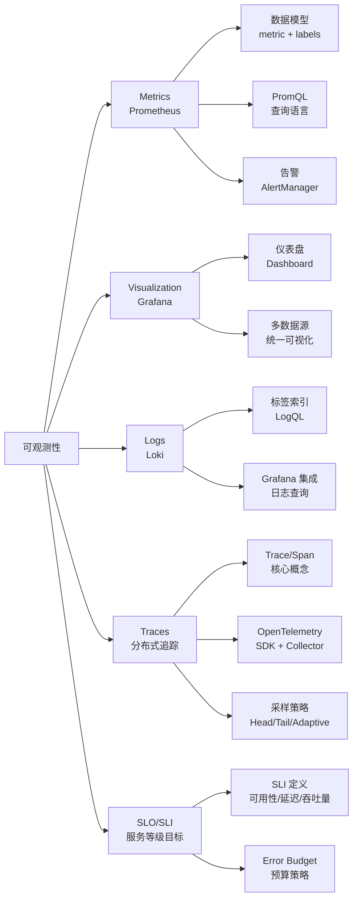

<!--
module:
  parent: system-design
  slug: system-design/08-observability
  type: article
  category: 主模块子文章
  summary: 一句话定位：**可观测性是稳定性的眼睛——从 Prometheus 指标到 Grafana 仪表盘到 Loki 日志聚合到分布式追踪到 SLO/SLI，构建云原生时代的全栈可观测体系。**
-->

# 可观测性

> 一句话定位：**可观测性是稳定性的眼睛——从 Prometheus 指标到 Grafana 仪表盘到 Loki 日志聚合到分布式追踪到 SLO/SLI，构建云原生时代的全栈可观测体系。**

---

## 知识脉络

## 模块导航

| 序号 | 分类 | 主题 | 核心内容 |
|------|------|------|----------|
| 1 | 指标 | [Prometheus · 云原生监控体系实战](01-prometheus/README.md) | 数据模型 / PromQL / 服务发现 / 告警 / 存储 |
| 2 | 可视化 | [Grafana · 可视化与仪表盘实战](02-grafana/README.md) | 仪表盘设计 / 多数据源 / 告警面板 / 模板变量 |
| 3 | 日志 | [Loki · 日志聚合系统实战](03-loki/README.md) | 标签索引 / LogQL / Grafana 集成 / Promtail |
| 4 | 追踪 | [分布式追踪 · Distributed Tracing 实战](04-tracing/README.md) | Trace/Span / OpenTelemetry / 采样策略 / Jaeger vs Tempo |
| 5 | SLO | [SLO/SLI · 服务等级目标实战](05-slo-sli/README.md) | SLI 定义 / SLO 设定 / Error Budget / Google SRE |

## 学习路径

- **入门**：Prometheus → Grafana（指标 + 可视化基础）
- **进阶**：Loki → Grafana 日志面板（构建 M+L+G 完整监控栈）
- **追踪**：分布式追踪（Trace/Span + OTEL + Jaeger/Tempo 选型）
- **可靠性**：SLO/SLI（Error Budget + Google SRE 实践）
- **高级**：AlertManager 告警链路 + 联邦集群 + 远程存储

## 相关章节

- 上游：[`07-deployment/observability`](../07-deployment/observability/README.md) — 部署篇的可观测性理论（三支柱 + SLO）
- 工具：[`06.spring/07-observability`](../../06.spring/07-observability/README.md) — Spring Boot Actuator + Micrometer 实现
- 工具：[`05.tools`](../../05.tools/README.md) — Docker / K8s 监控部署
- 面试：[`13.split-hairs/04.system-design`](../../13.split-hairs/04.system-design/README.md) — 系统设计面试题

---

## 📊 本节统计

| 子目录 | leaf 主题数 | 备注 |
|:-------|:-----------:|:-----|
| `08-observability/`（本文） | 5 | Prometheus · Grafana · Loki · Tracing · SLO/SLI |
| ├─ `01-prometheus/` | 1 | 数据模型 · PromQL · 告警 · 存储 |
| ├─ `02-grafana/` | 1 | 仪表盘 · 多数据源 · 告警面板 |
| ├─ `03-loki/` | 1 | 标签索引 · LogQL · Promtail |
| ├─ `04-tracing/` | 1 | Trace/Span · OTEL · 采样 · Jaeger vs Tempo |
| └─ `05-slo-sli/` | 1 | SLI 定义 · SLO 设定 · Error Budget |
| **README 覆盖** | 5 depth-2 leaf + 1 顶层 = **6** | 100% frontmatter（每篇含 summary） |
| **聚合主题数** | 5（见上方模块导航） | 全部聚合在本章及子 README |

> 数字基线：本节为新增顶层分类（2026-07-02 由 07-deployment/observability 拆分而来），子 README 已存在

---

← [返回 04.system-design 主模块](../README.md)
