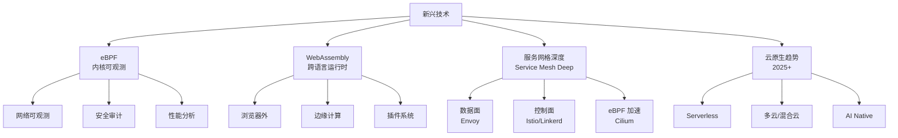

<!--
module:
  parent: system-design
  slug: system-design/09-emerging-tech
  type: article
  category: 主模块子文章
  summary: 一句话定位：**新兴技术是架构师的前瞻视野——eBPF 重塑可观测、WebAssembly 突破语言边界、服务网格重塑通信、云原生趋势定义未来 5 年。**
-->

# 新兴技术

> 一句话定位：**新兴技术是架构师的前瞻视野——eBPF 重塑可观测、WebAssembly 突破语言边界、服务网格重塑通信、云原生趋势定义未来 5 年。**

---

## 知识脉络

## 模块导航

| 序号 | 分类 | 主题 | 核心内容 |
|------|------|------|----------|
| 1 | 内核 | [eBPF · 内核级可观测与网络编程实战](01-ebpf/README.md) | 内核沙箱 / 网络可观测 / 安全 / 性能分析 |
| 2 | 运行时 | [WebAssembly (WASM) · 跨平台高性能运行时实战](02-wasm/README.md) | 浏览器外 / 边缘计算 / 插件系统 / 多语言互操作 |
| 3 | 通信 | [服务网格深度](03-service-mesh-deep/README.md) | 数据面 / 控制面 / Sidecar 与 eBPF / Istio vs Linkerd |
| 4 | 趋势 | [云原生趋势 2025+](04-cloud-native-trends/README.md) | Serverless / 多云 / AI Native / 平台工程 |

## 学习路径

- **入门**：eBPF → 服务网格深度（基础前沿 + 通信范式）
- **进阶**：WebAssembly → 云原生趋势（运行时革命 + 未来 5 年）
- **实战**：eBPF + Cilium 替代 Sidecar → WASM + Envoy 插件化 → 平台工程

## 相关章节

- 平行：[`08-observability`](../08-observability/README.md) — eBPF 是可观测性的下一站
- 平行：[`07-deployment`](../07-deployment/README.md) — 部署架构的新形态
- 工具：[`05.tools`](../05.tools/README.md) — K8s / Docker 是云原生的底座
- 面试：[`13.split-hairs/04.system-design`](../13.split-hairs/04.system-design/README.md) — 系统设计面试题

---

## 📊 本节统计

| 子目录 | leaf 主题数 | 备注 |
|:-------|:-----------:|:-----|
| `09-emerging-tech/`（本文） | 4 | eBPF · WASM · Service Mesh · 云原生趋势 |
| ├─ `01-ebpf/` | 1 | 内核沙箱 · 网络可观测 · 安全 · 性能分析 |
| ├─ `02-wasm/` | 1 | 浏览器外 · 边缘计算 · 插件系统 |
| ├─ `03-service-mesh-deep/` | 1 | 数据面 / 控制面 / eBPF 加速 |
| └─ `04-cloud-native-trends/` | 1 | Serverless / 多云 / AI Native |
| **README 覆盖** | 4 depth-2 leaf + 1 顶层 = **5** | 100% frontmatter（每篇含 summary） |
| **聚合主题数** | 4（见上方模块导航） | 全部聚合在本章及子 README |

> 数字基线：本节为新增顶层分类（2026-07-02 独立成节），子 README 已存在；最后更新 2026-07-02。

---

← [返回 04.system-design 主模块](../README.md)
