# 系统设计笔记

> 系统设计的知识体系图谱，从基础理论到工程实践的完整学习路径。

## 📚 知识地图

```mermaid
graph TB
    ROOT["04.system-design<br/>系统设计笔记"]

    ROOT --> M1["01 基础 Foundation"]
    ROOT --> M2["02 分布式 Distributed"]
    ROOT --> M3["03 高可用 HA"]
    ROOT --> M4["04 高性能 HP"]
    ROOT --> M5["05 安全 Security"]

    M1 --> M1A["软件工程 / 开发流程"]
    M1 --> M1B["OOD / DDD / TOGAF / ArchiMate / IT4IT"]
    M1 --> M1C["技术债"]

    M2 --> M2A["CAP / BASE"]
    M2 --> M2B["共识算法"]
    M2 --> M2C["分布式事务 / 锁 / ID"]
    M2 --> M2D["RPC / 网关 / 服务发现"]
    M2 --> M2E["分布式缓存"]

    M3 --> M3A["限流 / 熔断 / 重试"]
    M3 --> M3B["冗余 / 弹性"]
    M3 --> M3C["混沌工程"]
    M3 --> M3D["代码质量 / 容灾演练"]

    M4 --> M4A["负载均衡 / CDN"]
    M4 --> M4B["缓存 / 数据库优化"]
    M4 --> M4C["消息队列 / 序列化 / 连接池"]
    M4 --> M4D["Java 优化 / 多级缓存"]

    M5 --> M5A["JWT / OAuth2"]
    M5 --> M5B["RBAC / API 安全"]
    M5 --> M5C["加密 / 密钥管理"]
    M5 --> M5D["数据脱敏"]
```

## 🗺️ 学习路线

### 入门阶段
1. [软件工程](01-foundation/software-engineering/README.md) — 了解软件开发的全貌
2. [开发流程与方法](01-foundation/software-engineering/development-process/README.md) — 瀑布、敏捷、原型模型
3. [系统设计基础](01-foundation/system-design-basics/README.md) — 系统设计的核心步骤

### 进阶阶段
4. [面向对象设计](01-foundation/system-design-basics/ood/README.md) — SOLID/GRASP 原则、类与职责分配
5. [领域驱动设计 DDD](01-foundation/system-design-basics/ddd/README.md) — 以业务为核心的建模
6. [企业架构 TOGAF 10](01-foundation/system-design-basics/togaf/README.md) — 业务能力地图、ADM 9 阶段、模块化架构治理
6a. [架构描述语言 ArchiMate 3.2](01-foundation/system-design-basics/archimate/README.md) — 30+ 视点的企业架构建模语言，与 TOGAF 同源
6b. [IT 价值流参考架构 IT4IT 3.0](01-foundation/system-design-basics/it4it/README.md) — 4 价值流 + 9 功能组件，IT 运营层的"业务模型"
7. [CAP 定理](02-distributed/cap-and-base/cap/README.md) — 分布式系统的理论基石
8. [分布式事务](02-distributed/distributed-transaction/README.md) — 跨服务数据一致性
9. [分布式锁](02-distributed/distributed-lock/README.md) — 分布式协调基础
10. [限流](03-high-availability/rate-limiting/README.md) — 保护系统的第一道防线
11. [熔断](03-high-availability/circuit-break/README.md) — 防止级联故障

### 高级阶段
10. [微服务架构](01-foundation/system-design-basics/microservices/README.md) — 拆分/通信/契约/数据一致性/演进 5 大设计主题
11. [分库分表](04-high-performance/database-optimization/db-sharding/README.md) — 数据库水平扩展
12. [多级缓存](04-high-performance/cache-patterns/README.md) — 极致性能优化
13. [混沌工程](03-high-availability/chaos-engineering/README.md) — 主动注入故障
14. [可观测性](07-deployment/observability/README.md) — 系统运行可视化

### 专项深入
- [OAuth2.0 与 OIDC](05-security/oauth2-oidc/README.md) — 现代鉴权方案
- [架构描述语言 ArchiMate 3.2](01-foundation/system-design-basics/archimate/README.md) — 与 TOGAF 同源的架构建模语言
- [IT 价值流参考架构 IT4IT 3.0](01-foundation/system-design-basics/it4it/README.md) — 4 价值流 + 9 功能组件，IT 运营层的"业务模型"
- [服务注册与发现](02-distributed/service-discovery/README.md) — 微服务基础设施
- [幂等设计](06-idempotency/README.md) — 分布式系统可靠性保障
- [容量规划与压测](07-deployment/capacity-planning/README.md) — 系统容量评估

## 📂 模块导航

| 模块 | 内容数 | 说明 |
|------|--------|------|
| [01 基础篇](01-foundation/README.md) | 18 | 软件工程、OOD/DDD/TOGAF/ArchiMate/IT4IT、技术债 |
| [02 分布式篇](02-distributed/README.md) | 13 | CAP、共识算法、分布式事务、RPC |
| [03 高可用篇](03-high-availability/README.md) | 9 | 限流、熔断、重试、降级、冗余、混沌 |
| [04 高性能篇](04-high-performance/README.md) | 12 | 负载均衡、CDN、缓存、数据库优化、消息队列、连接池、序列化、Java 优化 |
| [05 安全篇](05-security/README.md) | 7 | JWT、OAuth2、API安全、OWASP、加密、密钥管理、访问控制 |
| [06 幂等设计](06-idempotency/README.md) | 5 | 幂等键、乐观锁、状态机、去重表、与分布式事务的关系 |
| [07 部署与运维](07-deployment/README.md) | 3 | 部署架构、可观测性、容量规划 |

## 🆕 最近更新

- 2025-06-04: 全面重构目录结构，新增 7 个章节
- [服务注册与发现](02-distributed/service-discovery/README.md)
- [分布式缓存设计](02-distributed/distributed-cache/README.md)
- [混沌工程](03-high-availability/chaos-engineering/README.md)
- [缓存设计模式](04-high-performance/cache-patterns/README.md)
- [OAuth2.0 与 OIDC](05-security/oauth2-oidc/README.md)
- [可观测性](07-deployment/observability/README.md)
- [容量规划与压测](07-deployment/capacity-planning/README.md)
- 2026-06-10: 新增 [架构描述语言 ArchiMate 3.2](01-foundation/system-design-basics/archimate/README.md) — 与 TOGAF 10 同源的企业架构建模语言，覆盖 30+ 视点
- 2026-06-10: 新增 [IT 价值流参考架构 IT4IT 3.0](01-foundation/system-design-basics/it4it/README.md) — 4 价值流 + 9 功能组件，Open Group 标准组合第三件套

---

## 相关章节

- 上游：[`01.java`](../01.java/README.md) — 语言基础（并发、I/O、网络编程为系统设计提供底层支撑）
- 上游：[`02.computer-basics`](../02.computer-basics/README.md) — 网络协议、Linux 基础
- 上游：[`03.database`](../03.database/README.md) — 事务、索引、缓存、连接池（数据层设计核心）
- 下游：[`06.spring`](../06.spring/README.md) — Spring 全家桶（系统设计的 Java 技术实现）
- 关联：[`05.tools`](../05.tools/README.md) — Docker、Nginx、Monorepo（部署与基础设施）
- 关联：[`07.workflow`](../07.workflow/README.md) — 工作流引擎（流程编排与事件驱动）
- 关联：[`09.front-end`](../09.front-end/README.md) — 前端架构（BFF、微前端、渲染模式）
- 深化：[`13.split-hairs/04.system-design`](../13.split-hairs/04.system-design/README.md) — 高频面试题深度剖析

---

← [返回笔记目录](../README.md)
