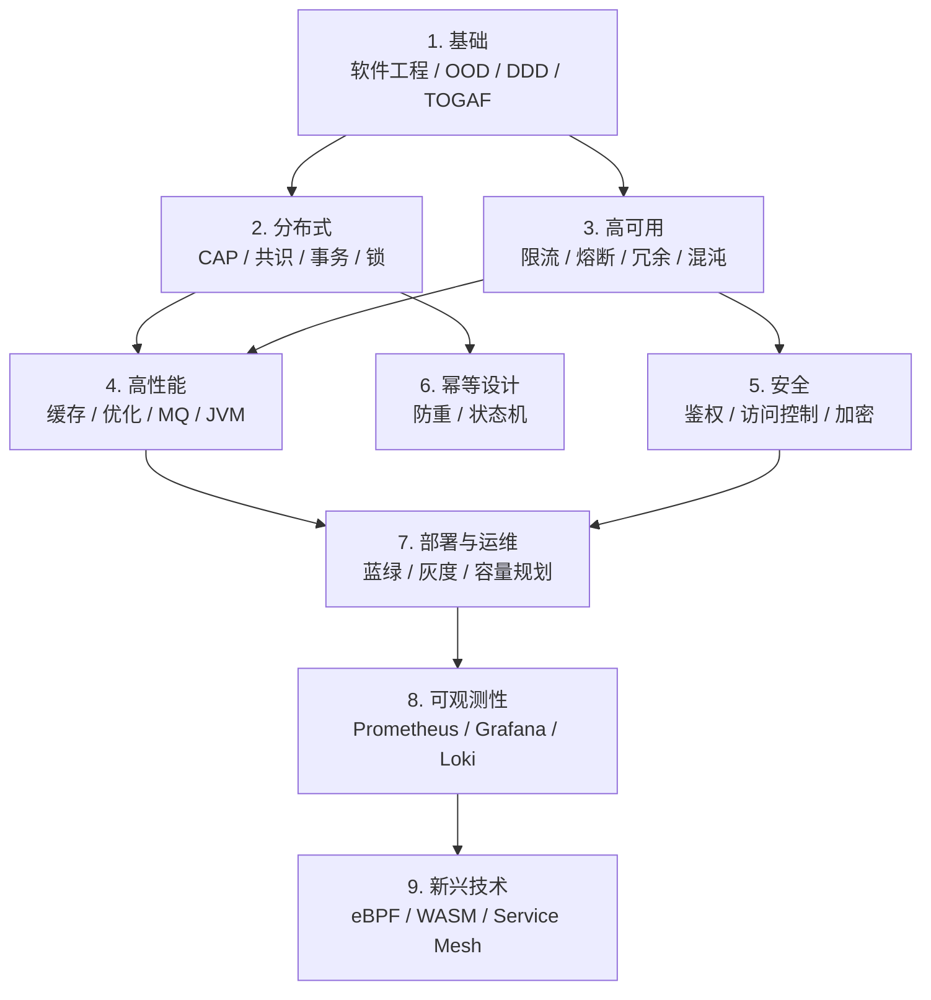

<!--
module:
  number: 04
  slug: system-design
  topic: 系统设计
  audience: 架构师 / SRE / 后端工程师
  category: 主模块
  summary: 系统设计知识体系图谱，从基础理论（软件工程 / DDD / TOGAF / ArchiMate / IT4IT）到工程实践（分布式 / 高可用 / 高性能 / 安全 / 幂等 / 部署 / 可观测性 / 新兴技术）的完整学习路径。
-->

# 系统设计

> 系统设计知识体系图谱，从基础理论（软件工程 / DDD / TOGAF / ArchiMate / IT4IT）到工程实践（分布式 / 高可用 / 高性能 / 安全 / 幂等 / 部署 / 可观测性 / 新兴技术）的完整学习路径。

> 最后更新: 2026-07-02

---

## 📚 目录导航

| 序号 | 分类 | 核心内容 | 子 README |
|:----:|------|---------|-----------|
| 01 | [基础](01-foundation/README.md) | 软件工程、OOD/DDD/TOGAF/ArchiMate/IT4IT、API 设计、架构图、模式、技术债 | [子入口](01-foundation/README.md) |
| 02 | [分布式](02-distributed/README.md) | CAP / BASE、共识算法、分布式事务 / 锁 / ID、RPC / 网关 / 服务发现、分布式缓存 | [子入口](02-distributed/README.md) |
| 03 | [高可用](03-high-availability/README.md) | 限流、熔断、重试、超时、降级、冗余、弹性架构、混沌工程、代码质量 | [子入口](03-high-availability/README.md) |
| 04 | [高性能](04-high-performance/README.md) | 负载均衡、CDN、SQL 优化、读写分离、分库分表、缓存模式、消息队列、JVM | [子入口](04-high-performance/README.md) |
| 05 | [安全](05-security/README.md) | JWT、OAuth2/OIDC、API 安全、OWASP、加密、密钥管理、6 大访问控制模型 | [子入口](05-security/README.md) |
| 06 | [幂等设计](06-idempotency/README.md) | 幂等键、乐观锁、状态机、去重表、分布式事务的关系 | [子入口](06-idempotency/README.md) |
| 07 | [部署与运维](07-deployment/README.md) | 部署架构、发布策略、可观测性、容量规划 | [子入口](07-deployment/README.md) |
| 08 | [可观测性](08-observability/README.md) | Prometheus 指标、Grafana 仪表盘、Loki 日志聚合 | [子入口](08-observability/README.md) |
| 09 | [新兴技术](09-emerging-tech/README.md) | eBPF 内核可观测、WebAssembly、服务网格、云原生趋势 | [子入口](09-emerging-tech/README.md) |

---

## 🎯 适用人群

- **架构师**：做系统选型、容量规划、风险评估，需要贯通"基础理论→分布式→高可用→高性能"全栈
- **SRE / 运维**：负责稳定性、灾备、监控告警、容量规划、混沌演练
- **后端工程师**：日常涉及限流、缓存、分布式事务、JVM 调优、生产事故定位
- **求职面试者**：CAP、共识算法、限流熔断、分布式锁是高频考点

---

## 🧭 学习路径

- **新人入门**：01 基础 → 02 分布式 → 03 高可用（建立"理论→组件→防护"基础视野）
- **后端进阶**：04 高性能 → 06 幂等设计 → 05 安全（性能与可靠性实战）
- **架构方向**：01 → 02 → 03 → 04 → 07 → 08 全链路贯通（可观测性兜底）
- **前沿探索**：09 新兴技术（eBPF / WASM / Service Mesh / 云原生趋势）
- **面试冲刺**：02 + 03 + 06 三大高频考点专题背诵

---

## 🗺️ 知识脉络

---

## 📊 速查表

| 概念 | 核心要点 | 典型场景 |
|------|---------|---------|
| **CAP** | 一致性 / 可用性 / 分区容错三选二 | 分布式系统理论边界 |
| **BASE** | 基本可用 / 软状态 / 最终一致 | 互联网分布式首选 |
| **分布式事务** | 2PC / 3PC / TCC / Saga / 本地消息表 | 跨服务数据一致性 |
| **幂等性** | 多次执行 = 单次执行 | 支付 / 订单 / 库存防重 |
| **限流** | 固定窗口 / 滑动窗口 / 漏桶 / 令牌桶 | 大促 / 防刷 / 保护后端 |
| **熔断** | Closed / Open / Half-Open 三态机 | 防止级联故障 |
| **缓存击穿 / 穿透 / 雪崩** | 热点 key / 不存在 key / 批量过期 | Redis 经典三大问题 |
| **ShardingSphere** | 分库分表 / 读写分离 / 分布式主键 | 数据库水平扩展 |
| **eBPF** | 内核级可观测 / 网络 / 安全 | 云原生性能分析 |

---

## 🎯 前置知识

- 计算机网络（TCP / HTTP / DNS）
- 操作系统（进程 / 线程 / 内存模型）
- 数据库（事务 / 索引 / 锁）
- 任意一门后端语言基础（Java / Go / Python）

---

## 🔗 相关章节

- 上游：[`01.java`](../01.java/README.md) — 并发 / I/O / 网络编程为系统设计提供底层支撑
- 上游：[`02.computer-basics`](../02.computer-basics/README.md) — 网络协议、Linux 基础
- 上游：[`03.database`](../03.database/README.md) — 事务、索引、缓存、连接池（数据层核心）
- 下游：[`06.spring`](../06.spring/README.md) — Spring 全家桶（系统设计的 Java 实现）
- 关联：[`05.tools`](../05.tools/README.md) — Docker / Nginx / Monorepo（基础设施）
- 关联：[`07.workflow`](../07.workflow/README.md) — 工作流引擎（流程编排与事件驱动）
- 关联：[`09.front-end`](../09.front-end/README.md) — 前端架构（BFF / 微前端 / 渲染模式）
- 深化：[`13.split-hairs/04.system-design`](../13.split-hairs/04.system-design/README.md) — 高频面试题深度剖析

---

## 📖 开源参考

| 项目 | 说明 | 链接 |
|------|------|------|
| **Alibaba Sentinel** | 流量控制 / 熔断 | [github.com/alibaba/Sentinel](https://github.com/alibaba/Sentinel) |
| **Resilience4j** | 熔断 / 限流 | [resilience4j.readme.io](https://resilience4j.readme.io) |
| **Apache ShardingSphere** | 分布式数据库中间件 | [shardingsphere.apache.org](https://shardingsphere.apache.org) |
| **Zipkin** | 分布式链路追踪 | [zipkin.io](https://zipkin.io) |
| **Chaos Mesh** | 云原生混沌工程 | [chaos-mesh.org](https://chaos-mesh.org) |
| **C4-Model** | 4+1 视图模型 | [c4model.com](https://c4model.com) |

---

## 📊 本节统计

- **顶层分类**：9 个（01 基础 / 02 分布式 / 03 高可用 / 04 高性能 / 05 安全 / 06 幂等 / 07 部署 / 08 可观测性 / 09 新兴技术）
- **leaf 主题数**：99（01=18 / 02=13 / 03=9 / 04=11 / 05=7 / 06=4 / 07=3 / 08=3 / 09=4，未含子 README 内嵌专题）
- **README 覆盖**：111 个（顶层 9 + depth-2 leaf 95 + depth-3 leaf 7）
- **frontmatter 覆盖**：111/111 = 100%
- **上一版本 → 本版本**：
  - 新增 08 可观测性、09 新兴技术 2 个分类（顶层 README 补齐 9 分类导航）
  - 顶层 README 重写：移除 7 分类旧表格，新增 §12 标准 9 分类导航 + 学习路径 + 速查表

---

← [返回笔记目录](../README.md)
