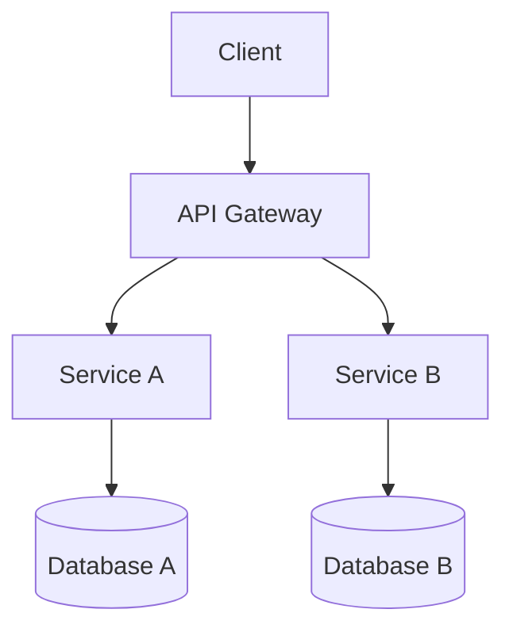

# 系统设计文档风格指南

> 本文档是 `note/04.system-design/` 目录下所有 88 篇 Markdown 文件的写作与维护规范,作为该目录的**唯一权威风格参考**。所有新增、修改、Review 文档前,请先通读本文。

---

## 目录

- [一、文件结构](#一文件结构)
- [二、YAML Frontmatter 模板 (可选)](#二yaml-frontmatter-模板-可选)
- [三、标题层级](#三标题层级)
- [四、编号风格](#四编号风格)
- [五、链接规范](#五链接规范)
- [六、代码示例](#六代码示例)
- [七、图表](#七图表)
- [八、引用与参考](#八引用与参考)
- [九、命名规范](#九命名规范)
- [十、Emoji 使用](#十emoji-使用)
- [十一、时间戳](#十一时间戳)
- [十二、待废弃约定](#十二待废弃约定)
- [十三、检查清单](#十三检查清单)
- [相关章节](#相关章节)
- [参考资料](#参考资料)

---

## 一、文件结构

每篇 Markdown 文件应遵循统一的"开篇 — 主体 — 收尾"三段式结构。

### 1.1 推荐 H1 标题

- **语言**:使用中文,与父章节主题保持一致
- **唯一性**:每个文件有且仅有一个 H1
- **示例**:
  - `01-foundation/system-design-basics/microservices/data-consistency/README.md` 的 H1 应为 `## 数据一致性`
  - `01-foundation/system-design-basics/togaf/README.md` 的 H1 应为 `## TOGAF 架构框架`

### 1.2 块引用摘要

H1 标题正下方必须紧跟一个块引用,用一句话定义全文:

```markdown
## CAP 定理

> 在分布式系统中,一致性(Consistency)、可用性(Availability)、分区容错性(Partition tolerance)三者不可兼得,至多只能同时满足其中两个。
```

要求:
- 长度:1 句话(30-80 字)
- 内容:核心定义或结论
- 不含链接、表格、列表

### 1.3 目录

文件**超过 200 行**时,必须在 H1 + 块引用之后插入 `## 目录`,列出所有 H2 章节。

- 短文件(< 200 行)可省略
- 目录使用 Markdown 自动锚点:`[一、xxx](#一xxx)`
- 中文锚点需保留原文,不要替换为拼音

### 1.4 相关章节

每个 **100 行以上**的文件,末尾必须添加 `## 相关章节`,列出同级目录的链接:

```markdown
## 相关章节

- [服务拆分](./01-foundation/system-design-basics/microservices/service-decomposition/README.md)
- [服务通信](./01-foundation/system-design-basics/microservices/service-communication/README.md)
- [服务契约](./01-foundation/system-design-basics/microservices/service-contract/README.md)
- [迁移与组织](./01-foundation/system-design-basics/microservices/migration-and-organization/README.md)
```

### 1.5 参考资料

每个 **100 行以上**的文件,末尾必须添加 `## 参考资料`,列出外部权威链接:

```markdown
## 参考资料

- [CAP Theorem - Wikipedia](https://en.wikipedia.org/wiki/CAP_theorem)
- [Brewer's Conjecture and the Feasibility of Consistent, Available, Partition-Tolerant Web Services](https://www.glassbeam.com/sites/all/files/2002-BREWER.pdf)
```

---

## 二、YAML Frontmatter 模板 (可选)

当前文档统一**无 frontmatter**,保持纯 Markdown 简洁性。如未来需要启用元数据,可使用以下模板:

```yaml
---
title: 文章标题
date: 2026-06-09
updated: 2026-06-09
tags: [分布式, 一致性]
difficulty: 中级
author: 作者名
status: draft | review | published
---
```

字段说明:
- `title`:可省略,默认使用 H1
- `date`:首次创建日期
- `updated`:最后更新日期(每次 PR 必更新)
- `tags`:2-5 个中文标签
- `difficulty`:初级 / 中级 / 高级
- `status`:草稿 / 审阅中 / 已发布

**注意**:启用 frontmatter 需要先在所有文件中统一添加,不要中途混用。

---

## 三、标题层级

### 3.1 层级规则

| 层级 | 用途 | 文件中数量 |
|------|------|----------|
| H1 (`#`) | 文件标题 | 有且仅有 1 个 |
| H2 (`##`) | 一级章节 | 3-10 个 |
| H3 (`###`) | 二级章节 | 视内容而定 |
| H4 (`####`) | 三级章节 | 谨慎使用 |

### 3.2 禁止跳级

- ✅ `# → ## → ### → ####` 逐级递进
- ❌ `# → ###` 跳级
- ❌ `## → ####` 跳级

### 3.3 中文文档特殊约定

- **理论性文章**(CAP、Paxos、DDD、TOGAF):使用 `## 一、xx`、`## 二、xx` 中文数字编号
- **操作性文章**(代码示例、工具对比、部署流程):使用 `## 1. xx`、`## 2. xx` 阿拉伯数字
- 同一章节内保持一致,不要混用

---

## 四、编号风格

### 4.1 理论性文章

适用于:理论阐述、概念定义、模型推导。

```markdown
## 一、CAP 三要素
## 二、为什么三者不可兼得
## 三、实际工程中的取舍
## 四、常见误区
```

### 4.2 操作性文章

适用于:操作步骤、代码演示、配置说明、对比表格。

```markdown
## 1. 环境准备
## 2. 安装步骤
## 3. 配置示例
## 4. 常见问题排查
```

### 4.3 同章节保持一致

- 同一目录下所有文件使用相同编号风格
- 例外:README 索引类文件不受此约束

---

## 五、链接规范

### 5.1 内部链接使用相对路径

- ✅ `[服务拆分](./01-foundation/system-design-basics/microservices/service-decomposition/README.md)`
- ❌ `[服务拆分](/note/04.system-design/.../README.md)` (绝对路径不可移植)
- ❌ `[服务拆分](service-decomposition/)` (缺少文件名)
- 💡 **从子章节视角**：在 `02-distributed/xxx/README.md` 中写跨章引用应为 `../01-foundation/.../目标文件.md`，每个 `..` 取决于当前文件深度

### 5.2 跨章节链接

跨大章节时使用明确路径:

```markdown
- [分布式事务](./02-distributed/distributed-transaction/README.md)
- [限流](./03-high-availability/rate-limiting/README.md)
```

### 5.3 锚点链接

- 锚点使用中文原文,不要转拼音
- ✅ `[一、文件结构](#一文件结构)`
- ❌ `[一、文件结构](#yi-wen-jian-jie-gou)`

### 5.4 链接受到时检查

- 新增/修改链接时,必须确认目标文件存在
- 删除/移动文件时,需同步更新所有反向引用
- 推荐使用编辑器插件自动检查失效链接

---

## 六、代码示例

### 6.1 必须指定语言

每个代码块必须带语言标识:

```markdown
​```java
public class Example {
    private String name;
}
​```

​```python
def hello():
    print("Hello, World!")
​```

​```bash
$ kubectl apply -f deployment.yaml
​```
```

错误示例:

```markdown
​```
public class Example { }
​```
```

### 6.2 重要代码配文字说明

代码块前后必须有 1-3 句话说明:
- 之前:解释这段代码的目的
- 之后:解释关键逻辑或输出

### 6.3 长代码块处理

**超过 30 行**的代码块,应使用说明性标题:

````markdown
### 示例 4.1:基于 Saga 模式实现分布式事务

````java
// 代码...
```
````

### 6.4 中文注释 + 英文变量

```java
public class OrderService {
    // 订单状态:待支付、已支付、已发货、已完成
    private String orderStatus;
    
    public void placeOrder(Long orderId) {
        // 幂等性检查:同一订单只能下单一次
        if (orderRepository.exists(orderId)) {
            return;
        }
        // ... 业务逻辑
    }
}
```

---

## 七、图表

### 7.1 优先级

1. **ASCII art**:兼容性最好,纯文本编辑器可读
2. **Mermaid**:需要渲染器支持(GitHub、VSCode、Typora)
3. **嵌入图片(PNG/SVG)**:需配合图片文件管理

### 7.2 ASCII art 示例

```markdown
     [Client]
        |
        v
   [API Gateway]
      /  |  \
     v   v   v
  [S1] [S2] [S3]   <- Microservices
   |    |    |
   v    v    v
  [DB1][DB2][DB3]  <- Database per Service
```

### 7.3 Mermaid 示例



### 7.4 嵌入图片

- 必须配合说明文字:``
- 图片文件应放在子目录的 `assets/` 或 `images/` 文件夹中
- 不使用外链图床(易失效)

### 7.5 图表归属

图表必须放在 `##` 章节下,不能孤立于标题之外。

---

## 八、引用与参考

### 8.1 标准/规范

- RFC 编号:`[RFC 7231: HTTP/1.1](https://datatracker.ietf.org/doc/html/rfc7231)`
- 官方文档:`[Kubernetes Documentation](https://kubernetes.io/docs/)`

### 8.2 论文

格式:**作者 + 年份 + 标题**

- ✅ `[Eric Brewer. 2000. Towards Robust Distributed Systems](https://...)`
- ✅ `[Lamport, L. (1998). The Part-Time Parliament. ACM TOCS]`

### 8.3 博客/文章

格式:**作者 + 日期 + 链接**

- ✅ `[Martin Fowler. 2014-03-25. Microservices](https://martinfowler.com/articles/microservices.html)`
- ✅ `[阮一峰. 2025-01-15. 科技爱好者周刊](https://...)`

### 8.4 第三方工具

- 官方文档优先:`[RabbitMQ Official Docs](https://www.rabbitmq.com/docs/)`
- 社区博客次之,需注明日期

---

## 九、命名规范

### 9.1 目录名

- 风格:小写英文或中文
- 分隔符:连字符 `-`
- ✅ `service-decomposition`、`data-consistency`、`togaf`
- ❌ `ServiceDecomposition`、`service_decomposition`、`服务拆分`

### 9.2 文件名

- 每个子目录有且仅有**一个** `README.md` 作为入口
- 避免 `README1.md` / `README2.md` / `README3.md` 等"草稿命名"
- 若需拆分子章节,使用语义名:
  - ✅ `cap.md`、`paxos.md`、`raft.md`
  - ✅ `business-capability.md`、`domain-analysis.md`
  - ✅ `adm.md`、`architecture-vision.md`
  - ❌ `README1.md`、`README2.md`、`README_old.md`

### 9.3 嵌入图片

- 描述性命名:`cap-theorem-triangle.png`、`microservices-architecture.svg`
- 避免:`img.png`、`img_1.png`、`screenshot20250609.png`
- 命名格式:`<topic>-<description>.<ext>`

---

## 十、Emoji 使用

### 10.1 推荐场景

- **章节装饰**:🎯 核心结论 / 📚 背景知识 / 🆕 新增内容 / 💡 提示
- **强调标记**:⚠️ 警告 / ✅ 正确示例 / ❌ 错误示例 / 🔍 深入阅读

### 10.2 避免

- 标题中堆砌 emoji:`## 🚀🎉💥 微服务架构 🚀🎉💥`
- 同一行内使用过多 emoji,影响阅读
- 风格不一致(一会用一会不用)

### 10.3 同章节保持一致

- 同一目录下的所有文件,emoji 风格统一
- 建议每个一级章节最多 1-2 个 emoji

---

## 十一、时间戳

### 11.1 H1 后更新时间

每篇文章在 H1 标题 + 块引用之后,可加:

```markdown
## CAP 定理

> 在分布式系统中,C、A、P 三者不可兼得。

> 最后更新:2026-06-09
```

### 11.2 报告/示例中的日期

使用**占位符**,不要硬编码:

- ✅ `压测时间:{{压测日期}}`
- ✅ `数据来源:2026-Q1 内部监控`
- ❌ `压测时间:2025-12-15`(硬编码易过时)

### 11.3 "近年"的表达

- ✅ `近年来,微服务架构逐渐成为主流`
- ❌ `2023 年以来,微服务架构...`(过于具体)

---

## 十二、待废弃约定

记录历史约定以备查阅,新文档**不应**再使用。

### 12.1 旧风格(已废弃)

- 直接 H1 + 长文,无目录、无块引用
- 章节使用阿拉伯数字但 H2/H3 层级混乱
- 内部链接使用绝对路径
- 代码块不指定语言
- 末尾无"相关章节"和"参考资料"

### 12.2 新风格(当前规范)

- H1 + 块引用 + (目录) + 主体 + 相关章节 + 参考资料
- 理论性文章用中文数字编号,操作性文章用阿拉伯数字
- 内部链接全部使用相对路径
- 代码块必须指定语言
- 关键概念配有图表

### 12.3 迁移策略

- 旧文件逐步重构,新文件必须遵循新风格
- 重大重构需在 PR 中标注 `style: 符合 STYLE_GUIDE`
- 不要一次性大规模修改,优先在新文件中推广

---

## 十三、检查清单

提交 PR / Commit 前的**自查清单**:

- [ ] H1 标题(中文,与父章节一致)
- [ ] H1 下方有块引用摘要(一句话定义)
- [ ] 文件 > 200 行时有 `## 目录`
- [ ] 所有内部链接目标存在(无 404)
- [ ] 所有图片文件存在(无失效外链)
- [ ] 代码示例指定语言(`​```java` 等)
- [ ] 文件 > 100 行时末尾有 `## 相关章节`
- [ ] 文件 > 100 行时末尾有 `## 参考资料`
- [ ] 无 `TODO` / `占位` / `TBD` 残留
- [ ] 时间戳已更新(若修改了内容)
- [ ] 编号风格与文章类型匹配(中文/阿拉伯)
- [ ] 无 `README1.md` / `README2.md` 等草稿命名
- [ ] emoji 使用风格与同目录其他文件一致
- [ ] 大段代码(>30 行)有说明性小标题

---

## 相关章节

- [00-README 索引](./README.md)
- [01-foundation/基础概念](./01-foundation/README.md)
- [02-distributed/分布式](./02-distributed/README.md)
- [03-high-availability/高可用](./03-high-availability/README.md)
- [04-high-performance/高性能](./04-high-performance/README.md)
- [05-security/安全](./05-security/README.md)
- [06-idempotency/幂等性](./06-idempotency/README.md)
- [07-deployment/部署](./07-deployment/README.md)

---

## 参考资料

- [Google Developer Documentation Style Guide](https://developers.google.com/style)
- [Microsoft Writing Style Guide](https://learn.microsoft.com/en-us/style-guide/welcome/)
- [GitHub Markdown Spec](https://github.github.com/gfm/)
- [Conventional Commits](https://www.conventionalcommits.org/)
- [RFC 2119: Key words for use in RFCs](https://datatracker.ietf.org/doc/html/rfc2119)
