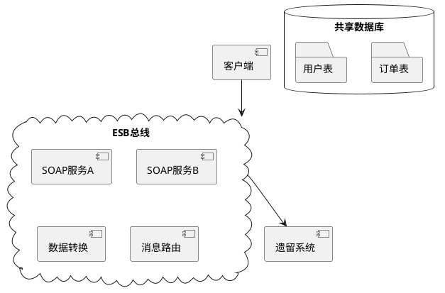
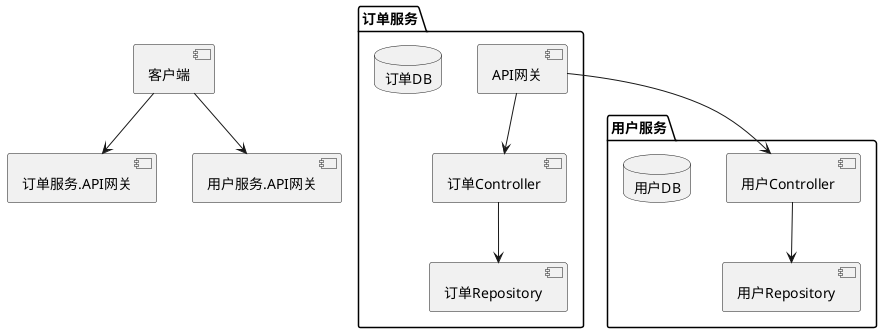
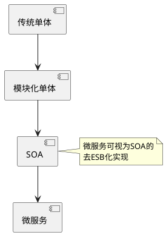

# 微服务与SOA对比

## 核心概念
### SOA (Service-Oriented Architecture)
- **定义**：企业级架构风格，通过服务接口实现业务功能复用
- **关键组件**：
    - 企业服务总线(ESB)
    - 服务注册中心
    - 标准化协议(SOAP/WS-*)
    - 集中式治理

### 微服务(Microservices)
- **定义**：将单一应用拆分为小型自治服务，每个服务运行独立进程
- **关键特征**：
    - 单一职责原则
    - 轻量级通信(HTTP/REST/gRPC)
    - 独立部署与扩展
    - 去中心化治理

## 架构对比

### 传统SOA架构

**特点**：
- 通过ESB实现服务间通信
- 共享数据库模式
- 强调服务复用和标准化
- 适合企业级复杂系统集成

### 微服务架构

**特点**：
- 每个服务拥有独立数据库
- 通过API网关暴露接口
- 服务间通过轻量级协议通信
- 适合快速迭代的互联网应用

## 关键差异对比表

| 维度         | SOA                          | 微服务                     |
|--------------|-----------------------------|---------------------------|
| **服务粒度** | 粗粒度（业务领域级）         | 细粒度（功能模块级）       |
| **通信机制** | ESB（同步/异步）            | 直接调用（同步）或消息队列 |
| **数据管理** | 共享数据库                   | 每个服务私有数据库         |
| **部署方式** | 集中部署                     | 独立容器化部署             |
| **治理模式** | 集中式治理                   | 团队自治                   |
| **典型协议** | SOAP/WS-*                   | REST/gRPC/GraphQL          |

## 演进关系

## 适用场景
**选择SOA的情况**：
- 企业需要集成多个异构系统
- 强调服务复用和标准化
- 具备ESB运维能力

**选择微服务的情况**：
- 需要快速迭代和持续交付
- 团队具备DevOps能力
- 系统需要高弹性和可扩展性

## 最佳实践建议
1. **渐进式改造**：从单体架构逐步拆分边界清晰的服务
2. **合理划分服务**：遵循单一职责和康威定律
3. **基础设施先行**：建立完善的监控、日志和CI/CD流水线
4. **避免过度设计**：初期可采用混合架构（如BFF模式）

> 提示：实际架构设计应结合团队技术栈、业务复杂度和组织文化综合考量，避免盲目追求技术潮流。
