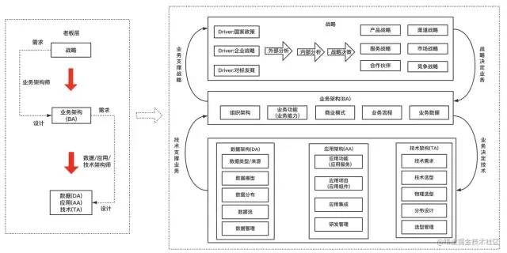

# 软件架构设计

## 软件架构的概念

### 定义
> 软件架构为软件系统提供了一个结构、行为和属性的高级抽象；  
> 软件架构风格是特定应用领域的惯用模式，架构定义一个词汇表和一组约束。

### 目的
> 软件架构是项目干系人进行交流的手段；  
> 软件架构是可传递和可复用的模型，通过研究软件架构可预测软件的质量；  
> 软件架构使推理和控制的更改更加简单，有助于循序渐进的原型设计，可以作为培训的基础。

### 与`TOGAF`的关系
> 在TOGAF企业架构理论中，架构是从公司战略层面，自顶向下的细化的一部分，从战略=> 业务架构=>应用/数据/技术架构  
> - 上层（老板）关注的是战略与业务架构
> - 下层（搬砖的）需要聚焦到应用/数据/技术架构这一层
> 
>   
> 
> - **业务架构**：由业务架构师负责，也可以称为业务领域专家、行业专家，业务架构属于顶层设计，其对业务的定义和划分会影响组织架构和技术架构;
> - **应用架构**：由应用架构师负责，需要根据业务场景需要，设计应用的层次结构，制定应用规范、定义接口和数据交互协议等。并尽量将应用的复杂度控制在一个可以接受的水平，从而在快速的支撑业务发展的同时，在保证系统的可用性和可维护性的同时，确保应用满足非功能属性的要求如性能、安全、稳定性等。
> - **技术架构**：描述了需要哪些服务；选择哪些技术组件来实现技术服务；技术服务以及组件之间的交互关系;
> - **[数据架构](..%2F..%2F..%2F10.big-data%2Fdata-architecture%2FREADME.md)**：描述了数据模型、分布、数据的流向、数据的生命周期、数据的管理等关系;

## [领域驱动设计](ddd%2FREADME.md)

## 架构图的分类

### [“4+1”视图](4%2B1%2FREADME.md)

### [C4 模型](c4-model%2FREADME.md)

## 画好架构图

### 视图的受众
> 首先应该要明确其受众，再想清楚要给他们传递什么信息  
> 不要为了画一个物理视图去画物理视图，为了画一个逻辑视图去画逻辑视图，而应该根据受众的不同，传递的信息的不同，用图准确地表达出来  
> 画出的图好不好的一个直接标准就是：受众有没有准确接收到想传递的信息。

### 视图的元素区分
> 看到架构视图是由方框和线条等元素构成，要利用形状、颜色、线条变化等区分元素的含义，避免混淆。  
> 架构是一项复杂的工作，只使用单个图表来表示架构很容易造成莫名其妙的语义混乱。
