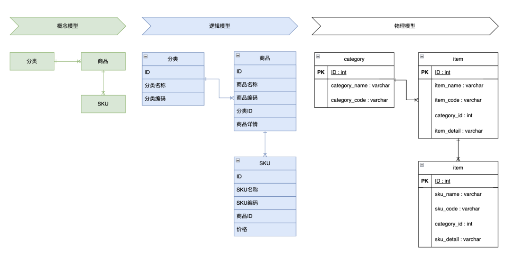

# 数据架构
> 数据架构就是数据模型如何设计、存储、管理和流动。  
> 通过统一的数据模型和标准，企业各部门之间的数据交换会变得更加容易，减少了信息孤岛。

## 数据架构的设计步骤
> 1. **需求分析**：明确企业的业务需求和目标，通过与业务部门沟通了解数据类型、来源、使用场景及扩展性要求，为数据架构奠定基础。
> 2. **数据建模**：在明确需求后，接下来就是进行数据建模。数据建模分为概念模型、逻辑模型和物理模型三个阶段。
> 3. **数据存储设计**：根据数据模型的设计，确定数据的存储方案。包括选择合适的数据库系统、设计表结构、索引，以及数据的分布策略。
> 4. **数据治理和安全**：为数据访问、共享、备份和恢复制定详细规则，确保符合企业的安全和合规要求，保障数据的安全性和可靠性。

## 数据模型
> 数据模型是数据架构中的核心概念，它本质上是一种对现实世界数据进行抽象和结构化的方法。
> - **概念模型**：主要关注业务需求中的核心实体和关系，用于捕捉业务领域中的关键数据。概念模型是对业务需求的高度抽象，通常用来与业务人员沟通和确认需求。
> - **逻辑模型**：在概念模型的基础上，逻辑模型进一步定义了数据的细节结构，包括实体的属性、数据类型和约束条件。需要注意的是，逻辑模型独立于具体的数据库技术，是系统架构设计的核心环节。
> - **物理模型**：物理模型是对逻辑模型的具体实现，它描述了数据在数据库中的存储方式，比如表结构、索引、分区等。物理模型与具体的数据库管理系统密切相关，直接影响系统的性能和可扩展性。
>
> 

## 数据库技术分析
### 关系型数据库（OLTP数据库）
> 关系型数据库是最为传统和普遍使用的一类数据库，典型代表有MySQL、Oracle、PostgreSQL等。它们通过表格形式组织数据，并使用SQL（结构化查询语言）进行数据管理和查询。  
> 
> 关系型数据库的核心优势在于其ACID特性（原子性、一致性、隔离性、持久性），确保了数据在高并发场景下的准确性和可靠性。这类数据库适用于对数据一致性要求极高的应用场景。
###  NoSQL数据库
> NoSQL数据库是在大数据和互联网应用中兴起的一类数据库，主要用于处理非结构化或半结构化数据。NoSQL数据库包括多种类型，如文档数据库（如MongoDB）、键值数据库（如Redis）、列式数据库（如HBase）和图形数据库（如Neo4j）。
>
> NoSQL数据库的优势在于其灵活的数据模型和高扩展性，特别适用于社交网络、内容管理、实时数据分析等场景。
### 分析型数据库（OLAP数据库）
> 分析型数据库专注于大规模数据的快速分析和查询，典型代表包括Amazon Redshift、Google BigQuery和阿里云的AnalyticDB。
>
> 这类数据库采用列式存储结构，能够在处理海量数据时提供高效的查询性能。它们通常用于企业的BI（商业智能）系统、数据仓库、数据湖等，需要对历史数据进行深入分析的场景。
### NewSQL数据库
> NewSQL数据库是在关系型数据库和NoSQL数据库之间的一个新兴类别，目标在于结合关系型数据库的事务处理能力和NoSQL数据库的扩展性。代表产品包括Google Spanner、CockroachDB等。
>
> NewSQL数据库保留了SQL查询的能力，同时通过分布式架构实现了高可用性和高扩展性，适用于那些既需要事务一致性又需要处理海量数据的应用场景
### 搜索引擎数据库
> 搜索引擎数据库如Elasticsearch和Solr，专门用于处理和查询文本数据。
>
> 它们基于全文索引技术，能够快速检索和排序海量文本数据。这类数据库广泛应用于日志分析、全文检索、内容推荐等需要高效搜索能力的场景。
