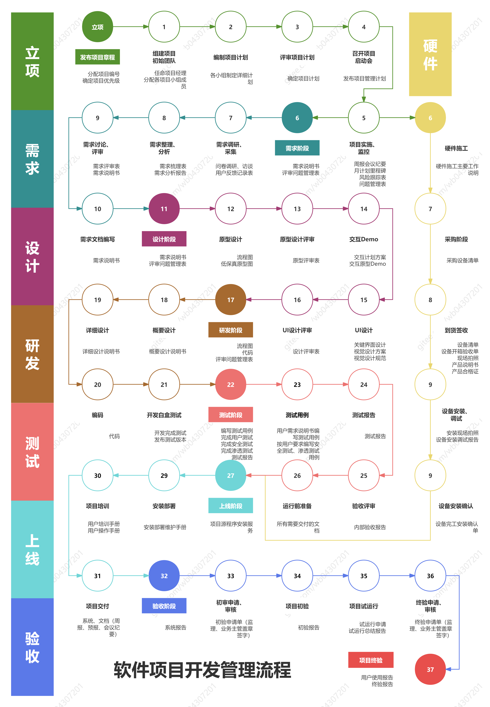

# 软件工程

**软件工程是运用系统化、规范化的工程方法开发与维护软件的综合性学科，旨在通过技术与管理手段提升软件质量、控制成本并满足多样化需求。

## 一、学科定位与目标

软件工程以计算机科学为基础，结合经济学、数学及管理学等理论，建立标准化的开发流程。其核心目标包括：

* **提升软件质量**：减少缺陷、增强稳定性。
* **优化开发效率**：缩短周期、合理分配资源。
* **降低维护成本**：通过模块化设计、文档化管理。
* **保障软件的可扩展性与可复用性**：适应需求变化，减少重复开发。

## 二、开发流程与方法

软件工程覆盖需求分析、设计、编码、测试、部署及维护六大阶段，强调阶段性评审与迭代优化。例如，敏捷开发通过短周期迭代快速响应用户反馈。其开发方法包括：

* **瀑布模型**：线性顺序开发，适合需求稳定明确的项目。
* **螺旋模型**：风险驱动的开发过程，适用于大型复杂系统。
* **敏捷开发**：强调快速响应变化、顾客协作和交付可用的软件产品。

## 三、工具与模型

软件工程采用标准化工具与模型规范开发行为，包括：

* **UML建模**：用于软件系统的可视化建模。
* **DevOps自动化工具**：实现持续集成与持续部署。
* **版本控制系统**：如Git，用于代码管理与协作。

## 四、质量保障体系

软件工程引入单元测试、集成测试、持续集成（CI/CD）等技术，结合代码审查与性能监控，确保软件可靠性。

## 五、应用领域与影响

软件工程广泛应用于金融（交易系统风控）、医疗（电子病历管理）、教育（在线学习平台）、交通（自动驾驶算法）等领域。其技术支撑了云计算、人工智能等前沿科技的发展，推动社会数字化转型。

## 六、发展趋势与挑战

随着AI与大数据的融合，软件工程趋向智能化（AI辅助代码生成）与数据驱动化（基于用户行为优化功能）。同时，云原生架构、低代码开发降低了技术门槛，但安全漏洞防范（如隐私保护）、跨平台兼容性（适应多终端）等问题仍需持续突破。

## 七、学科体系与教育

软件工程是中国普通高等学校本科专业，属计算机类专业，基本修业年限为四年，授予工学学士学位。该专业旨在培养具有扎实的软件理论和知识基础，对整个软件过程有整体了解、掌握软件工程领域的前沿技术，具有国际竞争能力，能从事大型软件项目系统分析、设计、编程、测试和软件项目管理等工作的复合型、实用型的高层次软件工程技术人才。