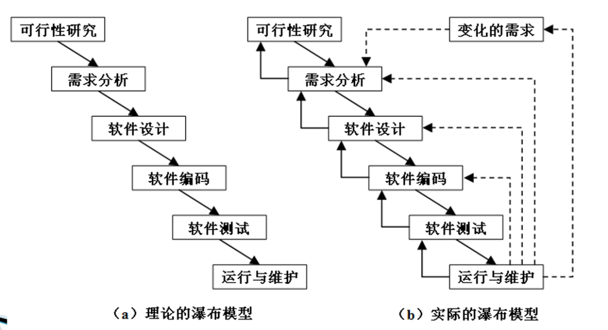

# 软件开发的流程与方法

## 1. 软件工程全生命周期管理
软件工程遵循**结构化开发框架**，涵盖六大核心阶段：
- **需求分析**：通过用户访谈、竞品分析明确功能与非功能需求（如性能、安全性）。
- **系统设计**：分解模块、定义接口、设计数据库架构（如ER图）与系统交互流程。
- **编码实现**：遵循编码规范（如Google Style Guide）实现功能，结合版本控制（Git）管理代码。
- **测试验证**：采用单元测试、集成测试、用户验收测试（UAT）确保质量，自动化测试工具（如Selenium）提升效率。
- **部署上线**：通过CI/CD流水线实现自动化部署，结合蓝绿部署、金丝雀发布降低风险。
- **运维维护**：监控系统运行状态（如Prometheus+Grafana），持续优化性能与修复缺陷。

**关键实践**：
- **阶段性评审**：每个阶段结束时通过评审会议（如需求评审会）确保目标达成。
- **迭代优化**：基于用户反馈与数据指标（如错误率、响应时间）持续改进产品。

## 2. 主流开发方法对比

| **方法**     | **核心特点**                                  | **适用场景**                              | **优势**                | **局限性**                         |
|------------|-------------------------------------------|---------------------------------------|-----------------------|---------------------------------|
| **瀑布模型**   | 线性顺序开发，阶段间严格依赖（如设计未完成不编码）                 | 需求明确、技术成熟的传统项目（如政府系统）                 | 流程清晰、文档完备，便于管理        | 灵活性差，后期变更成本高                    |
| **敏捷开发**   | 短周期迭代（Sprint）、用户故事（User Story）、每日站会、持续交付  | 需求变化频繁的互联网产品（如电商、社交）                  | 快速响应变化，提升用户满意度        | 对团队协作与自组织能力要求高                  |
| **快速原型模型** | 快速构建低成本原型（如纸质/数字模型），通过用户测试验证需求或设计，不追求最终交付 | 需求前期不明确、创新性强、需要快速验证概念的项目（如MVP、用户界面设计） | 低成本试错、降低开发风险、直接获取用户反馈 | 原型与实际产品差距大、用户反馈可能偏离实际、迭代周期过长易失效 |
| **螺旋模型**   | 风险驱动，每轮迭代包含计划、风险分析、工程与评审四个象限              | 大型复杂系统（如航天软件、金融核心系统）                  | 强化风险管理，适合高不确定性项目      | 流程复杂，需专业风险评估团队                  |

## 3. 瀑布模型开发深度解析
由于这种方法是从一个阶段成瀑布流入下一个阶段，所以称为“瀑布模型”

应坚持做到以下两点：
- 每个阶段都完成规定的文档，没有交出合格的文档就没有完成阶段性工作。
- 每个阶段结束前都要对提交的文档进行评审，以便尽早发现问题，改正错误。
### 变体-V模型

## 4. 敏捷开发深度解析

- **核心原则**：
    - **个体与互动** > 流程与工具（如通过每日站会强化沟通）。
    - **可工作的软件** > 全面文档（如用用户故事替代详细需求说明书）。
    - **客户协作** > 合同谈判（如产品负责人（PO）全程参与迭代规划）。

- **典型框架**：
    - **Scrum**：通过Sprint（2-4周）迭代交付，角色包括PO、Scrum Master、开发团队。
    >   
    > - **Sprint**：冲刺周期，通俗的讲就是实现一个“小目标”的周期。一般需要 2-4 周时间。
    > - **User Story**：用户的外在业务需求。拿银行系统来举例的话，一个 Story 可以是用户的存款行为，或者是查询余额等等。也就是所谓的小目标本身。
    > - **Task**：由 User Story 拆分成的具体开发任务。
    > - **Backlog**：需求列表，可以看成是小目标的清单。分为 Sprint Backlog 和 Product Backlog。
    > - **Daily meeting**：每天的站会，用于监控项目进度。有些公司直接称其为 Scrum。
    > - **Sprint Review meeting**：冲刺评审会议，让团队成员们演示成果。
    > - **Sprint burn down**：冲刺燃尽图，说白了就是记录当前周期的需求完成情况。
    > - **Release**：开发周期完成，项目发布新的可用版本。
    - **Kanban**：可视化工作流程（看板），限制在制品（WIP）数量优化效率。
    - **XP（极限编程）**：强调测试驱动开发（TDD）、结对编程等工程实践。
    > XP的核心原则围绕着五个基本价值观：沟通、简单、反馈、勇气和尊重。这些价值观相互交织，形成了XP的坚实基础。
    >   
    > - **沟通**：良好的沟通是XP成功的关键。团队成员之间、开发人员与客户之间的频繁交流可以确保每个人都了解项目的进展和需求的变化。通过持续的沟通，团队能够迅速解决问题，避免误解和潜在的风险。
    > - **简单**：XP提倡尽可能保持设计和代码的简单。这不仅减少了开发的复杂性，也降低了维护的难度。简单的设计和代码易于理解和修改，从而提高了开发效率和代码质量。
    > - **反馈**：及时的反馈是XP的另一个重要原则。通过频繁的小版本发布，开发团队可以迅速获得用户和客户的反馈，进而及时调整方向。这种反馈机制确保了产品能够不断满足客户的需求。
    > - **勇气**：XP鼓励开发者勇于面对和解决问题。无论是重构代码、修改需求，还是处理技术债务，都需要开发者具备足够的勇气。勇气使团队能够持续改进，追求卓越。
    > - **尊重**：尊重每个团队成员的贡献和意见，是XP价值观的核心之一。尊重建立了团队内部的信任和合作，促进了团队的和谐与高效运作。

- **工具支持**：
    - 项目管理：Jira、Trello
    - 协作平台：Confluence、Slack
    - 自动化测试：JUnit、Postman
    - RAID
  
### RAID 
RAID（风险、假设、问题和依赖项）是敏捷项目管理中一个关键的工具，用于识别和管理项目可能遇到的挑战。
#### 风险（RISK）
1. **风险的识别**：风险识别是风险管理的第一步。团队需要通过头脑风暴、专家访谈、历史数据分析等方法，识别出可能影响项目进度、质量和成本的风险因素。常见的风险包括技术风险、市场风险、法律风险和财务风险等。
2. **风险的评估**：评估风险的主要目的是确定其对项目的潜在影响和发生的可能性。评估方法包括定性评估和定量评估。定性评估通过专家评审来判断风险的严重性和可能性，而定量评估则通过数据分析、模拟等方法进行更精确的评估。
3. **风险的应对策略**：应对策略包括规避、减轻、转移和接受等。规避风险是通过改变项目计划来消除风险；减轻风险是通过采取措施降低风险的影响；转移风险是将风险转移给第三方，如购买保险；接受风险则是当风险无法避免且影响较小时，团队决定接受风险并准备应急计划。
4. **风险的监控与控制**：风险管理是一个持续的过程，需要在项目生命周期内不断监控和控制。团队应定期评审风险清单，更新风险状态，并根据实际情况调整应对策略。使用风险登记表和风险矩阵图等工具，可以帮助团队更有效地进行风险管理。
#### 假设（ASSUMPTIONS）
1. **假设的识别**：在项目规划阶段，团队通常会做出一些假设，以便进行更有效的计划和资源配置。这些假设可能包括市场需求、技术可行性、资源可用性等。识别这些假设是管理它们的第一步。
2. **假设的验证**：假设验证是确保项目计划建立在可靠基础上的关键步骤。验证方法包括市场调研、技术测试、专家评审等。通过验证，团队可以确认哪些假设是合理的，哪些需要调整或重新考虑。
3. **假设的管理**：假设管理包括记录、跟踪和更新假设。团队应建立假设登记表，定期评审和更新假设状态。如果发现某个假设不再成立，应及时调整项目计划，以避免对项目产生负面影响。
4. **假设的沟通**：有效的沟通是管理假设的重要环节。团队应确保所有成员了解和认同项目中的关键假设，并定期进行沟通，确保假设状态和相关信息得到及时更新和共享。
#### 问题（ISSUES）
1. **问题的识别**：问题通常是在项目执行过程中实际发生的事件，与风险不同，它们已经对项目产生了影响。识别问题的途径包括团队反馈、项目审查、质量检查等。
2. **问题的记录**：记录问题的主要目的是确保所有问题都得到及时的关注和处理。问题登记表是常用的记录工具，包含问题描述、责任人、优先级、解决措施等信息。通过详细记录，团队可以更有效地管理和解决问题。
3. **问题的优先级排序**：根据问题的严重性和紧急程度，对问题进行优先级排序，以便团队集中资源优先解决高优先级问题。常见的方法包括PARETO分析、影响/紧急矩阵等。
4. **问题的解决**：解决问题需要团队协作，通过制定和实施详细的解决方案来消除或减轻问题的影响。解决方案应包括责任分配、时间表和资源需求等。定期评审和更新问题状态，确保问题得到有效解决。
#### 依赖项（DEPENDENCIES）
1. **依赖项的识别**：依赖项是指项目中某些任务或交付物需要依赖其他任务或外部因素完成。识别依赖项有助于团队了解项目的关键路径和潜在瓶颈，从而更有效地进行资源配置和时间管理。
2. **依赖项的记录**：记录依赖项有助于团队跟踪和管理这些关键因素。依赖项登记表是常用的工具，包含依赖项描述、责任人、预期完成时间等信息。通过详细记录，团队可以更清晰地了解项目进展情况。
3. **依赖项的管理**：管理依赖项包括监控、协调和解决依赖关系。团队应定期评审依赖项状态，确保所有依赖项按计划完成。如果发现某个依赖项存在延迟或其他问题，应及时采取措施进行调整。
4. **依赖项的沟通**：有效的沟通是管理依赖项的重要环节。团队应确保所有成员了解项目中的关键依赖项，并定期进行沟通，确保依赖项状态和相关信息得到及时更新和共享。

## 5. 快速原型模型开发深度解析
快速原型模型以“用户参与”和“迭代优化”为核心，通过可视化原型将抽象需求转化为可交互的实体，帮助用户和开发团队在需求模糊或复杂时达成共识。其本质是“用原型代替文档沟通”，通过模拟真实用户体验，提前暴露设计缺陷和功能问题，避免后期开发中的资源浪费。

### MVP
Minimum Viable Product，最小可行产品。

## 6. 螺旋模型开发深度解析
瀑布模型 + 快速原型模型

## 7. 其他
### 增量/迭代模型
增量模型首先创建一组核心功能，或者是项目至关重要的最高优先级的系统，或者是能够降低风险的系统。随后基于核心功能反复扩展，逐步增加功能以提高性能。

#### 变体-RAD模型
RAD模型是增量型的软件开发过程模型，强调极短的开发周期，是瀑布模型的一个“高速”变体，通过大量使用可复用构件，采用基于构件的建造方法进行快速开发。
### 软件包模型
主要用于开发依赖于外购（协）软件产品和可重用软件包的系统

### 遗留系统维护模型
主要用于纠错性维护或者稍加改进一个运行系统

## 8. 方法选择策略
- **需求稳定性**：稳定选瀑布，高频变化选敏捷。
- **项目规模**：小型项目可用敏捷，大型系统需结合螺旋模型风险管控。
- **团队成熟度**：新手团队建议从瀑布模型入手，逐步过渡到敏捷。
- **行业特性**：医疗、航空等强监管领域需兼顾瀑布模型的文档要求与敏捷的灵活性。

**示例**：  
某电商平台大促活动开发：
1. **需求阶段**：通过用户调研明确“秒杀功能”需求。
2. **设计阶段**：采用微服务架构设计秒杀系统，分离读写负载。
3. **开发阶段**：按Scrum框架进行2周迭代，每日站会同步进度。
4. **测试阶段**：使用JMeter模拟高并发场景，优化数据库锁机制。
5. **部署阶段**：通过蓝绿部署无缝切换新版本，监控系统响应时间。

通过合理选择开发方法与流程，可显著提升项目交付效率与产品质量。