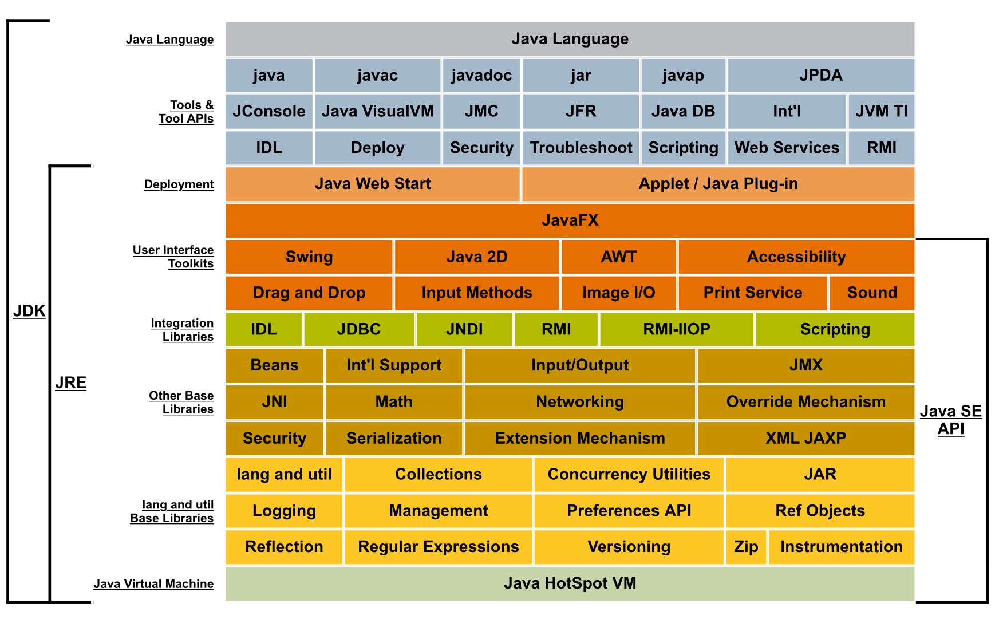
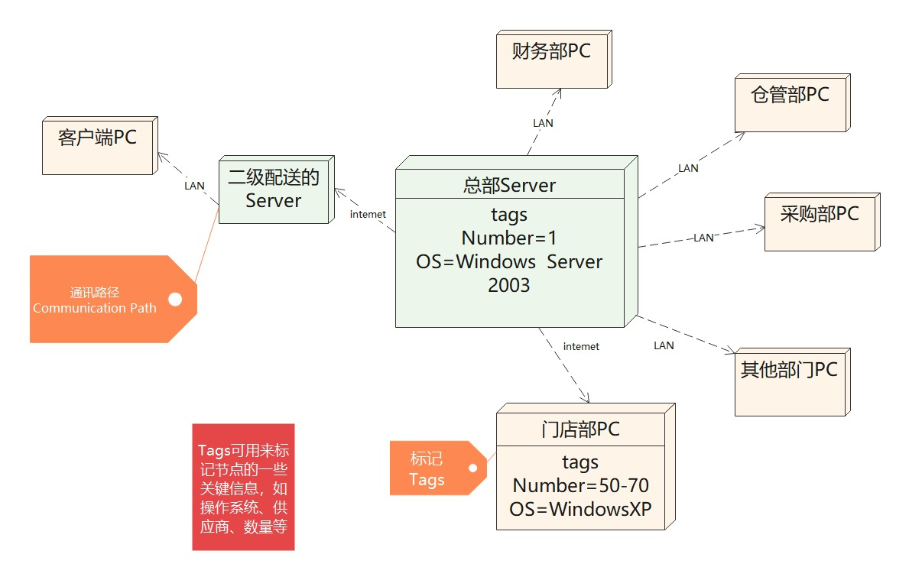

# “4+1”视图

## 场景视图（也叫用例视图）

> 黑盒视图。  
> 从外部视角，描述系统的参与者（用户）与系统功能用例的关系。反映的是系统的最终用户需求和交互设计。  
> 
> **通常由用例图表示**  
>   
> 

## 逻辑视图（也叫结构视图）

> 白盒视图。  
> 从结构化视角，描述该系统对用户提供的所需功能服务所具备的组件结构和数据结构，以及一些边界约束条件，清晰的描述给用户提供的功能需求服务是如何构建的。描述该系统内部所具备了那些组织结构，以达到实现对外功能。  
> 
> **通常由UML的组件图和类图来表示**  
>   
> 

## 开发视图（也叫实现视图）

> 白盒视图。  
> 从结构化视角和行为视角，去描述实现系统功能的各个组件和模块是如何实现的。  
>
> 
> 

## 处理视图（也叫过程视图、行为视图）

> 白盒视图。  
> 从行为视角，描述系统各个组件和模块是如何进行通信的。  
> 
> **通常由时序图和流程图表示**  
>   
> 

## 物理视图（也叫部署视图）

> 黑盒视图。  
> 从交互视角，描述系统可以部署到哪些物理环境（如服务器、PC端、移动端等）上和软件环境（如虚拟机、容器、进程等）上。  
> 
> **通常由部署图表示**   
> 
> 

## 优势和不足

### 优势

> - **多视角的全面性**：4+1视图模型通过逻辑视图、开发视图、物理视图、过程视图和场景视图五个不同的维度，全面描述了一个软件系统的各个方面。这种多视角的方法使得系统设计更为清晰、完整，便于开发团队全面理解和把握系统设计。
> - **易于理解和沟通**：每个视图关注系统的不同方面，通过特定的抽象层次和表示工具（如UML图）来表示，使得复杂系统的设计变得更为直观和易于理解。这有助于开发团队之间的沟通和协作，提高开发效率。
> - **实际问题的解决能力**：4+1视图模型不仅仅是理论上的创新，更是基于实际软件开发过程中的经验和需求。这使得该模型在解决实际问题时表现出色，尤其是在大型和复杂系统的设计中。
> - **教育和指导价值**：除了模型本身，Philippe Kruchten还致力于通过讲座、研讨会和出版物等方式，将自己的知识和经验传授给下一代软件工程师。这使得4+1视图模型在软件工程教育和培训中具有重要的价值。

### 不足

> - **更新和同步的挑战**：由于4+1视图模型涉及多个视图，当系统需求或设计发生变化时，需要确保所有视图都进行相应的更新和同步。这可能会带来一定的复杂性和挑战，需要开发团队具备高度的协同能力。
> - **视图之间的依赖性**：不同视图之间存在一定的依赖性，如逻辑视图和开发视图之间的关联。当其中一个视图发生变化时，可能会影响到其他视图。因此，在设计和维护过程中需要仔细考虑视图之间的依赖关系，确保系统的一致性和正确性。
> - **工具和方法的支持**：尽管4+1视图模型在理论上具有优势，但在实际应用中，可能缺乏足够的工具和方法支持。这可能会增加实现的难度和复杂性，需要开发团队具备较高的技能和经验。