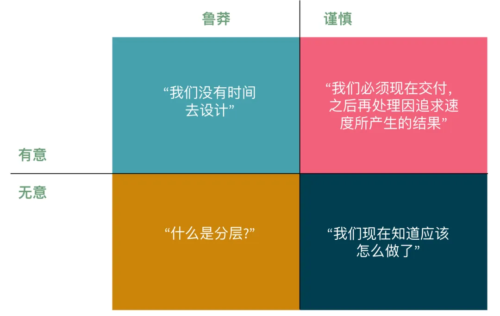
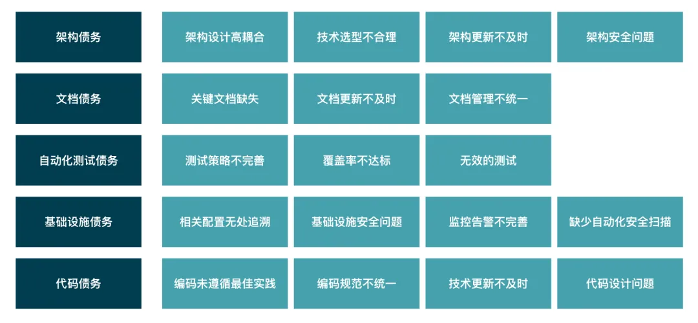
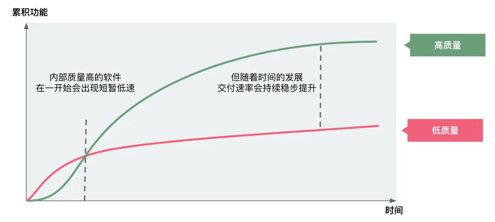
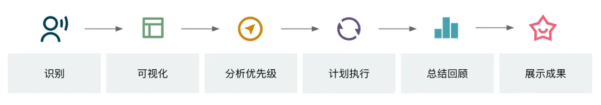
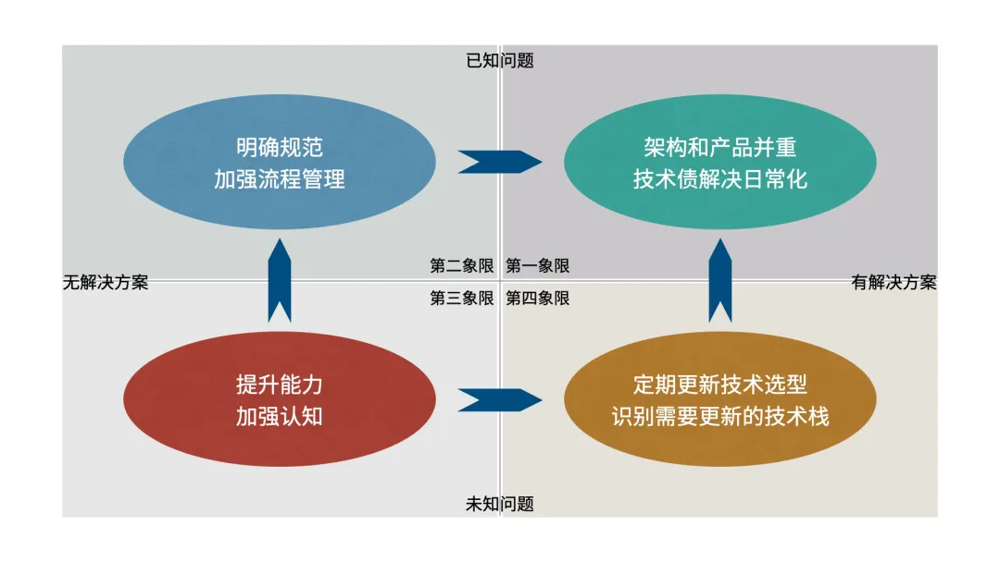
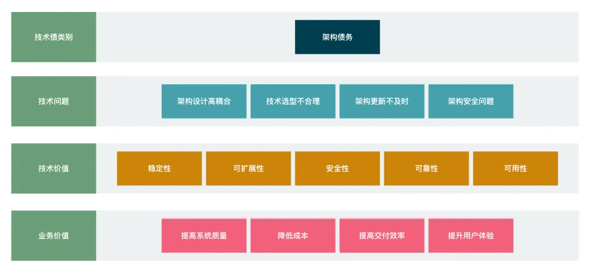
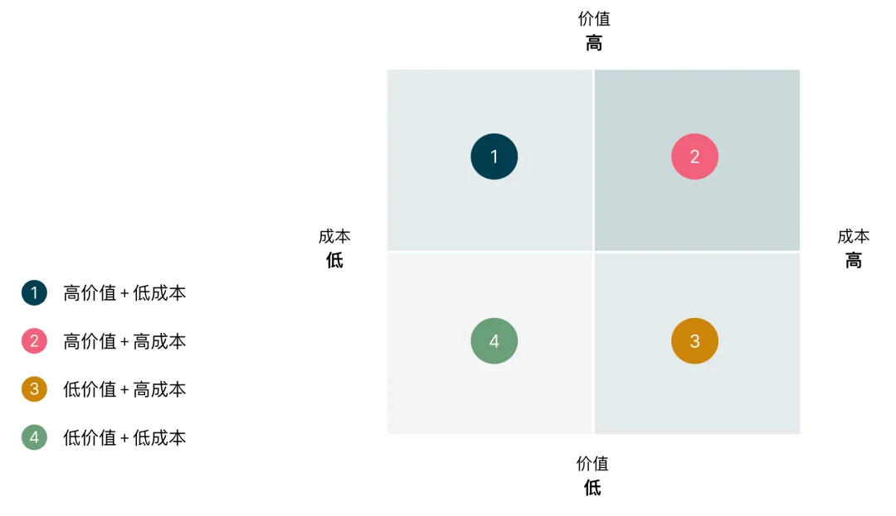

# 技术债
由于现在选择简单（有限）解决方案而不是使用需要更长时间的更好方法而导致的额外返工的隐含成本。

## 技术债产生原因
  
Martin Fowler —— TechnicalDebtQuadrant  
以上将技术债务产生的原因分为四类。我们通常认为，健康的技术债是右边的两个维度，不健康的技术债是左边的两个维度。基于此我们可以分析技术债产生的原因并制定相应的改进措施。  
- 鲁莽/有意 - “我们没有时间去设计”  
  团队虽然意识到这样做会导致技术债的积累，但却不清楚具体欠下债务的后果。为了提醒团队，可以增加相关流程和责任人。
- 谨慎/有意 - “我们必须现在交付，之后再处理因为追求速度所产生的结果”  
  当团队面临业务压力时，例如在发布新产品时需要快速上线以占领市场时，快速积累用户的重要性常常超越了更好的实践。在这种情况下，团队往往会选择快速完成产品交付，然后再处理技术债务。团队清楚这样做会带来技术债务，也知道逾期还债的具体后果。
- 鲁莽/无意 - “什么是分层？”  
  这个维度技术债务产生的原因通常是由于人员技能的不足。由于缺乏相关技能，开发人员可能不清楚如何编写更优秀和精炼的代码，如何设计良好的架构或者什么是更佳的解决方案。因此，导致技术债的出现和持续积累。这种情况需要加强团队成员的技能培养。
- 谨慎/无意 - “我们现在知道应该怎么做了”  
  随着团队成员的能力和对系统的了解的不断提升，使得之前认为是最佳方案的解决方案现在看来并不完全准确。但在当时，团队中没有人知道更好的做法。

## 技术债类型

## 管理技术债
Martin Fowler 在 Is High Quality Software Worth the Cost? 一文中从添加功能 / 时间两个维度来对比高质量的软件和低质量的软件在交付速率上的差别。  
  
技术债的持续累积是导致质量下降的关键原因，但技术债无法避免，因此技术债的有效管理和消除是我们保障高质量软件的必不可少的方式之一。
### 技术债管理的流程

#### 识别
技术的持续改进离不开团队中每个人的努力，因此需要每个成员都积极参与。在日常交付中，团队成员应该持续识别和记录需要改进的问题并将其放入backlog中，以便在技术改进会议中与团队同步。此外，团队还可以定期组织头脑风暴，以收集技术痛点和改进建议。当然也不仅仅限于团队内部，也要倾听用户的问题，有意识的建设研发效能度量体系，度量技术债和留意产品延迟和成本的上升。 

针对上面这几个技术债象限产生问题的原因来分析如何避免和解决技术债。鲁莽的/谨慎的 可以理解在技术债产生时，团队是否做出来细致的分析，其结果可以对应到 无解决方案/有解决方案。

而 故意的/无心的 表达的是对于技术债的产生是已知的，还是未知的，可以对应到 已知问题/未知问题。这样就可以将问题的解决也同样划到四个不同的象限，对于第一象限而言，已知问题，也有解决方案，只需要将技术债的解决列入计划实施起来就可以了。

对于其他象限，都无法直接列入计划解决，因此，我们需要通过一些手段让技术债从认知和方案层面向第一象限移动。第三象限的技术债，团队认知水平很低，只能通过提升团队的整体能力和认知水平，让问题逐渐清晰，向第二和第四象限转移。

### 可视化
当进行技术债务管理时，我们必须始终以价值为出发点。这个价值不仅限于技术层面，最终还会反映在客户或用户所获得的业务价值上。因此，我们建议在评估技术债务和技术改进任务时，同时考虑技术价值和业务价值两个维度。我们可以参考以下“价值映射图”示例，根据架构债务中存在的技术问题以及解决这些技术债务所带来的技术价值和业务价值进行分析。之后为每个改进任务创建技术卡来可视化所有技术改进任务。

### 分析优先级
时常会遇到的问题是，需要改进的地方太多，尤其是对于遗留系统。怎么办？先排优先级。可以基于价值/成本矩阵来评估改进任务的价值和成本。

基于以上价值-成本矩阵，我们会：
- 优先解决高价值+低成本的技术债；
- 尝试将高价值+高成本的技术债拆分为高价值+低成本的技术债，“尽早、频繁、小批”地进行PDCA（Plan/Do/Check/Adjust）的迭代解决；
- 在没有高价值+高/低成本的技术债时，再来考虑低价值+低成本的技术债；
- 最后如果只剩下低价值+高成本的技术债，还是先拆分，再解决，或可考虑直接移除；
### 计划执行
由于难以在一段时间内集中处理技术债务，因此认为将消除技术债务作为每个迭代交付目标的一部分是推进技术改进的有效方式。在对技术债务及相关改进任务进行优先级评估后，需要根据优先级将技术改进任务引入到每个迭代中。例如：每个迭代中引入20%的工作量用于技术改进任务，根据不同的问题类型要执行在识别中的不同策略，将技术债的状态进行转移：
- 明确技术规范，加强管理
- 技术债解决日常化
  - 核心领域优于其他子域
  - 可演进性优于可维护性
  - 明确清晰的责任定义优于松散无序的任务分配
  - 主动预防优于被动响应
- 持续关注技术发展趋势，提前规划架构的演进方向
- 保持技术优化相关投入
### 总结回顾
在技术债务管理中，可视化技术改进成果是不可或缺的一环。  
总结的目的不仅是梳理改进成果，更是与团队成员持续分享我们所创造的价值。   
通过可视化技术改进成果，能够增强团队成员的归属感和满足感，这对于提高团队士气非常重要。虽然有人开玩笑说“每一行代码都是改变世界的力量”，我们可能还无法真正改变世界，但我们能够为客户和用户持续创造价值。
### 展示成果
首先，了解客户需求至关重要，例如客户关心的系统稳定性、成本控制、交付效率等，除了向客户解释技术改进的价值和解决的问题之外，将技术改进的成果分享给客户也是至关重要的。  
我们需要持续跟进技术改进的成果，并向客户提供反馈。  
持续增强客户对技术改进的认可，才能真正确保技术改进的可持续性。
