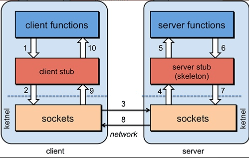

# RPC

RPC（Remote Procedure Call，远程过程调用）是一种计算机通信协议，允许程序像调用本地函数一样透明地执行另一台计算机上的代码，无需显式处理网络细节。它简化了分布式系统的开发，使开发者能够专注于业务逻辑而非底层通信机制。以下是RPC的核心介绍：

## 1. 核心概念
- **目标**：隐藏远程调用的复杂性，使分布式计算像本地调用一样自然。
- **关键点**：
    - **透明性**：调用方无需关心目标服务的位置（本地/远程）、网络协议或序列化方式。
    - **同步/异步**：支持阻塞式（等待结果）或非阻塞式（回调/Future）调用。
    - **跨语言支持**：通过标准协议（如gRPC的Protocol Buffers）实现不同语言间的互操作。

## 2. 工作原理
1. **客户端调用**：客户端像调用本地函数一样发起请求。
2. **Stub/Proxy处理**：
    - 客户端存根（Stub）将方法名、参数序列化为二进制或文本格式（如JSON、Protobuf）。
    - 通过网络传输（如TCP、HTTP/2）发送到服务端。
3. **服务端处理**：
    - 服务端框架（Skeleton）接收请求，反序列化参数。
    - 调用实际的服务实现，获取结果。
4. **返回结果**：结果按相同路径返回客户端，客户端反序列化后继续执行。

## 3. 关键组件
- **序列化/反序列化**：将数据转换为可传输格式（如JSON、Protobuf、Thrift）。
- **通信协议**：定义数据传输规则（如HTTP/2、TCP自定义协议）。
- **服务发现**：动态定位服务端地址（如ZooKeeper、Consul、Kubernetes DNS）。
- **负载均衡**：在多个服务实例间分配请求（如轮询、权重、最少连接）。
- **容错机制**：超时重试、断路器模式（如Hystrix、Sentinel）。

## 4. 常见RPC框架
| 框架           | 语言支持              | 协议/序列化                    | 特点                 |
|--------------|-------------------|---------------------------|--------------------|
| **gRPC**     | 多语言（Go/Java/C++等） | HTTP/2 + Protobuf         | 高性能、跨语言、支持流式通信     |
| **Dubbo**    | Java为主            | 自定义TCP + Hessian/Protobuf | 服务治理强（阿里开源）        |
| **Thrift**   | 多语言               | 自定义二进制                    | 跨语言、高效（Facebook开源） |
| **JSON-RPC** | 多语言               | HTTP + JSON               | 简单易用、可读性强          |
| **Finagle**  | Scala/Java        | Netty +自定义协议              | Twitter开源，高并发支持    |

## 5. RPC vs REST/HTTP API
| **特性**   | **RPC**             | **REST/HTTP API** |
|----------|---------------------|-------------------|
| **设计目标** | 高效调用远程函数            | 资源操作（CRUD）        |
| **协议**   | 自定义二进制/HTTP/2       | HTTP/1.1          |
| **数据格式** | Protobuf/Thrift（紧凑） | JSON/XML（可读性强）    |
| **性能**   | 更高（二进制+长连接）         | 较低（文本+短连接）        |
| **适用场景** | 内部服务间通信、微服务         | 公开API、跨平台交互       |

## 6. 典型应用场景
- **微服务架构**：服务间调用（如订单服务调用库存服务）。
- **分布式计算**：MapReduce、Spark等任务分发。
- **云原生应用**：Kubernetes中容器间通信。
- **游戏后端**：实时状态同步（如玩家位置更新）。

## 7. 优缺点
- **优点**：
    - 简化开发：屏蔽网络细节，提升效率。
    - 性能优化：支持二进制序列化、长连接复用。
    - 强类型：通过IDL（接口定义语言）生成代码，减少错误。
- **缺点**：
    - 复杂性：需处理服务发现、负载均衡等分布式问题。
    - 耦合性：客户端与服务端需严格约定接口（如Protobuf版本兼容性）。

## 8. 发展趋势
- **gRPC主导**：HTTP/2 + Protobuf成为高性能RPC标准。
- **Service Mesh集成**：通过Istio/Linkerd管理RPC流量（如熔断、重试）。
- **Serverless RPC**：AWS Lambda、阿里云函数计算等无服务器架构支持RPC调用。

## 9. 总结
RPC是分布式系统的核心通信方式，适合内部服务高效协作。选择框架时需权衡性能、语言支持、生态成熟度等因素。对于公开API，REST/GraphQL可能更合适；而内部微服务间通信，gRPC或Dubbo是更优选择。