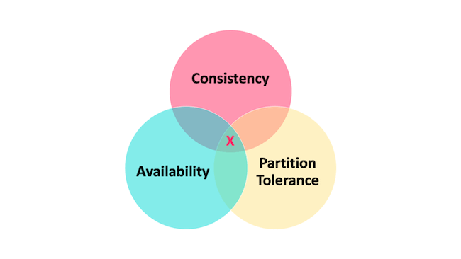

# 理论&算法&协议

## CAP & BASE理论

ACID 是数据库事务完整性的理论，CAP 是分布式系统设计理论，BASE 是 CAP 理论中 AP 方案的延伸。

### CAP 理论

CAP 也就是 Consistency(一致性)、Availability(可用性)、Partition Tolerance(分区容错性)

- **一致性(Consistency)**：所有节点访问同一份最新的数据副本
- **可用性(Availability)**：非故障的节点在合理的时间内返回合理的响应(不是错误或者超时的响应)
- **分区容错性(Partition Tolerance)**：分布式系统出现网络分区的时候，仍然能够对外提供服务
- **网络分区**：分布式系统中，多个节点之间的网络本来是连通的，但是因为某些故障(比如部分节点网络出了问题)某些节点之间不连通了，整个网络就分成了几块区域，这就叫 网络分区。

#### 3 选 2

如果网络分区正常的话(系统在绝大部分时候所处的状态，即是说分区容错性(Partition tolerance)是系统必须要实现的)，C 和 A 能够同时保证。  
当发生网络分区的时候，如果要保证继续服务，那么 C 和 A 只能 2 选 1。
CAP 理论中分区容错性 P 是前提，在 P 的基础上只能满足可用性 A 或者一致性 C ,也就是选择 CP 或者 AP 架构，选择 CP 还是 AP 的关键在于当前的业务场景。

##### CP 或者 AP 架构示例

- ZooKeeper、HBase 就是 CP 架构
- Cassandra、Eureka 就是 AP 架构
- Nacos 不仅支持 CP 架构也支持 AP 架构。

##### 为啥不可能选择 CA 架构呢？

举个例子：若系统出现“分区”，系统中的某个节点在进行写操作。为了保证 C， 必须要禁止其他节点的读写操作，这就和 A 发生冲突了。如果为了保证 A，其他节点的读写操作正常的话，那就和 C 

#### CAP 实际应用案例

##### Dubbo的注册中心

Dubbo 的架构图。注册中心负责服务地址的注册与查找，相当于目录服务，服务提供者和消费者只在启动时与注册中心交互，注册中心不转发请求，压力较小。

##### ZooKeeper 保证的是 CP。 

任何时刻对 ZooKeeper 的读请求都能得到一致性的结果，但是， ZooKeeper 不保证每次请求的可用性比如在 Leader 选举过程中或者半数以上的机器不可用的时候服务就是不可用的。

##### Eureka 保证的则是 AP。 

Eureka 在设计的时候就是优先保证 A (可用性)。在 Eureka 中不存在什么 Leader 节点，每个节点都是一样的、平等的。因此 Eureka 不会像 ZooKeeper 那样出现选举过程中或者半数以上的机器不可用的时候服务就是不可用的情况。 Eureka 保证即使大部分节点挂掉也不会影响正常提供服务，只要有一个节点是可用的就行了。只不过这个节点上的数据可能并不是最新的。

##### Nacos 不仅支持 CP 也支持 AP。

##### 其他

- HBase 就 CP 架构
- Cassandra 是 AP 架构

### BASE 理论

BASE 是 Basically Available(基本可用)、Soft-state(软状态) 和 Eventually Consistent(最终一致性) 三个短语的缩写。  
BASE 理论本质上是对 CAP 的延伸和补充，更具体地说，是对 CAP 中 AP 方案的一个补充。  
- 即使无法做到强一致性，但每个应用都可以根据自身业务特点，采用适当的方式来使系统达到最终一致性。  
- 牺牲数据的一致性来满足系统的高可用性，系统中一部分数据不可用或者不一致时，仍需要保持系统整体“主要可用”。

#### 基本可用

基本可用是指分布式系统在出现不可预知故障的时候，允许损失部分可用性。但是，这绝不等价于系统不可用。  
- 允许损失部分可用性
  - **响应时间上的损失**：正常情况下，处理用户请求需要 0.5s 返回结果，但是由于系统出现故障，处理用户请求的时间变为 3 s。
  - **系统功能上的损失**：正常情况下，用户可以使用系统的全部功能，但是由于系统访问量突然剧增，系统的部分非核心功能无法使用。

#### 软状态
软状态指允许系统中的数据存在中间状态(CAP 理论中的数据不一致)，并认为该中间状态的存在不会影响系统的整体可用性，即允许系统在不同节点的数据副本之间进行数据同步的过程存在延时。

## 一致性算法

Paxos算法、Raft算法和Gossip协议都是解决分布式系统中一致性问题的重要算法和协议。它们各有特点，适用于不同的场景和需求。在实际应用中，需要根据具体场景和需求选择合适的算法或协议，以实现分布式系统的高效、可靠和一致。

### Paxos 算法
Paxos算法是一种用于解决分布式系统中一致性问题的经典算法，由Leslie Lamport在1990年代提出。其核心目标是在多个节点之间就某个值达成一致，即使在部分节点发生故障的情况下也能保证系统的一致性。

#### 算法角色与概念
- **提案者(Proposer)**：负责向系统提交提案的节点，提案中包含了一个希望被系统接受的值。
- **接受者(Acceptor)**：负责接受提案并对提案进行投票的节点。
- **学习者(Learner)**：从接受者那里学习最终被接受的值，并可以将该值提供给客户端。
- **提案编号(Proposal ID)**：每个提案都有一个唯一的编号，用于区分不同的提案。通常，提案编号由两部分组成：一个时间戳和一个唯一的节点标识符。
- **多数派(Majority)**：在Paxos算法中，为了达成一致，需要获得超过半数的接受者的支持。
- **法定人数(Quorum)**：指的是能够满足一致性要求的最小接受者集合。在大多数情况下，法定人数是指超过半数的接受者。

#### 算法流程

Paxos算法分为两个阶段：准备阶段(Prepare Phase)和接受阶段(Accept Phase)。
- **准备阶段**：  
提案者选择一个提案编号n，并向所有接受者发送Prepare请求，该请求包含提案编号n。
接受者收到Prepare请求后，如果提案编号n大于它之前已经响应过的所有Prepare请求的编号，则接受者承诺不再接受任何编号小于n的提案，并向提案者回复一个Promise消息，该消息包含接受者已经接受的最高编号的提案(如果存在的话)。
- **接受阶段**：  
提案者收到大多数接受者的Promise消息后，选择一个值v(如果Promise消息中包含了已接受的提案，则选择该提案中的值；否则，可以选择任意值)，并向所有接受者发送Accept请求，该请求包含提案编号n和值v。
接受者收到Accept请求后，如果提案编号n等于它之前承诺过的最高编号，则接受该提案，并存储值v。然后，接受者向提案者回复Accepted消息，表示已经接受了该提案。
提案者收到大多数接受者的Accepted消息后，意味着该提案已经被系统接受。此时，提案者可以通知学习者该提案已被接受。

#### 算法特点与应用

Paxos算法具有高度的容错性和可扩展性，能够应对节点故障和网络延迟等问题。它广泛应用于分布式数据库、分布式存储系统、分布式事务处理等需要保证分布式系统一致性的场景。然而，Paxos算法本身比较复杂，理解和实现起来都有一定的难度，因此通常会使用一些基于Paxos算法的库或框架来简化分布式系统中的一致性实现。

### Raft 算法
Raft是一种相对较新的分布式一致性算法，旨在提供一种更易于理解和实现的解决方案。Raft算法把一致性算法流程分为三个子问题：领导选举(Leader election)、日志复制(Log replication)和安全性(Safety)。

#### 算法角色

- **领导者(Leader)**：接收处理客户端请求、向Follower进行日志同步，同一时刻最多只能有一个可行的Leader。
- **追随者(Follower)**：接受并持久化Leader同步的日志，在Leader告之日志可以提交之后，提交日志，处在完全被动状态。
- **候选人(Candidate)**：临时角色，处于Leader和Follower之间的暂时状态。Raft算法中在任意时刻最多只有一个Leader，正常工作期间只有Leader和Followers。

#### 状态转换与任期

1. **状态转换**：
   - Raft刚启动的时候，所有节点初始状态都是Follower。
   - 超时时间内如果没有收到Leader的请求则转换为Candidate角色并发起Leader选举。
   - 如果Candidate收到了多数节点的选票则转换为Leader。
   - 如果在发起选举期间发现已经有Leader了，或者收到更高任期的请求则转换为Follower。
   - Leader在收到更高任期的请求后转换为Follower。
2. **任期**：可以理解为是节点担任Leader职务的时间期限。Raft将时间划分为一个一个的任期(term)，每个任期由单调递增的数字(任期编号)标识，工作期可长可短也可能不存在。

#### 日志复制与一致性

Raft算法中，每个节点维护着一份日志，其中包含了系统中所有状态变更的记录，每一次状态变更被称为一个日志条目。日志记录包含索引(log index)、任期号(term)和命令(command)。

1. **日志复制**：
   - Leader先将命令追加到自己的日志中。
   - Leader并行地向其它节点发送AppendEntries RPC，等待响应。
   - 收到超过半数节点的响应，则认为新的日志记录是被提交的。
   - Leader将命令传给自己的状态机，然后向客户端返回响应。
2. **一致性检查**：
   - 如果两个节点的日志在相同的索引位置上的任期号相同，则认为他们具有一样的命令，从头到这个索引位置之间的日志完全相同。
   - 通过一致性检查保证了日志一致性的两点内容：一个日志条目在某个节点被提交，那么这个日志条目也必须在所有节点上被提交。

#### 算法特点与应用

Raft算法通过引入Leader选举和日志复制的机制，确保了分布式系统的共识和一致性。它具有简洁、高效、易于理解和实现的特点，广泛应用于元数据管理、分布式数据库等场景。

### Gossip 协议
Gossip协议，也称为流言协议，是一种在分布式系统中用于节点之间通信和数据同步的算法。其设计灵感来自于人类社交中的流言传播机制。

#### 协议背景与特点

Gossip协议产生的背景主要是为了解决大规模分布式系统中的一致性和可靠性问题。在这类系统中，节点数量众多，网络拓扑复杂多变，传统的集中式或分层式通信模型往往难以适应因为节点故障、网络分区等问题导致的动态变化。因此，需要一种能够在节点间高效、可靠地同步状态信息的机制，尤其是在处理故障检测、配置管理、数据一致性等问题时。Gossip协议因其简单、鲁棒、可扩展等特性而被提出和广泛应用。

#### 协议流程

1. **初始化**：每个节点维护一个包含系统状态信息的数据结构，如版本号、时间戳等。
2. **选择目标**：周期性地，每个节点随机选择几个其他节点作为通信的目标。
3. **信息交换**：节点之间通过双向或单向通信交换它们各自的信息。
4. **更新状态**：接收到信息的节点根据某种规则(如版本号比较)来决定是否更新自己的信息。
5. **重复**：重复上述过程，直至系统中的大多数或全部节点达到信息一致。

#### 传播因子与变种

1. **传播因子**：每次传播时，一个节点会向多少个其他节点发送消息。
2. **周期**：节点多久进行一次信息交换的时间间隔。
3. **消息大小**：每次传播的消息内容大小。

Gossip协议存在多种变种，如抗熵Gossip(Anti-Entropy)、流言蜚语Gossip(Rumor Mongering)和新闻传播Gossip(Epidemic Spreading)等，它们在基本流程上进行了调整以优化特定的性能指标或适应特定的应用场景。

#### 协议应用与优势

Gossip协议被广泛应用于分布式系统中的数据一致性、故障检测、组成员管理和资源发现等场景。其优势包括鲁棒性(即使部分节点或网络出现问题，信息仍然可以通过其他路径传播)、可扩展性(适用于大规模分布式系统，节点增加不会显著影响其性能)和简单性(算法实现简单，易于部署)等。然而，Gossip协议也存在一些挑战，如可能会产生大量冗余消息，影响网络带宽，以及不能保证实时一致性，只能达到最终一致性等。