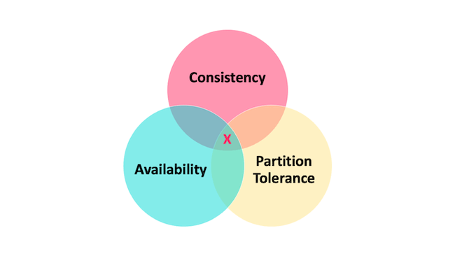

# CAP

CAP定理是分布式系统设计中的一个核心理论，由计算机科学家埃里克·布鲁尔（Eric Brewer）在2000年提出，后由麻省理工学院的赛斯·吉尔伯特（Seth Gilbert）和南希·林奇（Nancy Lynch）在2002年给出严格证明。它揭示了分布式系统在**一致性（Consistency）**、**可用性（Availability）**和**分区容错性（Partition Tolerance）**三者之间的根本性矛盾，指出任何分布式系统最多只能同时满足其中两个目标。

### **CAP定理的三个核心属性**
1. **一致性（Consistency）**
    - 定义：所有节点在同一时间看到相同的数据，即数据更新后，所有后续访问都能返回最新值。
    - 示例：在银行转账场景中，若A向B转账100元，系统需确保所有节点同时看到A余额减少和B余额增加的结果，避免出现中间状态。

2. **可用性（Availability）**
    - 定义：系统在合理时间内对请求作出响应，即使部分节点故障，仍能保证服务可用。
    - 示例：电商网站在部分服务器宕机时，仍能处理用户下单请求，不中断服务。

3. **分区容错性（Partition Tolerance）**
    - 定义：系统在网络分区（节点间通信中断）时，仍能继续运行并处理请求。
    - 示例：跨地域的云服务在某个数据中心网络故障时，其他数据中心仍能独立提供服务。

### **CAP定理的核心结论**

在分布式系统中，**分区容错性（P）是必须满足的**（因为网络不可靠是常态），因此系统只能在**一致性（C）和可用性（A）**之间二选一：
- **CP系统**：优先保证一致性，牺牲可用性。
    - 示例：Zookeeper、Etcd（分布式锁服务）。
    - 行为：在网络分区时，系统会拒绝请求，确保数据一致性，直到分区恢复。

- **AP系统**：优先保证可用性，牺牲强一致性。
    - 示例：Cassandra、DynamoDB（NoSQL数据库）。
    - 行为：在网络分区时，系统仍接受请求，但可能返回旧数据或临时不一致结果，后续通过异步复制修复。

- **CA系统**：理论上存在，但实际无意义。
    - 原因：若系统无需分区容错（P），则本质是单机系统，无需讨论分布式设计。

### **CAP定理的延伸与澄清**
1. **CAP是权衡而非绝对**：
    - 定理指出“三选二”，但实际系统中常通过妥协实现部分特性。例如：
        - **最终一致性（Eventual Consistency）**：AP系统通过异步复制，在一段时间后达到一致（如DNS、Cassandra）。
        - **BASE模型**（Basically Available, Soft state, Eventually consistent）：放宽一致性要求，以换取高可用性。

2. **网络分区是假设条件**：
    - CAP定理的前提是存在网络分区。若网络稳定（无分区），系统可同时满足C、A、P（如单机数据库）。

3. **一致性模型的多样性**：
    - 强一致性（如线性一致性）与弱一致性（如会话一致性、因果一致性）是不同层级的需求，AP系统可能选择更弱的一致性模型。

### **实际应用中的选择**
- **金融交易系统**：通常选择CP（如银行核心系统），确保数据绝对准确。
- **社交媒体、电商**：倾向于AP（如Twitter、淘宝），允许短暂不一致以提升用户体验。
- **中间方案**：通过分片（Sharding）、读写分离、缓存策略等，在C和A之间动态平衡。

### **总结**
CAP定理为分布式系统设计提供了理论框架，帮助开发者明确优先级。实际系统中，需根据业务场景（如对数据一致性的敏感度、用户对延迟的容忍度）在C和A之间做出合理取舍，并通过技术手段（如复制、缓存、冲突解决）优化系统表现。