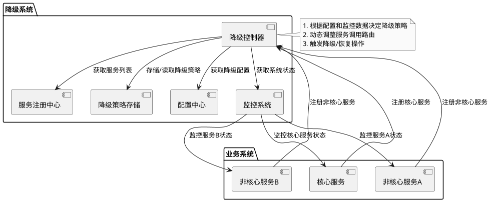
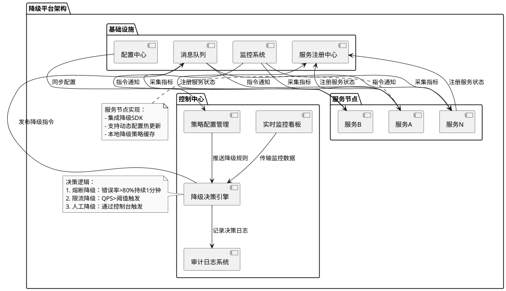

# 降级

降级是指当系统检测到某个服务或组件无法正常工作或性能下降时，主动降低对该服务或组件的依赖程度，或者切换到备用方案，以确保整个系统的稳定性和可用性。

## 降级的特征
1. *原因*:整体负荷超出整体负载承受能⼒。
2. *⽬的*:保证重要或基本服务正常运⾏，⾮重要服务延迟使⽤或暂停使⽤
3. *⼤⼩*:降低服务粒度，要考虑整体模块粒度的⼤⼩，将粒度控制在合适的范围内
4. *可控性*:在服务粒度⼤⼩的基础上增加服务的可控性，后台服务开关的功能是⼀项必要配置（单机可配置⽂件，其他可领⽤数据库和缓存），可分为⼿动控制和⾃动控制。
5. *顺序*:⼀般从外围延伸服务开始降级，需要有⼀定的配置项，重要性低的优先降级，⽐如可以分组设置等级 1-10，当服务需要降级到某⼀个级别时，进⾏相关配置

## 降级的⽅式
1. *延迟服务*
⽐如发表了评论，重要服务，⽐如在⽂章中显示正常，但是延迟给⽤户增加积分，只是放到⼀个缓存中，等服务平稳之后再执⾏。
2. *在粒度范围内关闭服务（⽚段降级或服务功能降级）*
⽐如关闭相关⽂章的推荐，直接关闭推荐区
3. *⻚⾯异步请求降级*
⽐如商品详情⻚上有推荐信息/配送⾄等异步加载的请求，如果这些信息响应慢或者后端服务有问题，可以进⾏降级；
4. *⻚⾯跳转（⻚⾯降级）*
⽐如可以有相关⽂章推荐，但是更多的⻚⾯则直接跳转到某⼀个地址
5. *写降级*
比如秒杀抢购，我们可以只进行 Cache 的更新，然后异步同步扣减库存到 DB，保证最终⼀致性即可，此时可以将 DB 降级为 Cache。
6. *读降级*
比如多级缓存模式，如果后端服务有问题，可以降级为只读缓存，这种⽅式适⽤于对读⼀致性要求不⾼的场景。

## 降级的分类
### 自动开关降级（超时、失败次数、故障、限流）
#### 独立降级系统
为了解决系统后门降级方式的缺点，我们将降级操作独立到一个单独的系统中，可以实现复杂的权限管理、批量操作等功能。

#### 降级组件类型
1. *超时降级*
主要配置好超时时间和超时重试次数和机制，并使⽤异步机制探测回复情况
2. *失败次数降级*
主要是⼀些不稳定的 api，当失败调⽤次数达到⼀定阀值⾃动降级，同样要使⽤异步机制探测回复情况
3. *故障降级*
⽐如要调⽤的远程服务挂掉了（⽹络故障、DNS 故障、http 服务返回错误的状态码、rpc 服务抛出异常），则可以直接降级。降级后的处理⽅案有：默认值（⽐如库存服务挂了，返回默认现货）、兜底数据（⽐如⼴告挂了，返回提前准备好的⼀些静态⻚⾯）、缓存（之前暂存的⼀些缓存数据）
4. *限流降级*
当我们去秒杀或者抢购⼀些限购商品时，此时可能会因为访问量太⼤⽽导致系统崩溃，此时开发者会使⽤限流来进⾏限制访问量，当达到限流阀值，后续请求会被降级；降级后的处理⽅案可以是：排队⻚⾯（将⽤户导流到排队⻚⾯等⼀会重试）、⽆货（直接告知⽤户没货了）、错误⻚（如活动太⽕爆了，稍后重试）
### 人工开关降级（秒杀、电商⼤促等）
系统预留的后门用于降级操作。
> 例如，系统提供一个降级URL，当访问这个URL时，就相当于执行降级指令，具体的降级指令通过URL的参数传入即可。这种方案有一定的安全隐患，所以也会在URL中加入密码这类安全措施。

系统后门降级的方式实现成本低，但主要缺点是如果服务器数量多，需要一台一台去操作，效率比较低，这在故障处理争分夺秒的场景下是比较浪费的。

## ⼤规模分布式系统如何降级？
在⼤规模分布式系统中，经常会有成百上千的服务。  
在⼤促前往往会根据业务的重要程度和业务间的关系批量降级。  
这就需要技术和产品提前对业务和系统进⾏梳理，根据梳理结果确定哪些服务可以降级，哪些服务不可以降级，降级策略是什么，降级顺序怎么样。  
⼤型互联⽹公司基本都会有⾃⼰的降级平台，⼤部分降级都在平台上操作，⽐如⼿动降级开关，批量降级顺序管理，熔断阈值动态设置，限流阈值动态设置等等。

