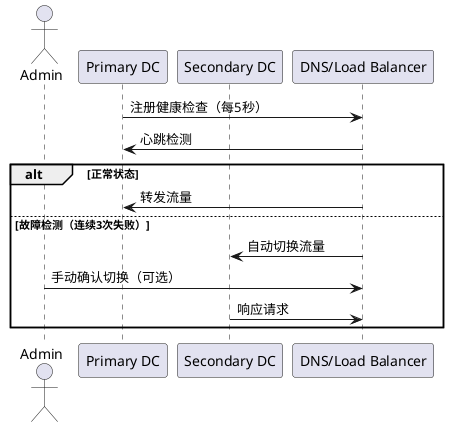

# 灾备设计和异地多活

灾备设计（Disaster Recovery, DR）和异地多活（Multi-Region Active-Active）是构建高可用系统的两种关键策略，分别针对**灾难恢复**和**持续高可用**场景。


## 一、灾备设计（Disaster Recovery）
### 核心目标
- **RTO（Recovery Time Objective）**：灾难发生后，系统恢复所需的最大时间（如2小时内恢复）。
- **RPO（Recovery Point Objective）**：数据丢失的最大容忍范围（如最多丢失15分钟的数据）。
- **典型场景**：数据中心火灾、地震、网络中断等极端故障。

### **设计模式**
1. **冷备（Cold Standby）**
   - 备用数据中心仅部署基础设施，无实时数据或服务。
   - **优点**：成本低。
   - **缺点**：RTO长（需手动恢复数据和服务）。

2. **温备（Warm Standby）**
   - 备用数据中心运行简化版服务，定期同步数据。
   - **优点**：RTO较短（自动或半自动切换）。
   - **缺点**：资源利用率低。

3. **热备（Hot Standby）**
   - 主备数据中心同时运行，数据实时同步（如主从复制、双活数据库）。
   - **优点**：RTO接近0，RPO极小。
   - **缺点**：成本高，需解决数据一致性冲突。

### 灾备切换流程


---

## 异地多活（Multi-Region Active-Active）
### 核心目标
- **全局低延迟**：用户就近访问，减少跨区域调用。
- **容灾能力**：任一区域故障时，其他区域无缝接管。
- **典型场景**：全球化服务（如电商、社交、金融）。

### 设计要点
1. **单元化架构**
   - 将用户按地域、ID哈希等分片（Unit），每个单元独立部署服务、缓存、数据库。
   - **示例**：用户ID末位为0-3的访问华东区，4-7访问华北区，8-9访问华南区。

2. **数据同步策略**
   - **最终一致性**：通过消息队列（如Kafka）异步同步数据，允许短暂不一致。
   - **强一致性**：使用分布式数据库（如TiDB、CockroachDB）或分布式事务（如Saga模式）。

3. **全局流量调度**
   - 通过DNS（如GeoDNS）或智能路由（如Anycast）将用户请求导向最近区域。
   - **示例**：
      - 用户访问 `api.example.com` → DNS解析为就近IP。
      - 内部服务通过服务发现（如Consul）动态路由。

4. **冲突解决**
   - **写冲突**：如两个区域同时修改同一数据，需通过版本号、时间戳或业务逻辑合并。
   - **缓存一致性**：使用分布式缓存（如Redis Cluster）或缓存失效策略。

### 异地多活数据同步
```plantuml
@startuml MultiRegionActiveActive

cloud "User" as user
rectangle "Region A (华东)" as regionA {
    component "API Gateway" as gatewayA
    component "Service" as serviceA
    database "DB (Master)" as dbA
}

rectangle "Region B (华北)" as regionB {
    component "API Gateway" as gatewayB
    component "Service" as serviceB
    database "DB (Replica)" as dbB
}

user -> gatewayA : 请求（就近路由）
gatewayA -> serviceA : 处理
serviceA -> dbA : 写数据（本地事务）
dbA -> dbB : 异步同步（Kafka）

user -> gatewayB : 请求（华东故障时）
gatewayB -> serviceB : 处理
serviceB -> dbB : 读数据（可能读到旧值）
dbB -> dbA : 最终一致

@enduml
```

---

## 灾备 vs 异地多活对比

| **维度**      | **灾备设计**     | **异地多活**          |
|-------------|--------------|-------------------|
| **目标**      | 灾难后恢复        | 持续高可用+容灾          |
| **成本**      | 中低（冷备）到高（热备） | 极高（多区域资源+数据同步）    |
| **RTO/RPO** | RTO较长，RPO可配置 | RTO≈0，RPO≈0（强一致时） |
| **数据一致性**   | 允许最终一致       | 需解决强一致或冲突         |
| **适用场景**    | 金融、政府（合规要求高） | 互联网、全球化服务         |

---

## 最佳实践建议
1. **灾备设计**
   - 定期演练故障切换（如每年1次）。
   - 使用云服务商的跨区域备份（如AWS S3 Cross-Region Replication）。

2. **异地多活**
   - 优先实现**读多写少**场景的多活（如商品查询）。
   - 避免跨区域事务，通过业务拆分减少同步需求。

3. **混合方案**
   - 核心业务（如支付）采用异地多活，非核心业务（如日志）采用灾备冷备。

通过结合灾备的**恢复能力**和异地多活的**持续可用性**，可以构建既抗灾又低延迟的弹性系统。


