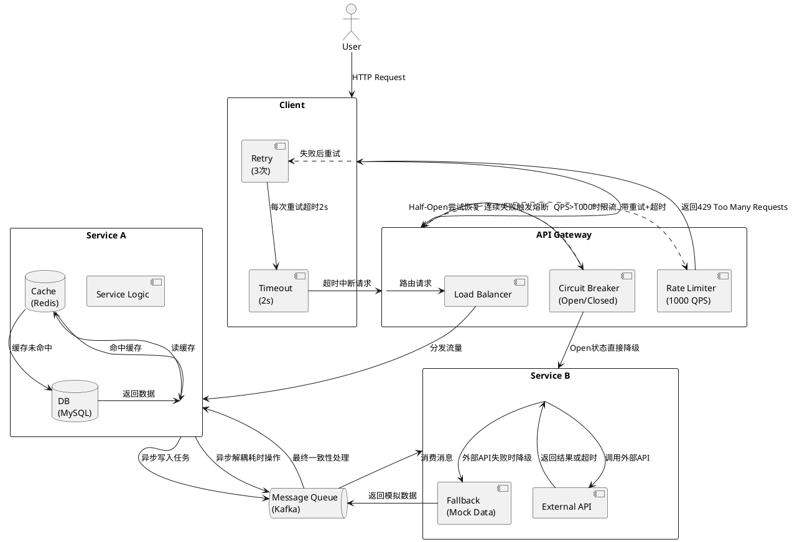

# 弹性架构

弹性架构（Elastic Architecture）是一种能够根据系统负载、资源需求或外部环境变化，动态调整资源配置和系统能力的架构设计模式。其核心目标是实现**高可用性、可扩展性、成本优化**，同时确保系统在面对流量波动、故障或业务增长时仍能稳定运行。  
弹性架构是现代系统设计的核心能力，尤其适用于互联网、金融、游戏等高并发场景。通过云原生技术、自动化工具和分布式设计，企业能够以更低的成本实现更高的系统韧性。实际落地时需结合业务特点，在扩展性、成本和复杂性之间找到平衡点。  
以下是弹性架构的关键要素、设计原则及实现方式：

## 弹性架构的核心目标
1. **自动扩展（Auto-scaling）**：根据负载动态增加或减少资源（如服务器、存储、带宽）。
2. **容错与自愈**：通过冗余和故障转移机制，确保系统在部分组件失效时仍能运行。
3. **成本优化**：按需使用资源，避免过度配置，降低闲置成本。
4. **快速响应**：适应业务需求的快速变化（如突发流量、季节性波动）。

## 弹性架构的关键设计原则
1. **无状态化设计**
   - 避免将用户状态或会话数据绑定到特定服务器，便于水平扩展。
   - 示例：使用分布式缓存（Redis）或数据库（如MongoDB）存储会话数据。

2. **微服务化**
   - 将单体应用拆分为独立的服务，每个服务可独立扩展。
   - 示例：电商系统中，订单服务、支付服务、库存服务分离。

3. **自动化与编排**
   - 通过工具（如Kubernetes、Terraform）实现资源自动部署、监控和调整。
   - 示例：Kubernetes的Horizontal Pod Autoscaler（HPA）根据CPU使用率自动扩容。

4. **负载均衡与流量控制**
   - 分布式流量分配（如Nginx、AWS ALB）避免单点过载。
   - 限流、熔断机制（如Hystrix、Sentinel）防止雪崩效应。

5. **数据弹性**
   - 数据库分片（Sharding）或读写分离，提升吞吐量。
   - 使用云原生数据库（如AWS DynamoDB、阿里云PolarDB）支持自动扩展。

6. **多区域与容灾设计**
   - 跨可用区（AZ）或区域（Region）部署，避免地域性故障。
   - 示例：AWS Multi-AZ RDS实现数据库主从切换。

## 弹性架构的实现技术
1. **云原生服务**
   - **计算弹性**：AWS EC2 Auto Scaling、阿里云ESS（弹性伸缩服务）。
   - **存储弹性**：对象存储（S3、OSS）按需扩容，无需预分配。
   - **网络弹性**：VPC、负载均衡器（NLB/ALB）动态调整带宽。

2. **容器化与编排**
   - Docker容器封装应用，Kubernetes管理容器集群，实现秒级扩缩容。
   - 示例：电商大促时，Kubernetes自动增加Pod数量应对流量峰值。

3. **Serverless架构**
   - 函数即服务（FaaS，如AWS Lambda、阿里云FC）按调用次数计费，无需管理服务器。
   - 适用场景：事件驱动、低频或突发任务（如图片处理、日志分析）。

4. **边缘计算**
   - 通过CDN或边缘节点（如AWS CloudFront、阿里云EdgeRoutine）将计算靠近用户，降低延迟。
   - 示例：视频直播平台利用边缘节点缓存内容，减少回源压力。

## 弹性架构的典型应用场景
1. **电商大促**
   - 动态扩展订单处理、支付服务，防止系统崩溃。
   - 使用消息队列（Kafka、RocketMQ）削峰填谷，平滑流量。

2. **游戏行业**
   - 实时根据玩家数量调整服务器实例，支持全球同服。
   - 示例：《原神》通过云游戏架构实现跨平台弹性扩展。

3. **IoT与大数据**
   - 弹性处理海量设备数据（如AWS IoT Core + Kinesis）。
   - 示例：智能电表数据实时分析，按需扩展计算资源。

4. **SaaS应用**
   - 多租户架构下，按租户需求动态分配资源。
   - 示例：Salesforce通过多租户数据库分片支持弹性扩展。

## 弹性架构的挑战与解决方案
1. **成本与性能平衡**
   - 挑战：过度扩展导致成本激增，扩展不足影响性能。
   - 方案：结合预测算法（如Prophet）提前扩容，或使用Spot实例（竞价实例）降低成本。

2. **数据一致性**
   - 挑战：分布式系统下保证强一致性或最终一致性。
   - 方案：采用CAP定理权衡，使用分布式事务（如Seata）或事件溯源模式。

3. **监控与告警**
   - 挑战：实时感知系统状态并触发自动化响应。
   - 方案：集成Prometheus+Grafana监控，结合CloudWatch/Sentry告警。

## 未来趋势
1. **AI驱动的弹性**
   - 利用机器学习预测流量模式，自动优化资源分配（如AWS Auto Scaling Predictive Scaling）。
2. **混合云弹性**
   - 结合公有云（AWS/Azure）和私有云（OpenStack）实现跨云弹性。
3. **低代码/无代码弹性**
   - 通过可视化工具（如阿里云EDAS）简化弹性架构配置，降低技术门槛。

## 弹性系统架构设计
结合了 **超时（Timeout）、熔断（Circuit Breaker）、限流（Rate Limiting）、重试（Retry）、降级（Fallback）、异步解耦（Async/MQ）** 等机制，并标注了关键交互流程。



### 架构图说明
1. **客户端弹性（Client）**
   - **重试（Retry）**：自动重试3次（如网络抖动）。
   - **超时（Timeout）**：每次请求超时2秒，避免阻塞。

2. **API网关（Gateway）**
   - **限流（Rate Limiting）**：每秒最多1000请求，超限返回 `429`。
   - **熔断（Circuit Breaker）**：
      - `Closed`：正常请求。
      - `Open`：连续失败后直接降级。
      - `Half-Open`：部分流量试探恢复。
   - **负载均衡（Load Balancer）**：分发流量到多个服务实例。

3. **服务A（Service A）**
   - **多级缓存**：先查Redis缓存，未命中再查MySQL。
   - **异步解耦**：耗时操作（如日志记录）通过Kafka异步处理。

4. **服务B（Service B）**
   - **外部调用**：可能因第三方API超时失败。
   - **降级（Fallback）**：失败时返回本地Mock数据。

---

### 关键弹性机制流程
#### 1. **正常流程**
```
User → Client → Gateway → Service A → Cache/DB → MQ → Service B → External API
```

#### 2. **超时场景**
```
Service B → External API (超时未响应)
Service B → Fallback (返回模拟数据)
```

#### 3. **限流场景**
```
Gateway (QPS=1001) → Client (返回429)
```

#### 4. **熔断场景**
```
Service B 连续失败 → Gateway熔断器Open
Client → Gateway → (直接降级，不调用Service B)
```

#### 5. **重试场景**
```
Client → Gateway → Service B (首次失败)
Client (Retry) → Gateway → Service B (第二次成功)
```

#### 6. **异步解耦场景**
```
Service A → MQ (写入任务) → Service B (异步处理)
```

---

### 弹性机制协同效果

| **机制**   | **作用**            | **触发条件**         |
|----------|-------------------|------------------|
| **超时**   | 避免资源长时间占用，快速失败。   | 外部API响应>2秒       |
| **重试**   | 掩盖短暂故障（如网络抖动）。    | 请求失败且未超限（如5xx错误） |
| **限流**   | 防止系统过载，保护后端服务。    | QPS超过阈值（如1000）   |
| **熔断**   | 阻止故障扩散，加速系统恢复。    | 连续失败率>50%        |
| **降级**   | 保证核心功能可用，牺牲非核心功能。 | 外部依赖不可用          |
| **异步解耦** | 削峰填谷，提升吞吐量。       | 耗时操作（如日志、通知）     |

### **总结**
- **前端弹性**：通过重试+超时提升用户体验。
- **网关弹性**：限流+熔断防止雪崩。
- **服务内弹性**：缓存+异步解耦优化性能。
- **依赖弹性**：降级策略保障核心链路。

此架构可扩展至微服务、云原生环境，结合Kubernetes（HPA、PodDisruptionBudget）和Service Mesh（如Istio）进一步增强弹性。


