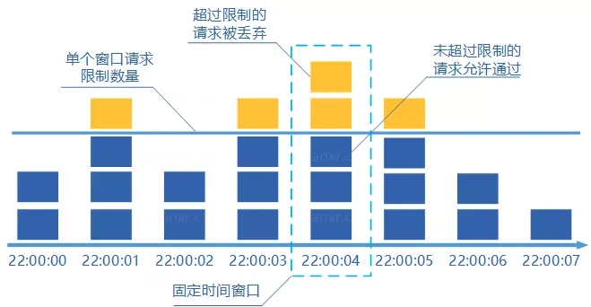
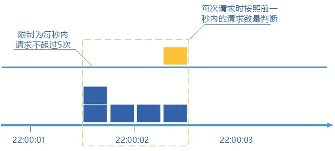

# 限流

在分布式系统中，限流是一种关键的容错策略，旨在通过控制进入系统的请求流量，防止系统因过载而崩溃或性能下降，其核心目标是在高负载情况下保障系统关键组件的可用性，同时确保大部分用户的请求能得到及时响应。以下从原理、常见策略、算法、应用场景及实施要点五个方面展开介绍：

## 一、限流原理
限流通过设置流量阈值，对超出阈值的请求采取拒绝、排队或延迟处理等措施，避免系统资源被耗尽。其本质是“量力而行”，确保系统处理能力与请求量匹配，防止因突发流量或恶意攻击导致服务不可用。

## 二、常见限流策略
1. **拒绝服务**
    - **直接拒绝**：当请求量超过阈值时，立即返回错误响应（如HTTP 429状态码），拒绝后续请求。
    - **优先级拒绝**：根据用户身份、请求类型等优先级，优先保障核心用户或服务的请求，拒绝低优先级请求。
    - **客户端限流**：统计客户端请求频率，对异常高频请求的客户端直接拒绝，防止恶意攻击。

2. **服务降级**
    - **关闭非核心功能**：在系统压力过大时，暂时关闭非核心服务（如日志记录、数据分析等），释放资源给核心功能。
    - **简化服务逻辑**：降低服务质量或精度（如减少数据刷新频率、返回缓存数据），以减少资源消耗。
    - **异步处理**：将实时性要求不高的功能改为异步任务（如订单确认邮件发送），避免阻塞主流程。

3. **延时处理**
    - **队列缓冲**：使用消息队列（如Kafka、RabbitMQ）缓冲请求，系统按自身负载能力异步消费队列中的请求。
    - **定时任务**：将非实时请求延迟到系统低峰期处理（如数据备份、报表生成）。

4. **弹性伸缩**
    - **自动化扩容**：结合云原生技术（如Kubernetes），根据流量动态调整服务实例数量，提升系统处理能力。
    - **负载均衡**：通过负载均衡器（如Nginx、LVS）将请求均匀分配到多个服务节点，避免单点过载。

## 三、限流算法
1. **固定窗口算法**
    - **原理**：将时间划分为固定窗口（如1秒），每个窗口内允许通过的请求数量有固定上限。
    - **缺点**：窗口切换时可能出现“突刺”现象（即前一窗口末尾和后一窗口初期的请求叠加，导致瞬间流量超限）。
    - 

2. **滑动窗口算法**
    - **原理**：窗口随时间滑动，统计最近一段时间（如1秒内）所有子窗口的请求总数，超过阈值则拒绝请求。
    - **优点**：平滑处理请求流量，避免固定窗口的“突刺”问题，适用于高并发场景。
    - 

3. **漏桶算法**
    - **原理**：使用一个“漏桶”缓冲请求，无论请求到达速率如何，均以固定速率处理请求，多余请求排队或拒绝。
    - **应用场景**：需要严格控制处理速率的场景（如网络传输、API调用限流）。
    - 

4. **令牌桶算法**
    - **原理**：以固定速率向桶中添加令牌，请求需获取令牌才能被处理，无令牌则拒绝或等待。
    - **优点**：允许突发流量（桶中积累的令牌可快速处理突发请求），适用于需要灵活应对流量波动的场景。
    - 

## 四、应用场景
1. **防范流量攻击**：通过限流阻止恶意用户或爬虫的异常高频请求，保护系统安全。
2. **应对突发流量**：在秒杀、促销等场景下，防止流量洪峰冲垮系统，保障核心交易流程稳定。
3. **保护下游服务**：当依赖的下游服务（如数据库、第三方API）性能下降时，通过限流避免请求堆积导致雪崩效应。
4. **多租户隔离**：在SaaS等场景下，为不同租户分配独立流量配额，防止单个租户占用过多资源影响其他用户。

## 五、实施要点
1. **合理设置阈值**：需评估系统及下游服务的承受能力，避免阈值过低影响用户体验，或过高导致系统崩溃。
2. **动态调整策略**：结合监控数据（如QPS、响应时间、错误率）动态调整限流阈值，实现自适应限流。
3. **监控与报警**：实时监控限流策略的执行情况，设置报警机制，及时发现并处理异常流量。
4. **用户体验优化**：限流时返回友好提示（如“系统繁忙，请稍后再试”），并提供重试机制或降级服务，减少对用户的影响。