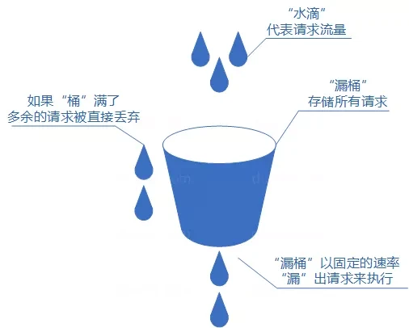

# Rate Limiting

限流是一种用于控制系统资源访问速率的技术，通过限制单位时间内允许的请求数量或操作频率，防止系统因突发流量或恶意攻击而过载，确保服务稳定性和可用性。以下是限流的核心介绍：

## 一、限流的核心目的
1. **防止系统崩溃**  
   避免因流量激增（如秒杀、抢购、DDoS攻击）导致服务器资源耗尽（CPU、内存、带宽等），引发服务不可用。
2. **保障公平性**  
   防止单个用户或服务占用过多资源，确保所有用户能公平使用系统。
3. **控制成本**  
   减少因过量请求导致的计算资源浪费，降低运维成本。
4. **提升用户体验**  
   通过优雅降级（如返回友好错误提示）避免系统无响应，提升用户感知。

## 二、常见限流算法
1. **固定窗口计数器（Fixed Window）**
    - 将时间划分为固定窗口（如每秒），统计窗口内请求数，超过阈值则拒绝新请求。
    - **缺点**：窗口边界可能出现流量突增（如前一秒末和后一秒初的请求叠加）。
    - 

2. **滑动窗口计数器（Sliding Window）**
    - 动态计算当前时间窗口内的请求数，避免固定窗口的边界问题。
    - **示例**：若限流100次/分钟，则统计最近60秒内的请求总数。
    - 

3. **漏桶算法（Leaky Bucket）**
    - 请求以固定速率处理，超出部分排队等待（类似漏桶漏水）。
    - **特点**：平滑突发流量，但可能增加延迟。
    - 

4. **令牌桶算法（Token Bucket）**
    - 系统按固定速率生成令牌，请求需获取令牌才能执行，超出部分拒绝或排队。
    - **特点**：允许一定程度的突发流量（如令牌桶容量为100，可瞬间处理100个请求）。
    - 

## 三、限流的应用场景
1. **API接口限流**
    - 防止第三方滥用API（如每分钟限制100次调用）。
2. **微服务架构**
    - 服务间调用限流，避免链式故障（如服务A调用服务B超时，导致服务A资源耗尽）。
3. **数据库访问**
    - 限制并发查询数，防止数据库连接池耗尽。
4. **消息队列**
    - 控制消费者处理速度，避免消息堆积。
5. **Web应用**
    - 防止爬虫或恶意刷接口（如登录接口限制每秒5次）。

## 四、限流的实现方式
1. **代码层面**
    - 使用Guava RateLimiter（令牌桶）、Redis计数器等工具实现。
2. **中间件**
    - **Nginx**：通过`limit_req`模块限制请求速率。
    - **Spring Cloud Gateway**：内置限流过滤器（基于Redis或内存）。
    - **Kong/Envoy**：API网关支持插件化限流。
3. **云服务**
    - AWS API Gateway、阿里云API网关等提供开箱即用的限流功能。

## 五、限流的策略与配置
1. **阈值设定**
    - 根据系统承载能力（如QPS、并发数）和业务需求设置合理阈值。
2. **动态调整**
    - 根据实时监控数据（如CPU使用率、响应时间）动态调整限流阈值。
3. **降级策略**
    - 超过阈值时返回`429 Too Many Requests`或跳转到降级页面。
4. **白名单与黑名单**
    - 对关键用户或IP豁免限流，或对恶意用户强制限流。

## 六、限流的常见的问题
1. **阈值选择**
    - 过低影响正常用户，过高无法起到保护作用。
2. **分布式环境**
    - 多节点限流需同步状态（如使用Redis分布式锁或计数器）。
3. **突发流量处理**
    - 需平衡系统稳定性与用户体验（如令牌桶允许短暂突发）。

## 七、常见场景
- **电商秒杀**：限制每秒1000个请求，超出部分排队或拒绝。
- **社交平台**：用户每分钟最多发送10条消息，防止刷屏。
- **金融系统**：交易接口限制每秒500笔，避免数据库锁冲突。

### 八、总结
限流是系统高可用设计的核心手段之一，需结合业务场景选择合适的算法和工具，并通过监控和调优持续优化。合理限流既能保护系统，又能提升用户体验，是技术架构中不可或缺的一环。