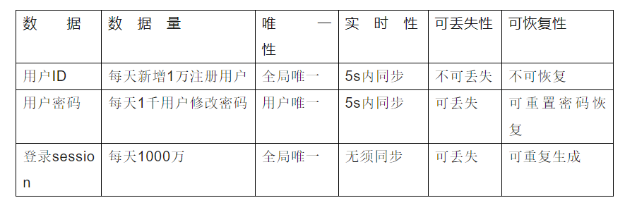
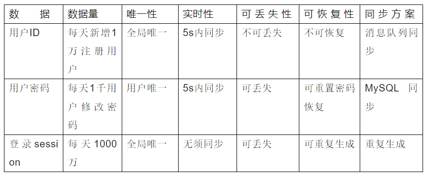
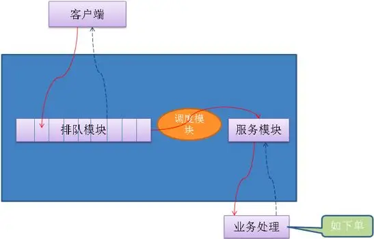

# 冗余设计/集群

1. 对于*服务8来说，冗余的思想就是相同的服务部署多份，如果正在使用的服务突然挂掉的话，系统可以很快切换到备份服务上，大大减少系统的不可用时间，提高系统的可用性。
2. 对于*数据*来说，冗余的思想就是相同的数据备份多份，这样就可以很简单地提高数据的安全性。
、
## 灾备设计和异地多活典型应用

### 高可用集群
一份服务部署两份或者多份，当正在使用的服务突然挂掉的话，可以切换到另外一台服务，从而保证服务的高可用。

## 同城灾备
一整个集群可以部署在同一个机房，而同城灾备中相同服务部署在同一个城市的不同机房中。并且，备用服务不处理请求。这样可以避免机房出现意外情况比如停电、火灾。

## 异地灾备
类似于同城灾备，不同的是，相同服务部署在异地（通常距离较远，甚至是在不同的城市或者国家）的不同机房中

## 同城多活
类似于同城灾备，但备用服务可以处理请求，这样可以充分利用系统资源，提高系统的并发。

## 异地多活
将服务部署在异地的不同机房中，并且，它们可以同时对外提供服务。

### 四步构建异地多活
1. 业务分级
按照一定的标准将业务进行分级，挑选出核心的业务，只为核心业务设计异地多活，降低方案整体复杂度和实现成本。
*分级标准*:
    1. 访问量大的业务
    2. 核心业务
    3. 产生大量收入的业务

2. 数据分类
挑选出核心业务后，需要对核心业务相关的数据进行进一步分析，目的在于识别所有的数据及数据特征，这些数据特征会影响后面的方案设计。
*数据特征分析维度*:
    1. 数据量 
    2. 唯一性
    3. 实时性 
    4. 可丢失性
    5. 可恢复性

*示例*:  

3. 数据同步
根据不同的数据设计不同的同步方案
方案；
    1. 存储系统同步
这是最常用也是最简单的同步方式。例如，使用MySQL的数据主从数据同步、主主数据同步。
    2. 消息队列同步
采用独立消息队列进行数据同步，常见的消息队列有Kafka、ActiveMQ、RocketMQ等。
    3. 重复生成
数据不同步到异地机房，每个机房都可以生成数据，这个方案适合于可以重复生成的数据。例如，登录产生的cookie、session数据及缓存数据等。

4. 异常处理
无论数据同步方案如何设计，一旦出现极端异常的情况，总是会有部分数据出现异常的。例如，同步延迟、数据丢失、数据不一致等。异常处理就是假设在出现这些问题时，系统将采取什么措施来应对。
## 异常处理的目的
问题发生时，避免少量数据异常导致整体业务不可用。
问题恢复后，将异常的数据进行修正。
对用户进行安抚，弥补用户损失。
## 异常处理措施
### 多通道同步
多通道同步的含义是采取多种方式来进行数据同步，其中某条通道故障的情况下，系统可以通过其他方式来进行同步，这种方式可以应对同步通道处故障的情况。
*方案的设计关键点*；
1. 一般情况下，采取两通道即可，采取更多通道理论上能够降低风险，但付出的成本也会增加很多。 
2. 数据库同步通道和消息队列同步通道不能采用相同的网络连接，否则一旦网络故障，两个通道都同时故障；可以一个走公网连接，一个走内网连接。。 
3. 需要数据是可以重复覆盖的，即无论哪个通道先到哪个通道后到，最终结果是一样的。例如，新建账号数据就符合这个标准，而密码数据则不符合这个标准
### 同步和访问结合
这里的访问指异地机房通过系统的接口来进行数据访问。
*方案的设计关键点*:
1. 接口访问通道和数据库同步通道不能采用相同的网络连接，不能让数据库同步和接口访问都走同一条网络通道，可以采用接口访问走公网连接，数据库同步走内网连接这种方式。 
2. 数据有路由规则，可以根据数据来推断应该访问哪个机房的接口来读取数据。例如，有3个机房A、B、C，B机房拿到一个不属于B机房的数据后，需要根据路由规则判断是访问A机房接口，还是访问C机房接口。 
3. 由于有同步通道，优先读取本地数据，本地数据无法读取到再通过接口去访问，这样可以大大降低跨机房的异地接口访问数量，适合于实时性要求非常高的数据。
### 日志记录
日志记录主要用于故障恢复后对数据进行恢复，通过在每个关键操作前后都记录相关日志，然后将日志保存在一个独立的地方，当故障恢复后，拿出日志跟数据进行对比，对数据进行修复。
*常见的日志保存方式*:
1. 服务器上保存日志，数据库中保存数据，这种方式可以应对单台数据库服务器故障或宕机的情况。 
2. 本地独立系统保存日志，这种方式可以应对某业务服务器和数据库同时宕机的情况。例如，服务器和数据库部署在同一个机架，或者同一个电源线路上，就会出现服务器和数据库同时宕机的情况。 
3. 日志异地保存，这种方式可以应对机房宕机的情况。
### 用户补偿
无论采用什么样的异常处理措施，都只能最大限度地降低受到影响的范围和程度，无法完全做到没有任何影响。例如，双同步通道有可能同时出现故障，日志记录方案本身日志也可能丢失。因此，无论多么完美的方案，故障的场景下总是可能有一小部分用户业务上出问题，系统无法弥补这部分用户的损失。但我们可以采用人工的方式对用户进行补偿，弥补用户损失，培养用户的忠诚度。简单来说，系统的方案是为了保证99.99%的用户在故障的场景下业务不受影响，人工的补偿是为了弥补0.01%的用户的损失。
常见的补偿措施有送用户代金券、礼包、礼品、红包等，有时为了赢得用户口碑，付出的成本可能还会比较大，但综合最终的收益来看还是很值得的
## 接口级的故障应对方案
异地多活架构主要应对系统级的故障。例如，机器宕机、机房故障、网络故障等问题。这些系统级的故障虽然影响很大，但发生概率较小。实际业务运行过程中，还有另外一种故障影响可能没有系统级那么大，但发生的概率较高，这就是接口级的故障。
*导致接口级故障的原因*:
1. *内部原因*:程序bug导致死循环，某个接口导致数据库慢查询，程序逻辑不完善导致耗尽内存，等等。
2. *外部原因*:黑客攻击、促销或抢购引入了超出平时几倍甚至几十倍的用户，第三方系统大量请求，第三方系统响应缓慢，等等。
*措施*:
1. 限流
2. 降级&熔断
3. 排队
排队实际上是限流的一个变种，限流是直接拒绝用户，排队是让用户等待很长时间  
排队系统架构:  

