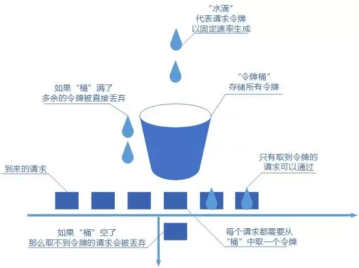

# 限流

限流就是对请求的速率进行限制，避免瞬时的大量请求击垮软件系统

## 常见限流算法有哪些？
### 固定窗口计数器算法

*优点*：实现简单，易于理解。
*缺点*:
1. 限流不够平滑。例如，我们限制某个接口每分钟只能访问30次，假设前30秒就有30个请求到达的话，那后续30秒将无法处理请求，这是不可取的，用户体验极差！
2. 无法保证限流速率，因而无法应对突然激增的流量。例如，我们限制某个接口1分钟只能访问1000次，该接口的QPS为500，前55s这个接口1个请求没有接收，后1s突然接收了1000个请求。然后，在当前场景下，这1000个请求在1s内是没办法被处理的，系统直接就被瞬时的大量请求给击垮了。

### 滑动窗口计数器算法

固定窗口计数器算法的升级版，限流的颗粒度更小
*优点*：
相比于固定窗口算法，滑动窗口计数器算法可以应对突然激增的流量。
相比于固定窗口算法，滑动窗口计数器算法的颗粒度更小，可以提供更精确的限流控制。
*缺点*：
与固定窗口计数器算法类似，滑动窗口计数器算法依然存在限流不够平滑的问题。
相比较于固定窗口计数器算法，滑动窗口计数器算法实现和理解起来更复杂一些。

### 漏桶算法

*优点*：
实现简单，易于理解。
可以控制限流速率，避免网络拥塞和系统过载。
*缺点*：
无法应对突然激增的流量，因为只能以固定的速率处理请求，对系统资源利用不够友好。
桶流入水（发请求）的速率如果一直大于桶流出水（处理请求）的速率的话，那么桶会一直是满的，一部分新的请求会被丢弃，导致服务质量下降。
实际业务场景中，基本不会使用漏桶算法。

### 令牌桶算法

*优点*：
可以限制平均速率和应对突然激增的流量。
可以动态调整生成令牌的速率。
*缺点*：
如果令牌产生速率和桶的容量设置不合理，可能会出现问题比如大量的请求被丢弃、系统过载。
相比于其他限流算法，实现和理解起来更复杂一些。

##针对什么来进行限流？
1. *IP8：针对IP进行限流，适用面较广，简单粗暴。 
2. *业务ID*：挑选唯一的业务ID以实现更针对性地限流。例如，基于用户ID进行限流。 
3. *个性化8：根据用户的属性或行为，进行不同的限流策略。例如，VIP用户不限流，而普通用户限流。根据系统的运行指标（如QPS、并发调用数、系统负载等），动态调整限流策略。例如，当系统负载较高的时候，控制每秒通过的请求减少。
## 单机限流怎么做？
单机限流可以直接使用GoogleGuava自带的限流工具类RateLimiter。RateLimiter基于令牌桶算法，可以应对突发流量。
33 分布式限流怎么做？
1. 常见的方案:
   1. *借助中间件架限流*：可以借助Sentinel或者使用Redis来自己实现对应的限流逻辑。
   2. *网关层限流*： 比较常用的一种方案，直接在网关层把限流给安排上了。不过，通常网关层限流通常也需要借助到中间件/框架。就比如SpringCloudGateway的分布式限流实现RedisRateLimiter就是基于Redis+Lua来实现的，再比如SpringCloudGateway还可以整合Sentinel来做限流。

2. 如果基于Redis来手动实现限流逻辑的话，建议配合Lua脚本来做。  
*为什么建议Redis+Lua的方式？*
   1. 8减少了网络开销8：我们可以利用Lua脚本来批量执行多条Redis命令，这些Redis命令会被提交到Redis服务器一次性执行完成，大幅减小了网络开销。
   2. *原子性*：一段Lua脚本可以视作一条命令执行，一段Lua脚本执行过程中不会有其他脚本或Redis命令同时执行，保证了操作不会被其他指令插入或打扰。

3. Apache网关项目ShenYu的RateLimiter限流插件就基于Redis+Lua实现了令牌桶算法/并发令牌桶算法、漏桶算法、滑动窗口算法

