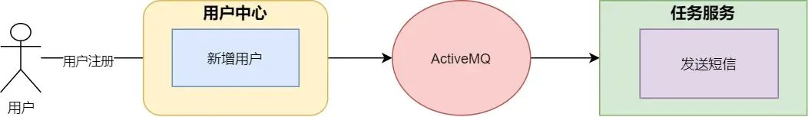
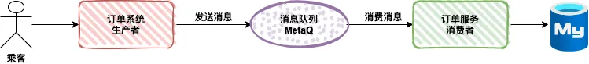
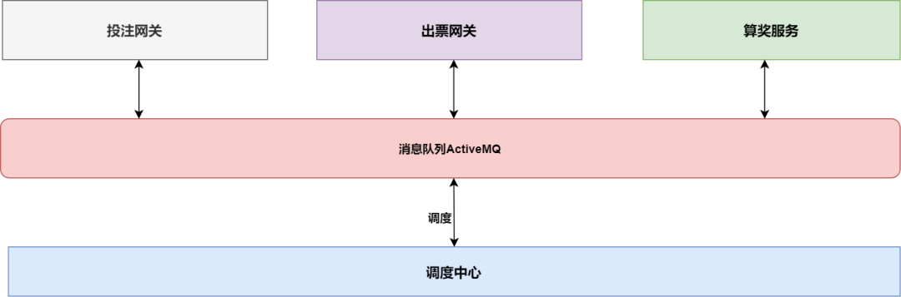
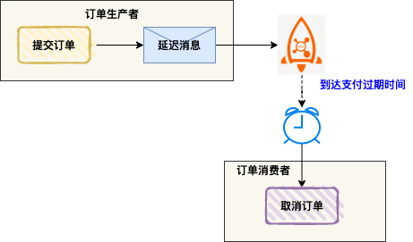
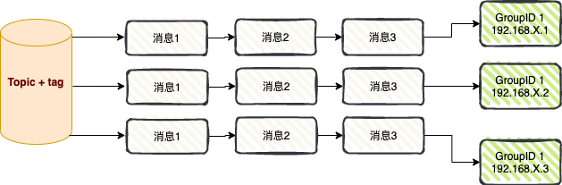
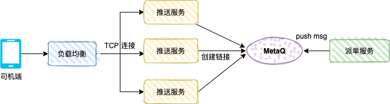
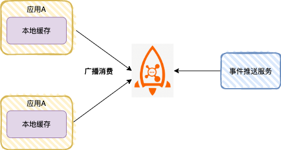
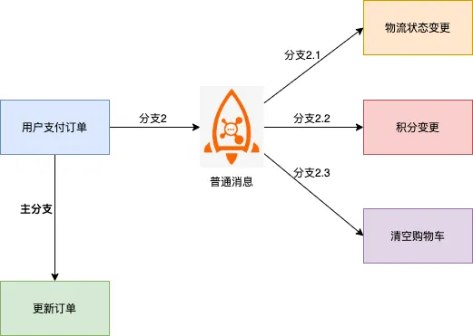
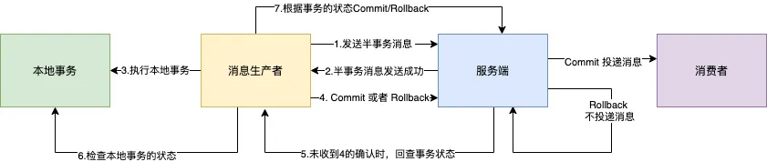
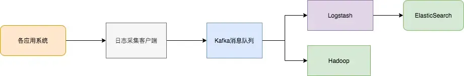

# 消息队列

消息队列看作是一个存放消息的容器，当需要使用消息的时候，直接从容器中取出消息使用。由于队列 Queue 是一种先进先出的数据结构，所以消费消息时也是按照顺序来消费的。

## 消息队列的组成
- **Broker**：消息服务器，作为server提供消息核心服务。
- **Producer**：消息生产者，业务的发起方，负责生产消息传输给broker。
- **Consumer**：消息消费者，业务的处理方，负责从broker获取消息并进行业务逻辑处理。
- **Topic**：主题，发布订阅模式下的消息统一汇集地，不同生产者向topic发送消息，由MQ服务器分发到不同的订阅者，实现消息的广播。
- **Queue**：队列，PTP模式下，特定生产者向特定queue发送消息，消费者订阅特定的queue完成指定消息的接收。
- **Message**：消息体，根据不同通信协议定义的固定格式进行编码的数据包，来封装业务数据，实现消息的传输。

---

## 常见消息队列对比

| 特性                  | ActiveMQ                   | RabbitMQ                      | RocketMQ                                                               | Kafka                                                                                | Pulsar                                                                                    |
|---------------------|----------------------------|-------------------------------|------------------------------------------------------------------------|--------------------------------------------------------------------------------------|-------------------------------------------------------------------------------------------|
| **单机吞吐量**           | 万级，比 RocketMQ、Kafka 低一个数量级 | 万级，比 RocketMQ、Kafka 低一个数量级    | 10 万级，支撑高吞吐                                                            | 10 万级，高吞吐，一般配合大数据类的系统来进行实时数据计算、日志采集等场景                                               | 10 万级                                                                                     |
| **topic 数量对吞吐量的影响** | -                          | -                             | topic 可以达到几百/几千的级别，吞吐量会有较小幅度的下降，这是 RocketMQ 的一大优势，在同等机器下，可以支撑大量的 topic | topic 从几十到几百个时候，吞吐量会大幅度下降，在同等机器下，Kafka 尽量保证 topic 数量不要过多，如果要支撑大规模的 topic，需要增加更多的机器资源 | 可无缝扩展到超过一百万个 topic，Pulsar 的吞吐量不会因分区数量的增加和持久性级别的改变而受到影响，而 Kafka 的吞吐量会因分区数量或持久性级别的改变而受到严重影响 |
| **时效性**             | ms 级                       | 微秒级，这是 RabbitMQ 的一大特点，延迟最低    | ms 级                                                                   | ms 级                                                                                 | ms 级                                                                                      |
| **可用性**             | 高，基于主从架构实现高可用              | 同 ActiveMQ                    | 非常高，分布式                                                                | 非常高，分布式，一个数据多个副本，少数机器宕机，不会丢失数据，不会导致不可用                                               | 非常高，分布式，单个实例原生支持多个集群，可跨机房在集群间无缝地完成消息复制                                                    |
| **消息可靠性**           | 有较低的概率丢失数据                 | 基本不丢                          | 经过参数优化配置，理论上可以做到 0 丢失                                                  | 经过参数优化配置，理论上可以做到 0 丢失                                                                | 经过参数优化配置，理论上可以做到 0 丢失                                                                     |
| **功能支持**            | MQ 领域的功能极其完备               | 基于 erlang 开发，并发能力很强，性能极好，延时很低 | MQ 功能较为完善，还是分布式的，扩展性好                                                  | 功能较为简单，主要支持简单的 MQ 功能，在大数据领域的实时计算以及日志采集被大规模使用                                         | Pulsar 是第一个将存储计算分离云原生架构落地的开源项目。Pulsar 的功能更全面，支持多租户、多种消费模式和持久性模式等功能，是下一代云原生分布式消息流平台        |
| **业务场景**            | -                          | -                             | 可靠消息传输                                                                 | 适合产生大量数据的互联网服务的数据收集业务                                                                | 对数据一致性、稳定性和可靠性要求很高（根据功能描述推断补充）                                                            |

---

## 使用消息队列会产生的问题
- **系统可用性降低**：系统可用性在某种程度上降低，在加入 MQ 之前，不用考虑消息丢失或者说 MQ 挂掉等等的情况
- **系统复杂性提高**：加入 MQ 之后需要保证消息没有被重复消费、处理消息丢失的情况、保证消息传递的顺序性等问题
- **一致性问题**：消息队列可以实现异步，消息队列带来的异步确实可以提高系统响应速度，但是如果消息的真正消费者并没有正确消费消息

---

## JMS 和 AMQP

JMS（Java Message Service）和 AMQP（Advanced Message Queuing Protocol） 共同构成了消息队列技术的生态体系

> - 消息队列是“汽车”，JMS/AMQP 是“驾驶手册”（规范）或“交通规则”（协议）。 
> - JMS 告诉 Java 开发者如何“开车”（调用接口），AMQP 规定所有车（不同语言客户端）如何“在路上行驶”（通信规则）。

---

## 应用场景

### 异步&解耦

### 消峰

### 消息总线

### 延时任务
用户在美团 APP 下单，假如没有立即支付，进入订单详情会显示倒计时，如果超过支付时间，订单就会被自动取消

### 广播消费

#### 消息推送
专车的司机端推送机制

#### 缓存同步
高并发场景

### 分布式事务
1. 传统XA事务方案：性能不足

2. 基于普通消息方案：一致性保障困难  

3. 基于 RocketMQ 分布式事务消息：支持最终一致性  

### 数据中转枢纽
