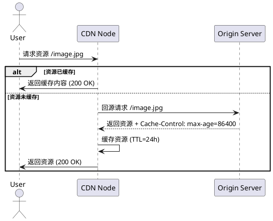
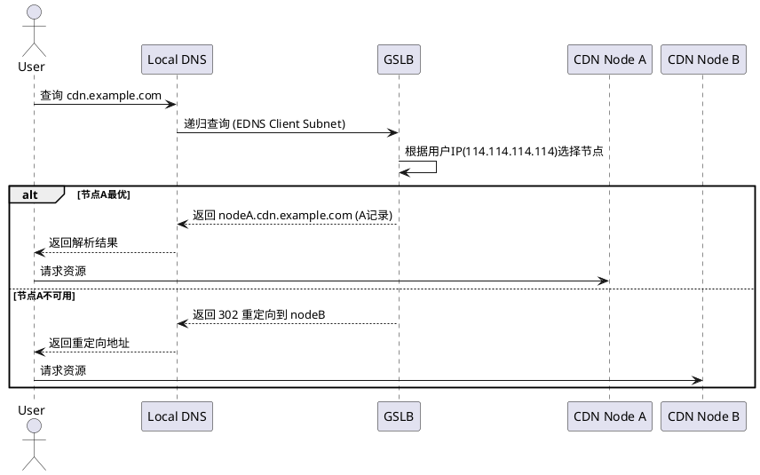

# CDN

Content Delivery Network/Content Distribution Network 内容分发网络

| 对比项  | CDN                                                   | 全站加速                                                                                                                                                                   |
|------|-------------------------------------------------------|------------------------------------------------------------------------------------------------------------------------------------------------------------------------|
| 加速资源 | 加速静态资源                                                | 同时加速静态和动态资源。                                                                                                                                                           |
| 加速方式 | 支持静态加速。将服务器上的图片、视频等静态资源缓存在CDN边缘节点供用户从最近的节点获取静态资源。     | 支持纯动态加速和动静态混合加速： ●纯动态加速 针对POST请求等不能在边缘缓存的业务，基于智能选路技术，从众多回源线路中择优选择一条线路进行传输。 ●动静态混合加速 智能识别动态和静态资源，静态资源缓存在边缘节点，供用户就近访问；动态资源基于智能选路技术，从众多回源线路中择优选择一条线路进行传输。 |
| 协议支持 | 支持HTTP、HTTPS。                                         | 支持HTTP、HTTPS、TCP、UDP、Websocket。                                                                                                                                        |
| 源站适配 | 不能区分动态和静态资源。您需要自行分离动态和静态资源，静态资源使用CDN加速， 动态资源无法被CDN加速。 | 智能区分动态和静态资源。无需分离动态和静态资源，全站加速支持智能区分动态和静态资源并分别加速。                                                                                                                        |
| 边缘计算 | 支持在边缘节点使用JavaScript构建边缘程序，例如A/B Test、预热等              | 支持在边缘节点和回源侧构建全链路的边缘计算，场景更加丰富，例如A/B Test、回源URI改写、封禁拦截等。                                                                                                                 |

## 工作原理

### 静态资源缓存到 CDN 节点中

#### 工作流程
1. 资源预取/主动推送
> 主动推送：管理员通过 CDN 控制台或 API 将静态资源（如图片、CSS、JS）上传至 CDN 边缘节点。  
> 被动回源：用户首次请求资源时，CDN 节点回源站（Origin Server）拉取资源并缓存到本地。
2. 缓存策略
> TTL（Time to Live）：设置缓存有效期（如 24 小时），过期后节点自动回源更新。
> 缓存键（Cache Key）：基于 URL 生成唯一标识，确保相同资源不被重复缓存。
> 分层缓存：热点资源存储在 SSD，冷门资源降级到 HDD 或云存储。
3. 缓存更新
> 源站更新：管理员修改源站资源后，通过 CDN 提供的 缓存刷新接口 主动清除旧缓存。
> 自动失效：节点检测到资源过期后，下次请求时重新回源。

#### 时序图

### 找到最合适的 CDN 节点
#### 节点选择机制
1. DNS解析调度
> 用户访问域名（如 cdn.example.com）时，本地 DNS 服务器向 CDN 的 权威 DNS（GSLB） 发起查询。  
> GSLB 根据用户 IP、网络质量、节点负载等因素，返回最优节点的 CNAME（如 node123.cdn.example.com）。
2. 智能路由算法
> 地理就近：优先选择距离用户物理位置最近的节点。  
> 网络质量：通过实时探测（如 ICMP Ping、TCP 握手延迟）选择低延迟节点。  
> 负载均衡：避开高负载节点，确保服务可用性。 
> 协议优化：对 HTTP/2、QUIC 等协议提供专项加速通道。
3. 302 重定向（备用方案）
> 若初始节点不可用，返回 302 状态码，将用户重定向到次优节点。

#### 时序图

## 防止静态资源被盗用
1. Referer 防盗链:配置 Request Header 中 referer 黑白名单，从而限制来源。
2. 时间戳防盗链:设置密钥，配合签名过期时间来控制资源内容的访问时限。
3. 回源鉴权:配置回源验证策略，对 CDN 接受到的访问请求进行鉴权，适用于对防盗链有很高实时性要求的场景。
4. IP 黑白名单:允许或禁止某些 IP 或 IP 段的访问，帮助您解决恶意 IP 盗刷、攻击等问题。
6. 最简单的办法:Referer 防盗链 和 时间戳防盗链