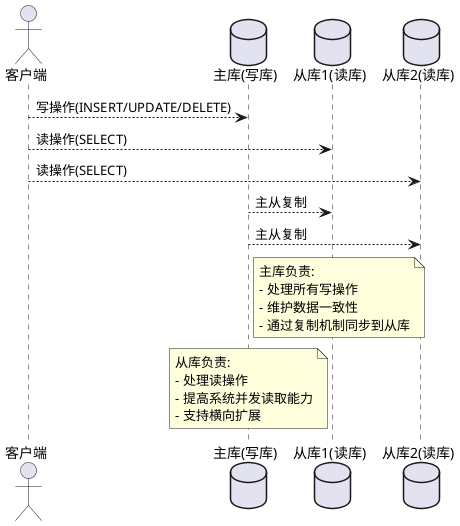
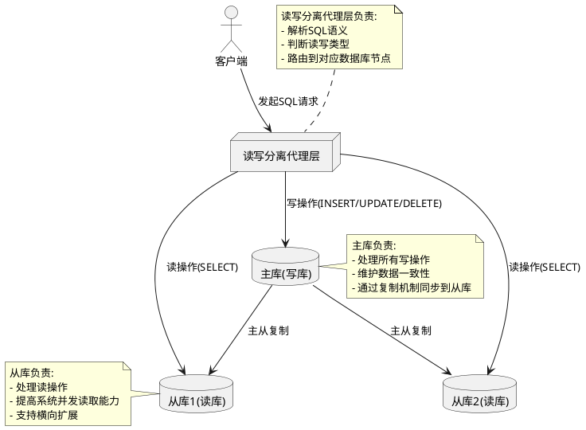

# 数据库读写分离

## 什么是读写分离

读写分离主要是为了将对数据库的读写操作分散到不同的数据库节点上。
- 小幅提升写性能，大幅提升读性能。 
- 一般情况下会选择一主多从，也就是一台主数据库负责写，其他的从数据库负责读。主库和从库之间会进行数据同步，以保证从库中数据的准确性。这样的架构实现起来比较简单，并且也符合系统的写少读多的特点。

## 现读写分离

### 读写分离步骤
1. 部署多台数据库，选择其中的一台作为主数据库，其他的一台或者多台作为从数据库。 
2. 保证主数据库和从数据库之间的数据是实时同步的，这个过程也就是我们常说的主从复制。 
3. 系统将写请求交给主数据库处理，读请求交给从数据库处理。

### 读写分离方式
#### 代理方式

在应用和数据中间加了一个代理层。应用程序所有的数据请求都交给代理层处理，代理层负责分离读写请求，将它们路由到对应的数据库中。
提供类似功能的中间件有 MySQL Router（官方， MySQL Proxy 的替代方案）、Atlas（基于 MySQL Proxy）、MaxScale、MyCat。
#### 组件方式
通过引入第三方组件来帮助进行读写请求。 例如使用 sharding-jdbc 进行读写分离的操作