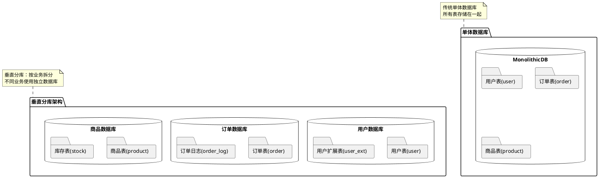
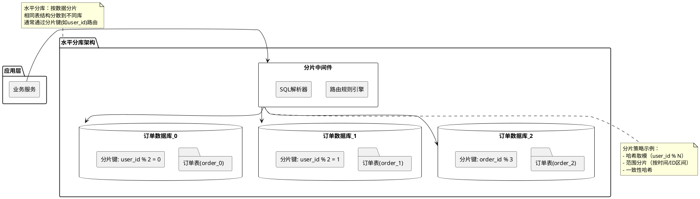
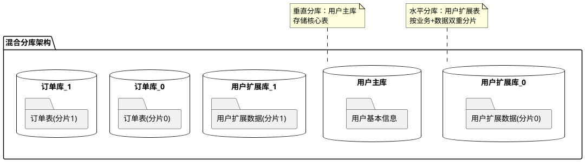
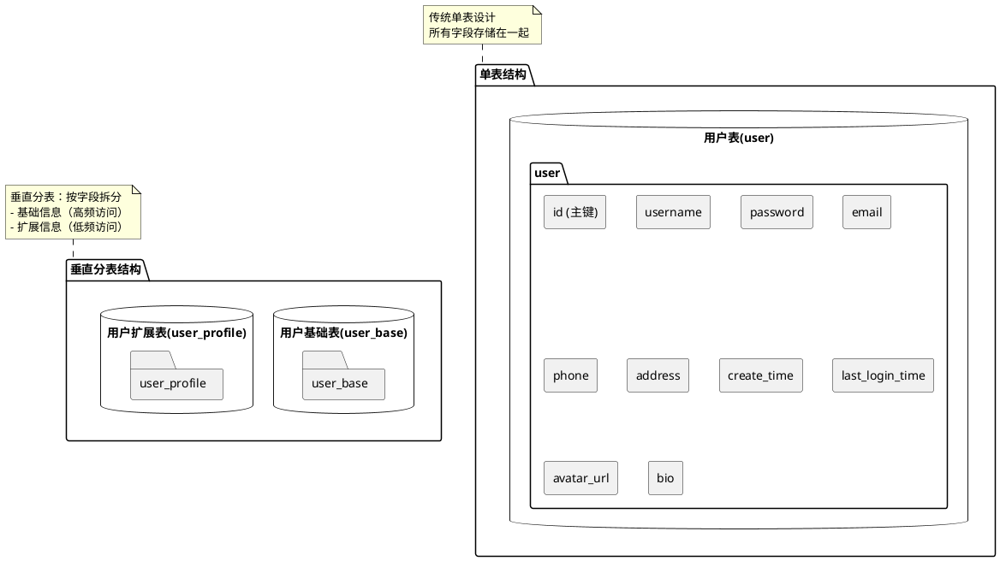
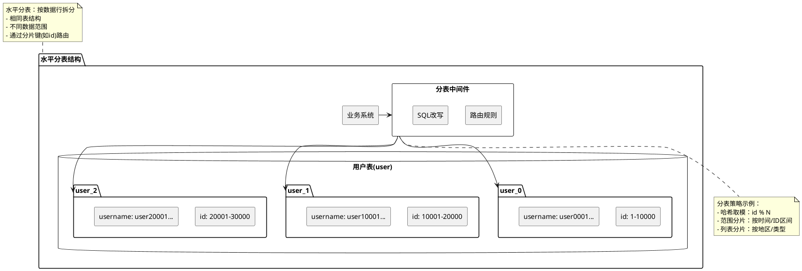
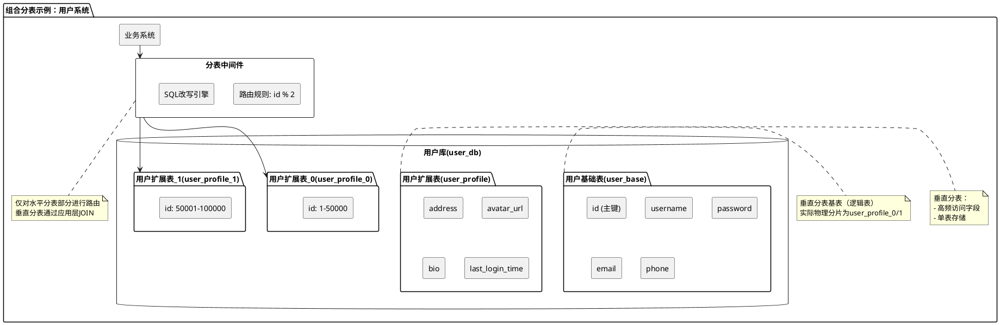

# 数据库分库分表

## 什么是分库
分库就是将数据库中的数据分散到不同的数据库上，可以垂直分库，也可以水平分库。

### 垂直分库
是把同一个表按一定规则拆分到不同的数据库中，每个库可以位于不同的服务器上，这样就实现了水平扩展，解决了单表的存储和性能瓶颈的问题。

垂直分库特点：
- 按业务维度拆分（如用户、订单、商品各自独立） 
- 每个库存储不同业务的表 
- 拆分后库结构不同（表结构无重叠） 
- 就是把单一数据库按照业务进行划分，不同的业务使用不同的数据库，进而将一个数据库的压力分担到多个数据库。

### 水平分库
是把同一个表按一定规则拆分到不同的数据库中，每个库可以位于不同的服务器上，这样就实现了水平扩展，解决了单表的存储和性能瓶颈的问题。

水平分库特点：
- 按数据维度拆分（如用户ID哈希、时间范围等） 
- 每个库的表结构相同，存储不同数据片段 
- 需要分片中间件管理路由规则

### 组合方案（垂直+水平）

### 垂直分库和水平分库区别

| **维度**   | 垂直分库      | 水平分库           |
|----------|-----------|----------------|
| **拆分依据** | 业务领域（不同表） | 数据特征（相同表的不同数据） |
| **库结构**  | 不同        | 相同             |
| **典型场景** | 业务解耦      | 数据扩容           |
| **复杂度**  | 较低        | 较高（需路由中间件）     |

## 什么是分表
分表就是对单表的数据进行拆分，可以是垂直拆分，也可以是水平拆分。

### 垂直分表
是对数据表列的拆分，把一张列比较多的表拆分为多张表。

垂直分表特点：
- 按字段频率拆分（如高频访问字段 vs 低频访问字段） 
- 通过id关联两张表（1:1关系） 
- 典型场景：解决单表字段过多问题

### 水平分表
是对数据表行的拆分，把一张行比较多的表拆分为多张表，可以解决单一表数据量过大的问题。

水平分表特点：
- 按数据行拆分（如ID范围、哈希值等） 
- 所有分表结构完全相同 
- 需要中间件进行SQL路由和结果合并 
- 典型场景：解决单表数据量过大问题

### 组合方案（垂直+水平）

### 垂直分表和水平分表区别

| **维度**   | 垂直分表         | 水平分表       |
|----------|--------------|------------|
| **拆分依据** | 字段访问频率/业务相关性 | 数据量/分片键    |
| **表结构**  | 不同（字段子集）     | 完全相同       |
| **关联方式** | 通过主键ID关联     | 通过分片键路由    |
| **典型问题** | 解决"宽表"问题     | 解决"大表"问题   |
| **复杂度**  | 较低（简单JOIN）   | 较高（需中间件支持） |

## 什么情况下需要分库分表？
1. 单表的数据达到千万级别以上，数据库读写速度比较缓慢。 
2. 数据库中的数据占用的空间越来越大，备份时间越来越长。 
3. 应用的并发量太大（应该优先考虑其他性能优化方法，而非分库分表）。的拆分，把一张行比较多的表拆分为多张表，可以解决单一表数据量过大的问题。

## 常见的分片算法有哪些？
分片算法主要解决了数据被水平分片之后，数据究竟该存放在哪个表的问题。
1. 哈希分片
求指定分片键的哈希，然后根据哈希值确定数据应被放置在哪个表中。哈希分片比较适合随机读写的场景，不太适合经常需要范围查询的场景。哈希分片可以使每个表的数据分布相对均匀，但对动态伸缩（例如新增一个表或者库）不友好。
2. 范围分片
按照特定的范围区间（比如时间区间、ID 区间）来分配数据，比如 将 id 为 1~299999 的记录分到第一个表， 300000~599999 的分到第二个表。范围分片适合需要经常进行范围查找且数据分布均匀的场景，不太适合随机读写的场景（数据未被分散，容易出现热点数据的问题）。
3. 映射表分片
使用一个单独的表（称为映射表）来存储分片键和分片位置的对应关系。映射表分片策略可以支持任何类型的分片算法，如哈希分片、范围分片等。映射表分片策略是可以灵活地调整分片规则，不需要修改应用程序代码或重新分布数据。不过，这种方式需要维护额外的表，还增加了查询的开销和复杂度。
4. 一致性哈希分片
将哈希空间组织成一个环形结构，将分片键和节点（数据库或表）都映射到这个环上，然后根据顺时针的规则确定数据或请求应该分配到哪个节点上，解决了传统哈希对动态伸缩不友好的问题。
5. 地理位置分片
很多 NewSQL 数据库都支持地理位置分片算法，也就是根据地理位置（如城市、地域）来分配数据。
6. 融合算法分片
灵活组合多种分片算法，比如将哈希分片和范围分片组合。
7. ……

## 分片键如何选择？
分片键（Sharding Key）是数据分片的关键字段。分片键的选择非常重要，它关系着数据的分布和查询效率。一般来说，分片键应该具备以下特点：
1. 具有共性，即能够覆盖绝大多数的查询场景，尽量减少单次查询所涉及的分片数量，降低数据库压力；
2. 具有离散性，即能够将数据均匀地分散到各个分片上，避免数据倾斜和热点问题；
3. 具有稳定性，即分片键的值不会发生变化，避免数据迁移和一致性问题；
4. 具有扩展性，即能够支持分片的动态增加和减少，避免数据重新分片的开销。

## 分库分表会带来什么问题？
1. join 操作
   同一个数据库中的表分布在了不同的数据库中，导致无法使用 join 操作。这样就导致我们需要手动进行数据的封装，比如你在一个数据库中查询到一个数据之后，再根据这个数据去另外一个数据库中找对应的数据。不过，很多大厂的资深 DBA 都是建议尽量不要使用 join 操作。因为 join 的效率低，并且会对分库分表造成影响。对于需要用到 join 操作的地方，可以采用多次查询业务层进行数据组装的方法。不过，这种方法需要考虑业务上多次查询的事务性的容忍度。
2. 事务问题
   同一个数据库中的表分布在了不同的数据库中，如果单个操作涉及到多个数据库，那么数据库自带的事务就无法满足我们的要求了。这个时候就需要引入分布式事务了。
3. 分布式 ID
   分库之后， 数据遍布在不同服务器上的数据库，数据库的自增主键已经没办法满足生成的主键唯一了。如何为不同的数据节点生成全局唯一主键呢？这个时候就需要为系统引入分布式 ID 了。
4. 跨库聚合查询问题
   分库分表会导致常规聚合查询操作，如 group by，order by 等变得异常复杂。这是因为这些操作需要在多个分片上进行数据汇总和排序，而不是在单个数据库上进行。为了实现这些操作，需要编写复杂的业务代码，或者使用中间件来协调分片间的通信和数据传输。这样会增加开发和维护的成本，以及影响查询的性能和可扩展性。
5. ……