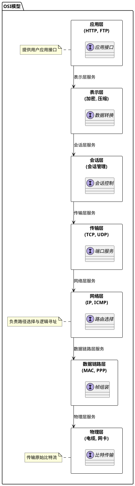
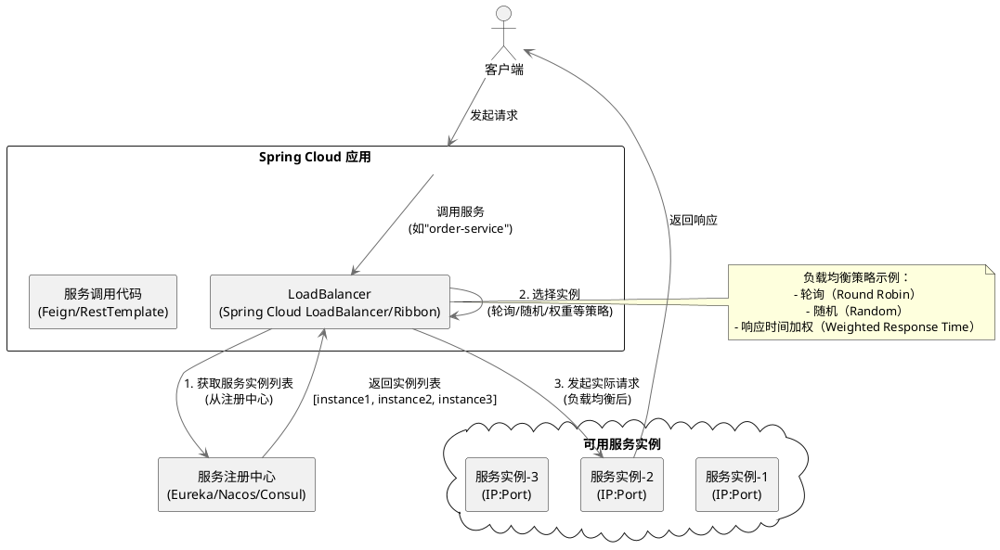

# 负载均衡

指的是将用户请求分摊到不同的服务器上处理，以提高系统整体的并发处理能力以及可靠性。负载均衡服务可以有由专门的软件或者硬件来完成，一般情况下，硬件的性能更好，软件的价格更便宜。

## 负载均衡分为哪几种？
负载均衡可以简单分为*服务端负载均衡*和*客户端负载均衡*这两种。
### 服务端负载均衡
主要应用在*系统外部请求*和*网关层*之间，可以使用*软件*或者*硬件*实现。

#### 硬件负载均衡和软件负载均衡
##### 硬件负载均衡
硬件负载均衡 通过专门的硬件设备（比如 F5、A10、Array ）实现负载均衡功能。  
硬件负载均衡的优势是性能很强且稳定，缺点就是实在是太贵了。像基础款的 F5 最低也要 20 多万，绝大部分公司是根本负担不起的，业务量不大的话，真没必要非要去弄个硬件来做负载均衡，用软件负载均衡就足够了！
##### 软件负载均衡
在我们日常开发中，一般很难接触到硬件负载均衡，接触的比较多的还是 软件负载均衡 。软件负载均衡通过软件（比如 LVS、Nginx、HAproxy ）实现负载均衡功能，性能虽然差一些，但价格便宜啊！像基础款的 Linux 服务器也就几千，性能好一点的 2~3 万的就很不错了。

### 根据 OSI 模型服务端负载均衡还可以分为二层负载均衡、三层负载均衡、四层负载均衡、七层负载均衡

最常见的是四层和七层负载均衡, 四层负载均衡性能很强, 七层负载均衡功能更强

#### 四层负载均衡
四层负载均衡 工作在 OSI 模型第四层，也就是传输层，这一层的主要协议是 TCP/UDP，负载均衡器在这一层能够看到数据包里的源端口地址以及目的端口地址，会基于这些信息通过一定的负载均衡算法将数据包转发到后端真实服务器。也就是说，四层负载均衡的核心就是 IP+端口层面的负载均衡，不涉及具体的报文内容。
#### 七层负载均衡
七层负载均衡 工作在 OSI 模型第七层，也就是应用层，这一层的主要协议是 HTTP 。这一层的负载均衡比四层负载均衡路由网络请求的方式更加复杂，它会读取报文的数据部分（比如说我们的 HTTP 部分的报文），然后根据读取到的数据内容（如 URL、Cookie）做出负载均衡决策。也就是说，七层负载均衡器的核心是报文内容（如 URL、Cookie）层面的负载均衡，执行第七层负载均衡的设备通常被称为 反向代理服务器 。

> 在工作中，我们通常会使用 Nginx 来做七层负载均衡，LVS(Linux Virtual Server 虚拟服务器， Linux 内核的 4 层负载均衡)来做四层负载均衡。

#### 七层负载均衡可以怎么做？
两种项目中常用的七层负载均衡解决方案：DNS 解析和反向代理。
##### DNS 解析
DNS 解析是比较早期的七层负载均衡实现方式，非常简单。  
DNS 解析实现负载均衡的原理是这样的：在 DNS 服务器中为同一个主机记录配置多个 IP 地址，这些 IP 地址对应不同的服务器。当用户请求域名的时候，DNS 服务器采用轮询算法返回 IP 地址，这样就实现了轮询版负载均衡。  
现在的 DNS 解析几乎都支持 IP 地址的权重配置，这样的话，在服务器性能不等的集群中请求分配会更加合理化。像阿里云 DNS 就支持权重配置。
##### 反向代理
客户端将请求发送到反向代理服务器，由反向代理服务器去选择目标服务器，获取数据后再返回给客户端。对外暴露的是反向代理服务器地址，隐藏了真实服务器 IP 地址。反向代理“代理”的是目标服务器，这一个过程对于客户端而言是透明的。  
Nginx 就是最常用的反向代理服务器，它可以将接收到的客户端请求以一定的规则（负载均衡策略）均匀地分配到这个服务器集群中所有的服务器上。  
反向代理负载均衡同样属于七层负载均衡。

### 客户端负载均衡
主要应用于系统内部的不同的服务之间，可以使用现成的负载均衡组件来实现。
> Java 领域主流的微服务框架 Dubbo、Spring Cloud 等都内置了开箱即用的客户端负载均衡实现。Dubbo 属于是默认自带了负载均衡功能，Spring Cloud 是通过组件的形式实现的负载均衡，属于可选项，比较常用的是 Spring Cloud Load Balancer（官方，推荐） 和 Ribbon（Netflix，已被弃用）

## 负载均衡常见的算法

负载均衡通过合理分配流量到多个服务器，提高系统的可用性、性能和可靠性。常见的负载均衡算法可分为静态和动态两大类，以下是详细分类及说明：

### 一、静态负载均衡算法
静态算法基于预设规则分配请求，不考虑服务器实时状态，适用于负载变化可预测的场景。

1. **轮询（Round Robin）**
    - **原理**：按顺序依次将请求分配到每台服务器，循环往复。
    - **适用场景**：服务器配置相同且负载均匀的场景。
    - **示例**：3台服务器A、B、C，请求顺序为A→B→C→A→B→C…

2. **加权轮询（Weighted Round Robin）**
    - **原理**：为每台服务器分配权重（如性能比例），权重高的服务器处理更多请求。
    - **适用场景**：服务器性能差异较大的场景。
    - **示例**：服务器A（权重2）、B（权重1）、C（权重1），请求顺序为A→A→B→C→A→A→B→C…

3. **IP哈希（IP Hash）**
    - **原理**：根据客户端IP地址的哈希值分配服务器，确保同一IP的请求始终落到同一服务器。
    - **适用场景**：需要会话保持（Session Persistence）的场景（如电商购物车）。
    - **缺点**：若服务器宕机，其IP对应的请求会全部失败。

4. **URL哈希（URL Hash）**
    - **原理**：根据请求URL的哈希值分配服务器，常用于缓存系统（如CDN）。
    - **适用场景**：静态内容分发，提高缓存命中率。

5. **随机（Random）**
    - **原理**：随机选择一台服务器处理请求。
    - **适用场景**：服务器性能相近且请求分布均匀的场景。

### 二、动态负载均衡算法
动态算法根据服务器实时状态（如负载、响应时间）动态调整分配策略，适用于负载波动大的场景。

1. **最少连接（Least Connections）**
    - **原理**：将请求分配给当前连接数最少的服务器。
    - **适用场景**：长连接场景（如数据库连接池）。
    - **变种**：加权最少连接（考虑服务器权重）。

2. **最少响应时间（Least Response Time）**
    - **原理**：选择响应时间最短的服务器处理请求。
    - **适用场景**：对延迟敏感的应用（如实时通信）。
    - **实现**：通常结合健康检查，避免将请求发给故障服务器。

3. **最小带宽（Least Bandwidth）**
    - **原理**：选择当前带宽使用率最低的服务器。
    - **适用场景**：大文件传输或流媒体服务。

4. **最小负载（Least Load）**
    - **原理**：根据服务器CPU、内存等指标计算综合负载，选择负载最低的服务器。
    - **适用场景**：复杂业务场景（如微服务架构）。

5. **加权最小负载（Weighted Least Load）**
    - **原理**：结合服务器权重和实时负载，动态调整分配比例。
    - **适用场景**：服务器性能差异大且负载波动频繁的场景。

6. **一致性哈希（Consistent Hashing）**
    - **原理**：通过哈希环将请求和服务器映射到固定位置，减少服务器增减时的数据迁移。
    - **适用场景**：分布式缓存（如Redis Cluster）、分布式存储（如Ceph）。
    - **优点**：避免全量数据重分布，提高系统扩展性。

### 三、其他高级算法
1. **源地址哈希（Source IP Hash）**
    - 类似IP哈希，但可扩展到其他源信息（如用户ID）。

2. **地理位置感知（Geo-Aware Routing）**
    - 根据用户地理位置分配最近的服务器，减少延迟（如CDN边缘节点）。

3. **预测算法（Predictive Balancing）**
    - 基于历史数据预测未来负载，提前调整分配策略（如AI驱动的负载均衡）。

### 四、算法选择建议
- **静态算法**：简单高效，适合负载稳定、服务器同构的场景。
- **动态算法**：适应性强，适合负载波动大、服务器异构的场景。
- **混合策略**：结合多种算法（如加权轮询+最少连接），平衡公平性和性能。
