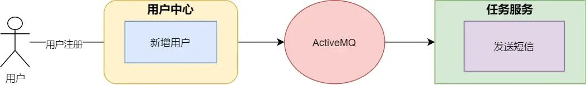
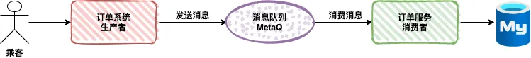
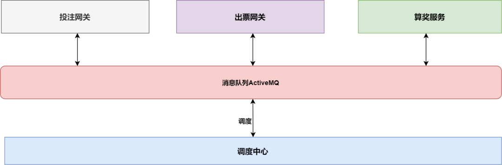
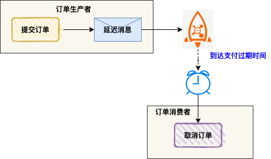
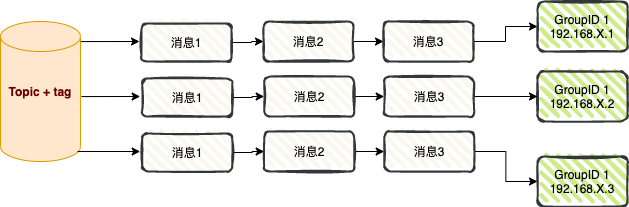
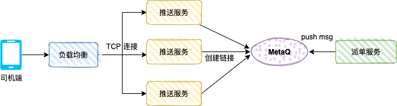
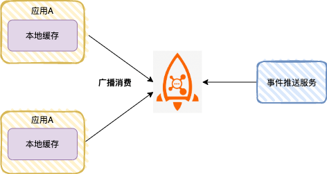
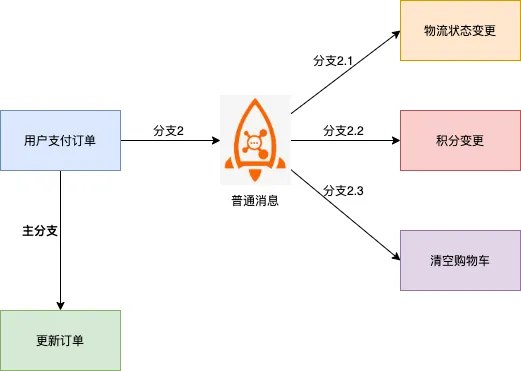
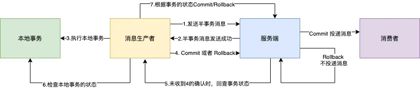
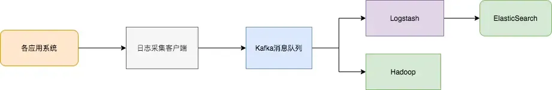

# 消息队列

消息队列看作是一个存放消息的容器，当需要使用消息的时候，直接从容器中取出消息使用。由于队列 Queue 是一种先进先出的数据结构，所以消费消息时也是按照顺序来消费的。

## 消息队列的组成
- **Broker**：消息服务器，作为server提供消息核心服务。
- **Producer**：消息生产者，业务的发起方，负责生产消息传输给broker。
- **Consumer**：消息消费者，业务的处理方，负责从broker获取消息并进行业务逻辑处理。
- **Topic**：主题，发布订阅模式下的消息统一汇集地，不同生产者向topic发送消息，由MQ服务器分发到不同的订阅者，实现消息的广播。
- **Queue**：队列，PTP模式下，特定生产者向特定queue发送消息，消费者订阅特定的queue完成指定消息的接收。
- **Message**：消息体，根据不同通信协议定义的固定格式进行编码的数据包，来封装业务数据，实现消息的传输。

---

## 常见消息队列对比

### 1. 核心定位与协议支持
| **消息队列**     | **核心定位**                              | **协议支持**                          |
|--------------|---------------------------------------|-----------------------------------|
| **ActiveMQ** | 传统企业级消息中间件，支持 JMS 规范，适合 Java EE 生态。   | JMS、AMQP、MQTT、STOMP、OpenWire。     |
| **RabbitMQ** | 高可靠性、低延迟的消息中间件，支持多种消息模式，适合金融、订单等场景。   | AMQP（核心）、MQTT、STOMP、HTTP。         |
| **RocketMQ** | 阿里巴巴开源的高吞吐、低延迟消息中间件，支持事务消息，适合电商、金融场景。 | 自定义协议（基于 TCP）、MQTT（部分支持）。         |
| **Kafka**    | 高吞吐、分布式日志存储，适合流式计算和大规模数据管道。           | 自定义协议（基于 TCP）、支持与 Flink/Spark 集成。 |
| **Pulsar**   | 云原生架构的高吞吐、低延迟消息中间件，支持多租户和流式计算。        | MQTT、AMQP（实验性）、自定义协议（基于 TCP）。     |

### 2. 性能对比
| **维度**    | **ActiveMQ** | **RabbitMQ**  | **RocketMQ**  | **Kafka**        | **Pulsar**        |
|-----------|--------------|---------------|---------------|------------------|-------------------|
| **吞吐量**   | 低（<1万 QPS）   | 中（5-10万 QPS）  | 高（10-50万 QPS） | 极高（百万级 QPS）      | 高（接近 Kafka，但延迟更低） |
| **延迟**    | 中（毫秒级）       | 低（毫秒级）        | 低（毫秒级）        | 高（不可预测延迟）        | 极低（比 Kafka 更优）    |
| **扩展性**   | 弱（集群扩展能力差）   | 一般（水平扩展需额外维护） | 强（天然分布式架构）    | 极强（天然分布式，自动负载均衡） | 强（存储计算分离，运维友好）    |
| **消息持久化** | 支持（磁盘存储）     | 支持（磁盘/内存可选）   | 支持（磁盘存储）      | 支持（日志结构，高性能）     | 支持（BookKeeper 存储） |

### 3. 关键特性对比
| **特性**   | **ActiveMQ**   | **RabbitMQ** | **RocketMQ** | **Kafka**              | **Pulsar**              |
|----------|----------------|--------------|--------------|------------------------|-------------------------|
| **事务支持** | 支持（JMS 事务）     | 支持（AMQP 事务）  | 支持（事务消息）     | 不支持（仅幂等生产/消费）          | 支持（Pulsar Transactions） |
| **消息顺序** | 支持（点对点模式）      | 支持（单队列内）     | 支持（顺序消息）     | 支持（单分区内）               | 支持（单分区内）                |
| **延迟消息** | 支持（Broker 端调度） | 支持（插件实现）     | 支持（内置延迟消息）   | 不支持（需外部实现）             | 支持（Pulsar Schedulers）   |
| **多租户**  | 不支持            | 不支持          | 不支持          | 不支持                    | 支持（原生多租户）               |
| **流式计算** | 不支持            | 不支持          | 支持（有限）       | 支持（与 Flink/Spark 深度集成） | 支持（Pulsar Functions）    |

### 4. 适用场景推荐
| **场景**                | **推荐消息队列**                  | **理由**                                   |
|-----------------------|-----------------------------|------------------------------------------|
| **传统企业级 Java EE 项目**  | **ActiveMQ**                | 兼容 JMS 规范，适合老项目升级或轻量级 MQ 需求。             |
| **金融支付、订单系统**         | **RabbitMQ** 或 **RocketMQ** | RabbitMQ 支持事务和低延迟；RocketMQ 支持事务消息且吞吐量更高。 |
| **大规模日志收集、流处理**       | **Kafka**                   | 超高吞吐量，与 Flink/Spark 深度集成，适合实时数据管道。       |
| **电商、金融高并发场景**        | **RocketMQ**                | 高吞吐+事务支持，经受住双十一考验。                       |
| **云原生、Serverless 架构** | **Pulsar**                  | 多租户、低延迟+高吞吐，存储计算分离，运维比 Kafka 更友好。        |
| **不确定业务需求**           | **Kafka** 或 **RocketMQ**    | Kafka 生态成熟；RocketMQ 通用性更强，支持事务和延迟消息。     |

### 5. 总结与建议
- **选型逻辑**：
    - **高吞吐+低延迟**：Pulsar > RocketMQ > Kafka > RabbitMQ > ActiveMQ。
    - **事务支持**：RabbitMQ/RocketMQ > ActiveMQ > Pulsar > Kafka。
    - **云原生架构**：Pulsar 是唯一原生支持多租户的消息队列。
    - **生态成熟度**：Kafka > RabbitMQ > RocketMQ > Pulsar > ActiveMQ。

- **最终推荐**：
    - **新项目云原生架构**：优先选 **Pulsar**（低延迟+高吞吐+易管理）。
    - **高可靠性事务场景**：选 **RocketMQ**（电商、金融）或 **RabbitMQ**（支付、订单）。
    - **大规模日志/流处理**：选 **Kafka**（监控、用户行为日志）。
    - **传统企业级项目**：选 **ActiveMQ**（JMS 兼容）。
    - 
---

## 使用消息队列会面临的问题
- **系统可用性降低**：系统可用性在某种程度上降低，在加入 MQ 之前，不用考虑消息丢失或者说 MQ 挂掉等等的情况
- **系统复杂性提高**：加入 MQ 之后需要保证消息没有被重复消费、处理消息丢失的情况、保证消息传递的顺序性等问题
- **一致性问题**：消息队列可以实现异步，消息队列带来的异步确实可以提高系统响应速度，但是如果消息的真正消费者并没有正确消费消息

---

## 应用场景

### 异步&解耦

### 消峰

### 消息总线

### 延时任务
用户在美团 APP 下单，假如没有立即支付，进入订单详情会显示倒计时，如果超过支付时间，订单就会被自动取消

### 广播消费

#### 消息推送
专车的司机端推送机制

#### 缓存同步
高并发场景

### 分布式事务
1. 传统XA事务方案：性能不足

2. 基于普通消息方案：一致性保障困难  

3. 基于 RocketMQ 分布式事务消息：支持最终一致性  

### 数据中转枢纽
