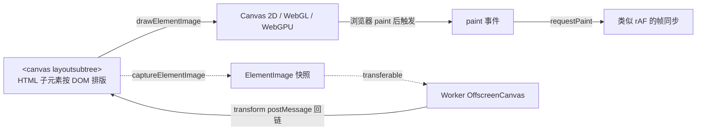

<!--
module:
  parent: front-end
  slug: front-end/browser-rendering/html-in-canvas
  type: article
  category: 主模块子文章
  summary: HTML-in-Canvas WICG 提案
  depth: ⭐⭐⭐⭐⭐
-->

# HTML-in-Canvas（WICG 提案）

> 一句话定位：**把任意 HTML 元素直接绘制到 `<canvas>` 内 —— 终结"DOM/CSS 优雅 vs Canvas 高性能"的二选一困局**

[HTML-in-Canvas](https://wicg.github.io/html-in-canvas/) 是 [WICG（Web Incubator CG）](https://github.com/WICG/html-in-canvas) 在 2023 年发起的活跃提案，2026 年仍在高速迭代（284+ commits）。**Chrome Canary 已通过 `chrome://flags/#canvas-draw-element` 落地**。它把 Canvas 的"GPU 高性能"与 DOM 的"原生可访问 / 国际化 / 排版"合并到一个 API 里 —— 不再需要 `html2canvas` 那种"DOM 序列化 → 重排 → 截图"的 hack。

> 📌 **本文快照源**：[github.com/WICG/html-in-canvas README](https://raw.githubusercontent.com/WICG/html-in-canvas/main/README.md)（main 分支）。本文使用的 API 仍处于实验阶段，正式语法可能微调。

---

## TL;DR



| 维度 | 旧方案（html2canvas 等） | HTML-in-Canvas |
|------|------------------------|---------------|
| 渲染方式 | DOM 序列化重绘 → 截图（有损、错位） | 复用浏览器原生排版 + 绘制 |
| 支持文本 | 简易文字（无 OpenType 高级特性） | 完整排版（OpenType / 字体子集 / RTL） |
| 性能 | 主线程长任务 | 可 OffscreenCanvas + Worker |
| 可访问性 | 需手写 fallback | 直接复用 DOM 树（a11y 节点天然一致） |
| 国际化 | 需重新实现 | 继承浏览器 IME / 字体回落 |

---

## 核心动机：5 大用例

提案原文明确列出的 5 类痛点：

1. **样式化、可排版的 Canvas 内容**：图表图例、坐标轴、游戏内菜单等需要的"超文本框"。
2. **可访问性提升**：`<canvas>` 的 fallback 内容经常与渲染结果**不一致**；新 API 让 a11y 节点与绘制像素天然一致。
3. **HTML + WebGL 着色器效果**：现行 `filter / backdrop-filter / mix-blend-mode` 范围有限，缺通用着色器混合。
4. **3D 场景内的 2D 内容**：游戏 / 网站需要把富文本贴到 3D 表面（立方体 / 球面）。
5. **媒体导出**：把 DOM 节点直接导出为图像或视频，不需要重新栅格化。

---

## 三件套原语（3 Primitives）

提案的核心由 **3 个新原语** 组成：HTML 属性、绘制方法、事件。

### `layoutsubtree` —— 让 Canvas 接受 DOM 子元素

```html
<canvas id="c" layoutsubtree>
  <form id="form_element">
    <label for="name">name:</label>
    <input id="name">
  </form>
</canvas>
```

打开 `layoutsubtree` 后：

- Canvas 的直接子元素获得 **stacking context** + **containing block** + **paint containment**
- 子元素的渲染**对用户不可见**，直到显式调用 `drawElementImage()` 才出现在 canvas 上
- 等价于"先把 HTML 在屏幕外排好版，再把绘制结果拍进 canvas"

### `drawElementImage()` + WebGL/WebGPU 等价物

```js
const ctx = canvas.getContext('2d');
canvas.onpaint = () => {
  ctx.reset();
  // 把 form_element 画到 (100, 0) 位置，返回一个同步用的 DOMMatrix
  const transform = ctx.drawElementImage(form_element, 100, 0);
  form_element.style.transform = transform.toString();  // 关键：保持命中测试/无障碍同步
};
```

**关键约束**（违反任意一条都会抛异常）：

| 约束 | 说明 |
|------|------|
| `layoutsubtree` 必须开启 | 在最近一次渲染更新时 |
| `element` 必须是 canvas 直接子元素 | 不接受孙子节点 |
| `element` 必须有生成框 | 不能 `display: none` |
| CSS transform **不影响绘制** | 仅影响命中测试 / 无障碍 |
| overflow（layout + ink）裁剪到 border box | 避免跨边界绘制 |
| `width`/`height` 可选 | 默认让目标尺寸与屏幕原尺寸等比 |

**3D 等价物**（同一思路在 3D 上下文落地）：

| 2D | WebGL | WebGPU |
|----|-------|--------|
| `drawElementImage()` | `texElementImage2D(target, internalformat, element, config)` | `copyElementImageToTexture(source, destination)` |

### `paint` 事件 + `requestPaint()`

```js
canvas.onpaint = (event) => {
  // event.changedElements 列出本次帧内被标脏的子元素
  // 此处对每个子元素调用 ctx.drawElementImage(...)
};
canvas.requestPaint();  // 类似 rAF：强制下一帧 paint（即便子元素未变）
```

**触发位置**：`update the rendering` 步骤中，**紧接着浏览器自身 Paint 步骤之后**（详见「设计取舍」一节）。

**重要规则**：
- `paint` 事件中**对 canvas 的绘制指令**会出现在当前帧
- `paint` 事件中**对 DOM 的修改**要等**下一帧**才生效
- 多个 `<canvas>` 时，**反向树序触发**（后代先于祖先）

---

## OffscreenCanvas + Worker 渲染

Worker 端运行浏览器无主线程是性能关键模式。提案提供了 `ElementImage` transferable：

```js
// 主线程
const worker = new Worker(URL.createObjectURL(new Blob([workerCode])));
const offscreen = canvas.transferControlToOffscreen();  // 标准 API
worker.postMessage({ canvas: offscreen }, [offscreen]);

canvas.onpaint = (event) => {
  const elementImage = canvas.captureElementImage(form_element);
  worker.postMessage({ elementImage }, [elementImage]);  // ElementImage 可转移
};

worker.onmessage = ({ data }) => {
  form_element.style.transform = data.transform.toString();
};

new ResizeObserver(([entry]) => {
  worker.postMessage({
    width:  entry.devicePixelContentBoxSize[0].inlineSize,
    height: entry.devicePixelContentBoxSize[0].blockSize
  });
  canvas.requestPaint();
}).observe(canvas, { box: 'device-pixel-content-box' });
```

```js
// Worker 内
let ctx;
self.onmessage = (e) => {
  if (e.data.canvas)        ctx = e.data.canvas.getContext('2d');
  if (e.data.width)         { ctx.canvas.width = e.data.width; ctx.canvas.height = e.data.height; }
  if (e.data.elementImage) {
    ctx.reset();
    const transform = ctx.drawElementImage(e.data.elementImage, 100, 0);
    self.postMessage({ transform });
  }
};
```

**命中测试同步公式**（细节藏在 `<details>`，调用方无需手算，`drawElementImage` 自动返回）：

$$
T_{\text{origin}}^{-1} \cdot S_{\text{css} \to \text{grid}}^{-1} \cdot T_{\text{draw}} \cdot S_{\text{css} \to \text{grid}} \cdot T_{\text{origin}}
$$

其中：

- $T_{\text{draw}}$：本次绘制变换（CTM × 平移 × 缩放）
- $T_{\text{origin}}$：元素 `transform-origin` 平移
- $S_{\text{css} \to \text{grid}}$：CSS 像素 → canvas 网格的缩放因子

> 输出回链到 `element.style.transform` 后，浏览器原生命中测试 / 无障碍树 **与绘制结果天然对齐**。

---

## 完整 IDL（spec 原文）

```idl
partial interface HTMLCanvasElement {
  [CEReactions, Reflect] attribute boolean layoutSubtree;
  attribute EventHandler onpaint;
  void requestPaint();
  ElementImage captureElementImage(Element element);
  DOMMatrix getElementTransform((Element or ElementImage) element, DOMMatrix drawTransform);
};

partial interface OffscreenCanvas {
  DOMMatrix getElementTransform((Element or ElementImage) element, DOMMatrix drawTransform);
};

interface mixin CanvasDrawElementImage {
  DOMMatrix drawElementImage((Element or ElementImage) element,
                             unrestricted double dx, unrestricted double dy);
  DOMMatrix drawElementImage((Element or ElementImage) element,
                             unrestricted double dx, unrestricted double dy,
                             unrestricted double dwidth, unrestricted double dheight);
  DOMMatrix drawElementImage((Element or ElementImage) element,
                             unrestricted double sx, unrestricted double sy,
                             unrestricted double swidth, unrestricted double sheight,
                             unrestricted double dx, unrestricted double dy);
  DOMMatrix drawElementImage((Element or ElementImage) element,
                             unrestricted double sx, unrestricted double sy,
                             unrestricted double swidth, unrestricted double sheight,
                             unrestricted double dx, unrestricted double dy,
                             unrestricted double dwidth, unrestricted double dheight);
};

CanvasRenderingContext2D         includes CanvasDrawElementImage;
OffscreenCanvasRenderingContext2D includes CanvasDrawElementImage;

dictionary WebGLCopyElementImageConfig {
  GLfloat sx;
  GLfloat sy;
  GLfloat swidth;
  GLfloat sheight;
  GLsizei width;
  GLsizei height;
};

partial interface WebGLRenderingContext {
  void texElementImage2D(GLenum target, GLenum internalformat,
                         (Element or ElementImage) element,
                         optional WebGLCopyElementImageConfig config = {});
};

dictionary GPUCopyElementImageDestination {
  required GPUImageCopyTextureTagged destination;
  GPUIntegerCoordinate width;
  GPUIntegerCoordinate height;
};

dictionary GPUCopyElementImageSource {
  required (Element or ElementImage) source;
  float sx; float sy; float swidth; float sheight;
};

partial interface GPUQueue {
  void copyElementImageToTexture(GPUCopyElementImageSource source,
                                 GPUCopyElementImageDestination destination);
}

[Exposed=Window]
interface PaintEvent : Event {
  constructor(DOMString type, optional PaintEventInit eventInitDict);
  readonly attribute FrozenArray<Element> changedElements;
};

dictionary PaintEventInit : EventInit {
  sequence<Element> changedElements = [];
};

[Exposed=(Window,Worker), Transferable]
interface ElementImage {
  readonly attribute double width;
  readonly attribute double height;
  undefined close();
};
```

**关键设计点**：
- `CanvasDrawElementImage` 作为 **mixin** 暴露给 `2D` / `Offscreen2D` 两个上下文，**避免重复 IDL**
- `(Element or ElementImage)` 联合类型：同一绘制方法既支持实时 DOM 节点，也支持可转移的快照
- `ElementImage` 是 `[Transferable]` —— 转移后主线程侧不可再用（与 `OffscreenCanvas` 一致）

---

## 设计取舍：paint 事件触发时机（Option A / B / C）

提案最关键的工程权衡：**`paint` 应在浏览器渲染管线的哪一步触发？**

| 方案 | 触发点 | 优势 | 致命问题 |
|------|--------|------|---------|
| **Option A** | resize observer 之后（步骤 16.2.6）循环 | 模仿 resize observer 模式 | 需要**同步执行 Paint** 才能拿到快照；Paint 是浏览器最贵的步骤；Gecko 架构限制 |
| **Option B** | Paint 之后立即触发，可循环 | 不需 partial paint | 每次循环要重跑更多渲染步骤；同 A 一样要循环 |
| **Option C（最终选择）** | Paint 之后**立即触发**，**不循环** | 每帧只跑一次；语义最清晰 | 必须**锁定帧内 DOM 状态**（除 canvas 自身绘制外），后续 DOM 改动推迟到下一帧 |

### 为什么 C 是唯一可行的（WebGL 关键约束）

Option A 的"先 buffer，paint 时再替换占位"模型对 **WebGL 是死结**：

```text
Buffer 模式：所有 draw 指令先记录到命令缓冲
  → 用户调用 gl.getError() / uniform 上传（[WaitForCmd 触发点](https://source.chromium.org/chromium/chromium/src/+/main:gpu/command_buffer/client/implementation_base.h;drc=b3eab4fd06ddbeee84b37224f4cc9d78094fc2f7;l=102)）
  → 浏览器必须 flush 缓冲 → 看到的是占位符 → 渲染不一致 / 死锁
```

→ 结论：**必须在已经持有完整 display list 的时机触发 paint**。这就是 Option C 的胜利之处。

### 锁帧的代价

Option C 要求：**进入 paint 事件后，DOM 内容（除 canvas 自己的绘制）已经被冻结**。`paint` 内修改 DOM 不会影响当前帧，要等下一帧才能看见。这也是 EventLoop 中"主线程阻塞预算"的另一种体现。

> 想做"每帧都跟手跟随 scroll/animation"的滚动条 / 进度条？提案预留了未来 [auto-updating canvas](#future) 模式（参见「未来展望」一节）。

---

## 安全与隐私清单（Read-back-allowed Rendering）

`drawElementImage` 和 `paint` 事件暴露的内容**不能**多于 author code 已经能观察到的内容 —— 这一约束叫 **read-back-allowed rendering**。具体排除以下 9 类**敏感信息**：

| 类别 | 实例 |
|------|------|
| 跨源嵌入内容 | `<iframe cross-origin>`、``、`<canvas>` 被跨源数据 drawImage |
| 跨源 URL 引用 | `background-image: url(...)`、`clip-path: url(...)` |
| 跨源 SVG | `<use href="跨源.svg">`、`<pattern>`、`<feImage>` |
| 系统主题信息 | 颜色、字号、主题偏好 |
| 拼写 / 语法标记 | 浏览器自带的下划线 / 圆点 |
| Visited link 颜色 | `:visited` 历史链接样式 |
| 未完成 autofill 候选 | 浏览器尚未提交的填充项 |
| Subpixel 抗锯齿 | 像素级渲染"指纹" |
| 字幕 / IME | caption 选择状态、IME 弹出层 |
| **系统偏好** | caption/subtitle 选择与外观 |

**以下信息**反而**可以**暴露（"不视为敏感"）：

| 类别 | 说明 |
|------|------|
| 搜索文本标记 | find-in-page 高亮、text-fragment (#:~:text=) |
| 滚动条 / 表单控件外观 | 已被 Blink / WebKit 通过 `<foreignObject>` 检测，公开 |
| 光标闪烁频率 | 同上 |
| `forced-colors` | 媒体查询已暴露系统色 |

---

## 与旧方案对比

| 场景 | html2canvas 等库 | SVG `<foreignObject>` | HTML-in-Canvas |
|------|------------------|----------------------|----------------|
| 文本排版 | 简化版（无 OpenType 全特性） | 完整 | 完整 |
| 跨域 iframe | 受限（需 CORS） | 受限 | 受限（同源） |
| WebGL / WebGPU 输出 | 不可（仅 2D canvas） | 不可 | 原生（`texElementImage2D` / `copyElementImageToTexture`） |
| Worker 渲染 | 否 | 否 | 是（`captureElementImage`） |
| 命中测试同步 | 需手算 | 需手算 | **自动**（`drawElementImage` 返回 transform） |
| 性能 | 主线程长任务 | 浏览器原生（但仅 SVG） | 浏览器原生 + Worker |

> **`foreignObject` 是"老前辈"**：SVG 1.1 早就允许内嵌 HTML，但应用面太窄（仅 SVG 子文档、不支持 WebGL 输出、不支持跨上下文）。HTML-in-Canvas 把这套能力"下放"到原生 Canvas。

---

## 浏览器支持与试用入口

| 引擎 | 状态 | 启用方式 |
|------|------|---------|
| **Chromium** | 实验功能已实现 | `chrome://flags/#canvas-draw-element`（Chrome Canary） |
| **Firefox** | 跟踪中 | 待贡献 |
| **Safari** | 跟踪中 | 待贡献 |

**官方示例**（仓库 `Examples/` 目录下）：

| Demo | 用到的 API |
|------|-----------|
| `complex-text.html` | `drawElementImage` 绘制旋转 / 复杂文本 |
| `pie-chart.html`    | `drawElementImage` 绘制带多行标签的饼图 |
| `webGL.html`        | `texElementImage2D` 把 HTML 贴到 3D 立方体 |
| `webgpu-jelly-slider/` | WebGPU `copyElementImageToTexture` 果冻滑动条 |
| `text-input.html`   | `drawElementImage` 交互式 form 输入 |

三方对接：[three.js PR #31233](https://github.com/mrdoob/three.js/pull/31233) 已有一个实验性 `htmltexture` 扩展，演示 HTML 贴图在 3D 场景中的用法。

---

## 关键 takeaway（面试向速查）

| 问题 | 速答 |
|------|------|
| 是什么？ | WICG 提案，让 `<canvas>` 直接绘制其 HTML 子元素 |
| 入口 flag？ | `chrome://flags/#canvas-draw-element` |
| 三大原语？ | `layoutsubtree` 属性 / `drawElementImage()` 方法 / `paint` 事件 |
| Worker 怎么用？ | `captureElementImage` → `ElementImage` transferable → worker 端 `drawElementImage` |
| paint 触发时机？ | **Option C**：浏览器自身 Paint 之后**立即触发**，不循环 |
| 为什么不是 Option A/B？ | A 要 partial paint（贵 + Gecko 受限），B 同 A；WebGL 必须持 display list 才不死锁 |
| 命中测试怎么同步？ | `drawElementImage` 返回 `DOMMatrix`，赋给 `element.style.transform` |
| 敏感信息？ | 排除 9 类（跨源 iframe / 系统色 / IME / autofill ...），但 find-in-page 等不算敏感 |

---

## 未来展望：自动更新 Canvas（暂未落地）

提案披露了一个**待实现**的"auto-updating canvas"模式：

> 目标：支持线程化滚动 / 动画时，canvas 仍能与 native scroll / animation 同步（每帧无需 main thread 介入）。

机制：
- `drawElementImage` 改为记录"占位符"，canvas 保留命令缓冲
- 每次浏览器 scroll/animation 更新时，**自动重放命令缓冲**，占位符重新栅格化
- 适用于 2D 上下文；WebGPU 需小规模 API 扩展

→ 当前 Chrome 实现**未含此模式**，需观察后续迭代。

---

## 📚 参考来源

| # | 来源 | 类型 | 用途 |
|---|------|------|------|
| 1 | [WICG/html-in-canvas README](https://github.com/WICG/html-in-canvas) | 官方（W3C WICG） | 一手 spec，commit 284+ 持续迭代 |
| 2 | chrome://flags/#canvas-draw-element | 官方实现 | 试用入口（Chrome Canary） |
| 3 | [HTML 渲染进 Canvas 的新提案解析](https://blog.csdn.net/weixin_41961749/article/details/160449948) | 中文二手深度 | 中文读者术语对照（`drawElementImage` / paint 时机） |
| 4 | [Chrome 推出全新 HTML-in-Canvas API 取代 html2canvas](https://www.sohu.com/a/1028944399_122066678) | 新闻报道 | 行业背景（"取代 html2canvas"信号） |
| 5 | [GitHub Issue #94: Hit testing and layer ordering](https://github.com/WICG/html-in-canvas/issues/94) | 官方讨论 | 命中测试模型的当前讨论 |
| 6 | [three.js PR #31233](https://github.com/mrdoob/three.js/pull/31233) | 三方扩展 | 验证 HTML 贴图在 3D 框架中的可集成性 |

> ⚠️ **二手来源核实说明**：本文核心 IDL、paint 时机 3 方案对比、安全 9 类清单均**严格对照官方 README** 原文。中文二手文 ([来源 3, 4]) 仅用于行业背景交叉验证，不作为 API 细节依据。OpenGL command buffer flush 死锁机制引用了一手 Chromium `gpu/command_buffer/client/implementation_base.h:102` 的 WaitForCmd 调用点。

---

## 交叉引用

- [`../` 浏览器渲染原理](../README.md) — 6 阶段渲染管线的根因地图；本章是其"扩展渲染能力"的最新子主题
- [`../../../06-performance/` 性能优化](../../../06-performance/README.md) — paint 事件时机的性能取舍
- [`../../../06-performance/optimization/` Canvas 渲染优化](../../../06-performance/optimization/README.md) — 已有的 drawImage 性能章节

---

← [返回 浏览器渲染原理](../README.md)
