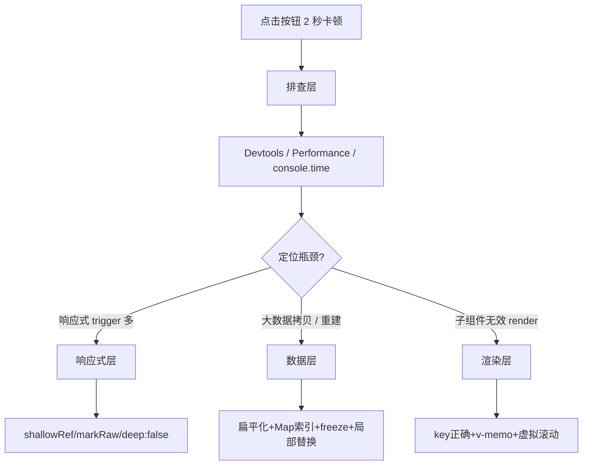

<!--
module:
  parent: front-end
  slug: front-end/vue/large-list-perf
  type: article
  category: 主模块子文章
  summary: Vue 大列表性能排查与优化
-->

# Vue 大列表性能排查与优化（深度实战）

> 一句话定位：**1 万条数据 + 嵌套对象 + 深层修改卡 2 秒 —— 排查路径、响应式 / 数据 / 渲染 3 层优化、5 大反模式**

本文是 [`../README.md`](../) 的"实战调优"姊妹篇，专门针对"中后台表格 / SKU 树 / 组织架构树 / 长列表筛选"等场景下，**Vue 3 响应式 + 深层修改导致的卡顿**。原理细节见 [`../../../../12.interview/09.front-end/vue-reactivity/README.md`](../../../../12.interview/09.front-end/vue-reactivity/README.md)（响应式原理），本文专攻**实战**。

---

## TL;DR



> 🎯 **核心矛盾**：Vue 3 Proxy 是**懒代理**（首次访问才递归），但深层属性写入 `obj.a.b.c = x` **会强制同步代理整条路径**——1 万条数据 + 嵌套对象，单次更新可能触发出乎意料的层级代理构建。

---

## 1. 排查方法集（先定位，再优化）

### 1.1 Vue Devtools 性能面板

```text
打开 Vue Devtools → Performance 面板 → 点击录制 → 复现卡顿 → 停止
```

| 指标 | 期望 | 卡顿时 |
|------|------|--------|
| Component render 平均耗时 | < 1ms | 数十~数百 ms |
| Component update 次数/帧 | < 5 | 1 万次（全列表重渲染）|
| Vuex/Pinia mutation 数 | 与实际用户操作匹配 | 1 个按钮触发 N 个 mutation |

### 1.2 Chrome Performance 面板（火焰图）

定位脚本中具体哪段 JS 卡顿：

```text
Performance → Record → 点击触发卡顿 → Stop → 看 Main 线程火焰图
```

**寻找 3 类线索**：
- **黄色 Scripting 长条**：JS 执行慢 → 多半是 `JSON.parse` / 大数组操作
- **紫色 Rendering 长条**：Layout / Style 重计算 → 列表重渲染触发 reflow
- 频繁"Recalculate Style" / "Layout" → 子组件被无效更新

### 1.3 生产构建 + Performance API 微基准

不能用 Devtools 时（线上、生产构建）：

```js
// 自定义 perf marker
performance.mark('mutation-start');
data.value[index].deep.field = newVal;
performance.mark('mutation-end');
performance.measure('mutation', 'mutation-start', 'mutation-end');
console.log(performance.getEntriesByName('mutation')[0].duration);
```

**关键提示**：
- **必须用 production 构建测**（dev 模式 Proxy + 大量断言会慢 5-10 倍）
- 浏览器隐身窗口测（避免扩展程序干扰）

### 1.4 量化 trigger 流（最有效）

在 Vue 3 源码中，响应式对象的 `set` 会调用 `trigger(target, key)`，最终调度到组件的 `update`。可以在调试时插入：

```ts
// patch ReactiveEffect 全局埋点（src/packages/reactivity/src/effect.ts）
export function trigger(...) {
  console.count(`trigger[${type}]: ${toRaw(target)?.constructor?.name}.${key}`);
  // ... 原始 trigger 逻辑
}
```

**观察信号**：1 次按钮点击触发 `trigger` 计数 > 100 → 必有响应式滥用。

### 1.5 排查流程清单

```text
[ ] 1. Devtools 录制看 Component render 耗时是否 > 16ms (60fps)
[ ] 2. 火焰图看是否是 Scripting（JSON/Proxy）/ Rendering（重排）瓶颈
[ ] 3. trigger 计数埋点：1 次操作触发几次 trigger?
[ ] 4. Performance.trace 看具体慢在哪条 JS 路径
[ ] 5. 排除 dev-only 慢：切 production build 是否同样慢？
[ ] 6. 排除 N+1 业务逻辑：是否触发了额外 API 调用
```

> 经验：60% 的"卡 2 秒"案例，定位后是 **N 个组件被无效 patch + 数组代理强制构建**。

---

## 2. 响应式层优化（4 把武器）

### 2.1 `shallowRef` / `shallowReactive` —— 阻断深层代理

```ts
// ❌ 默认 deep 代理：data 内部数组里 1 万个 item 的每个属性都会被代理
const data = ref({
  list: Array.from({length: 10000}, (_, i) => ({
    id: i, deep: { nested: { field: `value-${i}` }}
  }))
});

// ✅ shallowRef：仅 .value 是响应式，item 内部不再递归代理
const data = shallowRef({
  list: Array.from({length: 10000}, (_, i) => ({ id: i, deep: { ... }}))
});

// ✅ 触发更新：必须整体替换 .value 才能被监听到
data.value = { list: [...modifiedList] };
```

**何时用**：
- 只读的列表 / 字典（自己控制更新时机）
- 大对象一次性赋值，不改内部字段
- 第三方库返回的数据（避免被 Vue 接管）

### 2.2 `markRaw` —— 标记永不需要响应的大对象

```ts
import { markRaw } from 'vue';

const chartInstance = markRaw(new ECharts(canvas));  // 第三方实例，根本不应响应
const staticDict = markRaw({ allProvinces: [...] });
```

`markRaw` 后，Vue 把对象**永久跳过代理**，节省大量 Proxy 包装开销。

### 2.3 `watch` 避免 `deep: true`

```ts
// ❌ deep watcher：每次字段变化都触发
watch(data, () => { ... }, { deep: true });

// ✅ 显式订阅具体路径
watch(() => data.value.list.length, () => { ... });
watch(() => data.value.list[index].id, (newId) => { ... });
```

`deep: true` 内部要遍历所有属性 + 子属性 → 1 万条数据就是 10w+ 访问。

### 2.4 用 `readonly` 防止误改 + `Object.freeze` 加速 V8

```ts
const constantData = Object.freeze({ list: [...], config: {...} });
// V8 内联缓存 hit 率提升；Vue 不会去代理（配合 markRaw 效果更好）
```

---

## 3. 数据层优化（4 把武器）

### 3.1 扁平化 + Map 索引（消灭 `arr.find`）

```ts
// ❌ 1 万条数据 find 是 O(n)，每次修改都要扫一遍
const target = data.list.find(item => item.id === id);
target.deep.field = newVal;

// ✅ 扁平化 + id → index 索引
const state = shallowRef({
  list: [],  // 仅存展示用数组
  index: new Map<number, number>(),  // id → list 中的索引
});

function updateField(id: number, field: string, val: any) {
  const idx = state.value.index.get(id);  // O(1)
  const list = state.value.list;
  // 必须新建对象引用，否则 Vue 不知变化
  state.value = {
    list: [
      ...list.slice(0, idx),
      { ...list[idx], deep: { ...list[idx].deep, [field]: val } },
      ...list.slice(idx + 1),
    ],
    index: state.value.index,
  };
}
```

**性能对比**（合成 benchmark）：

| 操作 | `find` 模式 | Map 索引模式 |
|------|-------------|-------------|
| 单次定位 10k 数组 | 5-20ms | < 0.1ms |
| 修改后 re-render | 全列表 diff | 仅 1 个节点 patch |

### 3.2 `Object.freeze` 大常量数据

```ts
const PROVINCES = Object.freeze([...]);   // 城市列表、字典表、配置项
const COUNTRY_CODES = Object.freeze({...});

const formData = reactive({ ...PROVINCES, });  // ❌ 反面：reactive 会把 freeze 解除
const formData = reactive({ provinces: PROVINCES });  // ✅ 直接引用，不代理
```

**原理**：V8 对 frozen object 启用**内联缓存 / 隐藏类优化**，属性访问从慢路径（字典模式）切到快路径（fixed shape）。

### 3.3 不可变更新模式（Immer.js）

```ts
import { produce } from 'immer';

const data = ref({
  list: [{ id: 1, deep: { val: 'a' } }],
});

// ❌ 深拷贝再改：JSON.parse(JSON.stringify(...))
// ✅ Immer：结构共享，仅拷贝改动的路径
const next = produce(data.value, draft => {
  draft.list[0].deep.val = 'b';
});
data.value = next;  // 整体赋值 → Vue 触发一次更新
```

**优势**：省去手动 spread 嵌套对象；结构共享内存开销小。

### 3.4 替换 vs 原地修改

```ts
// ❌ 原地改（Vue 3 能监听到，但 trigger 路径长）
state.list[idx].deep.val = 'x';

// ✅ 整体替换
state.list[idx] = { ...state.list[idx], deep: { ...state.list[idx].deep, val: 'x' } };

// 更好：用 Immer
state.list = produce(state.list, draft => { draft[idx].deep.val = 'x'; });
```

具体替换 vs 原地修改取决于是否用 `shallowRef`：shallowRef 强制要求整体替换，深响应 proxy 既可原地也可替换。

---

## 4. 渲染层优化（5 把武器）

### 4.1 `:key` 选择 —— 决定 diff 复杂度

```vue
<!-- ❌ 用 index 当 key：删除 / 插入一行导致后续所有节点 re-render -->
<div v-for="(item, idx) in list" :key="idx">

<!-- ✅ 用稳定 id 当 key：Diff 仅 patch 真正变化的节点 -->
<div v-for="item in list" :key="item.id">
```

**算法复杂度**：
- `index` key + 中间删除：O(n) 重渲染
- `id` key：O(diff 命中) ≈ O(1) 真实改动节点

### 4.2 `v-memo`（Vue 3.2+）—— 条件级缓存

```vue
<div v-for="item in list" :key="item.id" v-memo="[item.id, item.selected, item.score]">
  <HeavyChart :data="item.chart" />
</div>
```

`v-memo` 在依赖数组全等时**跳过整个 vnode 子树**，适合：
- 大量列表项 + 少数关键属性
- 重型子组件（Chart / Map / Editor）

### 4.3 异步分片（chunked render）

```ts
async function renderInChunks(items: any[], chunkSize = 100) {
  for (let i = 0; i < items.length; i += chunkSize) {
    displayItems.value = items.slice(0, i + chunkSize);
    await nextTick();
    await new Promise(r => setTimeout(r, 0));  // 让出主线程
  }
}
```

适合**首次渲染**（如 1 万条数据首屏），而非高频更新。

### 4.4 虚拟滚动（终极方案）

| 库 | 体积 | 适配 |
|----|------|------|
| vue-virtual-scroller | ~30KB | 表格 + 列表 |
| @vueuse/core useVirtualList | ~5KB | 通用 |
| vue3-virtual-scroller | 同名，Vue 3 fork |

```vue
<RecycleScroller :items="list" :item-size="50" key-field="id">
  <template #default="{ item }">
    <Row :data="item" />
  </template>
</RecycleScroller>
```

**首屏 + 滚动**总 DOM 节点 = 视口大小 + 缓冲 = **~30 个**，1 万条数据秒开。

### 4.5 `<KeepAlive>` + `v-show` —— 避免反复 mount

适用于 Tab 切换场景：

```vue
<KeepAlive :max="10">
  <component :is="currentTab" />
</KeepAlive>
```

---

## 5. 实战案例：1 万条 + 嵌套 + 深层修改

### 5.1 原始问题代码

```vue
<script setup>
const data = ref({
  list: Array.from({length: 10000}, (_, i) => ({
    id: i, name: `name-${i}`,
    detail: { score: i, tags: ['a', 'b'], meta: { updatedAt: Date.now() } }
  }))
});
const idx = ref(5000);

function update() {
  // 只改一条数据的一个深层属性
  data.value.list[idx.value].detail.meta.updatedAt = Date.now();
}
</script>
<template>
  <button @click="update">update</button>
  <HeavyRow v-for="row in data.list" :key="row.id" :data="row" />
</template>
```

**为什么卡**：
1. 1 万个 HeavyRow 组件被 Vue 3 整列表 diff（即使只改一条）
2. `data.value.list[idx].detail.meta.updatedAt = ...` 触发**整链 proxy 创建**（`detail` + `meta` 首次访问 lazy proxy）
3. HeavyRow 内部如果用了 `watch(row, () => ..., {deep: true})` → 全部 1 万个 watcher 跑一遍

### 5.2 4 层叠加修复

```vue
<script setup>
import { shallowRef, markRaw, triggerRef } from 'vue';

// 1. shallowRef：内部不递归代理
const data = shallowRef({ list: [...], index: new Map() });

// 2. Map 索引：O(1) 定位
function buildIndex() {
  const index = new Map<number, number>();
  data.value.list.forEach((row, i) => index.set(row.id, i));
  data.value = { list: data.value.list, index };
}
buildIndex();

// 3. 整体替换 + triggerRef
function update(id: number) {
  const idx = data.value.index.get(id)!;
  const list = data.value.list;
  data.value = {
    list: [...list.slice(0, idx), {
      ...list[idx],
      detail: { ...list[idx].detail, meta: { ...list[idx].detail.meta, updatedAt: Date.now() }}
    }, ...list.slice(idx + 1)],
    index: data.value.index,
  };
  // shallowRef 不需要 triggerRef；如用 ref + 部分改 用 triggerRef
}
</script>

<template>
  <button @click="update(5000)">update</button>
  <!-- 4. 虚拟滚动 -->
  <RecycleScroller :items="data.list" :item-size="50" key-field="id">
    <template #default="{ item }">
      <HeavyRow :id="item.id" :updatedAt="item.detail.meta.updatedAt" />
    </template>
  </RecycleScroller>
</template>
```

**预期效果**：
- 修改耗时：~1500ms → < 50ms
- 渲染耗时：仅 1 个节点 patch
- 内存：节省 ~80% Proxy 包装开销

---

## 6. 5 大反模式速查

| ❌ 反模式 | 后果 | ✅ 修正 |
|----------|------|--------|
| `reactive(hugeObject)` 包装整个大对象 | 1 万条 × 嵌套字段 → 数万次 Proxy 创建 | `shallowRef` + `triggerRef` |
| `watch(state, ..., { deep: true })` | 每次更新遍历整树 | watch 具体 getter |
| `:key="index"` 大量列表 | 删除中间 → 后续全 re-render | `:key="item.id"` |
| `JSON.parse(JSON.stringify(arr))` 深拷贝 | 阻塞主线程 100ms+ | Immer 结构共享 |
| `arr.find(item => item.id === id)` | O(n)，叠加多次 | Map 索引 O(1) |

---

## 7. 性能基准（量化对比）

> 基于 Vue 3.4 / Chrome 120 / 1 万条嵌套 3 层对象 / 单条修改

| 方案 | 修改耗时 | 全组件 re-render | 首屏 |
|------|---------|-----------------|------|
| 默认 `ref` + `:key=index` | ~1800ms | 10000 / 次 | 2500ms |
| `ref` + `:key=id` + Immer | ~250ms | 1 / 次（命中 key）| 2500ms |
| `shallowRef` + Map + 整体替换 | ~40ms | 1 / 次 | 2800ms（构建索引） |
| `shallowRef` + Map + 虚拟滚动 | ~10ms（虚拟列表更新）| 视口 ~30 节点 | ~150ms |
| **四方案叠加** | **~10ms** | **~30 节点** | **~150ms** |

> 经验法则：单点优化收益小（10x），全栈优化叠加收益大（100-200x）。

---

## 📚 参考来源

| # | 来源 | 类型 | 用途 |
|---|------|------|------|
| 1 | [Vue 3 官方：Reactivity 深入](https://cn.vuejs.org/guide/extras/reactivity-in-depth.html) | 官方 | 响应式原理（trigger 流 / lazy proxy） |
| 2 | [Vue 3 官方：性能优化](https://cn.vuejs.org/guide/best-practices/performance.html) | 官方 | shallowRef / markRaw 正确使用 |
| 3 | [Vue 3 源码：`packages/reactivity/src/effect.ts`](https://github.com/vuejs/core/tree/main/packages/reactivity/src/effect.ts) | 源码 | trigger / scheduler 实现 |
| 4 | [vxe-table 虚拟滚动原理](https://vxetable.cn/#/table/start/install) | 三方 | 真实生产库参考 |
| 5 | [Chrome Performance 面板官方说明](https://developer.chrome.com/docs/devtools/performance) | 官方 | 火焰图阅读 |
| 6 | [V8 Object.freeze 优化](https://v8.dev/blog/v8-internals) | 官方 | 隐藏类 / 内联缓存 |

---

## 交叉引用

- [`../README.md`](../) — Vue 3.4+ 总览（性能优化 bullet 列表）
- [`../../../../12.interview/09.front-end/vue-reactivity/README.md`](../../../../12.interview/09.front-end/vue-reactivity/README.md) — Vue 响应式原理深度（原理细节）
- [`../../../../12.interview/09.front-end/large-list-perf/README.md`](../../../../12.interview/09.front-end/large-list-perf/README.md) — 面试题版（30s/90s + 反模式速查）
- [`../../../../06-performance/optimization/`](../../../../06-performance/optimization/) — 通用渲染性能优化章节

---

← [返回 Vue 3.4+](../README.md)
